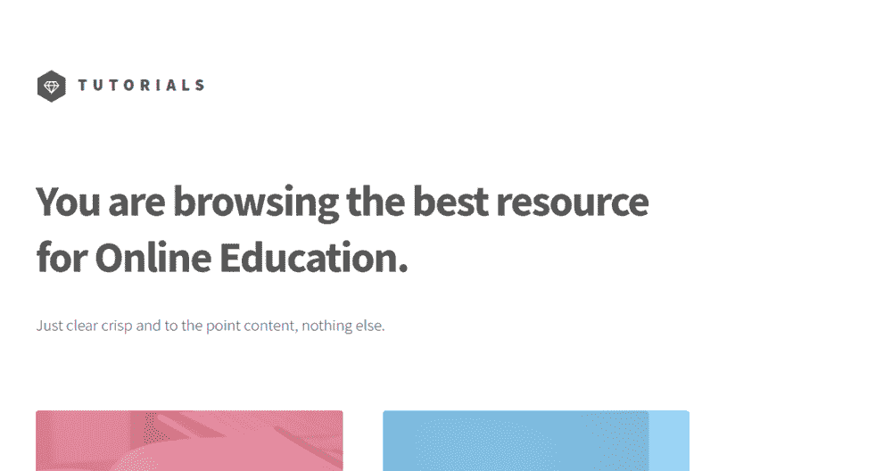

# 如何使用 Nuxt.js 构建教程应用程序

> 原文：<https://medium.com/hackernoon/how-to-build-a-tutorials-app-using-nuxt-js-e377ec9c4a8>



在本教程中，我将向你展示如何使用 [Nuxt.js](https://nuxtjs.org/) 和 [Cosmic JS](https://cosmicjs.com/) 创建一个“教程组合”应用程序。为了理解如何使用 Restful API，本教程将展示如何向 Cosmic JS API 发出简单的 AJAX 请求，以便检索、更新和删除 Cosmic JS 桶中的数据。让我们开始吧。

# TL；速度三角形定位法(dead reckoning)

[下载 GitHub repo。](https://github.com/cosmicjs/tutorials-app)
[查看演示。](https://cosmicjs.com/apps/tutorials-app)

# 开始使用:

首先，让我们创建一个新目录来构建我们的项目，并创建一个 package.json 文件。

`mkdir cosmicapp-tutorials`
`cosmicapp-tutorials$ touch package.json`

现在，在您的 package.json 中，复制并粘贴以下代码:

```
{
 "name": "cosmicapp-tutorials",
 "version": "1.0.0",
 "description": "Nuxt.js project",
 "author": "kutsaniuk@gmail.com",
 "private": true,
 "scripts": {
 "dev": "NODE_ENV=development nuxt",
 "build": "nuxt build",
 "start": "npm run build; NODE_ENV=production HOST=0.0.0.0 nuxt start"
 },
 "dependencies": {
 "axios": "^0.16.2",
 "body-parser": "^1.17.2",
 "cross-env": "^5.0.5",
 "express": "^4.15.3",
 "express-session": "^1.15.3",
 "http": "0.0.0",
 "nuxt": "^1.0.0-rc11",
 "sha1": "^1.1.1",
 "vue-notification": "^1.3.4"
 },
 "devDependencies": {
 "babel-eslint": "^7.2.3",
 "eslint": "^4.3.0",
 "eslint-config-standard": "^10.2.1",
 "eslint-loader": "^1.9.0",
 "eslint-plugin-html": "^3.1.1",
 "eslint-plugin-import": "^2.7.0",
 "eslint-plugin-node": "^5.1.1",
 "eslint-plugin-promise": "^3.5.0",
 "eslint-plugin-standard": "^3.0.1"
 }
 }
```

其次，我们来做一个 nuxt.config.js 文件。

`cosmicapp-tutorials$ touch nuxt.config.js`

现在，在您的 nuxt.config.js 中，复制并粘贴以下代码:

```
//cosmicapp-tutorials/nuxt.config.js
 const bodyParser = require('body-parser')
 const session = require('express-session') module.exports = { dev: (process.env.NODE_ENV !== 'production'),
 head: {
 title: 'cosmicapp-tutorials',
 meta: [
 { charset: 'utf-8' },
 { name: 'viewport', content: 'width=device-width, initial-scale=1' },
 { hid: 'description', name: 'description', content: 'Nuxt.js project' }
 ],
 link: [
 { rel: 'icon', type: 'image/x-icon', href: '/favicon.ico' }
 ]
 },
 loading: { color: '#585858' },
 build: {
 vendor: ['axios', 'vue-notification']
 },
 serverMiddleware: [
 bodyParser.json(),
 session({
 secret: 'super-secret-key',
 resave: true,
 saveUninitialized: false,
 cookie: { maxAge: 60000 }
 }),
 '~/api'
 ],
 env: {
 bucketSlug: process.env.BUCKET_SLUG || 'tutorials',
 readKey: process.env.READ_KEY || 'anyI1DP1bxB5ivjCaJSRC0ZFxB5SJDpfYgrDfR47fw7HIlWYAX',
 writeKey: process.env.WRITE_KEY || 'J72v1YeK8zZF6n0dI8yhiVTzQy75JASppAQe8XPykiJHW9ARfz'
 }
 }
```

# 构建我们的应用程序:

现在，我们将构建我们的文件结构，以便我们可以组织我们的 vue 文件。我们的 cosmicapp-tutorials 目录应该是这样的:

```
cosmicapp-tutorials
 |----api
 | |----index.js
 |----assets
 | |----css
 | |----fonts
 | |----images
 | |----sass
 |----layouts
 | |----default.vue
 |----middleware
 | |----auth.js
 |----pages
 | |----add
 | |----index.js
 | |----articles
 | |----_id.js
 | |----blog
 | |----index.js
 | |----edit
 | |----_id.js
 | |----login
 | |----index.js
 | |----profile
 | |----_id.js
 | |----register
 | |----index.js
 | |----index.vue
 |----static
 |----store
 |----nuxt.config.json
 |----package.json
```

现在，我们将设置 default.vue。将以下代码复制并粘贴到 default.vue 文件中:

```
<template>
        <div v-bind:class="{ 'is-menu-visible': isMenuVisible}">
        <div id="wrapper">
        <header id="header">
        <div class="inner">
        <!-- Logo -->
        <nuxt-link to="/" class="logo">
        <span class="symbol"></span>
        <span class="title">Tutorials</span>
        </nuxt-link>
        <pre v-bind="$store.state.authUser"></pre> <!-- Nav -->
        <nav @click="isMenuVisible = true">
        <ul>
        <li><a href="#menu">Menu</a></li>
        </ul>
        </nav> </div>
        </header>
        <nuxt/>
        <footer id="footer">
        <div class="inner">
        <ul class="copyright">
        <li><a href="https://cosmicjs.com/">Proudly powered by Cosmic JS</a></li><li>Copyright: <i class="fa fa-copyright"></i> Photography Portfolio App 2017</li>
        </ul>
        </div>
        </footer>
        </div>
        <nav id="menu" @click="isMenuVisible = false">
        <div class="inner">
        <h2>Menu</h2>
        <ul>
        <li><nuxt-link to="/">Home</nuxt-link></li> <li v-if="!$store.state.authUser"><nuxt-link to="/login">Login</nuxt-link></li>
        <li v-if="!$store.state.authUser"><nuxt-link to="/register">Register</nuxt-link></li> <li v-if="$store.state.authUser"><nuxt-link v-bind:to="'/profile/' + $store.state.authUser.user[0].value">Profile</nuxt-link></li>
        <li v-if="$store.state.authUser"><a href="#" @click="logout()">Logout</a></li>
        </ul>
        </div>
        <a class="close" @click="isMenuVisible = false" href="#menu">Close</a>
        </nav>
        </div> </template> <script>
        export default { data () {
        return {
        isMenuVisible: false
        }
        },
        methods: {
        async logout () {
        await this.$store.dispatch('logout')
        }
        }
        }
        </script> <style src="~/assets/css/main.css"></style>
```

之后，我们可以创建 index.vue。将以下代码复制并粘贴到您的 index.vue 文件中:

```
<template>
 <div id="main">
 <div class="inner">
 <header>
 <h1>You are browsing the best resource <br>
 for Online Education.</h1>
 <p>Just clear crisp and to the point content, nothing else.</p>
 </header>
 <section class="tiles">
 <article v-bind:class="'style' + (index + 1)" v-for="(article, index) in articles">
 <span class="image">
 
 </span>
 <nuxt-link v-bind:to="'/articles/' + article.slug" class="logo">
 <h2>{{article.title}}</h2>
 <div class="content" v-html="article.content"></div>
 </nuxt-link>
 </article>
 </section>
 </div>
 </div>
 </template> <script>
 import axios from 'axios' export default { asyncData () {
 return axios.get(`https://api.cosmicjs.com/v1/tutorials/object-type/articles?read_key=${process.env.readKey}`)
 .then((res) => {
 return { articles: res.data.objects }
 })
 },
 head () {
 return {
 title: 'Tutorials'
 }
 }
 }
 </script>
```

现在我们将设置我们的 store/index.vue。将以下代码复制并粘贴到您的 store/index.vue 文件中:

```
import axios from 'axios';
var sha1 = require('sha1');export const state = () => ({
    authUser: null
})export const mutations = {
    SET_USER: function (state, user) {
        state.authUser = user
    }
}export const actions = {
    // nuxtServerInit is called by Nuxt.js before server-rendering every page
    nuxtServerInit ({ commit }, { req }) {
        if (req.session && req.session.authUser) {
            commit('SET_USER', req.session.authUser)
        }
    },
    async login ({ commit }, { username, password }) {
        axios.get('https://api.cosmicjs.com/v1/' + process.env.bucketSlug + '/object-type/users/search', {
                params: {
                    metafield_key: 'username',
                    metafield_value_has: username,
                    limit: 1,
                    read_key: process.env.readKey
                }
            })
            .then(function (response) {
                if (response.data.status !== 'empty') {
                    axios.get('https://api.cosmicjs.com/v1/' + process.env.bucketSlug + '/object-type/users/search', {
                            params: {
                                metafield_key: 'password',
                                metafield_value: sha1(password),
                                limit: 1,
                                read_key: process.env.readKey
                            }
                        })
                        .then(function (response) {
                            if (response.data.status !== 'empty') {
                                axios.post('/api/saveSession', response.data.objects[0])
                                    .then(function (response) {
                                        commit('SET_USER', response.data);
                                        window.location.href = '/profile/' + username;
                                });
                            }
                        }) }
            })
    },
    async register ({ commit }, { username, password }) {
        axios.post('https://api.cosmicjs.com/v1/' + process.env.bucketSlug + '/add-object', {
                write_key: process.env.writeKey, title: username,
                type_slug: 'users',
                slug: username,
                metafields: [
                    {
                        key: "username",
                        type: "text",
                        value: username
                    },
                    {
                        key: "password",
                        type: "text",
                        value: sha1(password)
                    }
                ]
            })
            .then(function (response) {
                axios.post('/api/saveSession', response.data.object)
                    .then(function (response) {
                        commit('SET_USER', response.data);
                        window.location.href = '/profile/' + username;
                    });
            }); },
    async logout ({ commit }) {
        await axios.post('/api/logout')
        window.location.href = '/login';
        commit('SET_USER', null)
    }}
```

现在我们将设置我们的 auth.js。将以下代码复制并粘贴到您的中间件/auth.vue 文件中:

```
export default function ({ store, error }) {
    if (!store.state.authUser) {
        error({
            message: 'You are not connected',
            statusCode: 403
        })
    }
}
```

# 这是怎么回事:

1.  我们创建了默认布局。
2.  我们为登录、注册和会话创建了 store/index.js。
3.  我们创建了中间件/auth.js 来检查用户是否登录。

# 结论:

我们能够使用我们的动作和调度程序函数来消费 Cosmic JS API。我希望你和我一样喜欢这个教程，如果你有任何问题[在 Twitter 上联系我们](https://twitter.com/cosmic_js)和[加入我们的 Slack 社区](https://cosmicjs.com/community)。