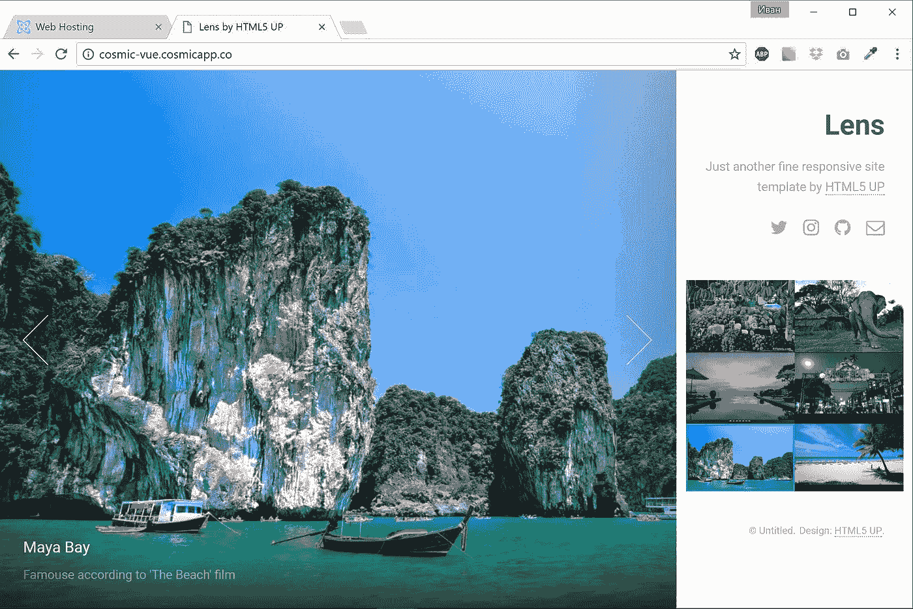
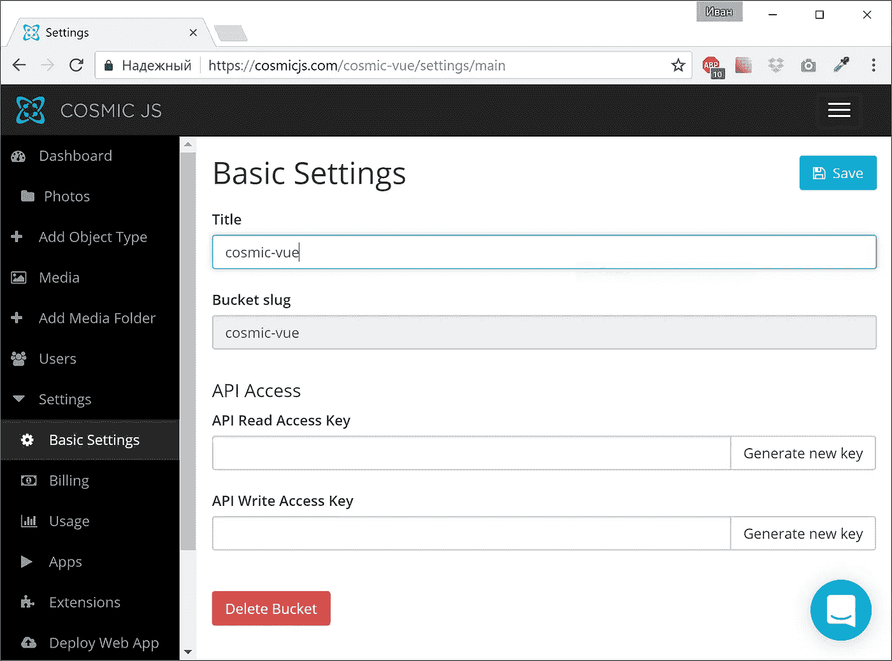
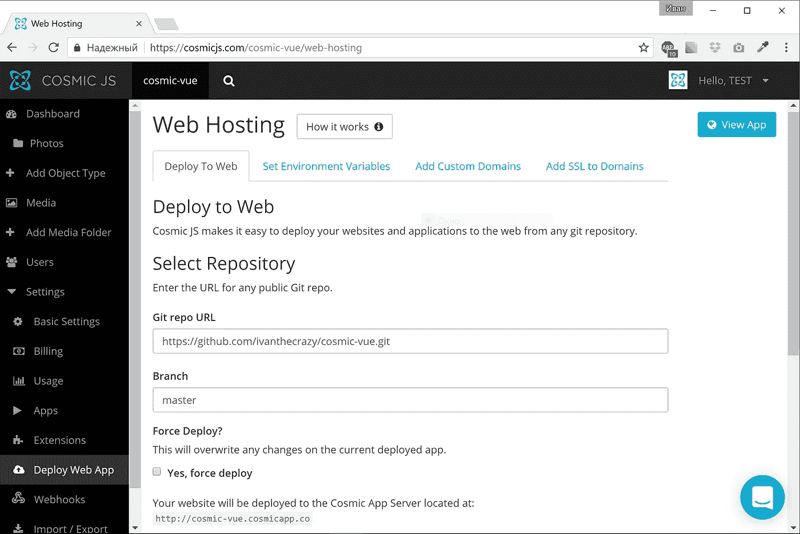

# 如何建立 Vue.js 图片库

> 原文：<https://medium.com/hackernoon/how-to-build-a-vue-js-photo-gallery-a0d4a1ec298d>

在本教程中，我将向您展示如何使用来自 [HTML5UP](https://html5up.net/) 的现成模板构建一个照片库，该模板由 [Cosmic JS](https://cosmicjs.com) API 提供支持，托管在 Cosmic JS 应用服务器上。



# TL；速度三角形定位法(dead reckoning)

[查看演示](https://cosmicjs.com/apps/vuejs-photo-gallery)
[在 GitHub 上查看代码库](https://github.com/cosmicjs/vuejs-photo-gallery)

# 先决条件

您将需要节点 JS 和 npm。在开始之前，确保你已经有了它们。

# 入门指南

首先，我们需要安装 VueJS CLI 并启动新项目。为此，请运行以下命令:

```
npm install -g vue-cli
vue init webpack vuejs-photo-gallery
cd vuejs-photo-gallery
npm install
```

设置好这个项目后，您就可以运行了

```
cd vuejs-photo-gallery
npm run dev
```

在浏览器中玩你的应用程序

# 使用现有的 git repo 做任何事情

首先，您必须确保安装了 node > 6.x，然后运行以下命令:

```
npm install -g vue-cli
git clone https://github.com/cosmicjs/vuejs-photo-gallery.git
cd vuejs-photo-gallery
npm install
npm run dev
```

运行最后一个命令后，浏览器窗口将自动打开

# 建立宇宙 JS 库

首先安装 Cosmic JS Angular/JavaScript 库

```
npm install cosmicjs --save
```

现在你应该能够导入宇宙对象并执行宇宙 JS API 调用，如下所示:

```
import Cosmic from 'cosmicjs';
const bucket = { slug: 'your-bucket-slug' };Cosmic.getObjects({ bucket }, (err, res) => {
  console.log(res.objects);
});
```

# 用宇宙 JS 设置事物

创建存储桶并记住存储桶名称(在我们的例子中为`vuejs-photo-gallery`):

然后创建一个名为 Photo 的新对象类型。

我们还需要一种存储图片本身的方法。请进入“图元字段模板”选项卡，用键`image`添加“图像/文件”类型的图元字段。这个元字段将存储图像。我们不需要更多的东西，所以只需设置名称和保存对象类型。保存后，您将被重定向到“新照片”页面。使用此页面创建一些照片并保存它们-我们将使用它们作为测试数据。



剩下唯一要做的就是设置网站范围内的东西，比如标题、标语、社交图标和页脚文本。让我们再创建一个名为 Global 的对象类型。并添加以下元字段:

*   标语—纯文本区域
*   Twitter —纯文本输入
*   Instagram —纯文本输入
*   Github —纯文本输入
*   电子邮件—纯文本输入
*   页脚—纯文本区域

# VueJS 环境

我们希望在部署时自动选择我们的存储桶名称。在这种情况下，我们需要配置文件，我们将在部署过程中使用正确的数据填充该文件。创建`src/config.js`以匹配以下内容:

```
Config = {
    bucket: 'vuejs-photo-gallery'
};module.exports = Config;
```

# 准备资产

下载模板 ZIP 文件，并将其解压缩到某个地方。在我们的例子中，我们有以下内容:

这是我们的 HTML 标记，稍后我们会把它移到 Vue 组件中。`images` -这是样本图像文件夹。我们不需要它，我们的图像将由宇宙 JS 服务器`assets`提供——其他资产如 CSS、字体、javascript 文件。我们需要 CSS 和字体。让我们暂时忽略 Javascript，因为我们计划使用 VueJS。让我们将`assets/css`和`assets/fonts`文件夹复制到我们项目中的`static`文件夹。这将允许我们将这些文件作为静态资产自动添加到构建中。

# 准备 index.html

现在是时候将我们的资产纳入`index.html`了。将以下内容添加到`head`部分:

```
<meta name="viewport" content="width=device-width, initial-scale=1" />
<!--[if lte IE 8]><script src="assets/js/ie/html5shiv.js"></script><![endif]-->
<link rel="stylesheet" href="static/css/main.css" />
<!--[if lte IE 8]><link rel="stylesheet" href="assets/css/ie8.css" /><![endif]-->
<!--[if lte IE 9]><link rel="stylesheet" href="assets/css/ie9.css" /><![endif]-->
<noscript><link rel="stylesheet" href="static/css/noscript.css" /></noscript>
```

这将包括我们的静态资产。一旦我们实现了正确的标记，外观将通过 CSS 自动设置。

# VueJS 组件

查看我们的页面，我们可以定义我们需要的组件:

`Header`和`Footer` -这将是非常简单的组件，将显示应用程序启动时加载的全局数据`Thumbs` -该组件将显示照片缩略图`Viwer` -该组件将显示大照片，并提供上一页/下一页导航。请注意——我们正在使用之前下载的模板创建组件的模板标记(从 index.html 复制粘贴并应用 VueJS 指令)。

`Header`组件:

```
<template>
    <header id="header">
        <h1>{{ header }}</h1>
        <div v-html="text"></div>
        <ul class="icons">
            <li><a :href="twitter" class="icon fa-twitter"><span class="label">Twitter</span></a></li>
            <li><a :href="instagram" class="icon fa-instagram"><span class="label">Instagram</span></a></li>
            <li><a :href="github" class="icon fa-github"><span class="label">Github</span></a></li>
            <li><a :href="email" class="icon fa-envelope-o"><span class="label">Email</span></a></li>
        </ul>
    </header>
</template><script>
import {EventBus} from '../event_bus';export default {
    name: 'app-header',
    created() {
        EventBus.$on('global_loaded', (obj) => {
            this.header = obj.title;
            this.text = obj.metafield.tagline.value;
            this.twitter = obj.metafield.twitter.value;
            this.instagram = obj.metafield.instagram.value;
            this.github = obj.metafield.github.value;
            this.email = 'mailto:' + obj.metafield.email.value;
        });
    },
    data () {
        return {
            text: null,
            twitter: '',
            instagram: '',
            github: '',
            email: '',
            header: ''
        }
    }
}
</script>
```

`Footer`组件非常相似:

```
<template>
    <footer id="footer">
        <div v-html="text"></div>
    </footer>
</template><script>
import {EventBus} from '../event_bus';export default {
    name: 'app-footer',
    created() {
        EventBus.$on('global_loaded', (obj) => {
            this.text = obj.metafield.footer.value;
        });
    },
    data () {
        return {
            text: null
        }
    }
}
</script>
```

两个组件都使用`EventBus`从父组件接收数据。我将在这篇文章的后面讲述事件总线。

# 拇指组件

这个组件比前两个组件更复杂:

```
<template>
    <section id="thumbnails">
        <article v-for="(item, index) in items" v-bind:class="{ 'active': activeIndex == index }">
            <a class="thumbnail" v-on:click="selectImage(item, index)">
                
            </a>
            <h2>{{ item.title }}</h2>
            <div v-html="item.content"></div>
        </article>
    </section>
</template><script>
import Cosmic from 'cosmicjs';
import * as Config from '../config';
import {EventBus} from '../event_bus';const bucket = { slug: Config.bucket };export default {
    name: 'thumbs',
    props: ['bus'],
    created() {
        Cosmic.getObjectType({ bucket }, { type_slug: 'photos' }, (err, res) => {
            this.items = res.objects.all;
            EventBus.$emit('loaded', this.items[0]);
        });
        EventBus.$on('move', (dir) => {
            this.activeIndex = this.activeIndex + dir;
            if (dir > 0 && this.activeIndex >= this.items.length) {
                this.activeIndex = 0;
            }
            if (dir < 0 && this.activeIndex < 0) {
                this.activeIndex = this.items.length - 1;
            }
            EventBus.$emit('loaded', this.items[this.activeIndex]);
        });
    },
    data () {
        return {
            items: [],
            activeIndex: 0
        }
    },
    methods: {
        selectImage (itm, index) {
            EventBus.$emit('loaded', itm);
            this.activeIndex = index;
        }
    }
}
</script>
```

在组件创建时，我们获取照片列表并订阅事件总线“移动”事件。然后，我们只是渲染这些照片，并在每次用户选择新照片时发出一个新事件。

# 查看器组件

```
<template>
    <div id="viewer">
        <div class="inner">
            <div class="nav-next" v-on:click="selectNext()"></div>
            <div class="nav-previous" v-on:click="selectPrev()"></div>
        </div>
        <div class="slide active" v-if="img">
            <div class="caption">
                <h2>{{ img.title }}</h2>
                <div v-html="img.content"></div>
            </div>
            <div class="image" v-bind:style='{ backgroundImage: "url(" + img.metafield.image.imgix_url + ")" }'>
            </div>
        </div> 
    </div>
</template><script>
import {EventBus} from '../event_bus';export default {
    name: 'viewer',
    props: ['bus'],
    created() {
        EventBus.$on('loaded', (obj) => {
            this.img = obj;
        });
    },
    data () {
        return {
            img: null
        }
    },
    methods: {
        selectNext() {
            EventBus.$emit('move', 1);
        },
        selectPrev() {
            EventBus.$emit('move', -1);
        }
    }
}
</script>
```

该组件通过事件总线订阅`loaded`事件。这个事件意味着用户选择了一张新照片，我们必须以更大的尺寸显示它；该组件的另一个任务是在用户单击上一页/下一页按钮时通知 Thumbs 组件。组件也将事件总线用于此目的。

# 事件总线

事件总线遵循发布-订阅模式，允许我们在 Thumbs 和查看器组件之间建立通信。两个组件都在同一个层次上(没有父子关系)，所以我们需要比简单的事件发射更复杂的东西。事件总线的实现非常简单(`src/event_bus.js`):

```
import Vue from 'vue';
export const EventBus = new Vue();
```

这个事件总线用于触发一个组件中的事件(使用`EventBus.$emit`)和订阅另一个组件中的事件(使用`EventBus.$on`)。

# 将一切串联在一起

现在是时候用`App`组件连接一切了:

```
<template>
  <div>
    <div id="main">
      <app-header></app-header>
      <thumbs></thumbs>
      <app-footer></app-footer>
    </div>
    <viewer></viewer>
  </div>
</template><script>
import AppHeader from './components/AppHeader'
import AppFooter from './components/AppFooter'
import Thumbs from './components/Thumbs'
import Viewer from './components/Viewer'
import Vue from 'vue';
import Cosmic from 'cosmicjs';
import * as Config from './config';
import {EventBus} from './event_bus';const bucket = { slug: Config.bucket };export default {
  name: 'app',
  components: {
    AppFooter,
    AppHeader,
    Thumbs,
    Viewer
  },
  created() {
    Cosmic.getObjectType({ bucket }, { type_slug: 'globals' }, (err, res) => {
      EventBus.$emit('global_loaded', res.objects.all[0]);
      console.log(res.objects.all[0]);
    });
  },
}
</script>
```

该组件在创建时加载全局数据，并通过`EventBus`通知`AppHeader`和`AppFooter`组件。

# 部署到 Cosmic JS 服务器

Cosmic JS 对部署应用有一些要求:

*   它必须在公共 git repo 中
*   [必须满足取决于您的平台的特定要求](https://devcenter.heroku.com/)

在我们的例子中，我们实际上有 HTML5 应用程序，所以我们需要一些额外的软件。

# 准备配置

在您的项目目录中创建一个`prepare.js`文件:

```
var fs = require('fs');var str = `
    Config = {
        bucket: '${process.env.COSMIC_BUCKET}'
    }; module.exports = Config;
`;
fs.writeFile("./src/config.js", str, function(err) {
    if(err) {
        return console.log(err);
    }
    console.log("The file was saved!");
});
```

这个脚本将重写应用程序配置文件(见以上更多信息)文件，以使用您的宇宙 JS 桶写密钥和桶名。

# 修改 package.json

VueJS CLI 添加了一些打包在`package.json`上的作为`devDependencies`。我们必须把它们都移到`dependencies`中，这样我们的脚本才能在 Cosmic JS 服务器中工作。

# 准备软件

我们还需要一些东西来服务我们的 Angular 应用程序。我们将使用快速框架:

```
npm install --save express
```

将以下内容添加到 package.json 中:

```
{
  ...
  "scripts": {
    ...
    "start": "node app.js"
  },
  ...
}
```

要点是在`scripts`部分定义了`start`命令(您可以安全地替换默认角度`start`命令)。这是将运行来启动我们的应用程序的命令。所以现在我们只剩下一件事了——创建`app.js`文件:

```
const express = require('express')
const app = express()app.use(express.static('./dist'));app.listen(process.env.PORT, function () {
});
```

这是一个简单的 Express 应用程序，它将`dist`目录作为静态文件的目录。请注意-应用程序监听通过`PORT`环境变量指定的端口，在 Cosmic JS 应用程序服务器上运行应用程序很重要。

# 为生产构建 VueJS 应用程序

我们将使用`app.json`来完成这项工作(dokku `predeploy`部分):

```
{
    "scripts": {
        "dokku": {
            "predeploy": "node prepare.js && npm run build"
        }
    }
}
```

该脚本将在我们启动 express 应用程序来构建 VueJS 生产应用程序之前执行。

# 运行它！

现在你可以在你的宇宙 JS 仪表板中进入“部署 Web 应用程序”页面。



只需输入您的回购网址，然后点击“部署到网站”，部署过程将开始，应用程序将在几分钟内准备就绪。

# 结论

使用 Cosmic JS 应用程序服务器允许使用 git repo 将应用程序快速部署到主机，而不用担心服务器配置和软件安装——一切都将由 Cosmic JS 服务器完成。

> 这篇文章最初出现在[宇宙 JS 博客](https://cosmicjs.com/blog/how-to-build-a-vuejs-photo-gallery)上。