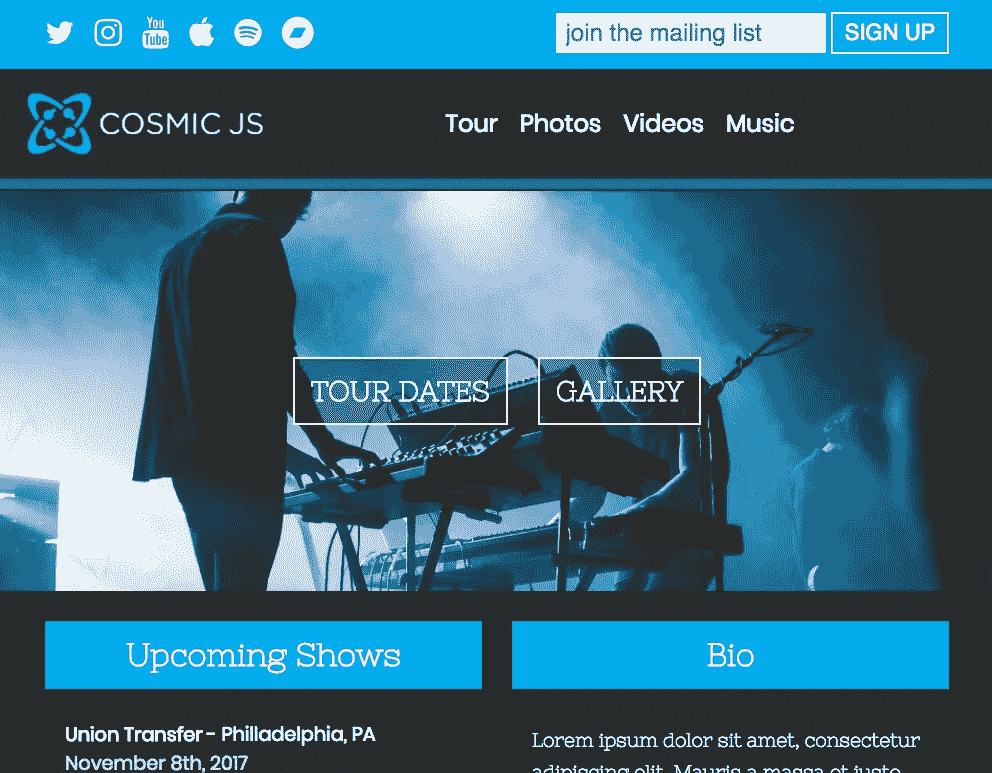

# 如何使用 Node.js 为你的乐队建立一个网站

> 原文：<https://medium.com/hackernoon/how-to-build-a-website-for-your-band-using-node-js-a7c856266c>

What we’ll be building

# TL；速度三角形定位法(dead reckoning)

[查看演示](https://cosmicjs.com/apps/band-website/demo)
[查看 GitHub 上的完整代码库](https://github.com/cosmicjs/band-website)
[点击几下即可安装并部署网站](https://cosmicjs.com/apps/band-website)

当你全神贯注于写歌、充分利用录音室时间、寻找演出机会时，你就不会被为乐队建立静态网站或处理深奥的 CMS 系统所困扰。当你想方便地访问你的数据，想知道一切都在哪里，想能够为自己编写一个简单的，可预测的应用程序时，Cosmic JS 应该是最明显的选择。

Cosmic JS 是一个 API 优先的 CMS，这意味着它独立于语言、独立于数据库，并且几乎独立于其他任何东西。这对于像这样的小项目来说非常棒，因为我们可以在未来用任何语言或框架快速扩展它，我们可以定义我们需要的复杂的数据结构。

我们的乐队网站需要有以下功能:

1.  巡演日期，这样我们的粉丝就知道在哪里可以看到我们
2.  照片库，因为看起来酷和听起来好一样重要
3.  视频画廊，因为照片会变得无聊
4.  一本传记，这样新粉丝就能知道我们在做什么
5.  一个邮件列表注册表格，所以我们可以向我们的球迷营销

我们的网站将被建成一个 Express 应用程序，与 Mailchimp 集成以处理电子邮件注册，其所有数据将完全由 Cosmic JS 提供。它也将通过 Cosmic 部署。

# 第 0 部分:设置 Cosmic JS

我们将在 Cosmic 中使用三种对象类型来构建我们的数据。

1.  旅游日期—用于存储演出信息
2.  图库—用于存储相册
3.  视频—用于存储 Youtube 视频的链接
4.  设置—用于存储站点设置

我们将用预定义的元字段设置每个对象类型，如下所示:

**游览日期
图元字段** 地点(文本)
地点(文本)
日期(日期)
门票链接(文本)

**图库
图元字段** 照片(复读机)
-照片(文件)
-日期(日期)

**视频
图元字段** 嵌入代码(文本)

(设置类型没有预设的元字段，我们将在需要时设置它们)

# 第一部分。样板设置

为了节省样板文件的时间，我们将使用 Yeoman 和 Express Generator(构建在 Express 的“官方生成器”上)来开始。如果你没有安装 Yeoman，运行`npm i -g yo`。然后用`npm i -g generator-express`安装发电机，用`yo express`运行发电机。按照说明在一个新目录下建立你的项目(比如说`CosmicUserBlog`)，安装*基础*版本，并为你的视图引擎使用手柄。

您的目录结构现在如下:

第二部分。装置

我们将使用以下软件包:

*   async——一个强大的异步实用程序库
*   axios——简单、基于承诺的 http 请求
*   Cors——标准 CORS 中间件
*   宇宙 JS——官方客户端
*   时刻—格式化日期
*   TruncateHTML —用于 HTML 安全文本缩短
*   洛达什——因为它的各种设施

你可以用 npm 安装这些，但我主张用纱线。它明显更快，我们没有时间浪费。所以安装 Yarn(在 macOS 上我们会做一个`brew install yarn`，然后运行`yarn add async axios cors cosmicjs moment truncate-html lodash`。

# 第三部分。配置应用程序

在`app.js`中，导入我们刚刚安装的包，并声明一个用于 Cosmic JS 客户端的`config`对象:

我们将其分配给`app.locals`以在我们的路线中使用。

# 网站设置

我们希望能够在整个网站上显示某些数据，我们将把它存储在一个 Cosmic JS 对象中，以便于编辑，而不是每次需要更改时都必须重新部署我们的网站。在你的宇宙仪表盘中，制作一个名为``Site Settings``的`Settings`物体。

主要布局

在我们开始构建之前的最后一步是对主手柄布局进行一些调整，其中我们需要链接到字体 Awesome、Normalize.css，并更改标题。变更后，`main.handlebars`将是这样的:

# 第四部分。构建页眉和页脚

网站上的每个页面都将有一个标题，所以我们将首先建立它。出于同样的原因，我们将使它成为部分的。它将链接到我们的社交媒体，我们邮件列表的注册表单，我们的徽标和主要导航。

将此添加到`partials/header.handlebars`:

这给了我们一个带有移动下拉菜单的响应式标题，我们需要将`nav-links`、`signup-form`和`social-links`构建成它们自己的部分。同样，`settings.logo`(和其他数据)将从路线通过`req.locals`传递。

# 导航链接部分

为了不重复，我们用`partials/nav-links.handlebars`中的所有导航链接创建了一个部分。

# 部分社交链接

这同样适用于我们的社交媒体链接，除了我们传递数据的方式会使构建稍微有趣一点。因为除了`title`、文本和`href`之外，每个帐户的 link 元素都是相同的，所以我们将使用 Handlebars `each`助手来迭代我们所有的帐户。

# 注册表单部分

最后，我们需要一个表单来处理向我们的 Mailchimp 列表添加新订户。我们将简单地收集他们的电子邮件地址，并在稍后向`/signup`发送 POST 请求时进行处理。

所有的页眉部分都完成了，页眉本身也就完成了，我们基本上免费得到了页脚:

注意`#getYear`助手。稍后我们将在`app.js`中定义它，并使用它以字符串形式返回当前年份。

# 第五部分。构建主页

主页可以让你一瞥网站的其他部分。在上半部分，我们将展示我们的标题和一个大的 CTA 部分，其中有链接到我们的旅行日期和照片库的按钮。在下半部分，我们将展示三个即将播出的节目，一个简介和一个页脚。

> 本文是 Matt Cain 在 Cosmic JS 上发表的[原文的缩略版](https://cosmicjs.com/articles/how-to-build-a-website-for-your-band-with-cosmic-js-j8v73a00)

# 第九部分。部署

在部署之前——这只是推到一个 Github repo 并遵循宇宙仪表盘上的指示——确保用`gulp sass`编译 Sass 样式

# 第十部分。结论

使用 Cosmic JS、Express 和 Mailchimp，我们为我们的乐队建立了一个可访问的功能性网站，让我们可以随时更新信息、巡演日期、照片库和视频，而不必每次改变都重新部署网站。Cosmic 的 API first approch 让我们可以简单地做到这一点，不需要数据库，只要有一个很棒的仪表板，就可以随时随地管理我们的数据。

鉴于我们能够如此快速地构建我们的应用程序，以及部署和维护它的简单性，很明显，Cosmic JS 在其 API 优先的内容管理方法中是独一无二的。很明显，CosmisJS 是一个赚钱机器。

Matt Cain 构建了智能 web 应用程序，并介绍了构建这些应用程序所使用的技术。你可以在他的 [*作品集*](http://mattcain.io/) 上了解他的更多信息。