# 如何用 Bootstrap 4 Beta 建立网站

> 原文：<https://medium.com/hackernoon/how-to-build-a-website-with-bootstrap-4-beta-cfbafbab8dcb>

## 非常简单的教程，教你如何快速建立自己的网站。

拥有一个网站就像打开一扇门，邀请潜在客户进入你的生意。

如果您符合以下条件，本教程非常适合您:

1.  一个初学网页设计师，希望解决自由职业者的项目
2.  一个非科技企业家想要快速检验他的想法

对于本教程，我们将建立一个即将到来的登录页面。比方说，你有一个新的应用程序，一个原型或一个新的网站想法，你想推出，你想建立一些嗡嗡声。这就是为什么尽快开始推广你的网站和社交资料是个好主意。

更重要的是，你想开始收集电子邮件，这样你就可以在你的想法推出之前开始建立客户群。

## 我们将要建造的东西

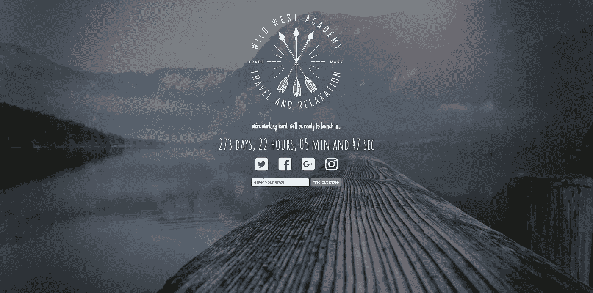

我们将从头开始开发一个响应性的登录页面，而不是创建一个基本的正在建设中的页面。包含以下内容的事物:

1.  倒计时钟
2.  互动社交媒体按钮
3.  与 Mailchimp 集成

我们将在 Bootstrap 中完成所有这些工作。Bootstrap 是开发响应式网站和登录页面最流行的前端框架之一。

在本教程结束时，你将拥有用 HTML 和 CSS 开发专业外观页面的技能。所以让我们开始吧！

# "取得成功的秘诀在于开始行动。"
― **马克·吐温**

# A.安装

为了让我们开始在 bootstrap 框架中编码，我们首先需要下载相关的文件，这样我们就可以链接所有默认的 bootstrap 风格。

## 1.下载编译好的 CSS 和 JS

如果你去 Bootstrap 站点，你应该看到大的下载按钮，下载编译好的 CSS 和 JS 版本。

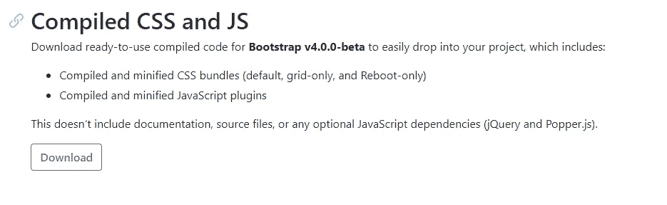

## 2.将文件提取到可访问的位置

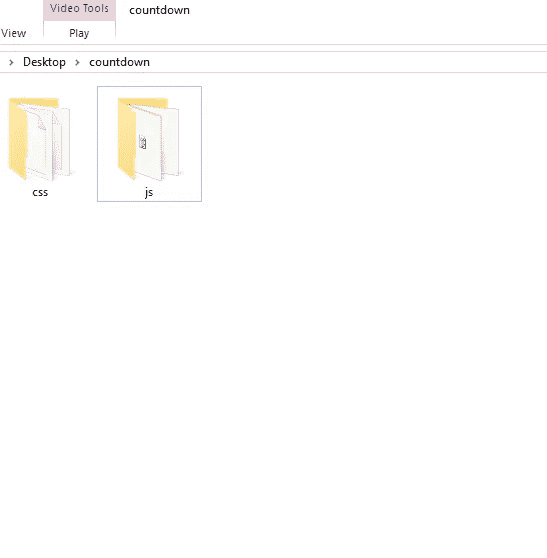

## 3.创建文件结构

我们有一些来自 Bootstrap 的文件，但是我们缺少索引文件和样式表。

## 4.下载 Atom 文本编辑器

你可以从这里下载:[https://atom.io/](https://atom.io/)。虽然你可以使用任何你喜欢的文本编辑器。重要的是你要找到一个你习惯使用的编辑器。

所以当你打开你选择的编辑器时，进入下一步。

## 5.创建一个 CSS 文件

创建一个新的空白文件，并将其作为 style.css 保存在 css 文件夹中。

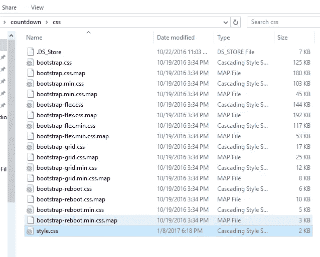

## **6。创建索引文件**

创建新的空白页。在我们将它保存为我们的索引文件之前，我们只需要添加一点代码来确保我们被插入到引导框架中。

为此，我们需要返回到 Bootstrap 网站的[文档选项卡](https://getbootstrap.com/docs/4.0/getting-started/introduction/)。

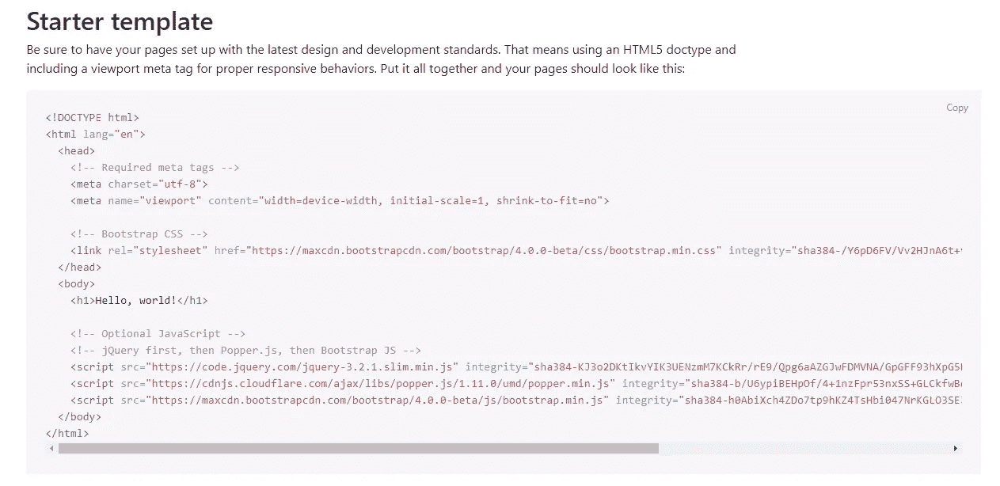

我们将使用初学者模板。我们必须复制这部分代码，然后我们可以跳回 HTML 编辑器并粘贴到我们的索引文件中。

## 7.去掉 Hello World h1。

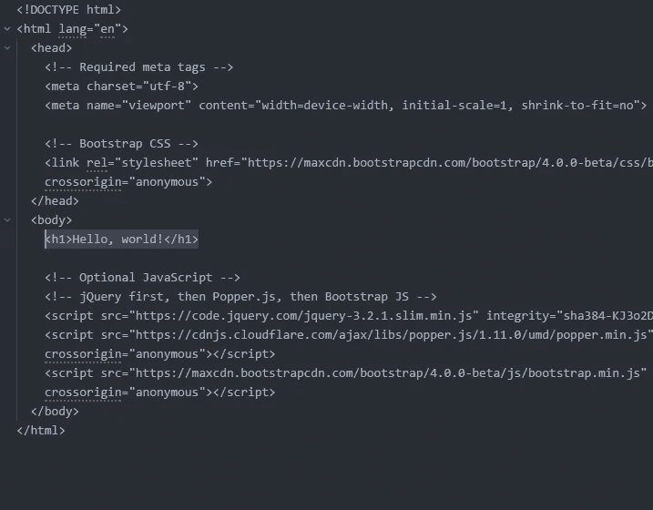

## 8.将索引文件与我们之前创建的样式表链接起来

当我们在浏览器中查看时，该样式将反映在索引页面中。

在 head 部分，只需将默认的引导样式表放在这里。

> <link rel="”stylesheet”" href="”css/style.css”">

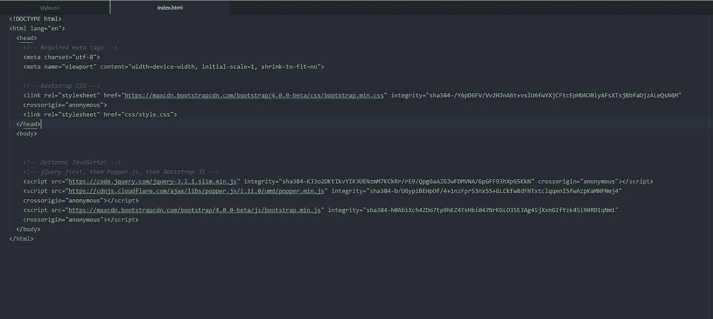

## 9.将索引文件另存为倒计时文件夹中的 index.html。

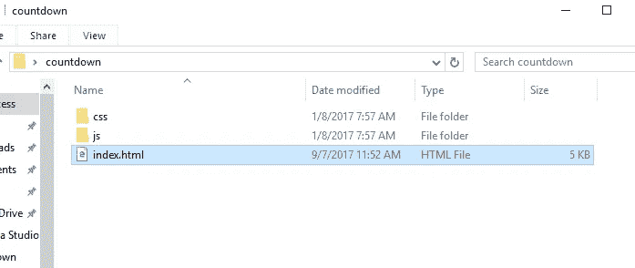

## 10.休息一下。这是你应得的


Studio Katze

## 11.安装字体真棒

这将使我们能够在页面中使用漂亮的矢量图标。

Bootstrap 4 附带了大量的图标，你可以从这些图标开始，它们被称为字形图标，但是它们是相当基本的，并不会真正得到更新。Bootstrap 4 也决定放弃对字形图标支持。

字体真棒是伟大的，因为不是创建一个图像，必须被其最终设计所束缚，与 FA 你可以很容易地调整边界，改变颜色，甚至动画，所以他们提供了更多的灵活性和自由。

点击这里进入字体劲爆主页:[http://fontawesome.io/](http://fontawesome.io/)

我们要做的第一件事是在使用它们之前将样式表安装到页面中。

点击下载

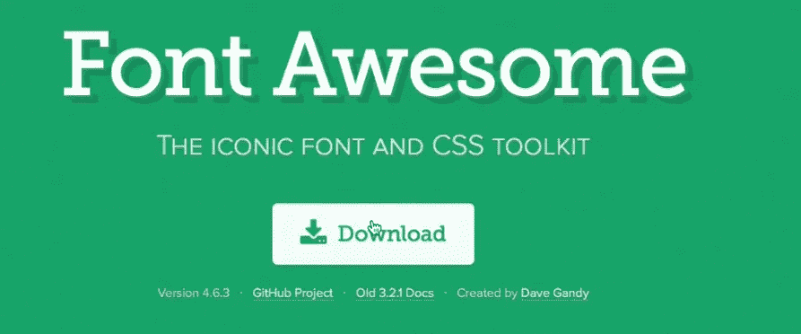

将档案文件解压到你的倒计时文件夹中，并删除只是版本的数字。

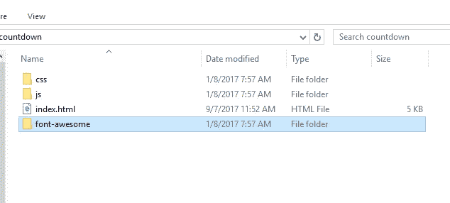

## 12.回到索引文件并安装新的样式表

将下面一行添加到索引文件中:

> <link rel="”stylesheet”" href="”font-awesome/css/font-awesome.css”">

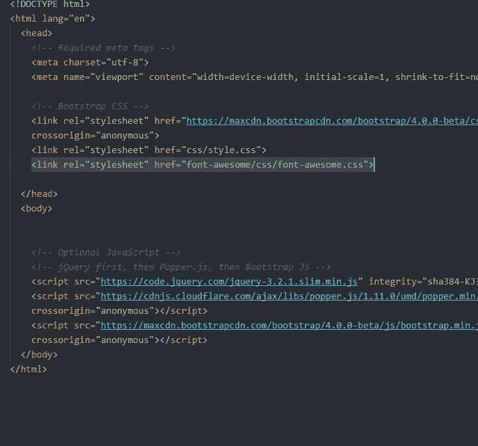

很快我们会在页面上需要的地方添加图标。

## 13.将项目图像添加到您的文件夹中

为了准确再现即将推出的页面，这里是我们将要使用的照片。


Background Image

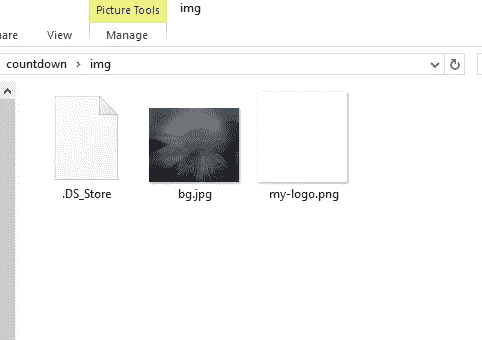

如果你想使用你自己的图像，那很好。只要记住在代码中链接到那些图片，而不是我在整个教程中使用的那些。

我们现在实际上都设置好了，我们终于可以开始设计我们的页面了

# B.创建我们的页面

我们已经准备好了所有的文件，现在我们可以开始倒计时了。

## 14.添加背景图像

因为我们正在创建一个启动页面，这将在一个页面中包含我们所有的元素。没有滚动，没有菜单，我们可以在 HTML 标签中应用背景图像。

转到样式表并添加以下行:

```
html, body {
    background:url('../img/bg.jpg') center center no-repeat;
    height: 100%;
    background-size:cover;
}
```

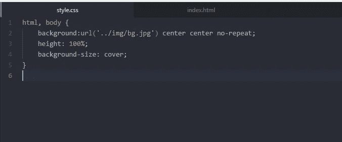

你可以打开你的索引页面，在浏览器上看到背景图片。

现在我们可以向页面添加内容，它将简单地放置在我们在样式表中添加的背景图片的顶部。

## 15.在 Index.html 添加我们的标志

我们要添加到页面的第一件事是品牌标志。

转到索引页并添加正文标签:

```
<section id="logo">
        <div class="container">
            <div class="row">

                <div class="col-md-12 text-center">
                    
                </div>
```

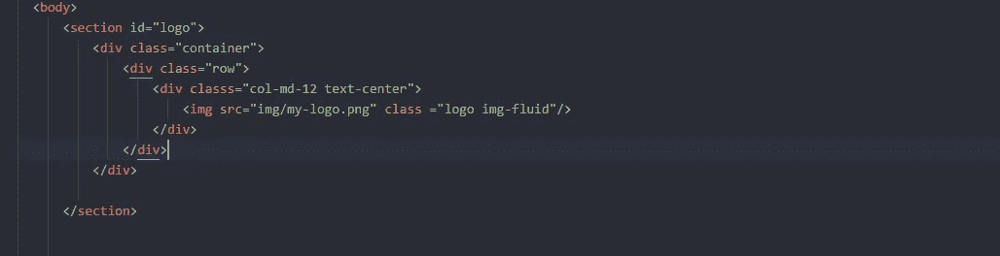

## 16.调整 CSS 中的徽标使其居中

在样式表中添加:

```
#logo img {
    margin:0 auto !important;
    padding-top:20px;
}
```

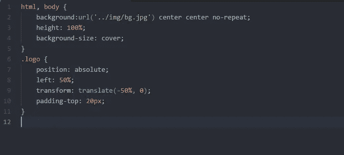

## 17.在索引文件中添加介绍文本

返回到您的索引文件，并在徽标下添加一个部分。

```
<section id="intro">
        <div class="container">
            <div class="row">

                <div class="col-md-12">
                    <p>we're working hard, we'll be ready to launch in...</p>
                </div>

            </div>  
        </div>
      </section>
```

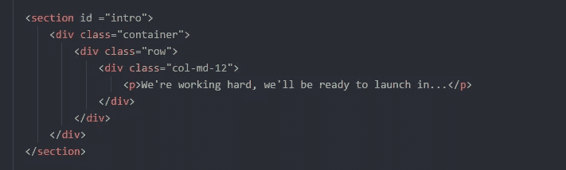

## 18.更改 CSS 中的介绍文本

```
#intro p {
    color: white;
    text-align:center;
    font-family: 'Just Another Hand', cursive;
    font-size:1.8em;
}
```

## 19.获取自定义的谷歌字体

为了做到这一点，我们必须通过谷歌字体添加一个新的样式表。

去这里:【https://fonts.google.com/】T4

随便看看，选你喜欢的。我要去找另一手牌—[https://fonts.google.com/?query=just+another&选择。family = Just+另一手+牌](https://fonts.google.com/?query=just+another&selection.family=Just+Another+Hand)

从他们的页面复制链接:

> <link href="”https://fonts.googleapis.com/css?family=<strong" class="jl hv">只是+另一个+手 " rel="stylesheet" >

并将其粘贴到索引页面的样式表部分。


复制 CSS 规则:

> 字体家族:‘只是另一只手’，草书；

并将它们粘贴到段落样式中的自定义样式表中。你也可以调整你的字体大小，使文本更具可读性。

## 20.自定义文本的最终 CSS 样式

```
#intro p {
    color: white;
    text-align:center;
    font-family: 'Just Another Hand', cursive;
    font-size:1.8em;
}
```

## 21.现在去吃点点心吧。你应得的。


Avocado toast sounds good

# C.添加倒计时钟

好的，我们取得了一些进展。现在是时候把我们的倒计时钟添加到我们的页面上了。

为了加快速度，只需复制第一个文本部分，并在下面复制它。

将节 id 从“文本简介”更改为“计数器”。

现在我们需要一些 JavaScript 代码。

## 22.获得伦德罗倒计时

你可以从这里的链接得到这个库:【https://github.com/rendro/countdown 

下载 zip 文件，解压并在 js 文件夹中复制 jquery.countdown 文件。

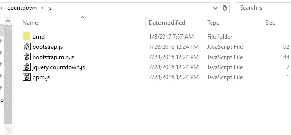

## 23.优步简单设置

要使用倒计时插件，你需要加载当前版本的 jQuery(用 1.7.2 测试过)和插件的 javascript 文件。只需添加以下几行:

```
<script type="text/javascript" src="[https://ajax.googleapis.com/ajax/libs/jquery/1.7.2/jquery.min.js](https://ajax.googleapis.com/ajax/libs/jquery/1.7.2/jquery.min.js)"></script>
      <script type="text/javascript" src="js/jquery.countdown.js"></script>
```

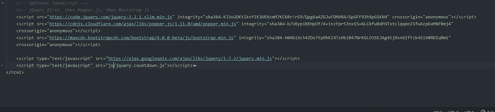

## 24.初始化插件

在下面添加脚本

```
<script>
      $(function() {
    $('.countdown').countdown({
        date: "June 7, 2087 15:03:26"
    });
});
      </script>
```

并在文本下面的部分中包含带有类的 div

```
<section id="counter">
        <div class="container">
            <div class="row">

                <div class="col-md-12">
                    <div class="countdown"></div>
                </div>

            </div>  
        </div>
      </section>
```

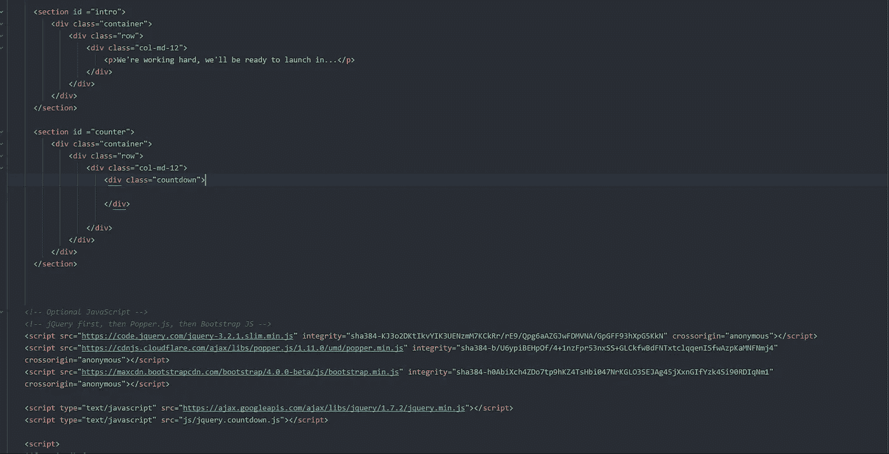

## 25.向倒计时文本添加自定义 Google 字体

重复同样的过程，去谷歌字体，并获得 Amatic SC 和添加粗体选项的字体。

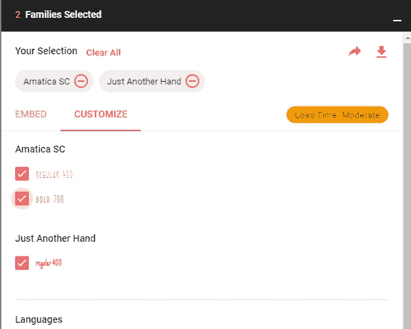

将代码从嵌入部分复制到索引页。

> <link href="”https://fonts.googleapis.com/css?family=<strong" class="jl hv">Amatic+SC:400700" rel = " style sheet ">

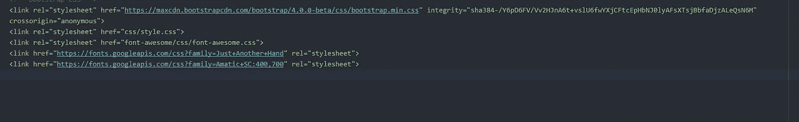

抓取 CSS 代码“字体系列:'业余 SC '，草书；并将其融入你的风格中。

```
#counter .countdown {
    text-align:center;
    color:white;
    font-family: 'Amatic SC', cursive;
    font-size:3em;
    margin:-15px 0 0;
}
```

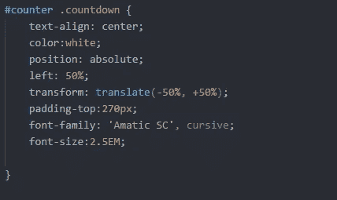

## 现在你的页面应该是这样的


## 26.让我们在索引中添加一些社交媒体按钮

对于我们的社交媒体按钮，我们将使用字体真棒图标。

我们已经在设置部分介绍了安装，现在我们可以开始使用它们了。你可以在这里看到他们所有的图标:[http://fontawesome.io/icons/](http://fontawesome.io/icons/)

我们将在一个容器中使用 Twitter、脸书、Google+和 Instagram square 图标。

```
<section id="icons">
        <div class="container">
            <div class="row">

                <div class="col-md-12">
                    <ul class="list-inline">
                        <a href="[http://www.twitter.com](http://www.twitter.com)" target="blank"><li class="list-inline-item"><i class="fa twitter fa-twitter-square fa-3x" aria-hidden="true"></i></li></a>
                        <a href="[http://www.facebook.com](http://www.facebook.com)" target="blank"><li class="list-inline-item"><i class="fa facebook fa-facebook-square fa-3x" aria-hidden="true"></i></li></a>
                        <a href="[http://www.google.com](http://www.google.com)" target="blank"><li class="list-inline-item"><i class="fa google fa-google-plus-square fa-3x" aria-hidden="true"></i></li></a>
                        <a href="[http://www.instagram.com](http://www.instagram.com)" target="blank"><li class="list-inline-item"><i class="fa instagram fa-instagram fa-3x" aria-hidden="true"></i></li></a>
                    </ul>
                </div>

            </div>  
        </div>
      </section>
```

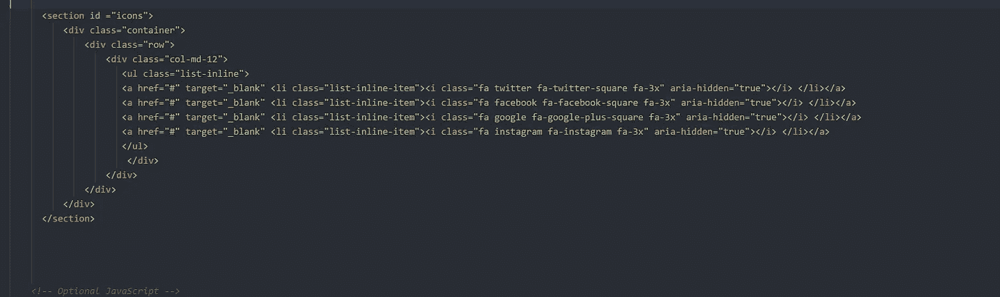

## 27.让我们为他们添加一些风格

我们必须对齐图标并改变它们的颜色

```
#icons .twitter:hover {
    color:#6cadde;
    bottom:5px;
}#icons .facebook:hover {
    color:#3b5998;
    bottom:5px;
}
```

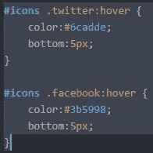

它应该是这样的:


## 28.让我们添加一些可怕的悬停效果

我们可以从 CSS 中制作出很棒的悬停效果。我们在索引页面中为每个图标添加了一个类别:脸书、谷歌、Instagram 和 Twitter。我们可以从样式表中设计过渡效果。

```
#icons .twitter:hover {
    color:#6cadde;
    bottom:5px;
}#icons .facebook:hover {
    color:#3b5998;
    bottom:5px;
}#icons .google:hover {
    color:#ea4335;
    bottom:5px;
}#icons .instagram:hover {
    color:#517fa6;
    bottom:5px;
}
```


Hover Effect

# D.注册表单

这是伟大的家伙。我们已经完成了流程的 50%以上。我们必须添加页面的最后一部分，即注册表单。

## 29.吃一颗激励药丸

# “忙碌不仅仅是做你喜欢的事情。这意味着做你不喜欢的事情，这样你就可以做你喜欢的事情。”未知的

## 30.创建窗体节

添加经典的

容器

```
<section id="signup">
        <div class="container">
            <div class="row">

                <div class="col-md-12">

                </div>

            </div>  
        </div>
      </section>
```

转到 Bootstrap 4 文档并检查内联表单代码以获得更多表单选项:[https://getbootstrap.com/docs/4.0/components/forms/](https://getbootstrap.com/docs/4.0/components/forms/)

我们将暂时只收集电子邮件。

HTML 代码是

```
<section id="signup">
        <div class="container">
            <div class="row">

                <div class="col-md-12">
                    <form class="form-inline" role="form" method="post" action="#signup">
                        <input type="email" class="form-control form-control-sm" name="email" placeholder="enter your email">
                        <button type="submit" class="btn btn-signup btn-sm" name="submit" value="send">find out more</button>
                    </form>

                </div>

            </div>  
        </div>
      </section>
```

## 31.设置窗体节的样式

为了使表格居中

```
#signup {
    text-align: center;
}#signup .form-inline {
    display: block;
}
```


## 32.表单和表单按钮的更多样式

```
#signup {
    text-align: center;
}#signup .form-inline {
    display: block;
}#signup .btn {
    background-color: rgba(161,186,226,0.5);
    color: white;
}#signup .btn:hover {
    background-color:rgba(37,165,82,1);
}
```

# E.电子邮件收集

这里我们有两种方法:

1.  使用 PHP 标记
2.  使用电子邮件营销工具(推荐)

## 33.使用 Mailchimp 收集电子邮件

您可以在网站的任何页面上嵌入 MailChimp 列表注册表单。定制表格以支持您的品牌，或将其与特别优惠相结合，以吸引新订户并提高参与度。

在这里阅读官方文档:[https://kb . mailchimp . com/lists/sign up-forms/add-a-sign up-form-to-your-website](https://kb.mailchimp.com/lists/signup-forms/add-a-signup-form-to-your-website)

# F.最终站点

## 34.HTML 代码

```
<!DOCTYPE html>
<html lang="en">
  <head>
    <!-- Required meta tags always come first -->
    <meta charset="utf-8">
    <meta name="viewport" content="width=device-width, initial-scale=1, shrink-to-fit=no">
    <meta http-equiv="x-ua-compatible" content="ie=edge"><!-- Bootstrap CSS -->
    <link rel="stylesheet" href="[https://maxcdn.bootstrapcdn.com/bootstrap/4.0.0-alpha.6/css/bootstrap.min.css](https://maxcdn.bootstrapcdn.com/bootstrap/4.0.0-alpha.6/css/bootstrap.min.css)" integrity="sha384-rwoIResjU2yc3z8GV/NPeZWAv56rSmLldC3R/AZzGRnGxQQKnKkoFVhFQhNUwEyJ" crossorigin="anonymous"><link rel="stylesheet" href="css/style.css">
    <link rel="stylesheet" href="font-awesome/css/font-awesome.css">
    <link href="[https://fonts.googleapis.com/css?family=Just+Another+Hand](https://fonts.googleapis.com/css?family=Just+Another+Hand)" rel="stylesheet">
    <link href="[https://fonts.googleapis.com/css?family=Amatic+SC:400,700](https://fonts.googleapis.com/css?family=Amatic+SC:400,700)" rel="stylesheet">

  </head>
  <body><section id="logo">
        <div class="container">
            <div class="row">

                <div class="col-md-12 text-center">
                    
                </div>

            </div>
        </div>
      </section>

      <section id="intro">
        <div class="container">
            <div class="row">

                <div class="col-md-12">
                    <p>we're working hard, we'll be ready to launch in...</p>
                </div>

            </div>  
        </div>
      </section>

      <section id="counter">
        <div class="container">
            <div class="row">

                <div class="col-md-12">
                    <div class="countdown"></div>
                </div>

            </div>  
        </div>
      </section>

      <section id="icons">
        <div class="container">
            <div class="row">

                <div class="col-md-12">
                    <ul class="list-inline">
                        <a href="[http://www.twitter.com](http://www.twitter.com)" target="blank"><li class="list-inline-item"><i class="fa twitter fa-twitter-square fa-3x" aria-hidden="true"></i></li></a>
                        <a href="[http://www.facebook.com](http://www.facebook.com)" target="blank"><li class="list-inline-item"><i class="fa facebook fa-facebook-square fa-3x" aria-hidden="true"></i></li></a>
                        <a href="[http://www.google.com](http://www.google.com)" target="blank"><li class="list-inline-item"><i class="fa google fa-google-plus-square fa-3x" aria-hidden="true"></i></li></a>
                        <a href="[http://www.instagram.com](http://www.instagram.com)" target="blank"><li class="list-inline-item"><i class="fa instagram fa-instagram fa-3x" aria-hidden="true"></i></li></a>
                    </ul>
                </div>

            </div>  
        </div>
      </section>

      <section id="signup">
        <div class="container">
            <div class="row">

                <div class="col-md-12">
                    <form class="form-inline" role="form" method="post" action="#signup">
                        <input type="email" class="form-control form-control-sm" name="email" placeholder="enter your email">
                        <button type="submit" class="btn btn-signup btn-sm" name="submit" value="send">find out more</button>
                    </form>

                </div>

            </div>  
        </div>
      </section>

    <!-- jQuery first, then Tether, then Bootstrap JS. -->
  <script src="[https://code.jquery.com/jquery-3.2.1.slim.min.js](https://code.jquery.com/jquery-3.2.1.slim.min.js)" integrity="sha384-KJ3o2DKtIkvYIK3UENzmM7KCkRr/rE9/Qpg6aAZGJwFDMVNA/GpGFF93hXpG5KkN" crossorigin="anonymous"></script>
<script src="[https://cdnjs.cloudflare.com/ajax/libs/popper.js/1.11.0/umd/popper.min.js](https://cdnjs.cloudflare.com/ajax/libs/popper.js/1.11.0/umd/popper.min.js)" integrity="sha384-b/U6ypiBEHpOf/4+1nzFpr53nxSS+GLCkfwBdFNTxtclqqenISfwAzpKaMNFNmj4" crossorigin="anonymous"></script>
<script src="[https://maxcdn.bootstrapcdn.com/bootstrap/4.0.0-beta/js/bootstrap.min.js](https://maxcdn.bootstrapcdn.com/bootstrap/4.0.0-beta/js/bootstrap.min.js)" integrity="sha384-h0AbiXch4ZDo7tp9hKZ4TsHbi047NrKGLO3SEJAg45jXxnGIfYzk4Si90RDIqNm1" crossorigin="anonymous"></script>WWzlZJ8ea9aCX4pEW3rVHjgjt7zpkNpZk+02D9phzyeVkE+jo0ieGizqPLForn" crossorigin="anonymous"></script>

      <script type="text/javascript" src="[https://ajax.googleapis.com/ajax/libs/jquery/1.7.2/jquery.min.js](https://ajax.googleapis.com/ajax/libs/jquery/1.7.2/jquery.min.js)"></script>
      <script type="text/javascript" src="js/jquery.countdown.js"></script>

      <script>
      $(function() {
    $('.countdown').countdown({
        date: "June 7, 2087 15:03:26"
    });
});
      </script>

  </body>
</html>
```

## 35.CSS 代码

```
html, body {
    background:url('../img/bg.jpg') center center no-repeat;
    height: 100%;
    background-size:cover;
}#logo img {
    margin:0 auto !important;
    padding-top:20px;
}#intro p {
    color: white;
    text-align:center;
    font-family: 'Just Another Hand', cursive;
    font-size:1.8em;
}#counter .countdown {
    text-align:center;
    color:white;
    font-family: 'Amatic SC', cursive;
    font-size:3em;
    margin:-15px 0 0;
}#icons {
    text-align:center;
}#icons .fa {
    color:white;
    margin:5px 15px;
    position:relative;
    bottom:0;
    transition:all 0.2s ease-in-out;
}#icons .twitter:hover {
    color:#6cadde;
    bottom:5px;
}#icons .facebook:hover {
    color:#3b5998;
    bottom:5px;
}#icons .google:hover {
    color:#ea4335;
    bottom:5px;
}#icons .instagram:hover {
    color:#517fa6;
    bottom:5px;
}#signup {
    text-align: center;
}#signup .form-inline {
    display: block;
}#signup .btn {
    background-color: rgba(161,186,226,0.5);
    color: white;
}#signup .btn:hover {
    background-color:rgba(37,165,82,1);
}
```

# 36.恭喜

# “胸怀大志，不要听那些告诉你做不到的人的话。人生苦短，不要想得太渺小。”- [蒂姆·菲利斯](https://medium.com/u/56d3bc91794f?source=post_page-----cfbafbab8dcb--------------------------------)

感谢阅读。我希望这有所帮助。如果你有任何反馈或建议，我很乐意在评论中与你交谈。