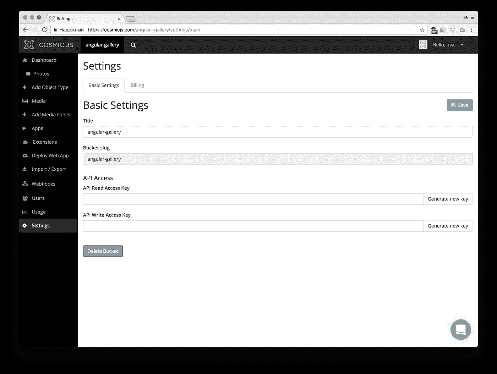
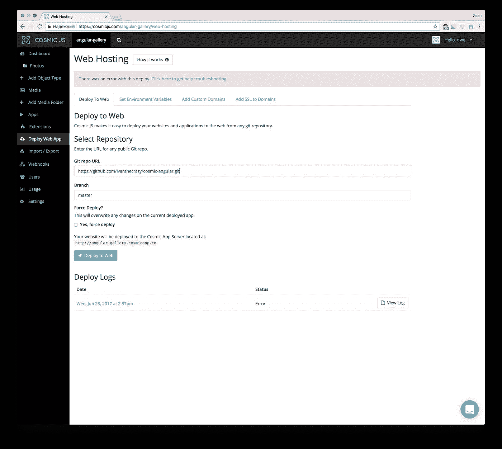

# 如何构建有角度的图像馈送

> 原文：<https://medium.com/hackernoon/how-to-build-an-angular-js-image-feed-ea6193fa0b75>


在本教程中，我将向你展示如何建立一个用户驱动的图片库，由 Angular 提供支持，托管在 [Cosmic JS](https://cosmicjs.com) 应用服务器上。

# TL；速度三角形定位法(dead reckoning)

[查看演示](https://cosmicjs.com/apps/angular-js-image-feed/demo)
[在 GitHub 上查看完整源代码](https://github.com/cosmicjs/angular-image-feed)
[安装 App 并部署到 Cosmic App 服务器](https://cosmicjs.com/apps/angular-js-image-feed)

# 先决条件

您需要预先安装节点 JS、npm 和 Angular cli。在开始之前，确保你已经有了它们。关于如何操作，请参考[角度文件](https://angular.io/guide/quickstart)。

# 入门指南

首先，我们需要创建角度项目。我们将使用 ng cli 来完成。因此，一旦安装了所有的先决条件，就需要设置新的 Angular 项目:

```
ng new cosmic-angular
```

设置好这个项目后，您就可以运行了

```
cd cosmic-angular
ng serve --open
```

在浏览器中玩你的应用程序

# 使用现有的 git repo 做任何事情

首先，您必须确保安装了 node > 6.x，然后运行以下命令:

```
npm install -g @angular/cli
git clone https://github.com/cosmicjs/angular-image-feed
cd cosmic-angular
npm install
ng serve --open
```

文章创建时最新的 ng cli 版本是 1.1.3。运行最后一个命令后，浏览器窗口将自动打开

# 建立宇宙 JS 库

首先安装 [Cosmic JS npm 模块](https://cosmicjs.com/knowledge-base/javascript-cms)用于 Angular/JavaScript 应用:

```
npm install cosmicjs --save
```

现在你应该能够导入宇宙对象并执行宇宙 JS API 调用，如下所示:

```
import Cosmic from 'cosmicjs';
const bucket = { slug: 'your-bucket-slug' };Cosmic.getObjects({ bucket }, (err, res) => {
  console.log(res.objects);
});
```

# 用宇宙 JS 设置事物

创建存储桶并记住存储桶名称(在我们的例子中为`‘cosmic-angular’`):

然后创建一个名为 Photo 的新对象类型，请记住对象类型 slug (photos ')。

我们还需要一种存储图片本身的方法。请进入“图元字段模板”选项卡，用键`'photo'`添加“图像/文件”类型的图元字段。这个元字段将存储图像。我们不需要更多的东西，所以只需设置名称和保存对象类型。保存后，您将被重定向到“新照片”页面。使用此页面创建一些照片并保存它们-我们将使用它们作为测试数据。

您还需要创建 Bucket write 键。允许用户上传图片和创建照片对象是必要的。打开设置页面，单击 API 写访问密钥上的“生成新密钥”,然后复制生成的密钥并保存更改。



# 角度环境

编辑`src/environments/environment.ts`以匹配以下内容:

```
export const environment = {
  production: false,
  write_key: 'YOURWRITEKEY',
  bucket_name: 'YOURBUCKETNAME',
  photos_type: 'photos'
};
```

# 角度的配置服务

我们计划在不止一个角度分量中使用宇宙 JS 物体。在这种情况下，创建一个专用的配置服务并在一个地方存储所有与 Cosmic JS 相关的东西是有意义的，比如 bucket 名称、write key 等。让我们用以下内容创建`src/services/cosmic_config.ts`:

```
import {Injectable} from '@angular/core';@Injectable()
export class CosmicConfigService {
    private write_key;
    private bucket_name;
    private photos_type; constructor() {
        this.photos_type = environment.photos_type;
        this.write_key = environment.write_key;
        this.bucket_name = environment.bucket_name
    } public getReadCfg(): any {
        return {
            bucket: {
                slug: this.bucket_name
            }
        };
    } public getWriteCfg(): any {
        return {
            bucket: {
                slug: this.bucket_name,
                write_key: this.write_key
            }
        };
    } public buildPhotoUploadObj(title, file): any {
        return {
            write_key: this.write_key,
            type_slug: this.photos_type,
            title: title,
            metafields: [{
                key: 'picture',
                type: 'file',
                value: file
            }]
        };
    } getPhotoSlug() {
        return this.photos_type;
    }
}
```

该服务有几种方法:

*   `getReadCfg` -返回用于读取数据的配置对象
*   `getWriteCfg` -返回写数据的配置对象(指定 write_key)
*   `buildPhotoUploadObj` -使用文件名和标题构建创建照片的对象
*   `getPhotoSlug` -返回照片的对象类型 slug

我们将从角度分量调用这些方法。

# 查看图库-角度部分

创建包含以下内容的`src/components/picture/picture.ts`文件:

```
import { Component, Input } from '@angular/core';@Component({
    selector: 'picture',
    templateUrl: './picture.html'
})
export class Picture {
    @Input() picture: any; constructor() {
    }
}
```

然后为图片组件创建一个模板:

```
<div class="ui card picture-item">
  <div class="image">
    
  </div>
  <div class="content">
    <div class="description">{{ picture.title }}</div>
  </div>
</div>
```

我们将使用这个组件来显示一个画廊图片项目。

现在用以下内容创建`src/components/picture_upload/picture_upload.ts`文件:

```
import { Component, Input, Output, EventEmitter } from '@angular/core';
import Cosmic from 'cosmicjs';
import { CosmicConfigService } from '../../services/cosmic_config';@Component({
    selector: 'picture-upload',
    templateUrl: './picture_upload.html'
})
export class PictureUpload {
    private fl;
    private title;
    public uploading;
    @Output() onUpload = new EventEmitter<any>(); constructor(
        private cosmicConfig: CosmicConfigService
    ) {
        this.uploading = false;
        this.fl = null;
        this.title = "";
    } onFileChange(ev) {
        if (ev.target.files && ev.target.files.length) {
            this.fl = ev.target.files[0];
        }
    } upload() {
        this.uploading = true;
        Cosmic.addMedia(this.cosmicConfig.getWriteCfg(), {
            media: this.fl,
            folder: this.fl.name
        }, (error, response) => {
            Cosmic.addObject(this.cosmicConfig.getWriteCfg(),
                this.cosmicConfig.buildPhotoUploadObj(this.title, response.body.media.name),
            (error, response) => {
                this.title = '';
                this.fl = null;
                this.uploading = false;
                this.onUpload.emit({});
            });
        });
    }
}
```

然后添加以下模板:

```
<div class="picture-upload">
    <div class="ui form" [ngClass]="{ 'active dimmer': uploading }">
        <div class="ui grid" *ngIf="!uploading">
            <div class="five wide column">
                <div class="field">
                    <input type="text" placeholder="Title..." (input)="title = $event.target.value" [value]="title"/>
                </div>
            </div>
            <div class="six wide column">
                <div class="field">
                    <input type="file" (change)="onFileChange($event)"/>
                </div>
            </div>
            <div class="five wide column">
                <button class="ui primary button fluid" (click)="upload()">Upload photo</button>
            </div>
        </div>
        <div *ngIf="uploading" class="ui text loader">Upload is in progress</div>
    </div>
</div>
```

向 app.module.ts 添加`Picture`和`PictureUpload`组件，就像对 AppComponent 等其他组件一样。这将允许我们在应用程序中使用它。

# 这里发生了什么？

我们的`Picture`组件不执行任何有趣的事情——它只是显示对象属性。然而`PuctureUpload`组件做着更有趣的事情。它在 Cosmic JS 服务器上创建了一个记录，但是这个记录附有一个图像，所以这使得整个过程更加复杂:

*   将图像上传到 Cosmic JS 服务器(使用`addMedia`方法)
*   获取上传的图像名称
*   创建新的 Cosmic JS 对象(使用`addObject`方法),传递它获得的图像名称
*   激发一个事件来通知父组件上传完成

# 将一切串联在一起

现在我们需要修改我们的`AppComponent`来使用这些新创建的组件。修改`src/app/app.component.ts`如下所示:

```
import { Component } from '@angular/core';
import Cosmic from 'cosmicjs';
import {CosmicConfigService} from '../services/cosmic_config';@Component({
  selector: 'app-root',
  templateUrl: './app.component.html',
  styleUrls: ['./app.component.css']
})
export class AppComponent {
  public items = [];
  page = 0;
  page_size = 2;
  scrollEnabled = true; constructor(
    public cosmicCfg: CosmicConfigService
  ) {
    this.reload();
  } reload() {
    this.items = [];
    this.page = 0;
    this.scrollEnabled = true;
    let params = {
      type_slug: this.cosmicCfg.getPhotoSlug(),
      limit: this.page_size,
      skip: 0
    };
    Cosmic.getObjectType(this.cosmicCfg.getReadCfg(), params, (err, res) => {
      this.items = res.objects.all;
    });
  } onUpload() {
    this.reload();
  } onScroll() {
    if (!this.scrollEnabled) {
      return;
    }
    this.page++;
    let params = {
      type_slug: this.cosmicCfg.getPhotoSlug(),
      limit: this.page_size,
      skip: this.page * this.page_size
    };
    Cosmic.getObjectType(this.cosmicCfg.getReadCfg(), params, (err, res) => {
      if (res.objects && res.objects.all) {
        res.objects.all.forEach((itm) => {
          this.items.push(itm);
        });
      }
      else {
        this.scrollEnabled = false;
      }
    });
  }
}
```

并制作如下模板:

```
<div infiniteScroll [infiniteScrollDistance]="1" [infiniteScrollThrottle]="300" (scrolled)="onScroll()">
    <picture-upload (onUpload)="onUpload()"></picture-upload>
<picture *ngFor="let item of items" [picture]="item"></picture>
</div>
```

我们计划拥有无限滚动的图库(你已经可以在代码中看到它的指令)。这意味着我们必须安装正确的库:

```
npm install --save ngx-infinite-scroll
```

# 这里发生了什么事？

*   在我们得到空响应之前，我们假设服务器上还有更多照片
*   我们正在获取 2 个整批的照片(`page_size`属性)
*   我们只获取“照片”类型的对象(如果我们有更多的对象类型，这很有用)
*   一旦我们得到空响应，我们就设置标志并停止获取更多照片
*   一旦我们从`PhotoUpload`组件得到一个事件，我们就重置整个列表。

# 部署到 Cosmic JS 服务器

Cosmic JS 对部署应用有一些要求:

*   它必须在公共 git repo 中，或者您需要[连接您的 GitHub 帐户](https://cosmicjs.com/integrations)进行私有 repo 部署
*   [必须满足取决于您的平台的特定要求](https://devcenter.heroku.com/)

在我们的例子中，我们实际上有 HTML5 应用程序，所以我们需要一些额外的软件。

# 准备配置

在您的项目目录中创建一个`prepare.js`文件:

```
var fs = require('fs');var str = `
    export const environment = {
        production: true,
        write_key: '${process.env.COSMIC_WRITE_KEY}',
        bucket_name: '${process.env.COSMIC_BUCKET}',
        photos_type: 'photos'
    };
`;
fs.writeFile("./src/environments/environment.prod.ts", str, function(err) {
    if(err) {
        return console.log(err);
    }
    console.log("The file was saved!");
});
```

此脚本将重写默认角度生产设置文件，以使用您的 Cosmic JS 存储桶写入密钥和存储桶名称。

# 修改 package.json

Angular cli 在`package.json`上增加了一些包装作为`devDependencies`。我们必须把他们转移到`dependencies`才能让我们的剧本发挥作用:

```
...
"dependencies": {
    "@angular/cli": "^1.1.3",
    "@angular/compiler-cli": "^4.0.0",
    ...
},
...
```

# 准备软件

我们还需要一些东西来服务我们的 Angular 应用程序。我们将使用快速框架:

```
npm install --save express
```

将以下内容添加到 package.json 中:

```
{
  ...
  "scripts": {
    ...
    "start": "node app.js"
  },
  ...
  "engines": {
    "node": "6.9.4",
    "npm": "4.2.0"
  }
  ...
}
```

要点是在`scripts`部分定义了`start`命令(您可以安全地替换默认角度`start`命令)。这是将运行来启动我们的应用程序的命令。所以现在我们只剩下一件事了——创建`app.js`文件:

```
const express = require('express')
const app = express()app.use(express.static('./dist'));app.listen(process.env.PORT, function () {
});
```

这是一个简单的 Express 应用程序，它将`dist`目录作为静态文件的目录。请注意-应用程序监听通过`PORT`环境变量指定的端口，在 Cosmic JS 应用程序服务器上运行应用程序很重要。

# 为生产构建 Angular 应用程序

我们将使用`app.json`来完成这项工作(dokku `predeploy`部分):

```
{
    "scripts": {
        "dokku": {
            "predeploy": "node prepare.js && ng build --aot --prod"
        }
    }
}
```

这个脚本将在我们启动 express 应用程序来构建 Angular 应用程序用于生产之前执行。

# 运行它！

现在你可以在你的宇宙 JS 仪表板中进入“部署 Web 应用程序”页面。



只需输入您的回购网址，然后点击“部署到网站”，部署过程将开始，应用程序将在几分钟内准备就绪。

# 结论

使用 Cosmic JS 应用服务器允许我们使用 git repo 将应用程序快速部署到主机，并且您不用担心服务器配置和软件安装——一切都将由 Cosmic JS 服务器完成。

> 本文原载于[宇宙 JS 博客](https://cosmicjs.com/blog/how-to-build-an-angular-js-image-feed)。