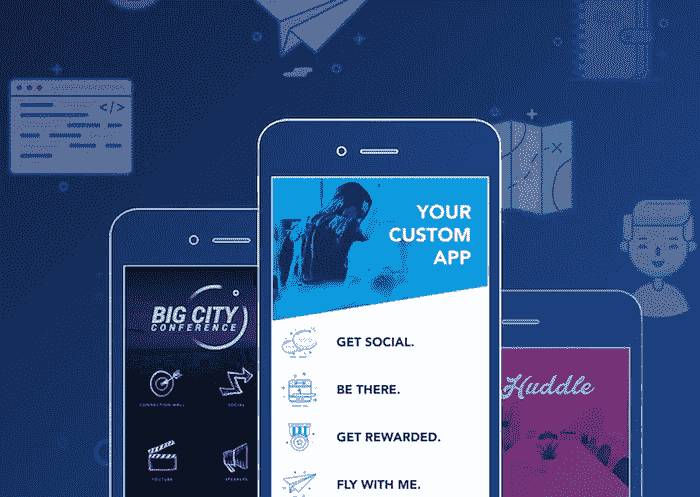

# 作为一个非技术人员如何构建一个 App

> 原文：<https://medium.com/hackernoon/how-to-build-an-app-as-a-non-technical-person-2edb74884794>

Courtesy of Pexels.com

作为一个非技术人员，做一个 app 还是挺辛苦的吧？

作为一名非技术型创始人，你为你的“颠覆”市场的“革命性”想法所做的第一件事可能是……找一位 T2 的首席技术官或 T4 的技术型创始人。

我说的对吗？

这是错误的开始方式。

原因是，在大多数情况下，你甚至还没有开始研究应用程序的一般概念，你就因为没有 CTO 和你在一起而受到“阻碍”。

你知道吗，你可以在对编码和设计一无所知的情况下构建一个应用程序？

下面我列出了一些解决方案，让你作为一个非技术人员开始构建你的第一个应用程序。除此之外，你还会发现一个你可以使用的工具列表，以及一些来自其他非技术型创始人的优秀案例研究，详细说明了他们是如何做到的。

我先告诉你…

# 作为非技术人员，你有哪些选项来构建你的第一个应用程序？

# #学习如何自己编写代码

为了[建立一个最小可行的产品](https://brainhub.eu/blog/what-is-mvp/)或一个应用的第一个版本，以验证对它的需求，并获得适当的开发资金，你可以像 Instagram 的那些家伙一样做同样的事情。

学习如何自己编码(时间>金钱)，找一个自由职业者为你建一个 app(金钱>时间)，雇佣一个软件开发公司(金钱>时间)或者黑你的 app…

## 从哪里可以学到如何开发一个 app？

我个人已经用这个免费的 youtube 视频课程[开始了一步一步的用 Bootstrap 构建静态网站的教程](https://www.youtube.com/watch?v=oepmLGQP1m4&list=PLUoqTnNH-2Xz_BUrjcahKWDhPcUj-FTOt)

Courtesy of Giphy Images

# #从设计应用原型开始

**设计—** 使用 [Sketch](https://www.sketchapp.com/) 、 [Balsamiq](https://balsamiq.com/) 和 AdobeXD 来设计你的 app 的界面。

**动画** —使用 [AdobeXD](http://www.adobe.com/products/experience-design.html) 和 [UXPin](https://www.uxpin.com/) 来设计和动画化您设计精美的应用程序之间的工作流。

**获得灵感** —使用 [SketchAppResources](https://www.sketchappsources.com/) 、 [UI 模式](http://ui-patterns.com/)或 [ProductHunt](https://www.producthunt.com/) 来寻找伟大产品的灵感，甚至使用一些开源的免费应用程序接口([freebiebug](https://freebiesbug.com/))并稍微调整它们。

阅读我的最新帖子[如何让非设计师的应用程序原型化](https://brainhub.eu/blog/how-to-prototype-app-as-non-designer/)在几天内从 0 变成英雄。

有了这样一个原型，你就可以去把你的产品/愿景卖给:

a)潜在**客户**

b)潜在的**联合创始人**

c)潜在的**投资者**

# #使用应用构建器

有很多网络平台可以让你通过拖放元素来构建一个应用。

你不需要编写任何代码。

在大多数情况下，应用程序的质量很差，速度很慢，但是对于你的第一个 MVP 来说，这足以验证一个产品。

你可以使用[https://buildfire.com/](https://buildfire.com/)或[https://bubble.is/](https://bubble.is/)或[https://www.appsheet.com](https://www.appsheet.com/)(谷歌表单驱动应用)

**更多灵感**来自产品搜索[的博客文章，点击](/product-hunt/7-tools-to-help-you-build-an-app-without-writing-code-cb4eb8cfe394)。

请注意，这些解决方案非常适合验证这个想法，但是您希望能够扩展应用程序，添加自定义功能，并改进它的 UI/UX。

这个解决方案开始还不错，但是不要期望有什么好结果。

Courtesy of [https://buildfire.com/](https://buildfire.com/)

# #找一个自由职业者来开发你的应用

如果你需要一些简单的东西(一个开发人员 1 个月的工作，不需要任何自动化测试，可扩展的后端，处理大量的数据，并且你不需要为此花太多的钱，只需要…

**雇佣自由职业者。**

然而，如果你要雇佣一个:

*   **获得推荐**或好评——当困难出现时，他/她不会消失
*   **请注意，如果费用**低于 30 美元(取决于国家——查看[自由职业者费用](https://www.hellobonsai.com/rates?utm_source=brainhub)),将很难在没有任何[技术债务](https://en.wikipedia.org/wiki/Technical_debt)的情况下获得一个好的编码应用
*   尝试找到一个开发者，他将**只专注于最多 1-2 个项目**
*   **明确你的目标和任务**(学习如何编写[用户故事](http://www.yodiz.com/blog/writing-user-stories-examples-and-templates-in-agile-methodologies/?utm_source=brainhub))
*   **与自由职业者签订一份合同**,记得包括你将拥有代码/你拥有它的全部权利(在某些情况下，工作结束后，你可能会被要求支付你购买的软件的许可费……)。阅读更多关于外包时如何保护你的知识产权的信息

# #寻找软件开发公司来开发您的应用程序

首先要做的是:

> ***在 70%的情况下你不需要软件开发公司做的 MVP****。*

它将过于昂贵和过于稳健。

但是，如果您知道您:

你的(已经)盈利的和已建立的业务将依赖于它。)

b)您的企业需要一个高度可扩展、强大的应用程序

c)你在市场/业务领域积累了丰富的经验，可以战胜它

d)有与软件开发商或软件开发公司合作的经验，那么…

Courtesy of Brainhub.eu + Pexels.com

作为一个非技术人员，在与外包公司讨论如何构建你的应用时，有一些事情需要考虑，比如:

*   永远拒绝最便宜的公司
*   寻找那些会说“不”或挑战你的想法/特点的人(寻找软件开发伙伴)
*   寻找一个**文化契合、“合作伙伴化学”**——你们应该相互理解，说相似的语言

关于[选择软件开发公司，你可以在这里找到更详细的答案。](https://brainhub.eu/blog/choose-software-development-company/)

# #何时不雇佣软件开发公司

与软件开发公司合作并不便宜。

我和我的联合创始人一起经营着一家 [JavaScript 开发公司](https://brainhub.eu/portfolio)——Brainhub，因此我想和你分享一下我对什么时候不应该雇佣软件开发公司的看法。

与软件开发商店一起构建一个 web 或移动应用程序就像雇佣一名海豹突击队员来完成你的工作。他们经验丰富，训练有素，随时准备“执行”你的想法。

然而，你的**不应该雇佣海军海豹突击队队员(软件公司)来解决像从树上抓猫这样的问题，而应该更多地从绑架者手中营救总统。**

Courtesy of Brainhub.eu

更具体地说，有几个原因，为什么你想有一个软件开发的**海豹突击队**建立的应用程序:

1.  市场上没有这样的东西，你可以从货架上拿下来或者用一个 creator 来做=你只需要做一个
2.  无论是在构建应用程序的业务方面还是技术方面，你都有丰富的经验——你知道自己需要什么，也知道如何与软件开发人员合作。
3.  你想要**扩大你的业务**并且已经有了一个有效的 MVP 或者客户正在为你的引导 MVP 付费
4.  **这不是一个登陆页面或简单的静态网站**或任何需要 1 个开发人员 1 个月时间才能完成的项目——这只是一个软件开发公司的小项目(拯救一只猫)

# #利用在线工具/开源应用程序/SaaS 应用程序发挥创造力

现在，有趣的是:

**搭建一个 APP** :)。

让我分享一些鼓舞人心的案例研究和操作指南，就像前面提到的那样，你可以自己复制。

## 使用现有的解决方案，而不是从头开始构建

有这么多现有的解决方案可以验证你的商业想法，有时很难找到从头开始构建应用程序的理由。让我向你展示几个在线解决方案，你可以用它们来开展业务:

*   **订阅盒服务—** 使用 [Cratejoy](https://www.cratejoy.com/?utm_source=brainhub) 的一个很棒的系统；这就像订阅盒的 Shopify。在这里你可以找到关于如何运营订阅盒服务的指南
*   **双边市场**——你想创建另一个 AirBNB 吗？外面是[共享部落](https://www.sharetribe.com/?utm_source=brainhub)。所以，你今天就可以开始你的双边市场
*   **数据库驱动的应用**——创建一个基于电子表格数据库的应用——使用 [Airtable](https://airtable.com/?utm_source=brainhub) 。即使对 8 年级学生来说也很容易
*   **社区应用** —一直想打造下一个 Hackernews、Producthunt，或者 Reddit？就用一个免费开源的[望远镜 NOVA](http://www.telescopeapp.org/?utm_source=brainhub) ( [用 JS ❤](https://brainhub.eu/blog/why-we-love-node-js/) 打造)。第二版[产品搜索用望远镜在 8 天内完成](https://www.fastcompany.com/3023152/open-company/the-wisdom-of-the-20-minute-startup)
*   **App to match people**——[stop cyber 欺凌](http://www.stopcyberbullying.eu/?utm_source=brainhub)是一个简单的 App，它连接随机的经历过网络欺凌的人。这款应用基于 Typeform、Google Sheets、Zapier 和 Gmail。这是一个完全自动化的系统，无需任何编码。阅读[关于如何做类似应用的说明](http://blog.growthtribe.io/build-back-end-system-without-coding-1/?utm_source=brainhub)
*   **社区提交的产品/项目列表**—[Builtwithbootstrap](http://builtwithbootstrap.com/?utm_source=brainhub)是一个全自动网站，通过出售引导主题(附属)和自动将网站发布到其登录页面来赚钱。在 Tumblr 上构建(0 托管成本+允许修改 html+CSS)。在这里阅读更多关于创始人如何做到的信息
*   **搜索目录** —你可以在几个小时内建立一个类似 Yelp 的本地搜索目录。多亏了 WordPress 和一个叫做 [ListingPro](https://themeforest.net/item/listingpro-multipurpose-directory-theme/19386460/?ref=matt-watt) 的酷插件，你可以很容易地做到这一点。这里有[关于如何一步一步做的说明](https://www.codeinwp.com/blog/create-a-local-search-directory-like-yelp-on-wordpress/?utm_source=brainhub)
*   **数码产品** —你可以从卖一本电子书/MP3/视频/excel 文件开始，来验证你的想法。您可以使用 [Gumroad](https://gumroad.com/?utm_source=brainhub) 来推出一个具有强大的管理/分析仪表板和实施的支付系统的单一数字产品网站
*   **网络应用** — [Kollecto](http://kollecto.com/) 是一款帮助人们成为艺术品收藏家的网络应用。它每月赚 3 万美元，由一个没有任何编程技能的创始人创建。点击此处阅读一个关于单干创始人如何成功的案例研究

我没有在这里列出所有的大型创业公司/应用程序，它们是你下一个自行车优步或宠物 Tinder 等的第一灵感。有一个非常简单的模式可以找到一个克隆应用或 SaaS 服务来帮助你创业，你只需支付月费和每笔交易 1-3%的小额费用。

你知道怎么做吗？

**准备好了吗？**

> *谷歌一下使用这种模式:*
> 
> ***'建立一个(n)* 键入一个 APP 的名称*喜欢 app'***
> 
> 例如。“建立一个类似优步的应用程序”

# #作为非技术人员构建应用的工具

我已经列出了所有我会推荐给非技术人员来构建第一个应用程序的工具。

通常，你可以在公司的博客上找到创始人写的很棒的案例研究，他们以非常规的方式使用他们的工具。[扎皮尔](https://zapier.com/blog/prototype-app-zapier/?utm_source=brainhub))。

*   **自动化/连接**应用程序:Zapier 或 IFTT
*   **表格/调查**:类型表格或 [WuFoo](https://www.wufoo.com/)
*   **一切皆有可能应用** : [谷歌表单](https://www.google.pl/search?q=google+sheet+build+apps&oq=google+sheet+build+apps&aqs=chrome..69i57j69i64.8868j0j7&sourceid=chrome&ie=UTF-8)🙂
*   **网络应用/网站** : [WordPress](https://themeforest.net/category/wordpress/?ref=matt-watt)

# 是行动的时候了！

现在是时候构建你的 MVP 了，这是你梦想的第一个应用程序。从上面的详细列表中选择你的方式去做，然后去做。

我希望我说服了你，你可以作为一个非技术人员来开发一个应用程序。

Courtesy of Giphy

*原载于 2017 年 6 月 12 日*[*brainhub . eu*](https://brainhub.eu/blog/build-app-non-technical-person/)*。*