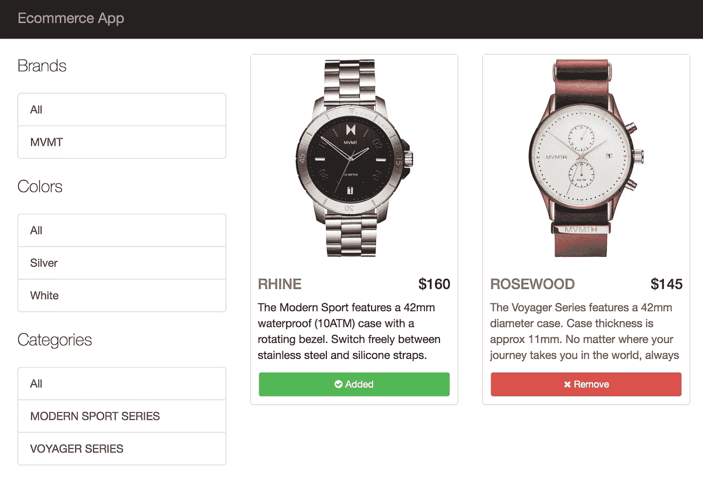

# 如何构建 Angular JS 电子商务应用程序

> 原文：<https://medium.com/hackernoon/how-to-build-an-ecommerce-app-using-angular-js-f73cadb2ace2>



这篇文章最初出现在宇宙 JS 博客上。

在本教程中，我将向你展示如何使用 Angular JS 和 Cosmic JS 创建一个电子商务应用程序。为了理解如何使用 Restful API，本教程将展示如何向 Cosmic JS API 发出简单的 AJAX 请求，以便在我们的 Cosmic JS Bucket 中检索、更新和删除电子商务产品和数据。在本教程结束时，我们将有一个功能齐全的电子商务网站，可以部署开始接受通过 Stripe 购买。让我们开始吧。

# TL；速度三角形定位法(dead reckoning)

[看看这个演示。](https://cosmicjs.com/apps/ecommerce-app)
[下载 GitHub 回购。](https://github.com/cosmicjs/ecommerce-app)
[安装 app，分分钟部署。](https://cosmicjs.com/login)(转到你的桶>应用程序)

# 入门指南

首先，让我们创建一个新目录来构建我们的项目，并创建一个 package.json 文件。

```
mkdir ecommerce-appecommerce-app$ touch package.json
```

现在，在您的 package.json 中，复制并粘贴以下代码:

```
//ecommerce-app/package.json
{
  "name": "ecommerce-app",
  "version": "1.0.0",
  "main": "app-server.js",
  "engines": {
    "node": "4.1.2",
    "npm": "3.5.2"
  },
  "description": "",
  "dependencies": {
    "bower": "^1.7.7",
    "express": "^4.13.3",
    "gulp": "^3.9.1",
    "buffer-to-vinyl": "^1.1.0",
    "gulp-autoprefixer": "^3.1.0",
    "gulp-concat": "^2.6.0",
    "gulp-concat-css": "^2.2.0",
    "gulp-minify-css": "^1.2.4",
    "gulp-ng-config": "^1.4.0",
    "gulp-env": "^0.4.0",
    "gulp-webserver": "^0.9.1",
    "http-server": "^0.9.0",
    "wiredep": "^3.0.0",
    "gulp-npm-script-sync": "^1.1.0"
  },
  "scripts": {
    "postinstall": "bower install && gulp config && gulp js",
    "start": "npm run production",
    "production": "node app-server.js",
    "gulp": "gulp"
  },
  "author": "",
  "license": "ISC",
  "devDependencies": {
    "gulp-npm-script-sync": "^1.1.0",
    "gulp-remote-src": "^0.4.2"
  }
}
```

其次，我们来做一个 bower.json 文件。

```
ecommerce-app$ touch bower.json
```

现在，在您的 bower.json 中，复制并粘贴以下代码:

```
//ecommerce-app/bower.json
{
  "name": "ecommerce-app",
  "description": "Ecommerce App",
  "version": "0.0.0",
  "homepage": "https://github.com/kutsaniuk/ecommerce-app",
  "license": "MIT",
  "private": true,
  "dependencies": {
    "angular": "~1.4.x",
    "angular-mocks": "~1.4.x",
    "angular-bootstrap": "~1.1.x",
    "angular-cookies": "~1.4.x",
    "angular-route": "~1.4.x",
    "angular-ui-router": "0.2.x",
    "angular-resource": "1.4.x",
    "angular-animate": "~1.4.x",
    "ng-dialog": "0.6.1",
    "bootstrap": "3.3.x",
    "cr-acl": "",
    "angular-chosen-localytics": "*",
    "bootstrap-chosen": "*",
    "ng-flow": "^2.7.4",
    "angular-mask": "*",
    "checklist-model": "0.9.0",
    "angular-ui-notification": "^0.2.0",
    "angular-ui-calendar": "^1.0.2",
    "angular-ui-switch": "^0.1.1",
    "ng-scrollbars": "^0.0.11",
    "jquery.scrollbar": "*",
    "angular-nvd3": "*",
    "infinity-angular-chosen": "^0.2.0",
    "angular-flash-alert": "^2.4.0",
    "components-font-awesome": "^4.7.0",
    "textAngular": "^1.5.16",
    "angular-loading-bar": "^0.9.0",
    "angular-environment": "^1.0.8",
    "angular-sticky": "angular-sticky-plugin#^0.3.0"
  },
  "resolutions": {
    "angular": "~1.4.x"
  },
  "devDependencies": {
    "cr-acl": "^0.5.0"
  }
}
```

配置应用服务器:

```
ecommerce-app$ touch app-server.js//events-app/app-server.js
var express = require('express');
var app = express();
app.set('port', process.env.PORT || 3000)
app.use(express.static(__dirname))
var http = require('http').Server(app)
app.get('/', (req, res) => {
  res.sendFile(__dirname + '/index.html');
})
http.listen(app.get('port'), () => {
  console.log('Ecommerce App listening on ' + app.get('port'))
})
```

# 我们正在安装什么，为什么

1.  我们将使用 AngularJS 框架来构建单页面应用程序
2.  我们正在为创建多视图安装 angular-ui-router。
3.  我们将使用 gulp 把所有的 js 和 css 文件构建成一个文件。

# 构建我们的应用

现在我们将构建我们的文件结构，这样我们就可以组织我们的 angular 模块和 js 文件。我们的电子商务应用程序目录应该是这样的:

```
ecommerce-app
|----app
|       |----auth
|                 |----auth.ctrl.js
|                 |----auth.service.js
|       |----config
|                 |----config.js
|       |----watch
|                 |----profile
|                           |----watch.profile.ctrl.js
|                           |----watch.profile.mdl.js
|                 |----watch.ctrl.js
|                 |----watch.mdl.js
|                 |----watch.service.js
|       |----admin
|                 |----orders
|                           |----preview
|                                   |----admin.orders.preview.mdl.js
|                           |----admin.orders.ctrl.js
|                           |----admin.orders.mdl.js
|                           |----admin.orders.service.js
|                 |----watches
|                           |----add
|                                   |----admin.watches.add.ctrl.js
|                                   |----admin.watches.add.mdl.js
|                           |----edit
|                                   |----admin.watches.edit.ctrl.js
|                                   |----admin.watches.edit.mdl.js
|                           |----admin.watches.mdl.js
|                 |----admin.ctrl.js
|                 |----admin.mdl.js
|       |----cart
|                 |----checkout
|                           |----cart.checkout.mdl.js
|                 |----cart.ctrl.js
|                 |----cart.mdl.js
|                 |----cart.service.js
|       |----user
|                 |----user.service.js
|       |----main.mdl.js
|----dist
|       |----css
|       |----img
|       |----js
|----css
|----views
|----gulpfile.js
|----app-server.js
|----bower.json
|----package.json
```

现在我们将建立我们的 index.html。将以下代码复制并粘贴到您的 index.html 文件中:

```
<!DOCTYPE html>
<html lang="en" ng-app="main">
<head>
    <meta charset="utf-8">
    <meta http-equiv="X-UA-Compatible" content="IE=edge">
    <meta name="viewport" content="width=device-width, initial-scale=1">
    <meta name="description" content="">
    <meta name="author" content=""> <title>Ecommerce App</title> <!-- bower:css -->
    <!-- endbower --> <!-- Bootstrap Core CSS -->
    <link href="bower_components/bootstrap/dist/css/bootstrap.min.css" rel="stylesheet"> <!-- Custom CSS --> <link href="dist/css/main.min.css" rel="stylesheet"> <!--[if lt IE 9]>
    <script src="https://oss.maxcdn.com/libs/html5shiv/3.7.0/html5shiv.js"></script>
    <script src="https://oss.maxcdn.com/libs/respond.js/1.4.2/respond.min.js"></script>
    <![endif]--></head>
<body><div ui-view></div><!-- bower:js -->
<!-- endbower --><script src="dist/js/main.js"></script>
</body>
</html>
```

在这里，我们将把我们的“根”视图作为目标，稍后放置我们的角度模块。位于我们的 dist 目录中的 [main.js](https://cosmicjs.com/blog/main.js) 文件是我们的 [gulpfile.js](https://cosmicjs.com/blog/gulpfile.js) 文件在捆绑了我们所有的 angular 模块之后将会产生的文件，现在，设置我们的 [gulpfile.js](https://cosmicjs.com/blog/gulpfile.js) 文件来捆绑我们所有的 js 文件，并将该捆绑文件导出到我们的 dist 目录中。将以下代码复制到您的 [gulpfile.js](https://cosmicjs.com/blog/gulpfile.js) 文件中:

```
//ecommerce-app/gulpfile.js
'use strict';var gulp = require('gulp'),
    webserver = require('gulp-webserver'),
    minifyCSS = require('gulp-minify-css'),
    concat = require('gulp-concat'),
    wiredep = require('wiredep').stream,
    gulpNgConfig = require('gulp-ng-config'),
    autoprefixer = require('gulp-autoprefixer'),
    b2v = require('buffer-to-vinyl'),
    sync = require('gulp-npm-script-sync');sync(gulp);gulp.task('css', function () {
  return gulp.src('css/**/*.css')
    .pipe(minifyCSS())
    .pipe(concat('main.min.css'))
    .pipe(autoprefixer())
    .pipe(gulp.dest('dist/css'));
});gulp.task('js', function() {
    return gulp.src('app/**/**/*.js')
        .pipe(concat('main.js'))
        .pipe(gulp.dest('dist/js/'));
});gulp.task('config', function () {
    const json = JSON.stringify({
        BUCKET_SLUG: process.env.COSMIC_BUCKET,
        MEDIA_URL: 'https://api.cosmicjs.com/v1/' + process.env.COSMIC_BUCKET + '/media',
        URL: 'https://api.cosmicjs.com/v1/',
        READ_KEY: process.env.COSMIC_READ_KEY || '',
        WRITE_KEY: process.env.COSMIC_WRITE_KEY || ''
    });
    return b2v.stream(new Buffer(json), 'config.js')
        .pipe(gulpNgConfig('config'))
        .pipe(gulp.dest('app/config'));
});gulp.task('default', function () {
  gulp.watch('css/**/*.css', ['css']);
  gulp.watch('app/**/**/*.js', ['js']);
  gulp.watch('bower.json', ['bower']);
});gulp.task('bower', function () {
  gulp.src('index.html')
    .pipe(wiredep({
      directory: 'bower_components'
    }))
    .pipe(gulp.dest(''));
});
```

之后，我们可以创建主模块。将以下代码复制并粘贴到您的 index.html 文件中:

```
(function () {
    'use strict'; angular
        .module('main', [
            'ui.router',
            'ui.bootstrap',
            'ngMask',
            'ngCookies',
            'ngRoute',
            'ngDialog',
            'cr.acl',
            'ui-notification',
            'ngFlash',
            'textAngular',
            'flow',
            'angular-loading-bar',
            'hl.sticky', 'watch',
            'cart',
            'admin', 'config'
        ])
        .config(config)
        .run(run); config.$inject = ['$stateProvider', '$urlRouterProvider', 'cfpLoadingBarProvider', 'NotificationProvider'];
    function config($stateProvider, $urlRouterProvider, cfpLoadingBarProvider, NotificationProvider) {
        cfpLoadingBarProvider.includeSpinner = false; NotificationProvider.setOptions({
            startTop: 25,
            startRight: 25,
            verticalSpacing: 20,
            horizontalSpacing: 20,
            positionX: 'right',
            positionY: 'bottom'
        }); $urlRouterProvider.otherwise(function ($injector) {
            var $state = $injector.get("$state");
            var $location = $injector.get("$location");
            var crAcl = $injector.get("crAcl"); var state = ""; switch (crAcl.getRole()) {
                case 'ROLE_ADMIN':
                    state = 'admin.watches';
                    break;
                default : state = 'main.watch';
            } if (state) $state.go(state);
            else $location.path('/');
        }); $stateProvider
            .state('main', {
                url: '/',
                abstract: true,
                templateUrl: '../views/main.html',
                controller: 'CartCtrl as cart',
                data: {
                    is_granted: ['ROLE_GUEST']
                }
            })
            .state('blog', {
                url: '/blog',
                templateUrl: '../blog.html'
            })
            .state('auth', {
                url: '/login',
                templateUrl: '../views/auth/login.html',
                controller: 'AuthCtrl as auth',
                onEnter: ['AuthService', 'crAcl', function(AuthService, crAcl) {
                    AuthService.clearCredentials();
                    crAcl.setRole();
                }],
                data: {
                    is_granted: ['ROLE_GUEST']
                }
            });
    } run.$inject = ['$rootScope', '$cookieStore', '$state', 'crAcl'];
    function run($rootScope, $cookieStore, $state, crAcl) {
        // keep user logged in after page refresh
        $rootScope.globals = $cookieStore.get('globals') || {}; crAcl
            .setInheritanceRoles({
                'ROLE_ADMIN': ['ROLE_ADMIN', 'ROLE_GUEST'],
                'ROLE_GUEST': ['ROLE_GUEST']
            }); crAcl
            .setRedirect('main.watch'); if ($rootScope.globals.currentUser) {
            crAcl.setRole($rootScope.globals.currentUser.metadata.role);
            // $state.go('admin.watches');
        }
        else {
            crAcl.setRole();
        } }})();
```

现在，我们将设置我们的授权控制器。将以下代码复制并粘贴到您的 [auth.ctrl.js](https://cosmicjs.com/blog/auth.ctrl.js) 文件中:

```
(function () {
    'use strict'; angular
        .module('main')
        .controller('AuthCtrl', AuthCtrl); function AuthCtrl(crAcl, $state, AuthService, Flash, $log) {
        var vm = this; vm.login = login; vm.showRegisterForm = false; vm.loginForm = null; vm.credentials = {};
        vm.user = {}; function login(credentials) {
            function success(response) {
                function success(response) {
                    if (response.data.status !== 'empty') {
                        var currentUser = response.data.objects[0]; crAcl.setRole(currentUser.metadata.role);
                        AuthService.setCredentials(currentUser);
                        $state.go('admin.watches');
                    }
                    else
                        Flash.create('danger', 'Incorrect username or password');
                } function failed(response) {
                    $log.error(response);
                } if (response.data.status !== 'empty')
                    AuthService
                        .checkPassword(credentials)
                        .then(success, failed);
                else
                    Flash.create('danger', 'Incorrect username or password'); $log.info(response);
            } function failed(response) {
                $log.error(response);
            } if (vm.loginForm.$valid)
                AuthService
                    .checkUsername(credentials)
                    .then(success, failed);
        } }
})();
```

创建授权服务，复制并粘贴以下代码:

```
(function () {
    'use strict'; angular
        .module('main')
        .service('AuthService', function ($http,
                                          $cookieStore,
                                          $q,
                                          $rootScope,
                                          URL, BUCKET_SLUG, READ_KEY, WRITE_KEY) {
            var authService = this;
            $http.defaults.headers.common['X-Requested-With'] = 'XMLHttpRequest'; authService.checkUsername = function (credentials) {
                return $http.get(URL + BUCKET_SLUG + '/object-type/users/search', {
                    params: {
                        metafield_key: 'email',
                        metafield_value_has: credentials.email,
                        limit: 1,
                        read_key: READ_KEY
                    }
                });
            };
            authService.checkPassword = function (credentials) {
                return $http.get(URL + BUCKET_SLUG + '/object-type/users/search', {
                    ignoreLoadingBar: true,
                    params: {
                        metafield_key: 'password',
                        metafield_value: credentials.password,
                        limit: 1,
                        read_key: READ_KEY
                    }
                });
            };
            authService.setCredentials = function (user) {
                $rootScope.globals = {
                    currentUser: user
                }; $cookieStore.put('globals', $rootScope.globals);
            };
            authService.clearCredentials = function () {
                var deferred = $q.defer();
                $cookieStore.remove('globals'); if (!$cookieStore.get('globals')) {
                    $rootScope.globals = {};
                    deferred.resolve('Credentials clear success');
                } else {
                    deferred.reject('Can\'t clear credentials');
                } return deferred.promise;
            };
        });
})();
```

# 这是怎么回事

1.  我们使用 ui 路由器来配置路由。
2.  我们为对我们的 Cosmic JS API 的异步调用创建了 Auth Service。
3.  我们创建了身份验证控制器来检查凭证。

为获取和更新用户创建用户服务，复制并粘贴以下代码:

```
(function () {
    'use strict'; angular
        .module('main')
        .service('UserService', function ($http,
                                          $cookieStore,
                                          $q,
                                          $rootScope,
                                          URL, BUCKET_SLUG, READ_KEY, WRITE_KEY) {
            $http.defaults.headers.common['X-Requested-With'] = 'XMLHttpRequest'; this.getCurrentUser = function (ignoreLoadingBar) {
                return $http.get(URL + BUCKET_SLUG + '/object/' + $rootScope.globals.currentUser.slug, {
                    ignoreLoadingBar: ignoreLoadingBar,
                    params: {
                        read_key: READ_KEY
                    }
                });
            };
            this.getUser = function (slug, ignoreLoadingBar) {
                return $http.get(URL + BUCKET_SLUG + '/object/' + slug, {
                    ignoreLoadingBar: ignoreLoadingBar,
                    params: {
                        read_key: READ_KEY
                    }
                });
            };
            this.updateUser = function (user) {
                user.write_key = WRITE_KEY; return $http.put(URL + BUCKET_SLUG + '/edit-object', user, {
                    ignoreLoadingBar: false
                });
            }; });
})();
```

为从 Cosmic JS API 获取、更新、添加和删除观察器创建观察器服务，复制并粘贴以下代码:

```
(function () {
    'use strict'; angular
        .module('main')
        .service('WatchService', function ($http,
                                          $cookieStore,
                                          $q,
                                          $rootScope,
                                          URL, BUCKET_SLUG, READ_KEY, WRITE_KEY, MEDIA_URL) { $http.defaults.headers.common['X-Requested-With'] = 'XMLHttpRequest'; this.watch = {
                title: null,
                type_slug: 'watches',
                content: null,
                metafields: [
                    {
                        key: "category",
                        title: "Category",
                        type: "text",
                        value: null
                    },
                    {
                        key: "brand",
                        title: "Brand",
                        type: "text",
                        value: null
                    },
                    {
                        key: "case_size",
                        title: "Case Size",
                        type: "text",
                        value: null
                    },
                    {
                        key: "case_thickness",
                        title: "Case Thickness",
                        type: "text",
                        value: null
                    },
                    {
                        key: "strap_width",
                        title: "Strap Width",
                        type: "text",
                        value: null
                    },
                    {
                        key: "movement",
                        title: "Movement",
                        type: "text",
                        value: null
                    },
                    {
                        key: "glass",
                        title: "Glass",
                        type: "text",
                        value: null
                    },
                    {
                        key: "water_resistance",
                        title: "Water Resistance",
                        type: "text",
                        value: null
                    },
                    {
                        key: "color",
                        title: "Color",
                        type: "text",
                        value: null
                    },
                    {
                        key: "strap_material",
                        title: "Strap Material",
                        type: "text",
                        value: null
                    },
                    {
                        key: "price",
                        title: "Price",
                        type: "text",
                        value: null
                    },
                    {
                        key: "images",
                        title: "Images",
                        type: "parent",
                        value: "",
                        children: [
                            {
                                key: "image_1",
                                title: "Image_1",
                                type: "file"
                            },
                            {
                                key: "image_2",
                                title: "Image_2",
                                type: "file"
                            },
                            {
                                key: "image_3",
                                title: "Image_3",
                                type: "file"
                            }
                        ]
                    }
                ]
            }; this.getWatches = function (params) {
                if (!angular.equals({}, params))
                    return $http.get(URL + BUCKET_SLUG + '/object-type/watches/search', {
                        params: {
                            metafield_key: params.key,
                            metafield_value_has: params.value,
                            limit: 100,
                            read_key: READ_KEY
                        }
                    });
                else
                    return $http.get(URL + BUCKET_SLUG + '/object-type/watches', {
                        params: {
                            limit: 100,
                            read_key: READ_KEY
                        }
                    });
            };
            this.getWatchesParams = function () {
                return $http.get(URL + BUCKET_SLUG + '/object-type/watches', {
                    params: {
                        limit: 100,
                        read_key: READ_KEY
                    }
                });
            };
            this.getWatchBySlug = function (slug) {
                return $http.get(URL + BUCKET_SLUG + '/object/' + slug, {
                    params: {
                        read_key: READ_KEY
                    }
                });
            };
            this.updateWatch = function (event) {
                event.write_key = WRITE_KEY; return $http.put(URL + BUCKET_SLUG + '/edit-object', event);
            };
            this.removeWatch = function (slug) {
                return $http.delete(URL + BUCKET_SLUG + '/' + slug, {
                    ignoreLoadingBar: true,
                    headers:{
                        'Content-Type': 'application/json'
                    },
                    data: {
                        write_key: WRITE_KEY
                    }
                });
            };
            this.createWatch = function (watch) {
                watch.write_key = WRITE_KEY; return $http.post(URL + BUCKET_SLUG + '/add-object', watch);
            };
            this.upload = function (file) {
                var fd = new FormData(); fd.append('media', file);
                fd.append('write_key', WRITE_KEY); var defer = $q.defer(); var xhttp = new XMLHttpRequest(); xhttp.upload.addEventListener("progress",function (e) {
                    defer.notify(parseInt(e.loaded * 100 / e.total));
                });
                xhttp.upload.addEventListener("error",function (e) {
                    defer.reject(e);
                }); xhttp.onreadystatechange = function() {
                    if (xhttp.readyState === 4) {
                        defer.resolve(JSON.parse(xhttp.response)); //Outputs a DOMString by default
                    }
                }; xhttp.open("post", MEDIA_URL, true); xhttp.send(fd); return defer.promise;
            }
        });
})();
```

为获取所有事件创建监视控制器，并删除、复制和粘贴以下代码:

```
(function () {
    'use strict'; angular
        .module('main')
        .controller('WatchCtrl', WatchCtrl); function WatchCtrl($stateParams, WatchService, Notification, $log, MEDIA_URL, $state) {
        var vm = this; vm.getWatches = getWatches;
        vm.removeWatch = removeWatch; vm.params = $stateParams; vm.categories = [];
        vm.brands = [];
        vm.case_sizes = [];
        vm.colors = []; vm.watches = []; function getWatches() {
            function success(response) {
                $log.info(response); vm.watches = response.data.objects; } function failed(response) {
                $log.error(response);
            } function params(response) {
                response.data.objects.forEach(function (item) {
                    if (vm.categories.indexOf(item.metadata.category) === -1)
                        vm.categories.push(item.metadata.category);
                    if (vm.brands.indexOf(item.metadata.brand) === -1)
                        vm.brands.push(item.metadata.brand);
                    if (vm.case_sizes.indexOf(item.metadata.case_size) === -1)
                        vm.case_sizes.push(item.metadata.case_size);
                    if (vm.colors.indexOf(item.metadata.color) === -1)
                        vm.colors.push(item.metadata.color)
                });
            } WatchService
                .getWatches($stateParams)
                .then(success, failed); WatchService
                .getWatchesParams()
                .then(params);
        } function removeWatch(slug) {
            function success(response) {
                $log.info(response);
                getWatches();
                Notification.success('Removed!');
            } function failed(response) {
                $log.error(response);
            } WatchService
                .removeWatch(slug)
                .then(success, failed); } }
})();
```

创建观察模块，复制并粘贴下面的代码:

```
(function () {
    'use strict'; angular
        .module('watch', [
            'watch.profile'
        ])
        .config(config); config.$inject = ['$stateProvider', '$urlRouterProvider'];
    function config($stateProvider, $urlRouterProvider) { $stateProvider
            .state('main.watch', {
                url: '?key&value',
                templateUrl: '../views/watch/watch.list.html',
                controller: 'WatchCtrl as vm'
            });
    }
})();
```

# 这是怎么回事

1.  我们为对我们的 Cosmic JS API 的异步调用创建了 Watch 服务。我们可以创建、更新、删除和获取手表。
2.  我们创建了用于获取和移除所有手表的手表控制器。
3.  我们创建了观察模块。

创建观察配置文件控制器以获取观察信息，复制并粘贴以下代码:

```
(function () {
    'use strict'; angular
        .module('main')
        .controller('WatchProfileCtrl', WatchProfileCtrl); function WatchProfileCtrl(UserService, $stateParams, WatchService, Notification, $log, MEDIA_URL, $state) {
        var vm = this; vm.getWatch = getWatch; function getWatch() {
            function success(response) {
                $log.info(response);
                vm.watch = response.data.object;
            } function failed(response) {
                $log.error(response);
            } WatchService
                .getWatchBySlug($stateParams.slug)
                .then(success, failed);
        } }
})();
```

创建观察配置文件模块，复制并粘贴下面的代码:

```
(function () {
    'use strict'; angular
        .module('watch.profile', [])
        .config(config); config.$inject = ['$stateProvider', '$urlRouterProvider'];
    function config($stateProvider, $urlRouterProvider) { $stateProvider
            .state('main.watch.profile', {
                url: 'watches/:slug',
                views: {
                    '@main': {
                        templateUrl: '../views/watch/watch.profile.html',
                        controller: 'WatchProfileCtrl as vm'
                    }
                }
            });
    }})();
```

创建购物车控制器，复制并粘贴以下代码:

```
(function () {
    'use strict'; angular
        .module('main')
        .controller('CartCtrl', CartCtrl); function CartCtrl(CartService, WatchService, Notification, $log, MEDIA_URL, $state) {
        var vm = this; vm.addToCart = addToCart;
        vm.getCart = getCart;
        vm.hasInCart = hasInCart;
        vm.removeFromCart = removeFromCart;
        vm.completeOrder = completeOrder; vm.cart = {};
        vm.cart.order = {};
        vm.watches = [];
        vm.totalPrice = 0;
        vm.orderForm = null; function addToCart(item) {
            function success(response) {
                Notification.success(response);
                getCart(); } function failed(response) {
                Notification.error(response);
            } CartService
                .addToCart(item)
                .then(success, failed); } function completeOrder(order) {
            order.watches = vm.watches; function success(response) {
                Notification.success('Success'); } function failed(response) {
                Notification.error(response.data.message);
            } if (vm.orderForm)
                CartService
                    .completeOrder(order)
                    .then(success, failed);
        } function removeFromCart(_id) {
            function success(response) {
                Notification.success(response);
                getCart();
            } function failed(response) {
                Notification.error(response);
            } CartService
                .removeFromCart(_id)
                .then(success, failed); } function hasInCart(_id) {
            return CartService.hasInCart(_id);
        } function getCart() {
            function success(response) {
                vm.cart = response;
                getWatches(); $log.info(response);
            } function failed(response) {
                $log.error(response);
            } CartService
                .getCart()
                .then(success, failed); } function getWatches() {
            function success(response) {
                $log.info(response); vm.watches = [];
                vm.totalPrice = 0; for (var _id in vm.cart)
                    response.data.objects.forEach(function (item) {
                        if (item._id === _id) {
                            vm.watches.push(item);
                            vm.totalPrice += item.metadata.price;
                        }
                    }); } function failed(response) {
                $log.error(response);
            } WatchService
                .getWatches({})
                .then(success, failed); }
    }
})();
```

创建购物车服务，复制并粘贴以下代码:

```
(function () {
    'use strict'; angular
        .module('main')
        .service('CartService', function ($http,
                                          $cookieStore,
                                          $q,
                                          $rootScope,
                                          URL, BUCKET_SLUG, READ_KEY, WRITE_KEY) {
            var that = this;
            $http.defaults.headers.common['X-Requested-With'] = 'XMLHttpRequest'; that.addToCart = function (item) {
                var deferred = $q.defer(); var cart = $cookieStore.get('cart');
                cart = cart ? cart : {}; if (!(item._id in cart)) {
                    cart[item._id] = item._id; $cookieStore.put('cart', cart); deferred.resolve('Added to cart');
                } else {
                    deferred.reject('Error: Can\'t added to cart');
                } return deferred.promise;
            }; that.getCart = function () {
                var deferred = $q.defer();
                var cart = $cookieStore.get('cart'); if (cart) {
                    deferred.resolve(cart);
                } else {
                    deferred.reject('Error: Can\'t get cart');
                } return deferred.promise;
            }; that.removeFromCart = function (_id) {
                var deferred = $q.defer(); var cart = $cookieStore.get('cart');
                cart = cart ? cart : {}; if (_id in cart) {
                    delete cart[_id]; $cookieStore.put('cart', cart); deferred.resolve('Removed from cart');
                } else {
                    deferred.reject('Error: Can\'t remove from cart');
                } return deferred.promise;
            }; that.hasInCart = function (_id) {
                var cart = $cookieStore.get('cart');
                cart = cart ? cart : {}; return _id in cart;
            }; that.completeOrder = function (order) {
                var watches = []; order.watches.forEach(function (item) {
                    watches.push(item._id);
                }); return $http.post(URL + BUCKET_SLUG + '/add-object/', {
                    write_key: WRITE_KEY,
                    title: order.firstName + ' ' + order.lastName,
                    type_slug: "orders",
                    metafields: [
                        {
                            key: "first_name",
                            type: "text",
                            value: order.firstName },
                        {
                            key: "last_name",
                            type: "text",
                            value: order.lastName },
                        {
                            key: "address",
                            type: "text",
                            value: order.address },
                        {
                            key: "city",
                            type: "text",
                            value: order.city },
                        {
                            key: "phone",
                            type: "text",
                            value: order.phone },
                        {
                            key: "postal_code",
                            type: "text",
                            value: order.postalCode },
                        {
                            key: "email",
                            type: "text",
                            value: order.email
                        },
                        {
                            key: "watches",
                            type: "objects",
                            object_type: "watches",
                            value: watches.join()
                        }
                    ]
                });
            };
        });
})();
```

创建购物车模块，复制并粘贴以下代码:

```
(function () {
    'use strict'; angular
        .module('cart', [
            'cart.checkout'
        ])
        .config(config); config.$inject = ['$stateProvider', '$urlRouterProvider'];
    function config($stateProvider, $urlRouterProvider) { $stateProvider
            .state('main.cart', {
                url: 'cart',
                templateUrl: '../views/cart/cart.html'
            });
    }
})();
```

# 这是怎么回事

1.  我们可以看到关于手表的信息。
2.  我们可以在购物车中添加手表。

# 后续步骤

[从宇宙 JS](https://cosmicjs.com/apps/ecommerce-app) 几分钟部署这个应用。部署之后，您可以通过转到 Bucket>Deploy Web App>Set Environment Variables 来将条带键设置为环境变量。开始添加产品并向用户收取商品费用！我希望你和我一样喜欢这个教程，如果你有任何问题[在 Twitter 上联系我们](https://twitter.com/cosmic_js)和[加入我们的 Slack 社区](https://cosmicjs.com/community)。

[](http://bit.ly/HackernoonFB)[](https://goo.gl/k7XYbx)[](https://goo.gl/4ofytp)

> [黑客中午](http://bit.ly/Hackernoon)是黑客如何开始他们的下午。我们是 [@AMI](http://bit.ly/atAMIatAMI) 家庭的一员。我们现在[接受投稿](http://bit.ly/hackernoonsubmission)并乐意[讨论广告&赞助](mailto:partners@amipublications.com)机会。
> 
> 如果你喜欢这个故事，我们推荐你阅读我们的[最新科技故事](http://bit.ly/hackernoonlatestt)和[趋势科技故事](https://hackernoon.com/trending)。直到下一次，不要把世界的现实想当然！

