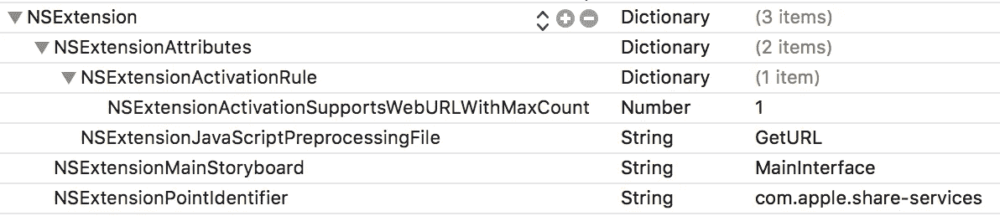
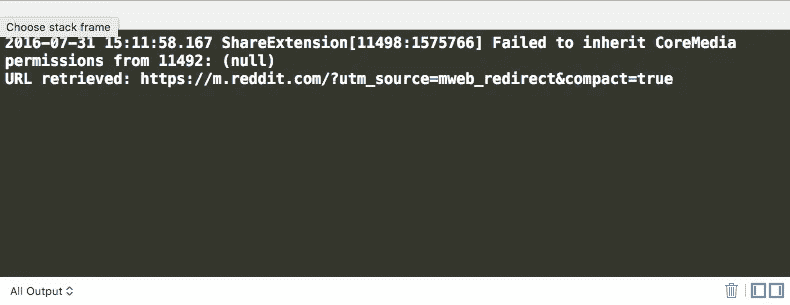
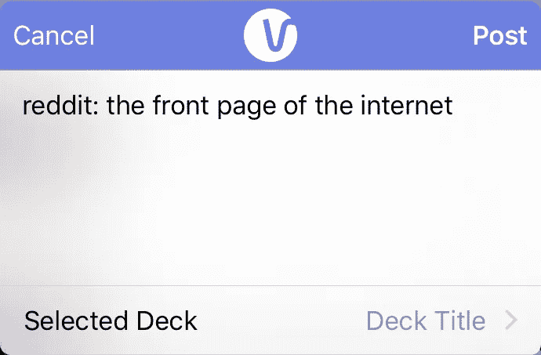

# 如何在 Swift 中构建 iOS 共享扩展

> 原文：<https://medium.com/hackernoon/how-to-build-an-ios-share-extension-in-swift-4a2019935b2e>

**注:针对 Swift 4 进行了更新。**

在工作的一天，我决定尝试创建一个共享扩展。我发现没有一个功能齐全的[教程](https://hackernoon.com/tagged/tutorial)，结果我不得不拼凑信息(令人惊讶的是，大部分信息归功于[苹果文档](https://developer.apple.com/library/ios/documentation/General/Conceptual/ExtensibilityPG/ExtensionScenarios.html#//apple_ref/doc/uid/TP40014214-CH21-SW1))。

## 目标

将网页 URL 作为丰富的内容保存到我们的应用程序中，并允许配置一些选项。最初我认为需要一个[扩展动作](https://developer.apple.com/library/ios/documentation/General/Conceptual/ExtensibilityPG/)——但是它似乎更适合于修改内容(比如一次点击就能去除照片上的红眼)。似乎包括苹果在内的其他公司正在使用共享扩展来创建项目。

这就是我们最终将建成的:


The completed extension

如你所见，我对设计进行了一些定制，并添加了被称为“配置项”的内容，这些内容是工作表底部的单元格；通常用于从帐户或其他选项中进行选择。这里使用它来从用户现有的“套牌”中选择要保存的套牌。你看不到的是，它还运行一些 JavaScript 代码来获取浏览器的当前 URL，我们稍后会将它发送到服务器。我们将提前讨论所有这些内容！

## 初始步骤

创建一个新项目，或者打开一个想要添加扩展的现有项目。然后打*档>新增>目标。*在[**iOS**](https://hackernoon.com/tagged/ios)**选项卡下选择*共享扩展*并按*下一步。*给它起个名字；我选择了简单的“共享扩展”。**

**它会问你是否想要激活该方案。这意味着当你运行应用程序时，它将允许你直接打开 Safari 或类似的应用程序来测试扩展，而不是你的主应用程序。我们想要这个——点击*激活*。**

**通过运行项目 *Cmd + R —* 来测试你目前拥有的东西。如上所述，它为你提供了从哪个应用程序进行测试的选项，选择 *Safari* 并点击 *Run。***

****

**The dialog presented when running an extension.**

**当 Safari 打开时，轻按“共享”图标，带有占位符图标的扩展名应该会出现在列表中。如果没有，点击*更多*并启用。点击图标会显示出*SLComposeServiceViewController 的*默认实现，开箱即用。**

## **获取 URL**

**share sheet 会自动检索页面标题并将其设置为正文，但通常您需要的不仅仅是标题，无论是 URL 还是页面上的图像。为此，您可以让 Safari 运行一个 JavaSript 文件来解析文档并检索我们需要的任何内容。**

**首先，右击 Xcode 中的 extensions 文件夹，选择 *New File。*你会发现**其他**标签里的*是空的*，点击*下一步*，将文件命名为“GetURL.js”。**

**您需要编辑您的 extensions***info . plist***文件，在“NSExtensionAttributes”中有另一个名为“NSExtensionAttributes”的字典，添加一个键“NSExtensionJavaScriptPreprocessingFile”，其中包含我们刚刚创建的文件的值“GetURL”(注意缺少扩展名)。**

**还要添加一个字典行“NSExtensionActivationRule ”,它应该包含带有数字 1 的键“NSExtensionActivationSupportsWebURLWithMaxCount ”:**

**Info.plist file as source code**

****

**How your extension’s Info.plist should look when viewed as a property list**

**NSExtensionJavaScriptPreprocessingFile:这让我们的应用程序知道在执行扩展时应该运行的 JavaScript 文件。**

**NSExtensionActivationRule:使用这个字典添加[动作扩展键](https://developer.apple.com/library/content/documentation/General/Reference/InfoPlistKeyReference/Articles/AppExtensionKeys.html)，帮助系统确定为哪些类型的内容激活您的扩展。**

**将以下内容粘贴到“GetURL.js”中:**

**加上我们上面设置的键，iOS 现在会寻找一个名为“ExtensionPreprocessingJS”的对象在运行时执行。这在[苹果文档](https://developer.apple.com/library/ios/documentation/General/Conceptual/ExtensibilityPG/ExtensionScenarios.html#//apple_ref/doc/uid/TP40014214-CH21-SW1)中有更详细的解释。**

**为了检索用上面的 javascript 文件抓取的数据，您需要在" shareviewcontroller . swift "*viewDidLoad*函数中运行这段代码:**

**对于 *kUTTypePropertyList:* ，您还需要这个导入**

```
**import** MobileCoreServices
```

**现在运行扩展应该可以成功地将 URL 打印到控制台！**

****

**附注:如果你想像我一样自定义导航栏(替换成你自己的图片或只是一个标题)，请添加下面的代码片段。**

**Optionally customize the styling of the navigation bar**

## **添加配置单元格**

**创建共享扩展时附带的样板文件将包含一个可选地提供配置项的方法(共享表底部的单元格)**

```
override func configurationItems() -> [AnyObject]! {
```

**插入以下代码段，该代码段返回“SLComposeSheetConfigurationItem”的数组:**

**再次运行你的应用程序，你会在底部看到一个单元格。**

## **配置项的模型**

**创建一个名为“Deck.swift”的基本模型，用于在视图控制器之间传递数据。**

**I mark all my classes as final by default, because subclassing is the devil in Swift**

## **表格视图**

**在开始的 gif 中，你会注意到当点击配置单元时，它会将一个新的视图推至一个表格视图。创建一个继承自“UIViewController”的新文件，命名为“shareselectviewcontroller . swift”。创建 tableview 属性并将其添加到视图中。**

**我还为这个视图设置了标题和标题颜色，并且更喜欢在 struct 中保存像单元格标识符这样的常量:)**

**创建一个属性来存储从原始视图控制器传入的面板:**

```
var userDecks = [Deck]()
```

**并符合表视图所需的协议:**

**I prefer to keep my protocols in separate extensions, and constants in a private struct.**

**回到“ShareViewController.swift ”,创建一个属性来存储一些虚拟数据，并在 viewDidLoad 中填充它:**

**最后，在我们创建的配置项的 tapHandler 中，创建一个*ShareSelectViewController*的实例，并让它在 tap 上推送，同时传递卡片组:**

**运行应用程序。点击配置单元应该会将虚拟数据推送到表格视图。**

****

**但是，您会注意到配置单元仍然被硬编码为“Deck Title”。要进行此更新，请创建一个属性来存储选定的卡片组，并在默认情况下选择第一个:**

**并更新 *configurationItems()* 中的配置单元格以使用它:**

```
deck.value = selectedDeck?.title 
```

**再次运行应用程序，你会看到它已经更新。**

****

## **更新所选卡片组的协议**

**你需要一种方法，当一副新牌被点击时，让它返回到 *ShareViewController* ，并更新用户界面。一份协议就足够了。将以下内容添加到您的*ShareSelectViewController:***

**Add protocol, delegate property, conform to TableViewDelegate and set tableView’s delegate to self**

**最后，使 *ShareViewController* 符合刚刚制定的协议，并确保 ShareSelectViewController 的委托设置为 self:**

**所选卡片组被更新，配置项被重新加载以更新值。然后我们弹出回到主屏幕。**

**运行应用程序，现在您应该能够更改套牌，套牌将会更新以显示正确选择的套牌:)**

****

## **收尾工作**

**剩下的就是将收集到的信息发送到您的服务器或应用程序进行处理，这可以在另一个样板方法中完成:**

```
override func didSelectPost()
```

**我不会对此进行详细说明，但是我使用了一个 *NSURLSession* 来发布到我们的服务器。我还通过创建一个[应用程序组](https://developer.apple.com/library/ios/documentation/General/Conceptual/ExtensibilityPG/ExtensionScenarios.html#//apple_ref/doc/uid/TP40014214-CH21-SW13)和使用一个共享的*nsuserrefaults*来存储和检索先前在主 iOS 应用程序中检索的数据，用真实的卡片组替换了虚拟数据。**

```
let userDefaults = NSUserDefaults(suiteName: "some.group.name")let decks = userDefaults?.objectForKey(“userDecks”) as? NSArray
```

**最后，你会注意到我的扩展在动作对话框中被命名为“Vurb ”,并且有一个图标。你可以通过[设置一个图标。要更改名称，只需在扩展*的项目设置中更改“显示名称”。*](http://stackoverflow.com/a/27333408/1450226)**

**这就是全部内容，如果你觉得这很有帮助，请通过推荐帮助其他人找到它。**

**您可以在此查看整个项目[。](https://github.com/scottfister/floop)**

**[](http://bit.ly/HackernoonFB)****[](https://goo.gl/k7XYbx)****[](https://goo.gl/4ofytp)**

> **[黑客中午](http://bit.ly/Hackernoon)是黑客如何开始他们的下午。我们是 [@AMI](http://bit.ly/atAMIatAMI) 家庭的一员。我们现在[接受投稿](http://bit.ly/hackernoonsubmission)并乐意[讨论广告&赞助](mailto:partners@amipublications.com)机会。**
> 
> **如果你喜欢这个故事，我们推荐你阅读我们的[最新科技故事](http://bit.ly/hackernoonlatestt)和[趋势科技故事](https://hackernoon.com/trending)。直到下一次，不要把世界的现实想当然！**

**[](https://goo.gl/Ahtev1)**