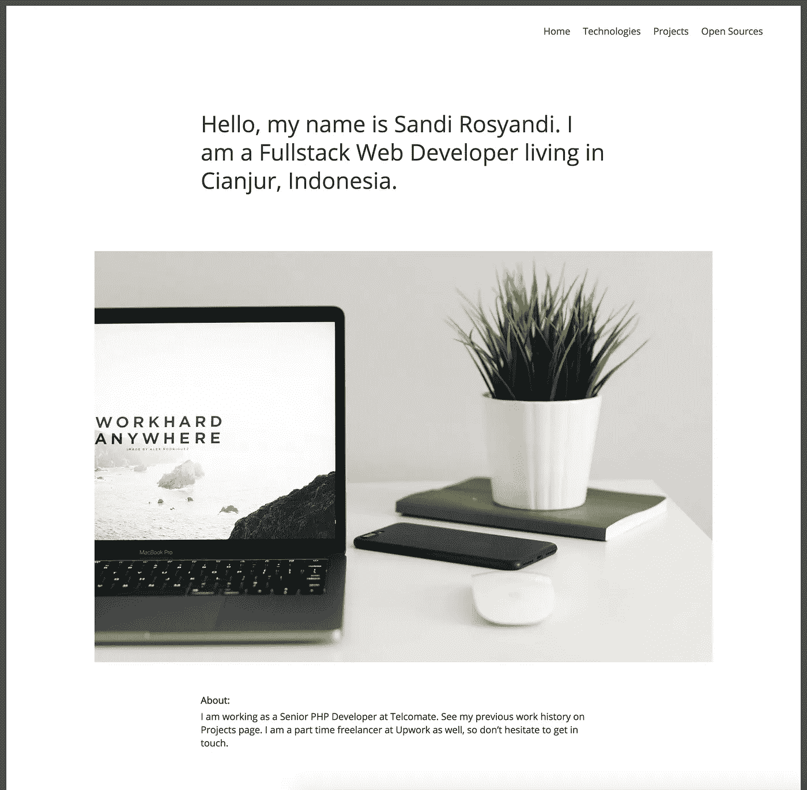
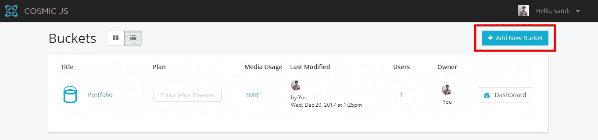
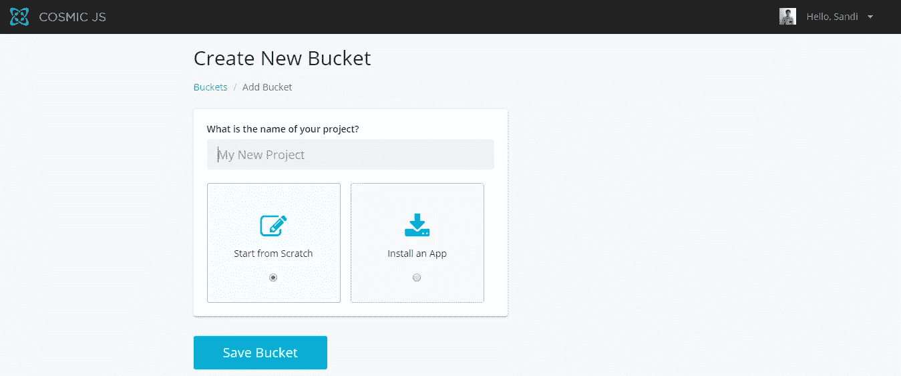
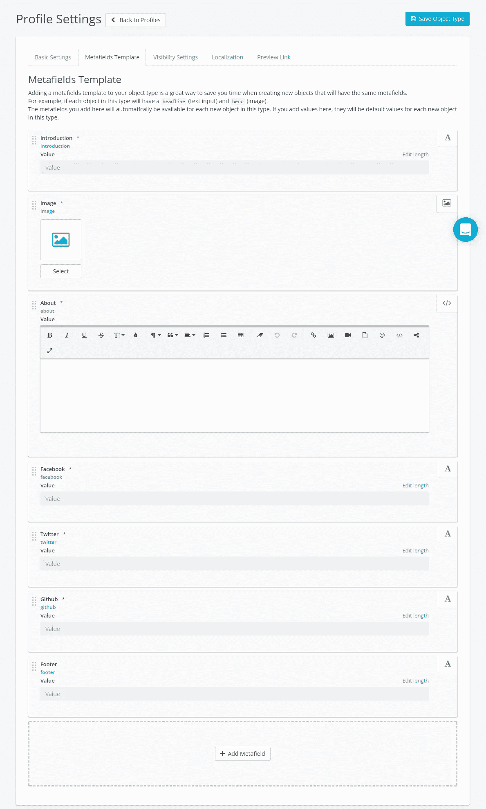
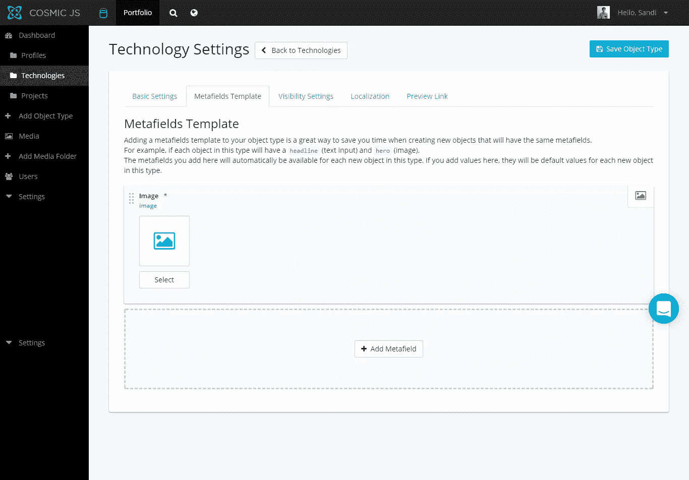
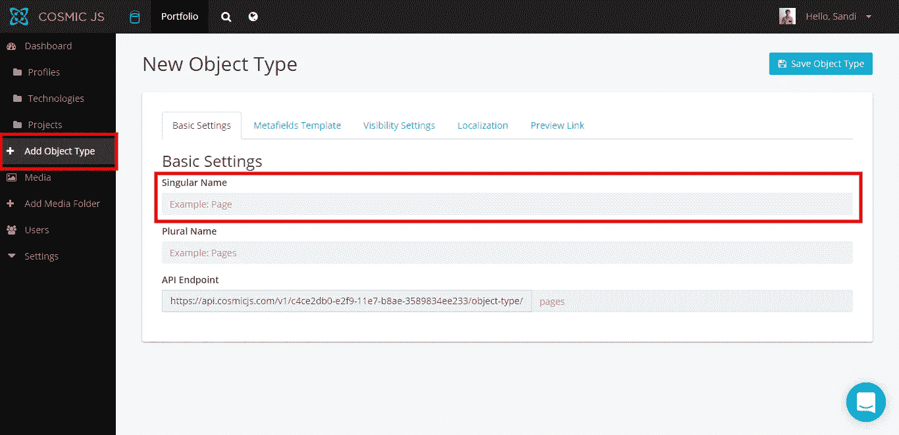
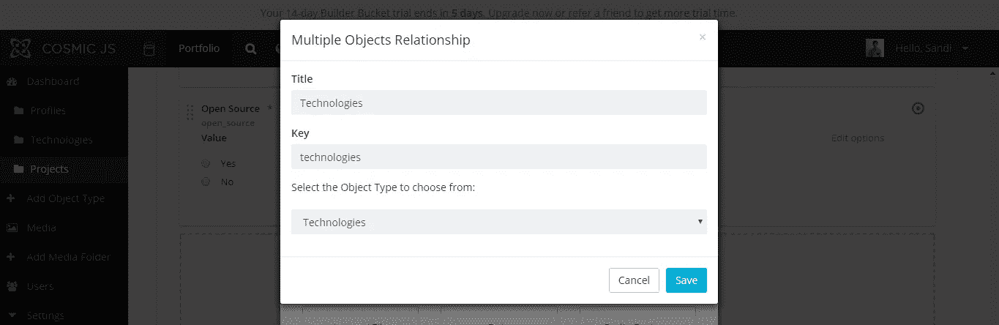

# 如何使用 Vue 和 Cosmic JS 建立作品集网站

> 原文：<https://medium.com/hackernoon/how-to-build-portfolio-site-using-vue-and-cosmic-js-5832bce7e7dc>

What we will be building.

在本教程中，我将向你展示如何使用 [Vue](https://vuejs.org/) 和 [Cosmic JS](http://cosmicjs.com/) 创建一个作品集网站。

# TL；速度三角形定位法(dead reckoning)

[查看演示](https://cosmicjs.com/apps/vue-portfolio)
[查看代码库](https://github.com/cosmicjs/vuejs-portfolio)

我们将要建立的投资组合网站将有 4 页，分别是主页、技术、项目和开源。这个网站也将有 3 个对象类型有概况，技术和项目。

**设置桶** 要创建桶，登录 [Cosmic JS](http://cosmicjs.com/) 并点击添加新桶

选择从头开始

**设置配置文件对象类型** 点击添加对象类型菜单，将配置文件放入单数文本框

添加下面的元字段:

1.简介(纯文本输入)

2.图像(图像/文件)

3.关于(HTML 文本区域)

4.脸书(纯文本输入)

5.Twitter(纯文本输入)

6.Github(纯文本输入)

7.页脚(纯文本输入)

**设置技术对象类型** 点击添加对象类型菜单，将技术放在单数文本框上

添加图像元字段(图像/文件)

**设置项目对象类型** 

添加下面的元字段:

1.简短描述(纯文本输入)

2.图像(图像/文件)

3.技术(多对象关系)，选择技术对象类型

4.URL(纯文本输入)

5.开源(单选按钮)，添加两个选项有是和否

**依赖关系**

这个网站使用 [Vue](https://vuejs.org/) 来创建单页应用程序。对于路由器，使用 [Vue 路由器](https://router.vuejs.org/en/)。它还使用 ES6，因此需要 [Babel](https://babeljs.io/) 和 [Webpack](https://webpack.js.org/) 用于模块捆绑。对于模板引擎，它使用 [Jade](http://jade-lang.com/) 和 [Stylus](http://stylus-lang.com/) 作为 CSS 预处理器。

**设置 index.html**

在这个文件中，我们包含了 [Twitter Bootstrap](https://getbootstrap.com/) 、 [Font Awesome](http://fontawesome.io/) 、 [Cosmic JS](http://cosmicjs.com/) 配置和核心 Javascript。第 12 行是安装 [Vue](https://vuejs.org/) app 的地方。

**Setup script.js**

本站使用 [Vue 路由器](https://router.vuejs.org/en/)进行路由，您可以在 12–17 号线上看到路由。以导入所需的组件。

**设置 App.vue**

该文件包含路由器视图组件、页脚和全局样式。模板在第 1–19 行。App.vue 所需的组件在第 22–23 行导入。第 42–49 行调用 [Cosmic JS](http://cosmicjs.com/) API，此时组件已安装并且样式在第 54–77 行。

**设置 MainMenu.vue**

该文件用于网站的主菜单。该模板位于第 1–11 行，在该模板中，它使用来自 [Vue Router](https://router.vuejs.org/en/) 的 router link 组件来创建锚点，因此将自动包含活动类。样式在第 13–30 行。

**设置 Home.vue**

该文件包含图像和关于文本。模板在第 1–15 行。第 18 行包括[宇宙 JS](http://cosmicjs.com/) 。第 33–42 行在组件挂载时调用 [Cosmic JS](http://cosmicjs.com/) API。样式在第 46–55 行。

**设置技术. vue**

此文件显示技术对象类型的内容。模板在第 1–15 行。第 18 行包括[宇宙 JS](http://cosmicjs.com/) 。第 33–42 行在组件挂载时调用 [Cosmic JS](http://cosmicjs.com/) API。样式在第 46–55 行。

**设置 Projects.vue 和 OpenSources.vue**

这两个文件显示来自项目对象类型的数据，不同的是 Project.vue 在 open_source metafield_key 的 metafield_value 为 Yes 而 OpenSources.vue 为 No 时显示来自项目对象类型的数据。第 18 行包括[宇宙 JS](http://cosmicjs.com/) 。第 28–34 行呈现技术数组，第 38–48 行调用 [Cosmic JS](http://cosmicjs.com/) API，元字段 _key 为 open_source，元字段 _value 为 No，对于开源页面，元字段 _value 为 Yes。样式在第 53–69 行。

**结论** 这是使用 [Vue](https://vuejs.org/) 和 [Cosmic JS](http://cosmicjs.com/) 构建的作品集网站。希望你喜欢这个教程，希望能帮到你。

> 本文[原载](https://cosmicjs.com/articles/how-to-build-a-portfolio-site-using-vue-and-cosmic-js)于[宇宙 JS](https://cosmicjs.com/) 。Cosmic JS 提供了帮助开发团队更快地构建和管理应用程序的工具。