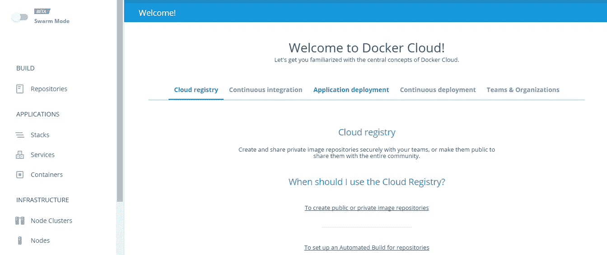

# 如何使用基于 Docker 的工具构建 SaaS—第 1 部分

> 原文：<https://medium.com/hackernoon/how-to-build-saas-using-docker-based-tools-part-1-ceb1a96e0907>


如果你曾经考虑过使用 [Docker](https://hackernoon.com/tagged/docker) 来构建 [SaaS](https://hackernoon.com/tagged/saas) ，你可能会问自己是想从头开始还是利用软件(基本上是基础设施编排)来降低复杂性和简化样板任务。我也想到了这一点，并决定尝试第二个选项，因为这更接近于开发人员/devops。当然，相反，它强加了一些限制，但是对于 MVP 构建的快速开始，这是首选。

## 从哪里开始？

当我选择使用特殊的库来简化我作为开发人员的生活时，我看了其中的几个，但最终选择了 2 个——Docker Cloud 和 Kontena。它们的定位有所不同，但总的来说都可以处理类似的任务—创建和管理节点集群/网格、堆栈、服务、管理 Docker 映像存储库、网络和其他协调任务。

事实上，将 Docker Swarm 与 Kontena 平台以及 Docker Cloud 与 Kontena Cloud 进行比较是正确的，但我将对两者进行比较，包括每个方面，甚至是云选项和 UI。需要提到的是，你可以完全免费尝试这两种方法。

# Docker 云



老实说，这是我第一次尝试，我投降了。

首先，如果您要构建基于 Docker 的 SaaS，您需要具备快速、简单的集群和节点供应能力。Docker 云有两种模式——标准和群。在标准模式下，您将节点、服务和应用作为整个基础设施的独立部分进行工作，而在 swarm 模式下，您将利用 Docker swarm 方法，因此您将拥有非常坚实的基础设施，将所有节点结合到一个具有 REST API 的统一接口中。

Docker Cloud 目前为您的节点提供 5 个云提供商的支持:AWS、Digital Ocean、Microsoft Azure、SoftLayer 和 Packet。我决定用 AWS。为了连接 Docker Cloud 和 AWS，你需要在 Amazon IAM 上设置一些东西——创建一个角色和内联策略，指定你可能需要的权限——并在 Docker Cloud 设置页面上粘贴生成的角色 ARN。然后，您应该能够直接从 Web UI 或利用 CLI 供应群集群(如果您处于群模式)或标准节点集群。

## 看起来很酷，但是有什么问题吗？

第一件让我沮丧的事情是发现蜂群模式还没有 REST API。因此，理论上，我可以启动 swarm cluster，但它不会有用，因为我无法从 SaaS 网络应用程序访问它。好的，没问题，你可以使用成熟的标准模式—【https://docs.docker.com/apidocs/docker-cloud/】T4。

第二个是连接 AWS 的混乱:正如我上面描述的，你需要按照这个指南创建一个角色和一个策略—[https://docs . docker . com/docker-cloud/cloud-swarm/link-AWS-swarm/](https://docs.docker.com/docker-cloud/cloud-swarm/link-aws-swarm/)(看起来很复杂，对吧？).你的政策文件应该以这个为基础——https://docs.docker.com/docker-for-aws/iam-permissions/——我就是这么做的。好了，现在我已经得到了角色 ARN，并将其粘贴到 Docker Cloud 上——设置完成。但是，当我试图创建一个节点集群时，它就是不起作用。这是我在新节点群集“时间线”选项卡下看到的内容(显示一些日志):

```
AWS returned an error: unauthorized operation. Please check that the AWS credentials you have provided have enough permissions
```

相信我，我已经尝试了很多很多次:终止集群并创建新的集群，选择不同的 AWS 区域，尝试重新创建角色和策略，通过完全重新定义或添加/删除几个具体权限来编辑策略，浏览 Docker 云论坛，再次重复所有这些—运气不好。

第三个令人沮丧的事情是社区沉默甚至社区缺席(除了一些热心者)。貌似 Docker 云团队没有参与官方论坛的讨论。只要看看下面这些话题——它们看起来死气沉沉。

 [## 无法在 AWS 上创建节点集群-未经授权的操作

### 嗨，我已经将 Docker 帐户连接到 AWS，就像这里描述的 https://docs.docker.com/docker-cloud/infrastructure…

forums.docker.com](https://forums.docker.com/t/cannot-create-node-cluster-on-aws-unauthorized-operation/21706) [](https://forums.docker.com/t/access-gui-created-swarm-via-api/29363) [## 通过 API 访问 GUI 创建的 swarm

### 我使用 docker cloud UI 成功创建了一个 swarm。它被部署到 AWS，我可以通过客户端在上面运行东西…

forums.docker.com](https://forums.docker.com/t/access-gui-created-swarm-via-api/29363) 

## 下一位，请！

正如我在文章开头提到的——我投降了……并决定关注 Kontena，我将在第 2 部分回顾它。

总的来说，Docker Cloud 看起来非常有前途，是构建基础设施或基于微服务的 SaaS 的酷工具，我相信他们可以很快成为这方面的领导者。但是这些日子 Docker 公司的快速增长，反而妨碍了他们做好几件事。依我拙见。