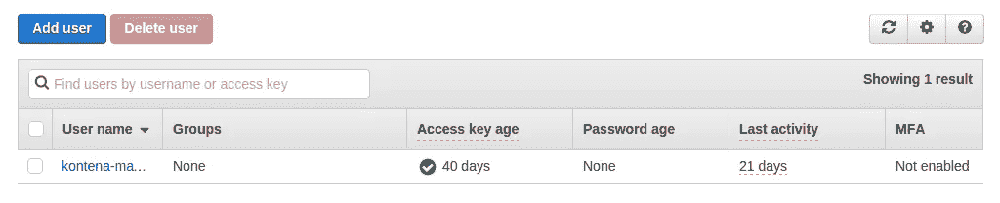
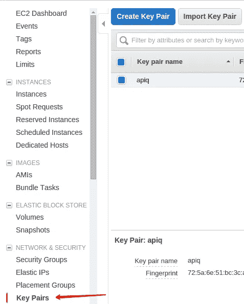

# 如何使用基于 Docker 的工具构建 SaaS—第 2 部分

> 原文：<https://medium.com/hackernoon/how-to-build-saas-using-docker-based-tools-part-2-529615ac6db0>


这是我的 [Docker](https://hackernoon.com/tagged/docker) 编排工具回顾的第二部分。作为[如何使用基于 Docker 的工具构建 SaaS 的续集——第一部分](/@igor.petrov/how-to-build-saas-using-docker-based-tools-part-1-ceb1a96e0907)。接下来让我们试试 [Kontena](http://kontena.io/) 。

# Kontena CLI

对 [Kontena](https://hackernoon.com/tagged/kontena) 的第一印象是“真的很酷”和“非常开发者友好”。你需要做的第一件事是安装 Kontena CLI。我已经按照说明文件在 MacOS 和 Ubuntu 上安装了它，没有遇到任何问题。安装后，您可以立即开始使用它，因为它使用起来非常简单，并且[文档](https://kontena.io/docs/)足够好(相对于 Docker Cloud CLI)。

要使用 Kontena，您需要有一个主节点——这是一台可以在任何云提供商上引导的机器，可以用作管理其他节点、网格和服务的中心点。

# 支持的云提供商

目前，正如文档中提到的，Kontena 支持 5 家云提供商:AWS、Azure、Digital Ocean、Packer 和 UpCloud。我试着用亚马逊网络服务来设置它。要开始在 AWS 上安装主节点，您需要用安全凭证设置 AWS 用户。只需转到 AWS IAM 并创建一个新用户。例如，“kontena-master”或任何其他名称。确保选中“编程访问”复选框，因为您需要访问和密钥。然后通过选择**“amazonec 2 full access”**策略为刚刚创建的用户设置权限。



在最后一步，你会得到“访问密钥 ID”和“秘密访问密钥”。将其保存在项目中的某个位置。



但这还不是全部:您需要一个 AWS EC2 密钥对——这些是 Kontena 能够登录到您的节点所需的密钥。只需将 AWS 控制台切换到 Amazon EC2 服务并创建一个密钥对。一旦完成，现在您就拥有了在 AWS 上设置 Kontena 主节点的所有信息。让我们使用文档中描述的 CLI 命令来实现这一点(不要忘记根据您的需要更改`— storage`和`— type`选项):

```
$ kontena aws master create \
  --access-key <aws_master_key> \
  --secret-key <aws_secret_key> \
  --key-pair <aws_key_pair_name> \
  --type m3.medium \
  --storage 100 \
  --region eu-west-1
```

在创建主节点的过程中，会询问您几个问题。一个是关于访问您的 Kontena 托管基础设施的身份验证，此时推荐的变体是通过 Kontena 云进行身份验证。这也是我选择的。但是除了 Kontena Cloud 之外，可以使用任何其他兼容 OAuth2 的身份验证提供者。

# 网格、堆栈和服务

让我们创建第一个网格:根据`etcd`规则，推荐的初始节点数是 3、5、7。这些节点将形成一个`etcd`集群基础设施——负责集群稳定性和故障转移的主要节点。

```
$ kontena grid create --initial-size=<initial_node_count> aws-grid# Now let's create AWS EC2 node in the current grid$ kontena aws node create \
  --access-key <aws_master_key> \
  --secret-key <aws_secret_key> \
  --key-pair <aws_key_pair_name> \
  --type m4.medium \
  --storage 100 \
  --zone a \
  --region eu-west-1
```

在您的网格准备好运行之后，您就离准备基础设施更近了。假设您有一个 web 应用程序，它需要一个数据库，当然还有 web 服务器/负载平衡器。我开始使用微服务方法，将每个组件放在单独的容器中。有两种组织容器的方法:

*   通过单独独立的[服务](https://www.kontena.io/docs/using-kontena/services.html)(可以链接在一起)
*   通过[堆栈](https://www.kontena.io/docs/using-kontena/stacks.html)(这是 Kontena 团队的首选方式和推荐方式)

因此，Kontena Stack 实际上是一组有组织的服务，而服务是一组使用相同 Docker 映像的容器。第二个选项是我已经选择并开始准备我的栈:一个 web 应用的栈，一个数据库的栈，一个负载平衡器的栈。您可以为数据库和负载平衡器使用预定义的 Kontena 映像，但是您也需要将您的 web 应用程序打包到映像中。我的网络应用已经有了一个——APIQ CMS。所以我的服务是打包成 Docker image、PostgreSQL 和负载平衡器(公开 HTTP 的 web 服务器)的 Ruby on Rails app。下面是我的栈定义的例子(你使用 YAML 格式并根据 [Kontena.yml](https://www.kontena.io/docs/references/kontena-yml.html) 定义它)

```
# lb-stack.yml
stack: apiq/lb
description: APIQ LB
expose: internet_lb
services:
  internet_lb:
    image: kontena/lb:latest
    ports:
      - 80:80
      - 443:443    
    deploy:
      strategy: daemon
```

需要注意这里的`expose:`选项——这允许您向其他栈公开您的服务。

```
# db-stack.yml
stack: apiq/db
description: APIQ DB
expose: db
services:
  db:
    image: postgres:latest
    stateful: true
```

数据库是一个有状态的服务，我猜你想把你的数据库数据存储在某个地方，数据库节点的删除不会影响你的数据。

```
# kontena.yml
stack: apiq/core
description: APIQ Core
variables:
  secret_token: # variable name
    type: string  # type (string, integer, boolean, uri, enum)
    from: # where to obtain a value for this variable
      random_string: 64 # still no value, auto generate a random
    to:
      env: SECRET_TOKEN # send this value to the vault on kontena master
services:
  app:
    image: webgradus/kms
    command: bundle exec rails s -p 3000 -b '0.0.0.0'
    environment:
      SECRET_TOKEN: ${SECRET_TOKEN}
      RAILS_SERVE_STATIC_FILES: 'true'
      KONTENA_LB_INTERNAL_PORT: 3000
      KMS_ASSETS_STORAGE: 'fog'      
    hooks:
      post_start:
        - name: db_create
          cmd: rails db:create
          instances: 1
          oneshot: true
        - name: db_migration
          cmd: rails db:migrate
          instances: 1
    links:
      - lb/internet_lb
      - db/db
    ports:
      - "3000:3000"
    secrets:
      - secret: AWS_ACCESS_KEY_ID
        name: AWS_ACCESS_KEY_ID
        type: env
      - secret: AWS_SECRET_ACCESS_KEY
        name: AWS_SECRET_ACCESS_KEY
        type: env
      - secret: AWS_REGION
        name: AWS_REGION
        type: env
```

我们来详细回顾一下这个。第一，`variables`节。本节允许您定义变量以及获取它们的方式，这些变量可以在 Kontena.yml 中使用。在我的堆栈文件中，我正在生成一个随机字符串，并将其传递给`SECRET_TOKEN`环境变量(这应该是为应用程序指定的)。`command`定义应用程序应该启动的方式，`environment` —应用程序的环境变量以及特殊的 Kontena 变量(例如，链接 web 应用程序和负载平衡器的`KONTENA_LB_INTERNAL_PORT`)。接下来，我定义了几个钩子来执行正确的应用程序引导所必需的特定于 Rails 的任务——数据库创建和迁移。很明显，`links`部分将`app`服务与前两个堆栈中暴露的`db`和`internet_lb`服务链接起来。而`secrets`部分是 Kontena Vault 所负责的——您在网格级别上为可访问的 API 或数据库密码指定密钥。在我的例子中，我在我的 web 应用程序中使用亚马逊 S3 服务，并希望任何`app`服务节点都可以访问亚马逊凭证。通过将机密保存到保管库中来准备您的机密:

```
$ kontena vault write AWS_REGION us-east-1
```

现在，我们可以在节点上安装准备好的堆栈:

```
$ kontena stack install lb-stack.yml
$ kontena stack install db-stack.yml
$ kontena stack install --name cms-1 kontena.yml
```

之后，我将 APIQ CMS 实例连接到数据库和负载平衡器，并在 web 上提供。要查找公共 IP 并在浏览器中查看您的应用程序:

```
$ kontena service show cms-1
```

# SaaS 到底在哪里？

好的，非常好的问题:-)现在，在您使用 CLI 尝试了所有操作之后，是时候通过 Kontena Master REST API 执行相同的操作了。只需生成 API 令牌，并根据客户需求开始安装应用程序堆栈。遵循 [API 文档](https://kontena.io/docs/api/master/)，用你最喜欢的语言编写代码。

```
$ kontena master token create --expires-in 0 --token
```

# Kontena 云

一旦你在 Kontena Cloud 上注册并使用它进行身份验证，你就可以随时登录并查看基于 Kontena 的基础设施的仪表板(现在完全免费)。真的很酷！在那里，您可以找到您的网格、节点、服务、资源使用和日志。


# 社区

关于 Kontena，接下来需要提到的是核心团队的大力支持。我在 Kontena 论坛上问了两个问题，总是得到回复。此外，还出现了许多新资源:YouTube 上的视频指南、Kontena 新闻和更新的常规电子邮件摘要以及博客帖子。

总之，我建议试一试，即使你不需要建造 SaaS。您可以通过轻松扩展服务、添加更多节点和网格来管理应用的基础架构。