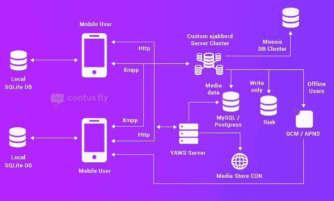

# 如何像 WhatsApp 一样搭建自己的实时聊天 App？

> 原文：<https://medium.com/hackernoon/how-to-build-your-own-real-time-chat-app-like-whatsapp-9d1d058afd5b>

嗯，创建一个像 WhatsApp 这样的应用程序是一个非常棒的想法，但你必须了解用于构建它的技术和功能。

现在让我们回到第一个聊天室吸引用户参与那些激动人心的闲聊的日子。然后，社交网站渗透到世俗生活中，提供超视距连接。目前，即时消息通过提供快速响应让我们始终参与其中。此外，我们更喜欢即时消息应用程序提供的便利和舒适。

因为我们非常了解像 Whatsapp 这样的聊天应用程序的流行。我们发现，大多数人更喜欢开发提供实时交互的聊天应用程序，为用户增加个人触摸体验。

现在，是时候卷起袖子开始开发另一个像 WhatsApp 一样的巨大聊天应用了。

# **现代聊天 App 的演变**

鉴于，现代聊天应用程序必须具备显著的功能，能够适应任何类型的聊天解决方案。最近一段时间，人们发现，像 WhatsApp 这样的聊天应用程序公司正在尝试人工智能和机器人等先进技术。一个理想的聊天应用程序有潜力提供企业级通信、个人聊天、业务发展通信和电子商务聊天解决方案。

由于 WhatsApp 的成功，投资者和开发者追求复制 WhatsApp 的成功也就不足为奇了。同样，Contus 的核心拥有无所不包的技术来开发像 WhatsApp 这样的聊天应用— [**Contus Fly**](http://www.contus.com/messaging-solutions.php?utm_source=whatsapp-clone&utm_medium=InContentLink&utm_campaign=Hackernoon) 在 Android 和 iOS 等各种平台上根据你的期望绘制新功能。尽管 WhatsApp 可能会主导消息市场，但你的聊天应用仍有发展空间，可以繁荣 WhatsApp 所不具备的特殊功能。

考虑到你的目标业务，这不是开发传统版本的 WhatsApp，而是最终建立一个现代的聊天应用程序，它将被你的用户明确识别，是任何聊天解决方案的理想选择。

# **你有没有想过是什么技术让 WhatsApp 这样的聊天应用如此完美？**

这是 Contus Fly 的架构，配备了后端组件，可以构建类似 Whatsapp 的实时聊天应用程序:

Erlang: 这是用于开发史诗聊天应用 Whatsapp 的主要编程语言。Erlang 编程语言因其性能、速度和可伸缩性而最受青睐。Contus Fly 构建于 Erlang 之上，垃圾收集器允许针对不同的功能优化即时更新代码。在 Contus Fly 中实现的编程语言有助于以非常低的延迟处理大量的短消息。

**Ejabberd:** Contus Fly 使用开源 jabber like(WhatsApp clone)来提高运行效率，并针对预期结果进行了优化。它使用 XMPP(可扩展消息和存在协议)协议来处理任何局域网或互联网上的消息传递系统。Ejabberd 服务器是使用某些可插拔模块开发的，这些模块支持多种功能，例如:

1.  一对一的聊天
2.  实际联系人和出席列表
3.  存储和转发(脱机邮件)
4.  个人事件协议(PEP)和消息类型规范
5.  多用户聊天(MUC) —群聊
6.  隐私设置和帐户欺骗
7.  邮件存档管理(MAM)

**FreeBSD:** WhatsApp 在其平台上每天发送超过 10 亿条消息，该应用建立在 FreeBSD 之上。Contus Fly 选择 FreeBSD 操作系统是因为它精致的网络堆栈和广泛的可靠性。FreeBSD 作为一个单一的发行商，在安装方面有很多优势，并且提供了二进制软件包的简单创建。

**YAWS:** (另一个 Web 服务器)完全用 Erlang 编写。Contus Fly 使用嵌入式模式，其中 YAWS 作为嵌入式 web 服务器运行在另一个 Erlang 应用程序的组合上。YAWS 系统具有高效处理并发进程的能力，并拥有高性能。

**Lighttpd:** Lighttpd 是一款开源 web 服务器，针对 Contus Fly 进行了优化，以获得更高的性能。轻量级 web 服务器部署在 WhatsApp 上，以获得安全、灵活、快速和兼容的特性。

**PHP:** Contus Fly 使用 PHP 开源语言以其性能和可靠性。结合 Ajax 这种强大的 web 开发技术，利用 AJAX 显示数据库中的数据，开发出响应式实时聊天 app。

**BEAM:** BEAM 是运行 Erlang 的虚拟机。它是一堆内置功能，如 if-simple 网络接口工具。Contus Fly 使用 BEAM 接口来支持调度程序、进程、消息传递、内存管理和多核等功能。

**自定义 XMPP 服务器:**通过减少关键字的字节来控制编码 XMPP 服务器的功能。该技术用于实现实时消息交换。XML 格式是面向人类的，它不意味着任何机器学习都可以阅读。

**HTML5 web sockets:**web socket 是 html 5 中的一个特性，用于在 web 浏览器和服务器之间建立稳固的连接。WebSocket 数据通过套接字直接发送，这在服务器和 web 浏览器之间提供了更快和持久的通信。

**Mnesia DB:** 这是一个用 Erlang 语言编写的实时数据库管理系统。Contus Fly 使用 Mnesia，这是一个软数据库，允许存储消息，文件，图像，视频，文档和其他运行在您的应用程序上的多媒体文件。这是一种超出你预期的技术，有潜力存储任何数量的数据。

Get Updates

# 聊天应用的成功特性:

现在，让我们来看看综合聊天应用程序提供的内置功能:

**#1。**
VOIP 电话:网络电话(VOIP)是一种通过互联网协议提供语音通信和多媒体会话的技术。

**#2。视频聊天:**

**#3。群组通话:**
聊天应用程序允许用户通过视频/音频在群组对话的帮助下进一步与其他用户联系。

**#4。端到端聊天加密:**
用户安全加密，保护免受第三方渗透。通过高级加密技术优先考虑用户私人数据的安全性。

**#5。云服务同步:**
云资源平台同步对托管环境进行监控、更新、存储和缩放。

**#6。**
多媒体支持:视频、图像、gif、语音笔记、动画、文档、联系人、位置等各种数据格式的文件传输。

**#7。自毁消息:**
通过点击群组中的收件人姓名发送密语，该消息不会被其他人看到。

**#8。地理位置集成:增强的地理位置集成使得实时交互非常有效。**

**#9。日历同步:**
日历同步提供了一个事件和任务的全面知识，这些事件和任务将会出现在你还没有计划你的一天的地方。

**#10。多平台聊天:**
跨平台的消息传递将使您无论是在办公桌前还是在旅途中都能参与其中。

**#11。应用内购买:**
选择合适的盈利策略，在数字商店销售应用，增加应用的收入流。

**#12。支付整合:**

**UPI** —统一支付接口是更安全、更人性化、允许即时支付的支付模块之一。

**VPA** —虚拟支付地址将使用注册在特定银行账户中的可公开共享的电子邮件地址，而不是银行账号和 IFSC 代码。

**MPIN** —手机银行个人识别码是一个 4-6 位数的安全代码，用于认证通过 UPI 转账的所有类型的资金

# WhatsApp 没有的动态功能:

除了这些内置功能之外，Contus Fly 还可以根据您的期望和聊天解决方案的类型整合更多功能。

1.  **配置用户访问权限，管理用户账号:**
    - >仅限邀请用户
    - >开放访问
    - >管理员验证访问
2.  **通过任何首选平台通知您的活跃用户:**
    - >推送通知
    - >电子邮件&电子邮件摘要
    - >短信
3.  **根据您的需求创建定制的聊天群组:**
    - >任何人都可以创建群组
    - >只有管理员可以创建群组
    - >用户可以查看并请求加入群组
    - >用户无法查看群组，因为他们不在相关的圈子中

# 通过聊天应用解决方案的货币化，Contus Fly 提供了各种各样的赚钱功能:

1.完全免费。应用内支付
3。移动广告
4。赞助。捐款

> **“每个新来的人(聊天 app)以后还有房间”**

如果你正准备 [**开发一款像 WhatsApp 一样的聊天应用**](http://www.contus.com/messaging-solutions.php?utm_source=whatsapp-clone&utm_medium=CTA&utm_campaign=Hackernoon) ，用额外的现代功能进行增强，那么你正走在一条正确的道路上，让你的聊天应用具有动态功能。