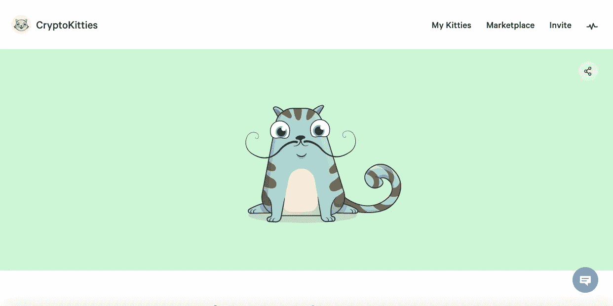
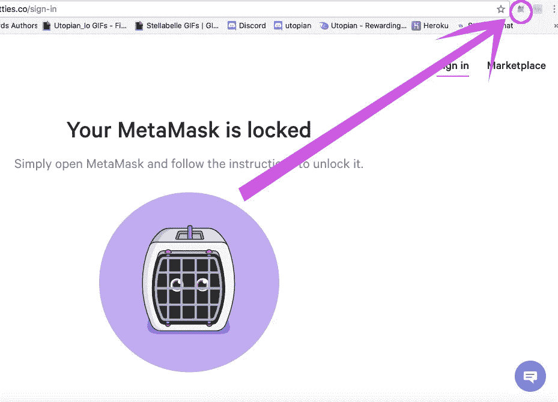
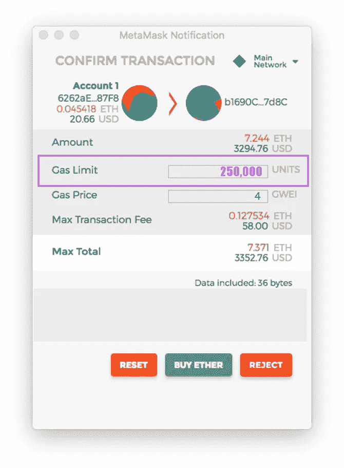
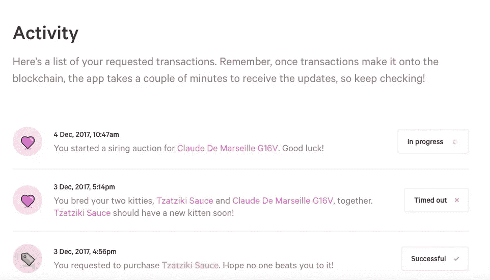
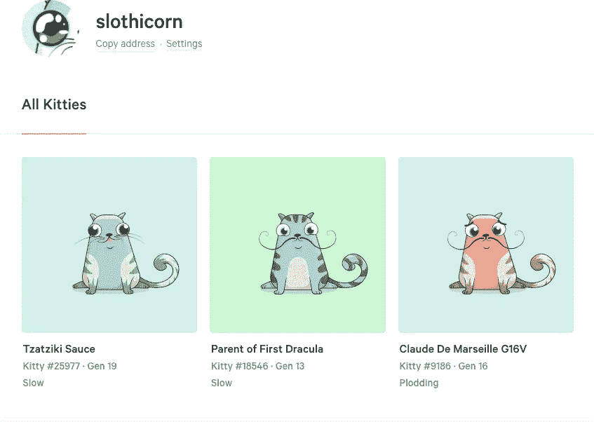
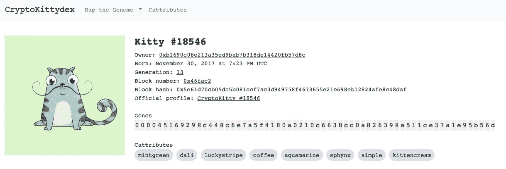
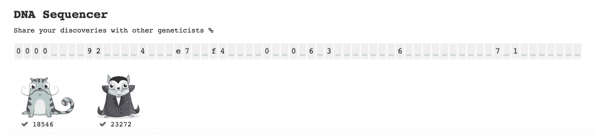
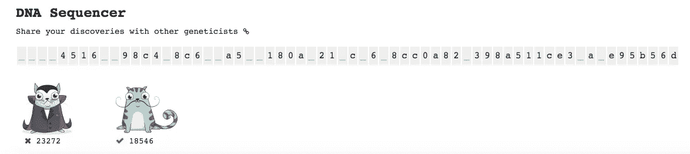
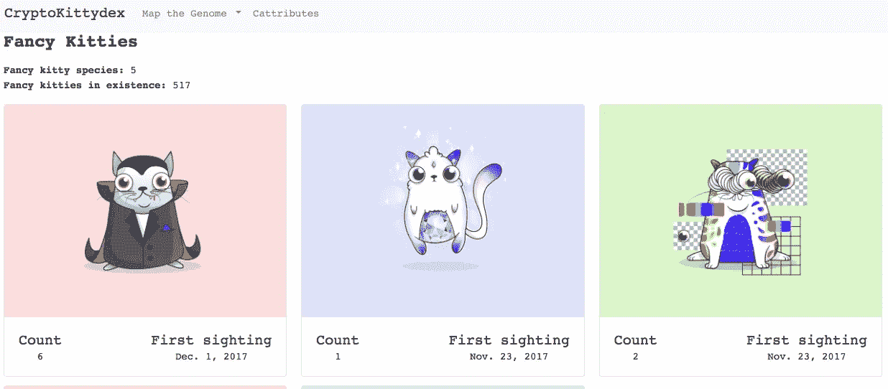

# 如何购买 Cryptokitty:完全指南+ DNA 测序

> 原文：<https://medium.com/hackernoon/how-to-buy-a-cryptokitty-the-complete-guide-dna-sequencing-26e14596a9cf>

my first cryptokitty, First Parent of Dracula

# 官方链接:

神秘小猫:[https://www.cryptokitties.co/](https://www.cryptokitties.co/)T2[https://twitter.com/cryptokitties](https://twitter.com/cryptokitties)

# 昨天我在区块链以太坊买了我的第一只密码猫。

# 专业的疯狂科学家！那是我的小猫！

我不认为自己是那种完全被新的互联网时尚所吸引的人，但当我的朋友昨天告诉我，她通过饲养她的 cryptokitty(并且仍然保留所有权)赚了 80 美元时，我突然想到，我可以在为我的虚拟猫拉皮条的同时赚取被动收入。到目前为止，我已经为我的第一只小猫——德古拉的第一个父母——拉皮条赚了 2.2 美元。这个数字真的很低，主要是因为我低估了小猫的繁殖能力。

我不会告诉你我花了多少钱买我的密码猫。我今年早些时候买了乙醚，并支付了大约 70 美元。现在 1 ETH 值 450 美元。我只能说我为我的第一只隐猫花了太多钱。

## 我买我的基于三个事实:1。我的猫生了一只德古拉。2.我的一个朋友两天前买了一只，她告诉我她通过饲养她的鸡赚了 80 美元。3.我爱萨尔瓦多·达利。

在 Twitter 上有很多人在乞求答案之后，我写了这个完整的指南。这是我的小猫，它的名字是德古拉的第一任父母。隐猫就像蜗牛，这意味着它们都可以怀孕。没有男女之分。我用免费工具 [Giphy 把我的制作成了动画 GIF。](https://giphy.com/channel/stellabelle)

# 第一步:安装 MetaMask Chrome 扩展:[https://metamask.io/](https://metamask.io/)

元掩码是连接以太坊区块链最不友好的方式。MetaMask 是一个数字钱包，允许您签署智能合同和交易。

## 如果您是 MetaMask 的新手，请观看此介绍视频开始学习:

下面是一个困难密码的例子:特洛伊！Tupee$Live67M2stlaughTerry987

***pro 提示:*** *让你的密码变得非常难，别忘了用纸笔写下你的种子恢复短语。*

# 第二步:买一些乙醚

为了买一只隐猫，你必须先买一些乙醚。对美国公民来说，最简单的方法是通过比特币基地购买。如果你已经有一个比特币基地钱包，你可以直接通过 MetaMask 购买，meta mask 使用比特币基地的小工具。如果你不在美国，你可以在加密货币交易所购买乙醚。

***亲提示:*** *别傻了，买太多乙醚。你不想破产吧。隐猫很容易上瘾。*

# 第三步:发送乙醚到你的 MetaMask 钱包。

如果你从未向电子钱包发送过比特币或以太币，请抓紧你的裤子做笔记。加密货币使用的系统与你习惯的不同。这叫做一对钥匙。因此，一长串字符是你的公共地址，另一长串字符是你的私钥。

把这一对钥匙想象成你家的地址和一把打开它的钥匙。你的公钥就像你家的地址，每个人都知道并且可以在线搜索。你的私人钥匙就像是你打开家门的钥匙。只有你有钥匙，而且你把它放在一个安全的地方。你的私人钥匙应该像你的房门钥匙一样被妥善保管。您的私钥是唯一可以访问与您的公共地址相关的资金的东西。

## 下面是公钥和私钥的样子:

**公钥:**
0 xc2d 7 cf 95645d 33006175 b 78989035 c7c 9061 D3 f 9

**私钥:**3a 1076 BF 45 ab 87712 ad 64 cbb 3 b 10217737 f 7 FAA CBF 2872 e 88 FDD 9 a 537d 8 Fe 266

所以，当你在元掩码中时，你要复制你的公钥，然后把它粘贴到你的比特币基地钱包中。你要把你在比特币基地买的乙醚发到你的超能面具钱包里。

这里有一段视频展示了这个过程:

关于密钥对的进一步阅读:以太坊 Wiki:[https://the Ethereum . Wiki/w/index . PHP/Accounts，_Addresses，_Public_And_Private_Keys，_And_Tokens](https://theethereum.wiki/w/index.php/Accounts,_Addresses,_Public_And_Private_Keys,_And_Tokens)

***亲提示:*** *千万不要把自己的私钥电邮给自己。千万不要把你的私钥保存在你的电脑上。是的，将您的私钥备份到 usb 闪存驱动器上。*

# 第四步:登录并购买你的 Cryptokitty

[https://www.cryptokitties.co/](https://www.cryptokitties.co/)

现在你的超能面具里有一些乙醚，是时候买你的第一只小猫了。当你点击“登录”按钮时，你会注意到它不是让你登录 cryptokitties 网站，而是让你登录 MetaMask。欢迎来到新区块链时代！

点击右上角，你可以看到一个微弱的狐狸图像:

确保你在主以太网上。

## 现在是去市场的时候了。

滚动直到找到您想要的，然后点按按钮，

> 好吧，买这只小猫。

这是整个过程中最难的部分。区块链以太坊上的每一笔交易都要求你在创建交易时支付一笔费用。这是为了减少网络上的垃圾邮件。Tbh，我还是有点搞不清楚每次创建交易要用多少 Gwei(汽油费)。我上一次购买 cryptokitty 花了大约 20 美元，我输入了 4 Gwei 的汽油费，它运行得很好(尽管我仍在试图理解 Gwei)。

然而，今天却是另一回事。我认为人们吓坏了，下了大量的订单，因为我的两次繁育小猫的尝试都失败了。检查 etherscan 后，看起来有超过 2000 个未决事务。

## Cryptokitties 正在打破以太坊区块链！

最重要的部分是确保你的汽油量限制在 250，000。我了解到元掩码默认为一个巨大的疯狂数字有一个问题:

# 步骤 5:检查您的交易

## 单击右上角看起来像曲线的图标。

这是显示您的订单状态和交易的页面。这是你大部分时间处于紧张状态的地方。

今天交通非常拥挤。昨天完成的交易似乎比以往任何时候都多。我打赌今天会超过那个。这种新的互联网热潮中最令人沮丧的部分是，区块链以太坊没有适当的规模，也不具备处理大量交易数量的能力(不像区块链 Steem 和 Bitshares)。因此，在您提交订单后，您的交易与成千上万的其他交易一样处于“待定”状态。现在，我有一个未决的，我已经有两个交易失败了，原因还不清楚。我像以前一样设置了我的 Gwei 气体限制，但目前没有任何东西工作。

# 那么，你应该买一只 cryptokitty 吗？

也许只有一个，以防这被证明是下一个神奇宝贝类固醇区块链热潮。但话说回来，如果你是一名程序员，并且拥有疯狂的技能，你应该联系我，这样我们就可以在 EOS 上构建这个很酷的基因 dna 宠物拉皮条代码(让它开源)。EOS 旨在处理签证类型的交易量。

所有以太坊的外星人都不会喜欢接下来的这一点，但在我写博客和在 Steem 区块链创建交易的所有时间里，我没有任何一次交易失败。steemit 网站不久前出现了一些问题，但区块链没有。斯蒂姆完全宠坏了我。我们没有拥堵问题，尽管我们的区块链量比以太坊多得多。

# 我现在拥有 3 只 cryptokitties，我完全沉迷于此。

正如你所看到的，我最喜欢的颜色是蓝色和绿色，我所有的猫都有点不寻常。我想专门研究达利和德古拉的特征，以及其他奇特的小猫。

对于那些对你的一长串 cryptokitty 超时交易感到彻底沮丧的人，请访问这个网站，它深入研究了你的虚拟猫的基因组结构:[https://cryptokittydex.com/](https://cryptokittydex.com/)

我几乎杀死了我所有的脑细胞，试图破译哪些基因控制着德古拉特征。如果你聪明，请帮忙！下面你会发现我的第一个父母的德古拉 cryptokitty 和它的孩子，德古拉的 DNA 测序。

我买我的第一只隐猫是基于这样一个事实:它生了一只德古拉。我想制造更多的德古拉，但我不确定我的猫的基因是否包含德古拉特征。

很明显我可能暂时失去了理智。我几乎很高兴以太坊区块链今天基本上不能用了，否则我可能已经买了数十亿只达利-德古拉猫。

我有一个邪恶的，美丽的想法，所以如果你聪明，知道如何编码这样的东西，请与我联系。