# 如何购买比特币和交易加密货币:分步指南

> 原文：<https://medium.com/hackernoon/how-to-buy-bitcoin-and-trade-cryptocurrencies-a-step-by-step-guide-7e64faecfa3f>

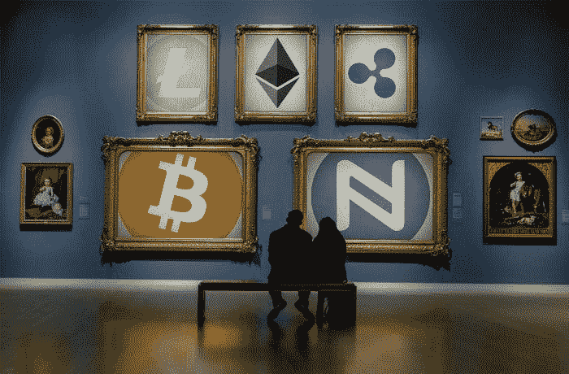

尽管 2017 年对区块链来说是巨大的增长年，但获得加密货币并进行交易并不适合胆小的人。在本文中，我的目标是解释如何在多个交易所和一个硬件钱包中购买、存储和交易加密货币，包括如何安全地参与代币销售(又称初始硬币发行，或 ico)。

## **第一步:时刻保持警惕**

外面真的是蛮荒的西部，所以要小心。网络钓鱼诈骗和彻头彻尾的欺诈的数量正在呈指数级增长。优质新闻和教育内容的信噪比很小，不幸的是，这使得骗子可以为所欲为。

本周早些时候，[SEC 逮捕了一个出售“PlexCoins”](http://fortune.com/2017/12/04/cryptocurrency-bitcoin-sec-ico-scam/)的家伙，他通过向投资者承诺 13 倍的回报和增加“加密货币服务的可及性”(不管这意味着什么)，筹集了 1500 万美元。

这只是一个例子。有[多个故事](https://www.google.com/search?q=falling+for+an+ICO+scam)关于*经验丰富的秘密投资者*陷入骗局并损失大笔金钱。

本质上没有*期待*一直被骗，很容易被骗。

几个月前，我写了一篇关于区块链、协议和令牌销售的入门文章，如果你是密码世界的新手，我建议你阅读这篇文章。

当然，如果你决定玩这个游戏并开始购买加密货币，要知道很有可能会输掉你的大部分(如果不是全部)钱。在外面要小心。

## **第二步:在比特币基地购买你的第一枚比特币**

好的，如果你已经决定加入，去知名的交易所是一个好主意(以避免诈骗)，所以我将在这里浏览一下在比特币基地购买比特币的例子，该交易所位于旧金山，是世界上最大的交易所之一。

[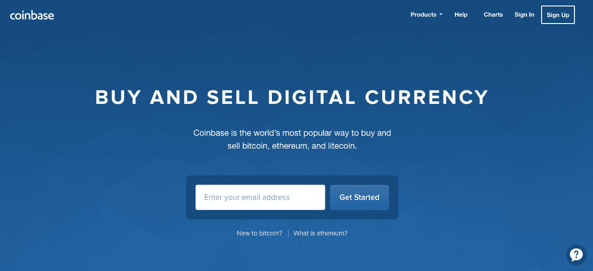](https://www.coinbase.com/?r=599607f4753ae400c04d16e0)

注册后，你需要验证你的身份并通过一些重要的关卡，但之后你会面临用你的银行账户或信用卡购买比特币的选择。

为了节省最多的交易费用(我将在下面解释)，你可以将现金从你的银行账户转移到你的“美元钱包”(或欧元，英镑钱包)，但这需要大约一周的时间。如果你想在此之前锁定一个价格，你可以直接购买比特币(一种“市价单”)，并支付比特币基地的交易费。自 2017 年 10 月 12 日起，[比特币基地现在允许你在他们的平台上进行市场买入，最高可达 25，000 美元。](https://blog.coinbase.com/announcing-instant-bitcoin-ethereum-and-litecoin-purchases-on-coinbase-c29d8a94e152)

## **第三步:将资金从比特币基地转移到 GDAX**

一旦你可以使用你的货币，你会想把 BTC(或任何其他货币)转移到比特币基地的交换界面， [GDAX](https://www.gdax.com) 。

首先，使用您的比特币基地凭据登录，您将看到一个类似这样的界面(不要害怕，我们将浏览一下):

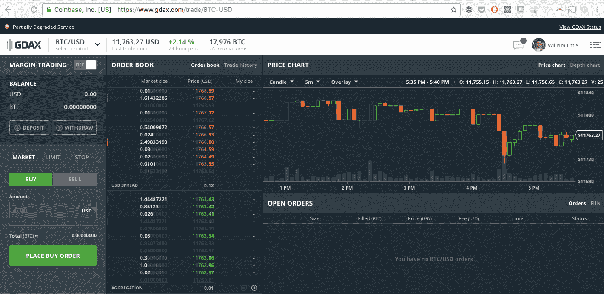

点击此处的“存款”:

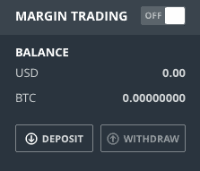

然后点击“比特币基地账户”选项:

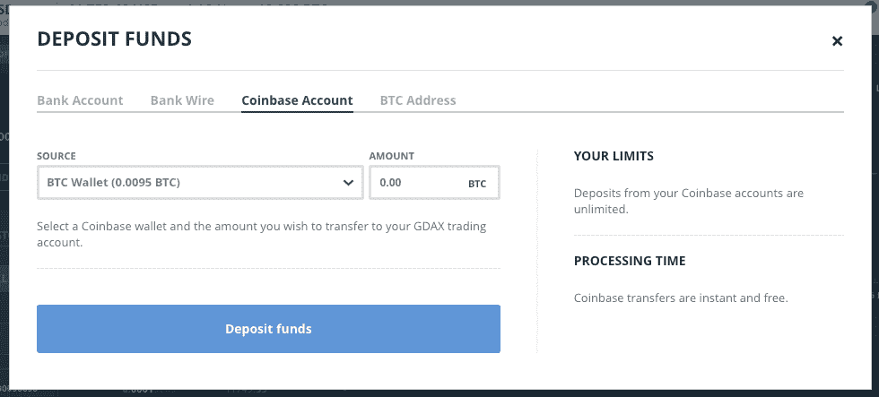

选择您要转账的金额(在本例中，我们将使用 0.0095 BTC)，提交后，该金额将立即显示在您的可用余额中，如下所示:

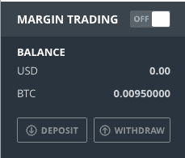

现在，用你的可用资金，你可以购买在 GDAX 上交易的硬币。(在撰写本文时，只有比特币(BTC)、莱特币(LTC)和以太坊(ETH)可用)。

## **第四步:在 GDAX 上进行你的第一笔交易**

接下来，我们将介绍一个与 BTC 一起购买 ETH 的例子。任何可用的货币配对都可以完成相同的过程:

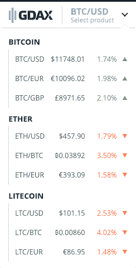

点击你选择的市场后，你会看到你正在交易的货币的可用余额*在顶部，你正在购买的货币的当前余额*在底部*。*

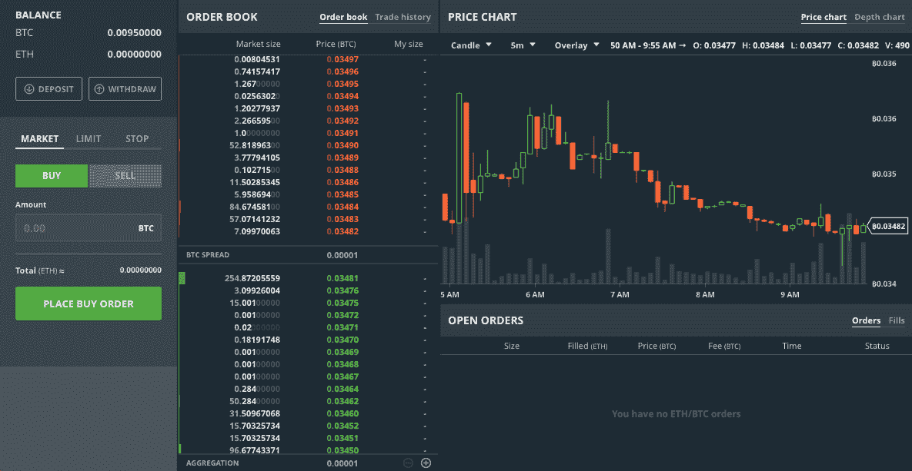

你在这里看到的所有红色和绿色数字分别是当前的要价和出价。“要价”是某人愿意出售硬币的价格，“出价”是某人愿意购买硬币的价格。

现在，我们可以在这里提交一个“市场”订单来购买 ETH，这样做的好处是以订单簿中的最佳可用利率立即锁定我们，但这使我们成为“接受者”(用交易术语来说)，因此会产生[交易费](https://www.gdax.com/fees/ETH-BTC)。

无论如何，如果你觉得价格会继续上涨，那么市场买入是一种有效的方式。

也就是说，如果你愿意在订单簿中输入你自己的出价，然后等待其他人来以你的出价出售他们的货币，那么你就成为了“庄家”，并且不收取任何交易费用。这也适用于卖出你的货币。

因此，尽可能使用限价单，以避免费用和节省资金。

继续点击“限制”标签:

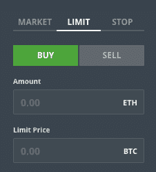

我们将通过在订单簿中输入限价订单来购买 BTC 的 ETH。填写这些字段的一个简单提示是单击最高出价(绿色)数字，然后单击您当前的可用余额。这将自动填充您的“金额”和“限价”字段。

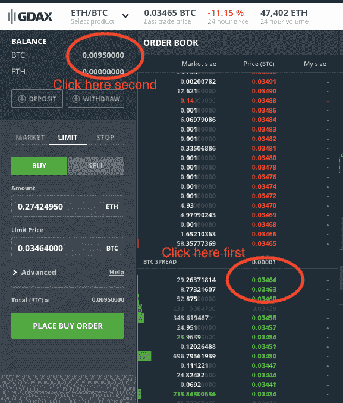

如果愿意，您可以手动调整金额，然后再次单击最高出价，用该数字预先填充(而不是键入)，因为出价数字可能会快速变化。

在本例中，我们将继续购买 0.01 ETH。

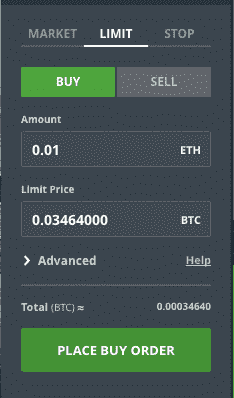

点击“下单购买”会将您的订单添加到订单簿的出价顶部，除非自您选择价格后情况发生了快速变化，这种情况可能会发生:

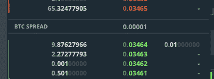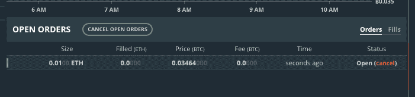

当然，你可以随时点击“取消”,如果你真的想立即购买，如果你看到你的出价在队列中下降太多，你可能需要这样做(例如，价格上涨，使你的出价暂时没有吸引力)。

例如，我刚刚为 0.01 ETH 提交了另一个限价购买订单，它很快就出现在出价队列中:

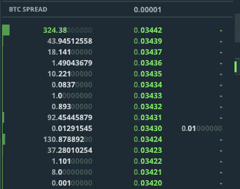

我可以等待，或者我可以点击取消，再次快速点击最高出价，并重新下单(我会这样做)。然后订单看起来像这样，把我放回到出价队列的顶端:

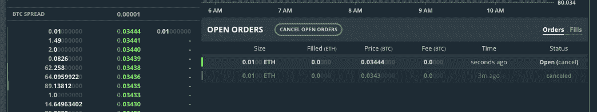

果然，一个收货人来了，很快就完成了我的订单，现在我的余额如下:

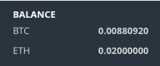

## **第五步:将加密货币放入硬件钱包**

交易所很容易受到攻击，通常不会很快支持来自 forks 的新硬币，并且不允许你参与大多数合法的 ico，因为他们如何存储你的硬币。因此，将加密货币转移到一个或多个硬件钱包是一个好主意。

我将在这里使用一个 [Trezor 钱包](https://trezor.io/)作为例子，尽管大多数硬件钱包都有类似的用户体验。如果你选择不同的品牌，你将能够很容易地遵循类似的步骤。(对于免费选项，您可以暂时使用[纸质钱包](https://www.google.com/search?q=paper+crypocurency+wallets)。)

遵循钱包网站上的设置指南(以避免诈骗！).Trezor 让你写下 24 个单词，作为其恢复协议的一部分，你应该写在一张纸上，并存储在某个安全的地方(如银行的保险箱)。

设置完成后，按照说明生成一个新地址来接收 BTC，如下所示:

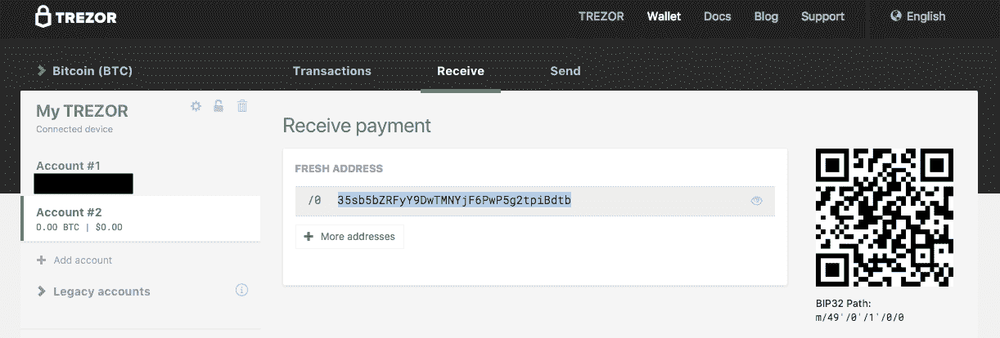

然后，回到 GDAX，点击“撤回”:

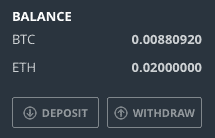

这就打开了这个窗口(是的，比特币交易经常被延迟…欢迎关注缩放问题，这个问题很重要):

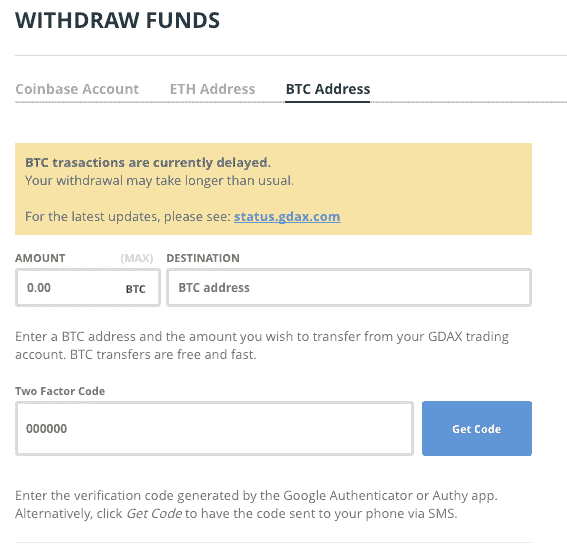

*在 authenticator 应用程序上有一个快速题外话，当你获得新手机时，你需要从你的恢复代码中恢复你的比特币基地设置，所以请务必也记下并保存在一个安全的地方！*

对于大额交易，最好先移动少量资金，以确认一切正常，然后再进行大额交易。

我们将继续将 0.001 BTC 移动到由硬件钱包生成的新地址中:

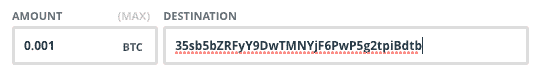

当然，要再三检查你的目的地地址是否正确，然后开始吧。

你可以使用 blockchain.info 来检查交易是否已经在系统上注册。例如，对于我们的新地址，要检查的 URL 是:

[https://block chain . info/address/35 sb 5 bzrfyy 9 dwtmnyjf 6 PWP 5g 2 tpibdtb](https://blockchain.info/address/35sb5bZRFyY9DwTMNYjF6PwP5g2tpiBdtb)

在 Trezor 网站上，您可以点击“比特币(BTC)”标签，并在不同的支持硬币之间进行选择:

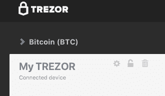

为了将我们的以太移动到我们硬件钱包的地址中，这实际上是通过 myetherwallet.com 网站[完成的:](https://www.myetherwallet.com/)

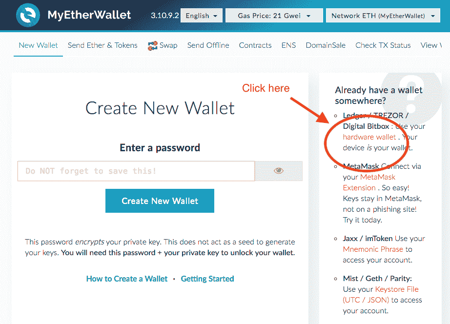

想要使用纸质钱包的用户可以使用该网站生成私钥和密码，但出于我们的目的，我们将单击硬件钱包选项:

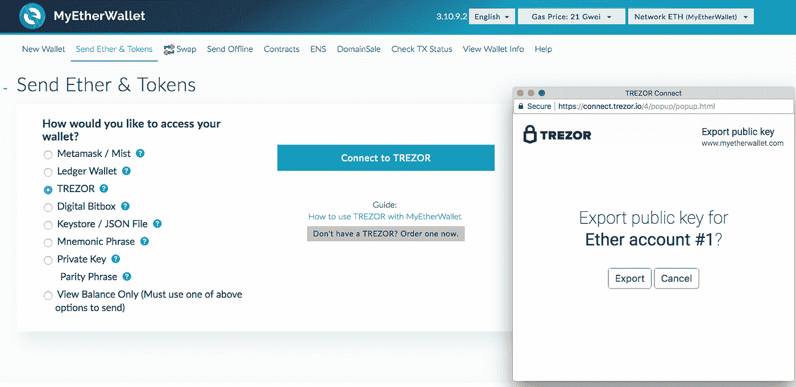

一旦你用你的密码解锁你的 Trezor 并导出公钥，你将被给予选择一个地址来使用的选项。继续使用一个新的，它会把你带到这样一个界面:

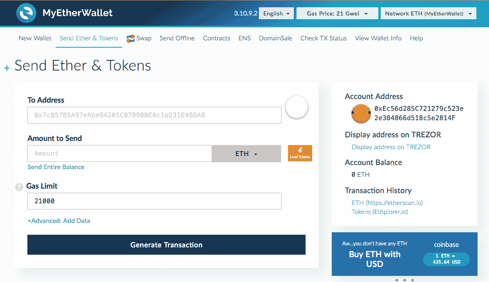

与我们为 BTC 所做的类似，让我们返回 GDAX，选择 ETH/USD 交换，并将资金提取到一个 ETH 地址(小心地从我们的钱包中复制/粘贴地址，并进行三次检查):

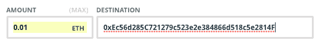

对于以太坊，使用类似 EtherScan.io 的网站来检查您的交易状态，在我们的示例中，可以通过以下 URL 完成:

[https://ethers can . io/address/0 xec 56d 285 c 721279 c 523 e 2e 384866d 518 C5 e 2814 f](https://etherscan.io/address/0xec56d285c721279c523e2e384866d518c5e2814f)

在区块链，你会看到这样的交易:

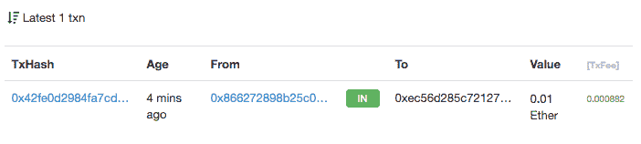

## **第六步:将你的加密货币从硬件钱包转移到第二个交易所**

如果你想获得比比特币基地/GDAX(即 ETH、LTC 和 BTC)更多的硬币，那么你需要将硬币转移到另一个交易所进行交易。对于我们这里的例子，我们将使用 [Bittrex](https://bittrex.com) (更新:我推荐[币安](https://www.binance.com/?ref=19658305)而不是 Bittrex，因为它是一个更大的交易所，费用也低得多(0.1%比 0.25%)。下面的原则同样适用，所以你可以很容易地跟随。

一旦您完成了帐户的设置和验证，请进入“钱包”标签，点击比特币旁边的“+”:

这将为您带来一个地址(我已经涂黑了，因为我正在积极使用这个地址，但它是一个标准的 34 个字符的比特币地址)

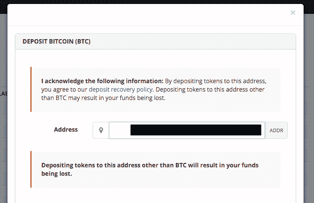

要从您的硬件钱包发送 BTC，您需要遵循类似的流程:

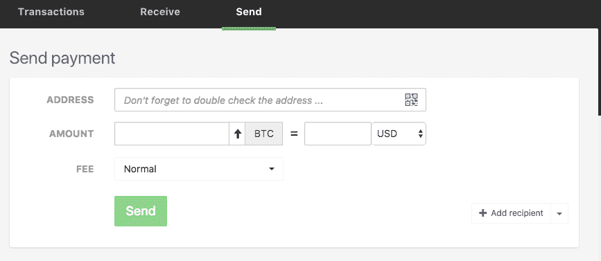

在 Bittrex 中对你要发送的地址进行三次检查，总是先测试一小笔金额，然后在第二次交易中跟进全部金额。

同样，使用跟踪网站(blockchain.info、EtherScan 等)来确保你的交易正确进行。

您将看到您的货币首先显示在 Bittrex wallet 部分的“待定”下，然后它们将移动到“可用余额”

## **第六步:在第二个交易所用 BTC 交易另一种加密货币**

最后，我们将在 Bittrex(或币安，或你选择的任何其他交易所)上遵循类似的程序，就像我们在 GDAX 上做的那样，发出买入限价单以获得另一枚硬币。

Bittrex 针对特定市场的用户界面如下所示:

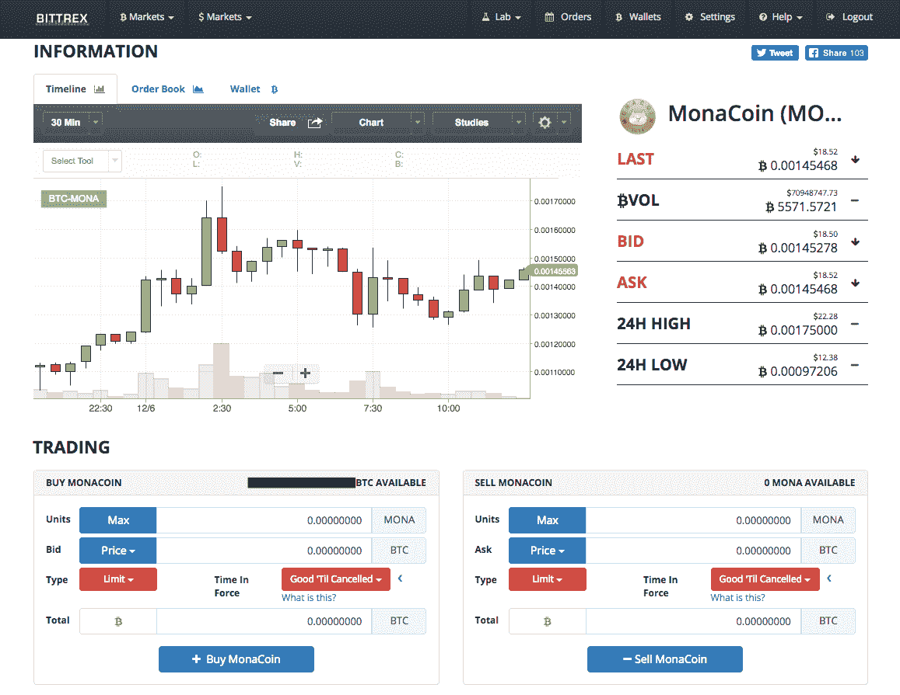

同样的原则也适用。继续操作，输入您想要购买的单位数量(或者只需点击“最大”),并通过点击下拉菜单轻松选择最新的投标价格，然后就可以开始了。

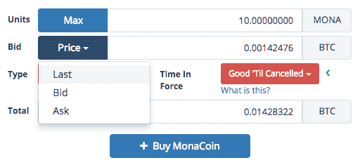

## **第七步:做代币销售/ico 作业，负责任地交易**

如果你还不了解区块链、协议和代币销售，那么[可以看看我关于这些主题的入门文章](https://hackernoon.com/a-primer-on-blockchains-protocols-and-token-sales-9ebe117b5759)作为一个好的起点。

在参与代币销售之前，一定要做足功课，核实团队、概念、计划、合法性等。例如，浏览 Linkedin 是一个好主意，看看你是否可以联系到一名团队成员或顾问，并进行对话以验证项目的真实性。

如果/当你决定参与代币销售时，大部分都是在以太坊区块链完成的(也就是说，你把代币寄给他们，他们会把代币寄回给你)。

在这种情况下，您需要遵循我们上面所做的相同协议。也就是说，先发送少量邮件，并使用以太网扫描验证您发送的是正确的智能合同:

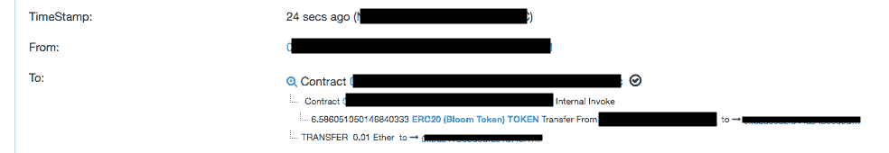

假设这看起来对您的适用代币销售是正确的，那么继续发送全部金额。

**如果你想换回法定货币，**你可以逆转上述过程。下达市价或限价卖单(即买入而非卖出)，然后从 GDAX 或任何其他合法的交易所将资金存回您的银行账户。

作者注:提前感谢对本文的任何/所有反馈、更正和评论。 [*订阅我的简讯*](http://wclittle.us5.list-manage.com/subscribe?u=e0dcd463a855cae724998d8f5&id=030549b371) *，当我写更多关于区块链的东西时，我会让你知道(作为提醒，我也写创业、技术和健康&健身科学)。非常感谢* [*托尼*](https://www.linkedin.com/in/tony-little-nd-4068273/) *和* [*安德鲁*](https://www.linkedin.com/in/andrewcronk/) *帮忙编辑这篇文章。最后，如果你觉得这篇文章有帮助的话，欢迎在下面发表评论，点击拍手按钮，和/或与朋友分享这篇文章。谢谢！*