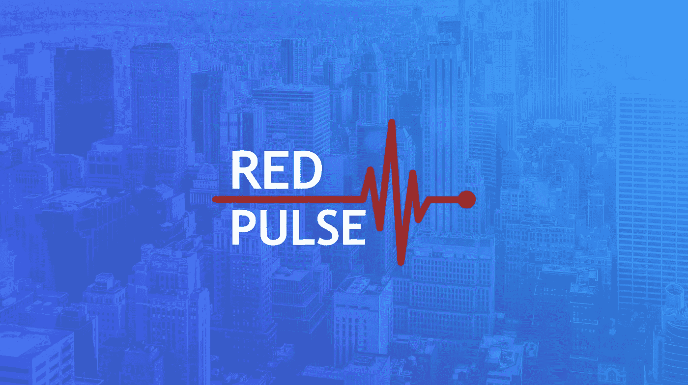
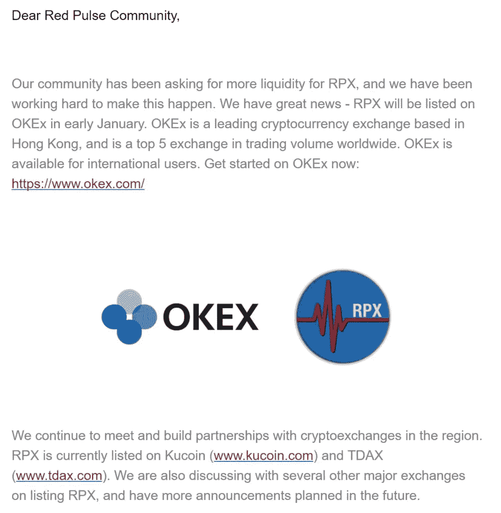
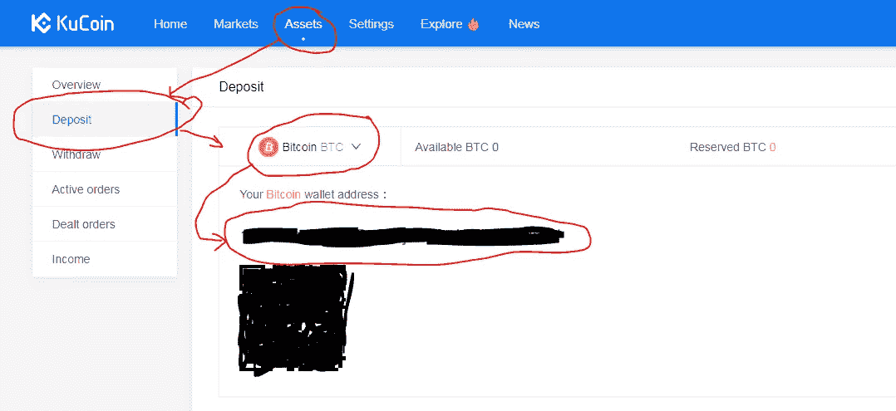
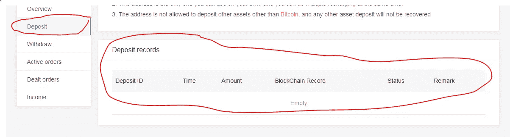
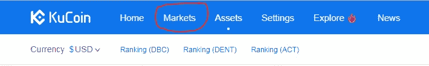
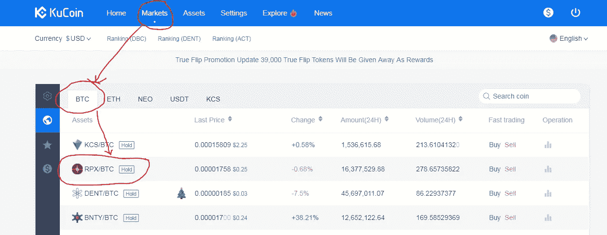
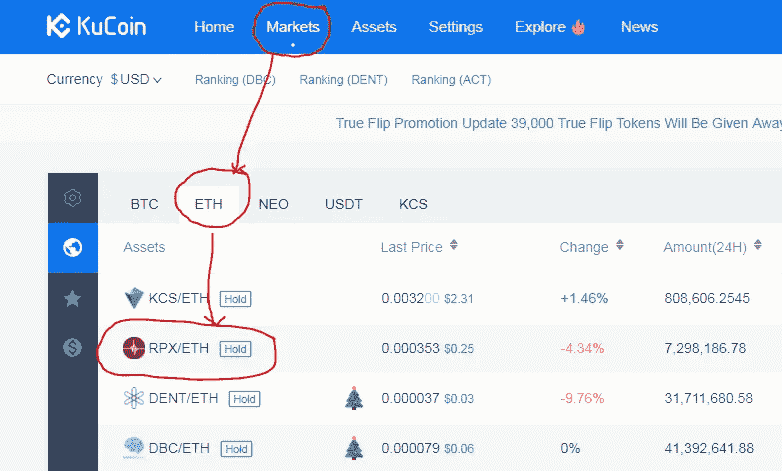
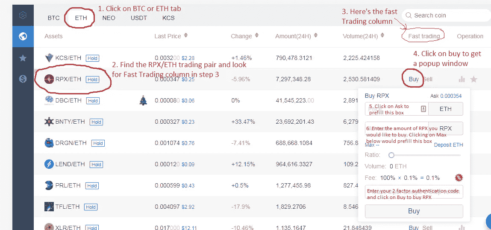

# 如何购买红色脉冲令牌又名 RPX

> 原文：<https://medium.com/hackernoon/how-to-buy-red-pulse-token-aka-rpx-4c1f606a3d60>

## 综合指南了解什么是红色脉冲，它的令牌，目的以及如何从交易所购买 RPX 令牌。

## 什么是红色脉搏

[红脉](http://coin.red-pulse.com)是一个覆盖中国经济和资本市场的市场情报平台。该公司使用机器学习和自然语言处理来自动化和规模化基本数据收集，同时结合加密货币来创建一个开放透明的研究共享经济。

> 最终，红色脉冲旨在解决我们今天都面临的问题，即**信息过载**。

他们在近地天体上做了一个 ICO，实际上他们是第一个在近地天体平台上做 ICO 的项目。交易红色脉冲令牌的股票代码是 **RPX**

> 首先，这篇文章纯粹是为了教育和信息目的，而不是鼓励你购买加密货币。在进行投资之前，你应该始终做好自己的研究 **(DYOR)** ，做出自己的决定 **(MYOD)** ，并对风险感到放心。投资不稳定的加密货币包含一个风险因素:这些货币的价格会上下波动(通常以一种看起来不理性的方式)。

## 在交易所上市

目前 RPX 在库币交易所上市，这是一个相对年轻但发展迅速的交易所之一。你可以在 KuCoin 上用不同的对子买卖 RPX。Red Pulse 的首席执行官 Jonathan Ha 昨天刚刚在视频中宣布，它将在本周在 10 大交易所中的 2 个交易所推出，并在 1 月份推出另一个交易所。这是一个非常令人兴奋的消息，鉴于它的潜力——在它成为主流并在其他交易所上市之前，以如此低的价格购买它可能是一种偷窃。

更新 2:红脉将于 1 月 8 日在火币 Pro 上市。我很快会在火币网上发布一个购买红色脉冲代币(RPX)的分步指南。

更新 1: Red Pulse 将于 1 月初在 OKEx 上市。

所以这是个大新闻。购买过程在 [KuCoin](https://www.kucoin.com/#/?r=1R8v3) 和 OKEx 上几乎相同——因为 OKEx 限制来自包括美国在内的几个国家的用户，我将使用 [KuCoin](https://www.kucoin.com/#/?r=1R8v3) 来解释购买过程，以帮助更多的观众。OKEx 上的过程也基本相同。

## 如何购买 RPX

*   在比特币基地购买以太币或比特币。你可以使用下面的指南来购买它们。如果你已经有比特币或者以太坊，可以跳过这一步。

 [## 如何在美国、澳大利亚、欧洲和新加坡购买比特币

### 解释如何在美国、澳大利亚、新加坡和欧洲使用银行购买第一枚比特币的综合指南…

hackernoon.com](https://hackernoon.com/a-beginners-guide-to-buying-bitcoin-8cf715421a9c)  [## 如何在美国、澳大利亚、欧洲和新加坡购买以太坊

### 我们将解释如何购买以太坊，这是一种比比特币更先进的实现方式，被誉为下一个脸书

hackernoon.com](https://hackernoon.com/a-beginners-guide-to-buying-ethereum-e11c73b5e5ed) 

*   一旦你有了[比特币](https://www.coinbase.com/join/5922da0103b62e7e9e6b9df8)或[以太坊](https://www.coinbase.com/join/5922da0103b62e7e9e6b9df8)，你就可以前往[库币](https://www.kucoin.com/#/?r=1R8v3)，RPX 在那里上市并可以交易。
*   在 ku coin[上注册——这是一个很酷的交流平台，有非常好的用户界面，也很实用，不会把杂乱的东西扔到你的脸上。](https://www.kucoin.com/#/?r=1R8v3)
*   设置双因素身份验证时，保存恢复密钥很重要。万一你的手机丢了或者你换了手机，你需要这个密钥来让谷歌认证器正常工作。
*   使用用户名、密码和 2FA 登录后，您将进入资产屏幕，如果没有，请单击顶部菜单栏上的“资产”。

*   单击资产后，从侧面菜单项中选择存款，如下所示

*   在存款屏幕上，您将有一个下拉菜单来选择一项资产(比特币或以太坊或您随身携带的任何东西)。选择比特币查看存款地址或以太坊查看以太坊存款地址。
*   使用这个地址从[比特币基地](https://www.coinbase.com/join/5922da0103b62e7e9e6b9df8)或任何其他你拥有比特币或以太坊的交易所发送你的资金。
*   向下滚动时，您可以看到所选资产的存款历史，如下所示

*   一旦你看到你的存款被确认，你可以向上滚动到顶部的菜单并点击 ***市场—*** ，这将显示你可以与之交易的不同对 **RPX** 。

如果你已经将比特币存入 [KuCoin](https://www.kucoin.com/#/?r=1R8v3) ，点击 BTC 标签，你会看到 RPX/BTC。不要点击它——按照下面的步骤轻松购买/销售

如果您已经将以太币存入了[库币](https://www.kucoin.com/#/?r=1R8v3)，点击 ETH 标签，您可以看到 RPX/ETH 对。不要点击它，因为你可以在这个屏幕上直接购买/出售。

在 RPX 代币进入其他交易所并变得出名之前，按照下面的截图和评论来完成你的购买。

Step by Step process to buy RPX

完成 RPX 购买后，您可以转到顶部的资产菜单项，查看活动订单或已处理订单，以查看您的 RPX 代币。如果它在活跃订单中，这意味着 RPX 还没有被购买——但订单已经被下了——当它达到我们提到的价格时，它将被自动购买并转移到成交订单。

## 太棒了&恭喜

耶！您已经在库币交易所成功购买了 RPX 代币。库币交易所还提供各种其他配对，如尼奥、USDT 和 KCS。你也可以用它们来购买 RPX。

KCS——ku coin 股票也是一个有趣的概念，请从下面的文章中了解更多。

 [## 查看 KCS-库币公司的股票，它可以支付股息并节省 50%的交易费用。

### 币安和库科恩提供 BNB 和 KCS，可以为您节省 50%的费用，但也作为良好的长期投资。这是…

hackernoon.com](https://hackernoon.com/binance-kucoin-bnb-kcs-can-save-you-fees-be-a-good-investment-822d38cffd0) 

很快会写一篇关于如何在 Huobi Pro 和 OKEx 上购买红色脉冲令牌的详细文章。与此同时，对于大多数交易所来说，情况几乎是相似的。

1.  用你的美元在比特币基地购买以太币/比特币
2.  转到交易所对应的存款地址
3.  根据您的存款选择 RPX/联邦理工学院或 RPX/BTC 学院
4.  点击 Ask 自动填充价格，点击 Max 自动填充要购买的数量。您可以手动输入这些值，以减少购买量。
5.  单击“购买”—如果需要，可能会输入双因素身份验证。
6.  就这样，你已经购买了你的红色脉冲代币——HODL·RPX