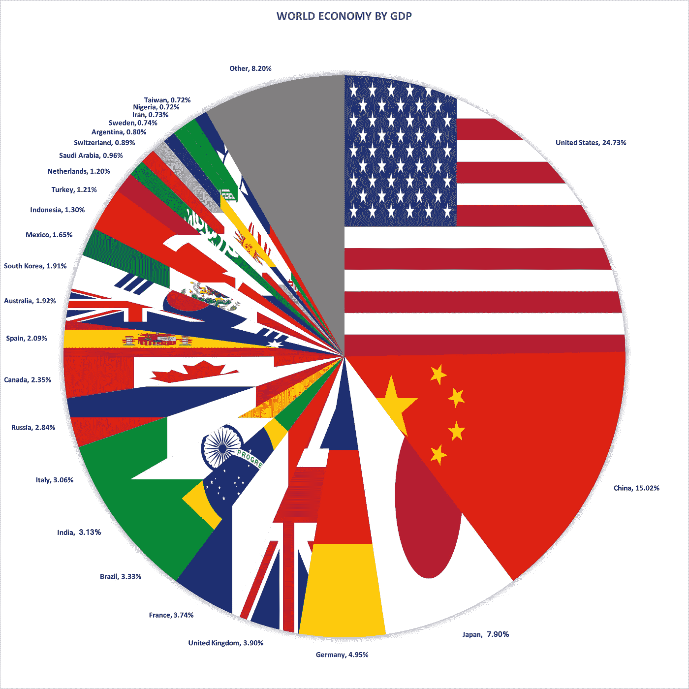
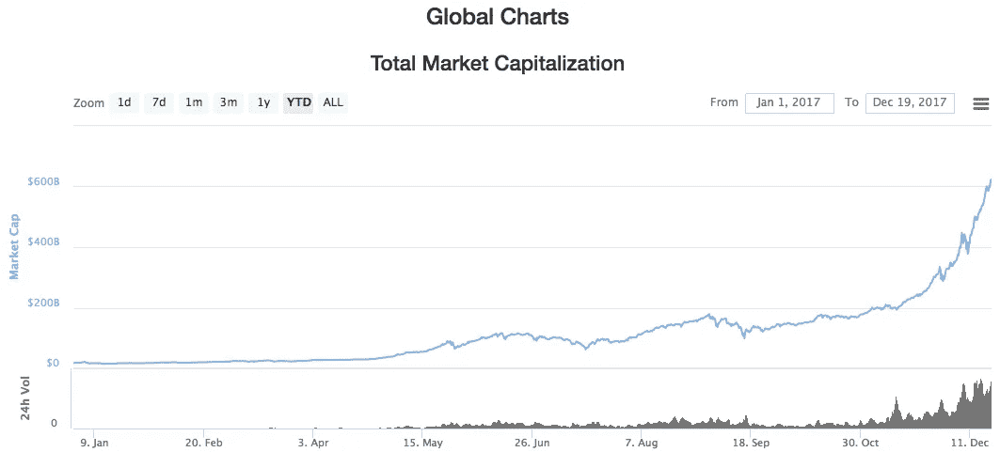
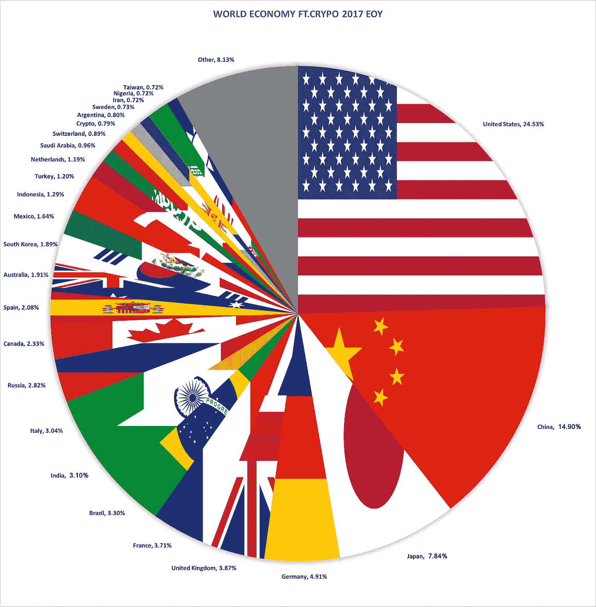
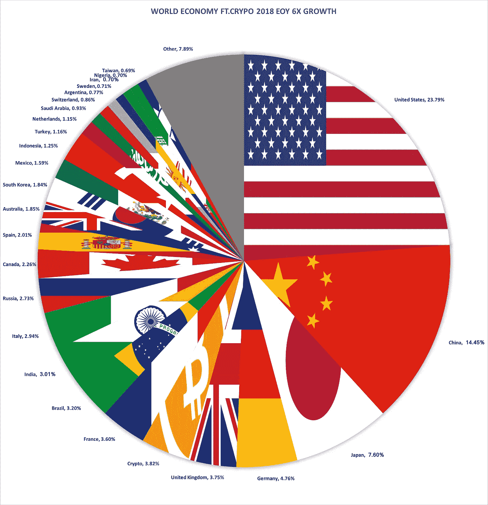
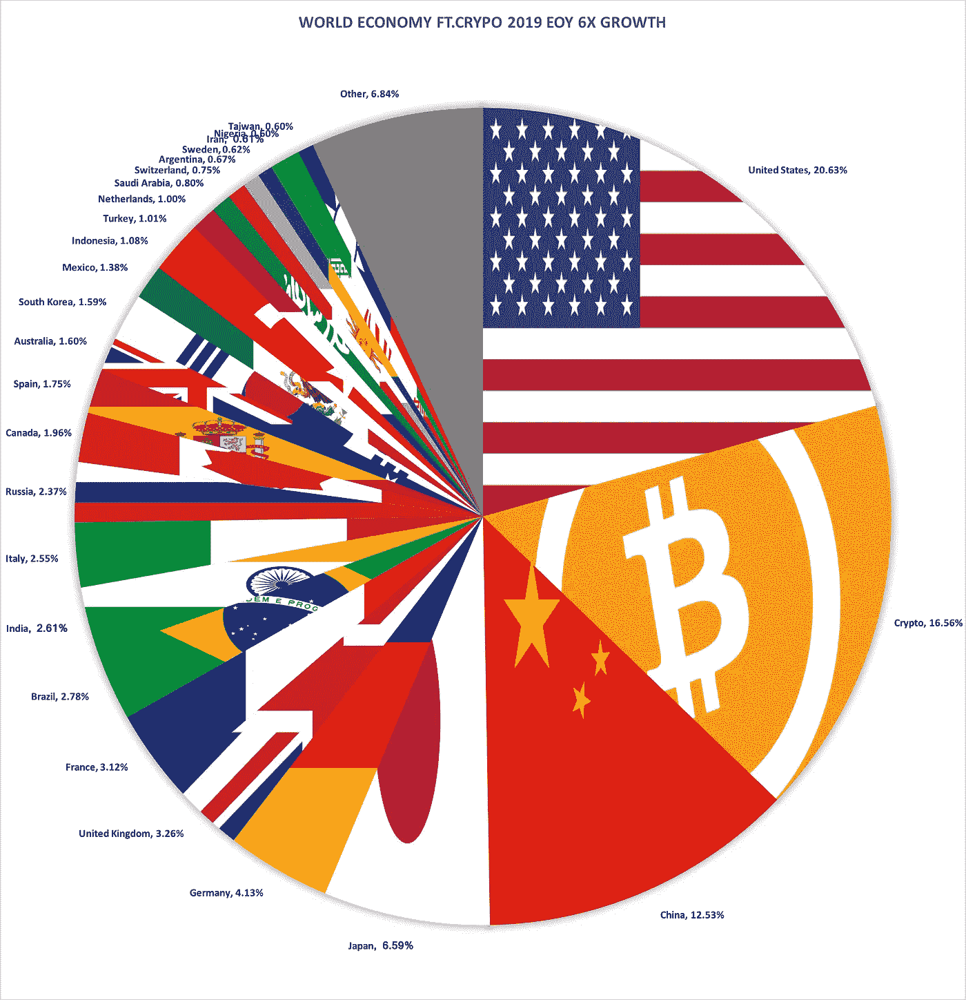
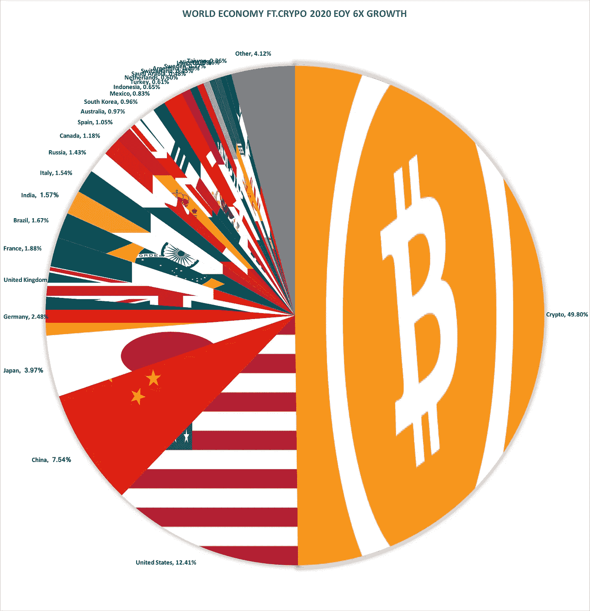

# 如何利用密码蚕食世界经济[可视化]

> 原文：<https://medium.com/hackernoon/how-to-capitalize-on-crypto-eating-the-world-economy-visualized-8879dcaef3a4>

## 我们信任加密

今年到目前为止，*秘密经济*从 177 亿美元增长到 6230 亿美元，正被跨越海洋和国界的大规模采用。

欢迎来到人类历史上发展最快的行业。

Despite the boom in cryptocurrencies, Bitcoin remains king 👑

# 世界经济(加密前)

A traditional view of the world’s money

欢迎来到世界 GDP！[我们总共有大约 78.5 万亿美元](http://www.imf.org/external/pubs/ft/weo/2017/01/weodata/weorept.aspx?pr.x=52&pr.y=12&sy=2015&ey=2022&scsm=1&ssd=1&sort=country&ds=.&br=1&c=512%2C672%2C914%2C946%2C612%2C137%2C614%2C546%2C311%2C962%2C213%2C674%2C911%2C676%2C193%2C548%2C122%2C556%2C912%2C678%2C313%2C181%2C419%2C867%2C513%2C682%2C316%2C684%2C913%2C273%2C124%2C868%2C339%2C921%2C638%2C948%2C514%2C943%2C218%2C686%2C963%2C688%2C616%2C518%2C223%2C728%2C516%2C836%2C918%2C558%2C748%2C138%2C618%2C196%2C624%2C278%2C522%2C692%2C622%2C694%2C156%2C142%2C626%2C449%2C628%2C564%2C228%2C565%2C924%2C283%2C233%2C853%2C632%2C288%2C636%2C293%2C634%2C566%2C238%2C964%2C662%2C182%2C960%2C359%2C423%2C453%2C935%2C968%2C128%2C922%2C611%2C714%2C321%2C862%2C243%2C135%2C248%2C716%2C469%2C456%2C253%2C722%2C642%2C942%2C643%2C718%2C939%2C724%2C644%2C576%2C819%2C936%2C172%2C961%2C132%2C813%2C646%2C199%2C648%2C733%2C915%2C184%2C134%2C524%2C652%2C361%2C174%2C362%2C328%2C364%2C258%2C732%2C656%2C366%2C654%2C734%2C336%2C144%2C263%2C146%2C268%2C463%2C532%2C528%2C944%2C923%2C176%2C738%2C534%2C578%2C536%2C537%2C429%2C742%2C433%2C866%2C178%2C369%2C436%2C744%2C136%2C186%2C343%2C925%2C158%2C869%2C439%2C746%2C916%2C926%2C664%2C466%2C826%2C112%2C542%2C111%2C967%2C298%2C443%2C927%2C917%2C846%2C544%2C299%2C941%2C582%2C446%2C474%2C666%2C754%2C668%2C698&s=NGDPD&grp=0&a=)。如果你住在美国或中国，恭喜你！你的身价约为 29 万亿美元，约占全球 GDP 的 39%。

如果你是沙特阿拉伯，你的财富约为 7560 亿美元，约占全球 GDP 的 0.96%。

如果你是杰夫·贝索斯，[你的身价大约是 1000 亿美元](https://www.bloomberg.com/news/articles/2017-11-24/jeff-bezos-fortune-hits-100-billion-on-black-friday-stock-surge)，或者大约是全球 GDP 的 0 . 13%(嘿，杰夫，你能帮我让我的 Alexa 重新工作吗？)

# 一年的秘密工作

Year to date of the crypto market cap 😵

从 177 亿美元的[市值增长到 6232 亿美元](https://coinmarketcap.com/)，今年到目前为止，密码产业已经增长了 3520%——一些专家可能称之为“愚蠢的快速”的速度

尽管市场上出现了新的硬币，比特币仍然占据着至高无上的地位，市值约为 3180 亿美元，占整个行业的 51%以上。

# 世界遇见密码

Move over Argentina, Crypto is the 21st richest country now!

这就是当今世界经济以加密货币为特征的样子。你看到瑞士和阿根廷之间的那一小块了吗？这就是加密，它已经比 2017 年 1 月 1 日大了 35 倍。这不是一个很大的部分，但它现在是可见的，这本身就是一个相当大的成就。

## **密码的未来**

现在让我们展望一下我们的未来。在我们的实际分析中，我们将假设一个更适中的年增长率，仅为 600%，但为了好玩，在这张图表中，让我们看看如果 crypto 在 2018 年保持当前 3，520%的增长率会发生什么。

## 一年预测保持增长

In crypto we trust

Wowza！如果加密市场再保持一年的高速增长，它将会比美国经济还要大！再过一年，crypto 就像 pacman 一样了。

回到更温和的 6 倍增长率(不到 2017 年的五分之一)。这是 2018 年至 2020 年各自的图表。

## Crypto 2018 预测增长 1/5

Crypto in 2018 EOY

如果 Crypto 的增长速度放缓至现在的五分之一，那么明年这个时候它将成为世界第六大经济体。

## Crypto 2019 预测增长 1/5

Crypto in 2019 EOY

在 2 年内，加密取代中国成为世界第二大经济体。

## Crypto 2020 预测增长 1/5

Crypto in 2020 EOY

到 2020 年底，世界上一半的人使用加密技术。

谈到加密，有些人说“船已经启航了”。

# “但这种增长可能是不可持续的！”

我会第一个承认我们看到的增长是疯狂的。

我记得大约一年前，大约在 2017 年新年，有一项民意调查问我们认为以太坊(当时是 8 美元)的价格到 2017 年底会是多少。当我猜到*50 美元时，我认为我是如此的乐观！*毕竟这是一年内的 6 倍多。今天，以太坊的价格是一年前的 100 倍左右[。](https://coinmarketcap.com/currencies/ethereum/)

要吸取的教训是，是的，秘密经济*可能会*崩溃，你(和我)的所有投资可能会降至零，但也有机会看到违背历史逻辑的增长。

金钱是虚构的，传统经济学站不住脚，这是密码世界中的狂野西部。

# “那么，我该如何利用呢？”

按住 shift 键的同时😛但是说真的:

## 1.如果你还没有，那就在 crypto 里放些钱吧

如果它消失了，你不会感到沮丧，但你会非常兴奋地看到它的繁殖。我们还有很长的路要走，这个行业还很年轻。在馅饼没了之前，给自己拿一块🍰

## **2。长期下注**

像创业公司一样，超过 90%的新硬币将可能失败。所以，不要支持“泵和转储”经济，长期投资那些你确实认为对生态系统/世界有价值的东西🌍

## 3.市场时机>市场时机

加密价格在一天内会有 25%的上下波动——习惯吧。但是，如果你把赌注放在长期和 HODL 上，你会赶上通往月球的每一次牛市🌕

## 4.建造一些东西

尽管发展很快，但密码产业仍处于幼稚阶段。有绿色的机会领域等待着雄心勃勃的工程师或企业家。直到 iPhone 发明近 10 年后，我们才看到最受欢迎的移动应用，我敢肯定，最受欢迎的🛠区块链应用仍在等待开发

非常感谢我在 [*调度实验室*](https://dispatchlabs.io) *的团队，感谢他们帮助我编辑并鼓励我将我的说教变成文字。感谢所有带领我们走到今天的区块链建设者们。我们正站在巨人❤️的肩膀上*

> 如果你觉得这篇文章有用或有趣，请投下*👏*还是一股。在推特上关注我以获得更多见解[twitter.com/ZaneWithSpoon](http://twitter.com/ZaneWithSpoon)