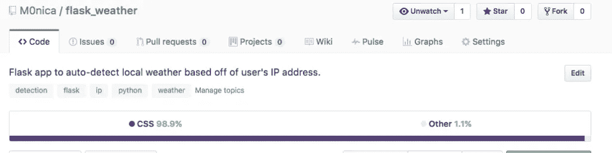

# 如何在 GitHub 中更改回购语言

> 原文：<https://medium.com/hackernoon/how-to-change-repo-language-in-github-c3e07819c5bb>

## GitHub 是否告诉你你的存储库 98.9%是 CSS 或 HTML，而事实并非如此？以下是每次解决该问题的方法。

我最近开始在 Flask 中开发一款[天气应用，根据用户的 IP 地址自动检测他们的位置。在对 GitHub 做了一些更新后，我的应用程序从以 Python 为主转变为 98.9%的 CSS，尽管它是一个 Flask 应用程序，其中大部分代码是用 Python 和 HTML 编写的。有时，我不同意 GitHub 对我的资源库中的语言进行分类的方式，所以我着手解决这个问题。](https://github.com/M0nica/flask_weather)

Before: My Flask App Appeared in GitHub as 98.9% CSS.

 [## 莫尼卡/烧瓶 _ 天气

### flask_weather - Flask 应用程序根据用户的 IP 地址自动检测当地天气。

github.com](https://github.com/M0nica/flask_weather) 

## 提示:帮助 GitHub 正确地检测你的库的主要语言。

GitHub 有一个[语言库](https://github.com/github/linguist)，可以自动检测每个知识库中的语言。在研究如何解决 GitHub 对项目语言的错误分类时，我发现解决方法很简单，只需告诉 GitHub 忽略哪些文件。

 [## github/语言学家

### 语言学家-语言专家。如果您的存储库的语言报告不正确，请向我们发送请求！

github.com](https://github.com/github/linguist) 

虽然您仍然希望将这些文件提交给 GitHub，因此不能使用. gitignore，但是您可以告诉 GitHub 的语言学家在. gitattribute 文件中忽略哪些文件。(旁注:[如果你对了解](http://www.blacktechdiva.com/hide-api-keys/)[感兴趣，可以看看我关于“对 GitHub 隐藏 API 密匙”](http://www.blacktechdiva.com/hide-api-keys/)的文章。gitignore 。

 [## 隐藏您的 API 密钥🔑“黑科技天后

### 如果你计划在 GitHub 上编写任何应用程序并存储你的代码，那么保护你的…

www.blacktechdiva.com](http://www.blacktechdiva.com/hide-api-keys/) 

在检查语言学家库的文档时，我了解到只需在. gitattributes 文件中添加一行就可以解决这个特定 repo 的语言问题。

我的。gitattributes:

这个单行文件告诉 GitHub 忽略我的 static/文件夹中的所有文件，这个文件夹是为 Flask 应用程序存储 CSS 和其他资源的地方。供应商文件有时会占用大量的相对空间，所以我告诉语言学家忽略它们(因为它们占了我项目的 98.9%)！

After: My Flask App Appears in GitHub now as 56.2% Python and 43.8% HTML.

 [## alexkaratarakis/gitattributes

### 有用的集合。gitattributes 模板

github.com](https://github.com/alexkaratarakis/gitattributes) 

这里有一个由@提供的知识库示例。gitattributes 文件供你下次不同意语言学家的意见时尝试；).注:对。gitattributes 可能不能追溯应用，如果语言学家*真的*错了，GitHub 鼓励你在他们的/语言学家报告中报告这个问题。

我希望这篇文章是有帮助的！我很想听听你对 GitHub 的一些建议，也很乐意回答你的任何问题。

*如果你喜欢读这篇文章，可以考虑点击拍手按钮👏。想看更多我的作品吗？查看* [*我的 GitHub*](https://github.com/M0nica/) *查看我的代码，并在*[*http://aboutmonica.com*](http://aboutmonica.com)*了解更多我的开发经验。*