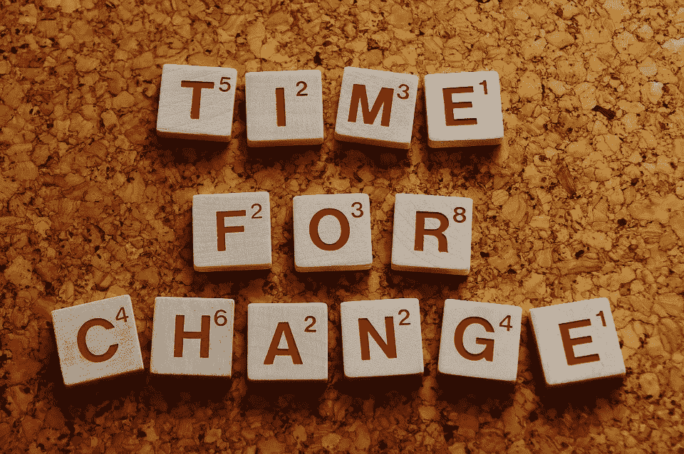

# 如何改变你的习惯

> 原文：<https://medium.com/hackernoon/how-to-change-your-habits-813c038d3b63>

查尔斯·杜希格在他的书《习惯的力量:我们为什么在生活和商业中做这些事情》中解释了习惯循环。

> 习惯循环由线索、常规和奖励组成。

**提示**可以是外部的，也可以是内部的。突然想吃一块蛋糕是一种内在的暗示。外部提示是当 facebook 向你发送通知说有人提到了你。

**常规**是你根据提示采取的行动。比如去面包店，点一个蛋糕然后吃。

奖励是拥有蛋糕的快乐。大脑决定让你未来想要的原因。

*打破习惯循环很简单。你要做的就是改变套路，给你一个类似的奖励。当你想吃一块蛋糕的时候。吃个苹果吧。有时你必须尝试不同的奖励来打破这个循环。这样你就把你的坏习惯变成了好习惯。*

试着从微小的改变开始。如果你有起床就看手机的习惯。通过读一章来改变它。

你知道脸书、Pinterest 等公司用同样的方法来吸引你购买他们的产品吗？在 [Hooked:如何打造养成习惯的产品](http://amzn.to/2mXFCD9)这本书里有很好的解释。

> [黑客中午](http://bit.ly/Hackernoon)是黑客如何开始他们的下午。我们是 AMI 家庭的一员。我们现在[接受投稿](http://bit.ly/hackernoonsubmission)并乐意[讨论广告&赞助](mailto:partners@amipublications.com)机会。
> 
> 如果你喜欢这个故事，我们推荐你阅读我们的[最新科技故事](http://bit.ly/hackernoonlatestt)和[趋势科技故事](https://hackernoon.com/trending)。直到下一次，不要把世界的现实想当然！

