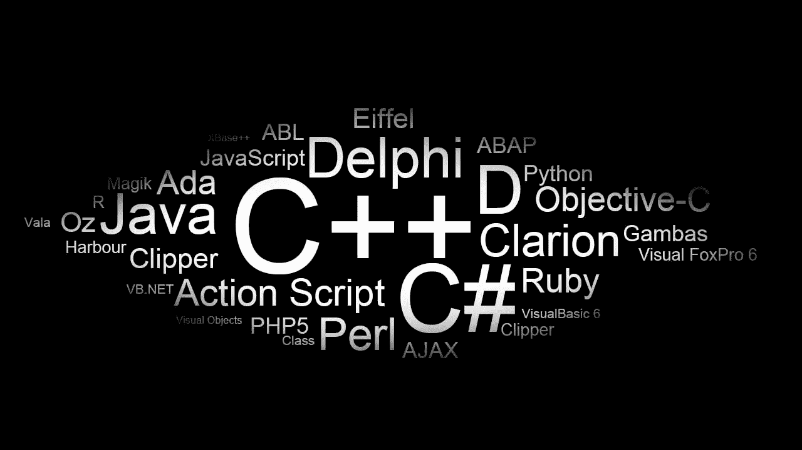
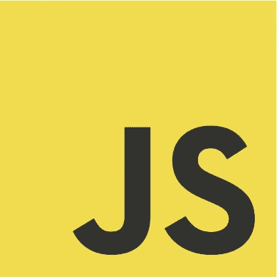
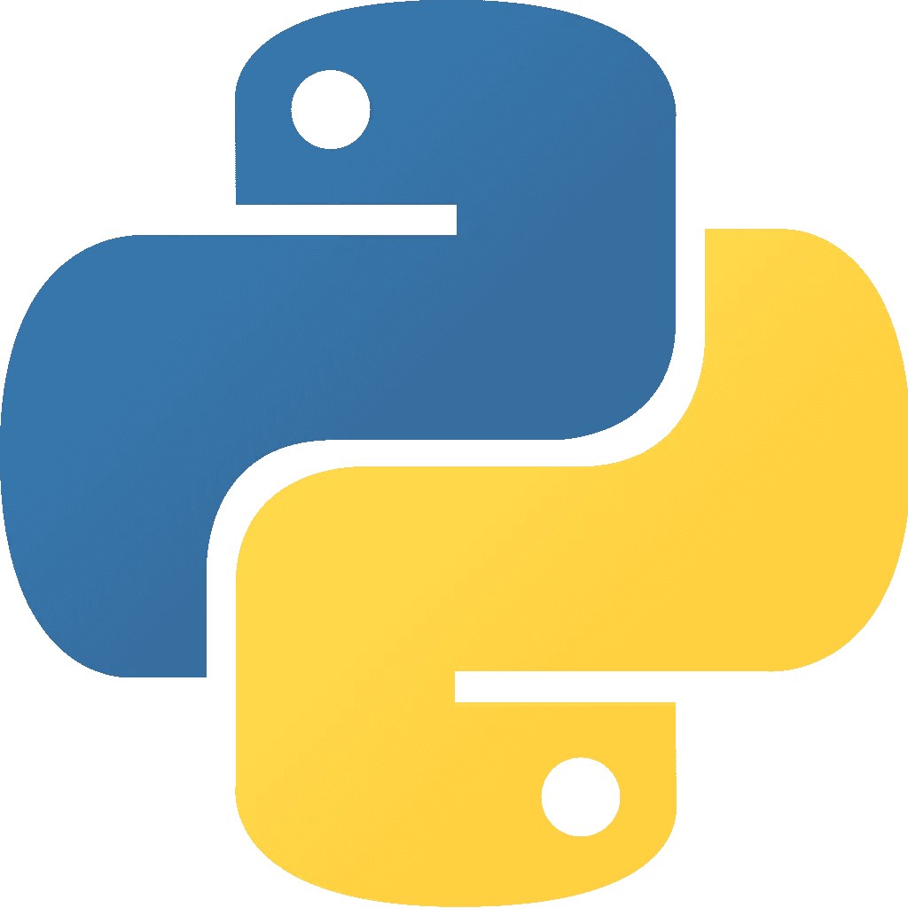

# 如何选择一门初学编程语言

> 原文：<https://medium.com/hackernoon/how-to-choose-a-beginner-programming-language-47cdc5e1b95b>

当你决定要学习如何编码时，你要做的第一个决定是你将花时间学习哪种语言。对于零经验的人来说，这通常不是一件容易的事情，而且关于这个决定有很多相互矛盾的信息。可以肯定的是，只要付出适当的努力，几乎任何一种[编程](https://hackernoon.com/tagged/programming)语言都可以用来学习如何编写软件。然而，我认为初学者应该考虑两个主要因素来缩小选择范围。

1.*从学习的角度来看，这种语言有多平易近人？*

许多大学的计算机科学课程使用 C++和 Java 等低级语言作为入门课程。虽然这对于想进入学术界或做低级编程如构建操作系统的人来说是有意义的，但我认为这对于绝大多数人来说是错误的方法。如果你和我一样，你正在进入构建 web 和移动应用程序的编程阶段，而不是学习如何优化内存管理或为打印机创建驱动程序。CS 入门课程的所有基本概念都可以用更容易理解、使用起来更有趣的语言来教授。

2.*为什么我想学习如何编码？*

选择编程语言开始的第二个重要因素，我在上面提到过，是你个人的编程目标是什么。同样，想成为计算机科学教授的人与想成为企业家或在初创企业工作的人有着截然不同的目标。下面，我挑选了最能满足大多数人这两个要求的三种语言。这些语言平易近人，易于使用，同时受到最前沿技术公司的欢迎。这些语言中的每一种都可以有效地帮助你快速起步，并最终帮你找到一份工作，或者让你更有创造力，做出更酷的东西。

# 红宝石

Ruby 是我精通的第一门语言，现在仍然是我选择的语言。如果你曾经尝试过学习用 C++或 Java 编写代码，Ruby 将是一股新鲜空气。它非常容易阅读和编写，组织得非常好，并且在低级需求之上创建了一个抽象层，像 C++这样的语言迫使开发人员自己实现这些需求。此外，Ruby 有大量的内置语言特性，这将使您的生活更加轻松，还有一个蓬勃发展的开源社区，该社区开发自由软件，提供语言本身没有的功能。最重要的是，如果你想构建一个完整的 web 应用程序，Ruby 是 Ruby on Rails web 应用程序框架的基础，这个框架非常流行，被大大小小的公司所使用。Ruby 不仅提供了一个通俗易懂的编程入门，还提供了一个开始用 Rails 构建真正起作用的 web 应用程序的好方法。

# Java Script 语言

JavaScript 是世界上最流行的编程语言，也是所有主流 web 浏览器都支持的唯一语言。JavaScript 有很多与 Ruby 相同的特性，这使得它对初学者来说很容易使用，但是语法比 Ruby 稍差，在我看来，语言的某些方面可能更令人困惑。然而，这些有些不太理想的语言特性被 JavaScript 的能力所平衡，为初学者提供了切实的结果。如果你知道如何使用 HTML 和 CSS 来构建网页，你几乎可以在开始学习 JavaScript 时就开始将交互性融入其中。JavaScript 也可以通过 Node.js 在后端使用，所以它还有一个优点，就是允许新手程序员不用学习一种以上的语言就可以编写一个完整的 web app。

# 计算机编程语言

Python 是另一种适合初学者的优秀语言，它的语法和特性与 Ruby 非常相似。Python 还有一个名为 Django 的 web 框架，它或多或少与 Rails 不相上下。Python 的另一个优势是在学术界以及数据科学和机器学习领域应用广泛。与 Python 相比，我更喜欢 Ruby，但是如果您对这些类型的编程感兴趣，而不是严格意义上的 web 应用程序开发，Python 可能是您更好的选择。

以上所有的语言都是你第一语言的绝佳选择，可以让你很快学会编程，并且马上就能构建东西！

目的地:Dev 是一个为期 8 周的项目，在哥伦比亚的麦德林将网络开发教育与文化融入相结合。想了解我们如何帮助您成为数字流浪者吗？ [*点击这里*](http://www.destinationdev.com?utm_source=medium_proglangs)

*原载于 2016 年 11 月 27 日*[*【www.destinationdev.com】*](http://www.destinationdev.com/blog/2016/11/27/how-to-choose-a-beginner-programming-language)*。*

> [黑客中午](http://bit.ly/Hackernoon)是黑客如何开始他们的下午。我们是 [@AMI](http://bit.ly/atAMIatAMI) 家庭的一员。我们现在[接受投稿](http://bit.ly/hackernoonsubmission)并乐意[讨论广告&赞助](mailto:partners@amipublications.com)机会。
> 
> 如果你喜欢这个故事，我们推荐你阅读我们的[最新科技故事](http://bit.ly/hackernoonlatestt)和[趋势科技故事](https://hackernoon.com/trending)。直到下一次，不要把世界的现实想当然！

