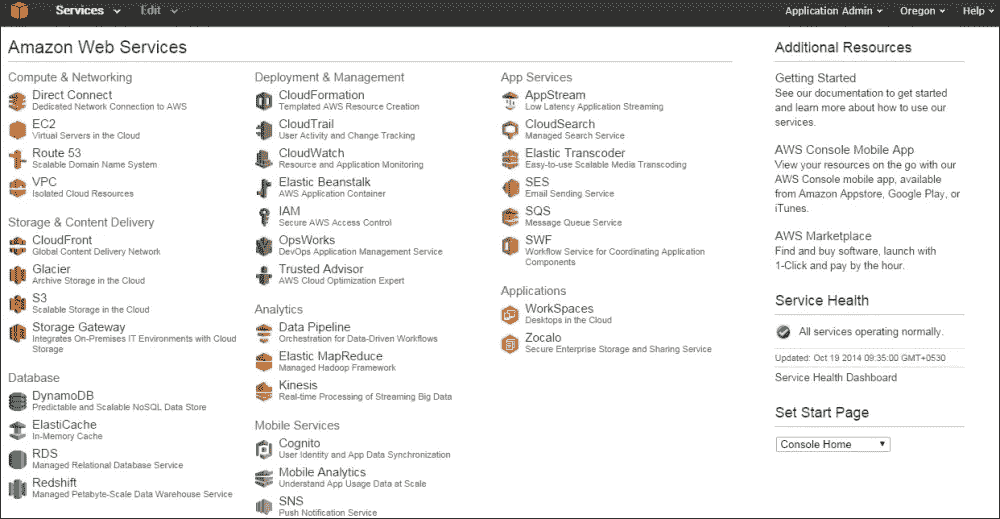
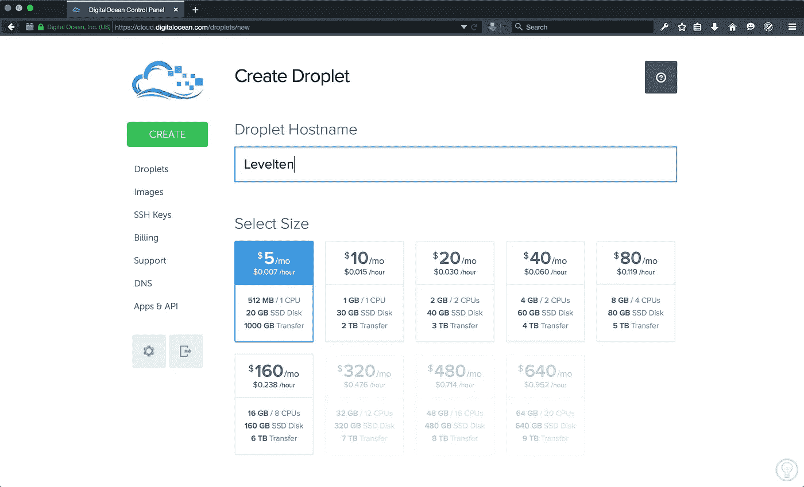

# 如何为你的创业公司选择云计算技术

> 原文：<https://medium.com/hackernoon/how-to-choose-a-cloud-computing-technology-for-your-startup-2527c0d68ce5>

如今，当谈论开发应用程序时，云计算技术成为一种标准。几年前，公司被迫拥有专门的团队来配置、运行和维护服务器机房，这使得轻松扩展和提供可持续产品变得极其困难。对于小型创业公司来说，由于缺乏人力资源和资金，这甚至更加困难。

如今，不仅几乎每种你能想象到的架构都有云计算技术，而且云供应商也在不停地争夺我们(开发人员)的注意力。过去几年，大多数大型科技公司，如谷歌、亚马逊和 IBM，都推出了云服务。他们做广告，提供免费层，出席技术会议，并举办免费的研讨会来体验他们的云解决方案。他们意识到，一旦你爱上他们的服务，这很可能是你未来几年每个项目中最喜欢的选择。

那么什么是云提供商呢？云提供商是为您的应用提供云服务的实体。运营可能包括运行服务器、为您的应用程序提供服务、托管静态文件、提供数据库解决方案、处理服务器之间的联网、管理 DNS 等等。不同的云供应商在其服务中提供不同级别的抽象，通常定义为 IaaS 与 PaaS。

## IaaS(基础设施即服务)

IaaS，或基础设施即服务，指的是一个底层的解决方案，比如提供一个没有安装任何东西的 Linux Ubuntu 服务器。这种解决方案适合那些在设计、配置和保护服务器基础设施的各个方面都有经验的高级开发人员。IaaS 服务为您提供了灵活性和可扩展性，这很可能是设计可扩展应用程序的最佳方式。如前所述，这种方法要求创业公司中至少有一名开发人员具备这种技能，否则，你的产品迟早会变得一团糟。

## 平台即服务

PaaS，或平台即服务，指的是一个完全维护和管理的环境，它隐藏在一个抽象层之下，你甚至不应该关心。云供应商负责为您维护运营所需的服务器，您可以获得用于存储数据的高级数据库、用于用户身份验证的服务、客户端应用程序的端点等。这种方法更容易和更快地启动和运行，并且通常满足大多数基本应用程序。但是，您应该考虑到，对于更复杂的体系结构来说，这可能还不够。

一般来说，在处理部署和服务应用程序时，IaaS 和 PaaS 都可以节省大量时间。你可以通过点击一个按钮来运行一个服务器，通常是按使用付费的。当流量高峰突然出现时，可以手动甚至使用 API 自动扩展服务器。你可以确定你在一家好公司(只要你选择明智)，无论你能想象什么，你基本上都可以创造。

# 云提供商列表

在早期创业公司中，由于灵活性、定价模式和可访问性，使用云计算技术成为一种标准。为你的创业公司选择最好的云服务是每个科技企业家必须完成的基本任务。作为贵公司的开发主管，你应该知道主要备选方案之间的差异，并选择最适合你的产品的方案。

在决策失误的情况下，技术债务会越积越多。此外，将整个架构从一个云提供商迁移到另一个云提供商并不是一件小事。因此，你应该能够知道其中的区别，尝试每一个主要的选择，并做出明智的决定。

在考察和体验了最佳云提供商之后:

*   亚马逊网络服务(AWS)——[尝试免费层](https://aws.amazon.com/free/)
*   谷歌云
*   数字海洋— [用 10 美元信用试试](https://m.do.co/c/f441a74808c9)
*   微软 Azure
*   IBM 云
*   赫罗库

并在各种各样的项目中使用它们，我将选择我最喜欢的两个:AWS 和 DigitalOcean，并使用一组参数对它们进行比较。

我选择了这两家云提供商作为我的最佳选择，之前我使用了创业时最重要的参数对它们进行了评级:

1.  **特性(产品)** —您的下一代应用程序的可用云计算技术、集成和可能性的范围有多广。为了扩大规模，您需要确保云供应商能够在未来几年支持您的应用程序。
2.  **定价** —可用的定价模式、初创公司的自由层级和定价透明度。早期创业公司(自筹资金的创业公司)寻求以最低的价格获得最大的价值。
3.  **易用性** —中级开发人员构建基本云架构和部署应用的速度有多快，迭代现有云架构的难易程度以及初学者的学习曲线如何。
4.  **教程和支持** —提供在线资源来帮助您启动和运行不同的服务，以及人工客户支持的可访问性。

# 三，二，一，战斗！

# 特征

提供的服务范围有多广？

**亚马逊网络服务:** AWS 拥有迄今为止最广泛的服务，它涉及到产品。如果你在 AWS 清单下找不到云计算技术，你很可能在其他地方也找不到。AWS 有许多不同的 IaaS 和 PaaS 服务，专门用于服务器需要执行的每项任务，分为有组织的类别。当使用 AWS 时，你可以确定你的启动可伸缩性是无限的。另一方面，该产品有时可能会让初学者感到困惑，因为它会让入门过程变得更长。如果您的应用程序有许多定制组件，AWS 可能是您应该考虑的云提供商。

**等级:** 5/5

**digital ocean:**digital ocean 提供的服务范围相对狭窄。至于 IaaS，你可以找到 droplets(服务器)，数据存储单元，网络和监控服务。至于 PaaS，您可以轻松部署无需任何配置的应用程序，如 Node.js、Redis、Docker 等。尽管该产品非常简洁，但我发现它正是 80%以上的应用程序所需要的。除了标准的 droplet 之外，高 CPU 和高内存 droplet 可用于自定义使用，以及每个 droplet 的备份和快照。DigitalOcean 团队正根据社区的要求不断增加他们的产品。作为一个长期使用 DigitalOcean 的开发者，我不得不承认，他们满足社区的愿望是值得高度赞赏的。

**等级:** 4/5

# 定价

可用的定价模型和透明度

**亚马逊网络服务:** AWS 基于按使用付费的定价模式。每种云计算技术都有自己独特的定价，并且有一个[定价计算器](https://calculator.s3.amazonaws.com/index.html)可用于尝试估算您的前期成本。如果你以前没有使用过 AWS，你可能会发现这个计算器有点复杂。为了预先估计您的成本，您需要将您的服务器架构设计转化为 AWS 术语，然后通过从侧栏中选择适当的服务来尝试和估计。我发现产品种类繁多有时掩盖了成本估算，所以我发现有时开始启动服务并使用价格提醒在仪表板中跟踪成本是很有用的。另一方面，AWS 提供了一个非常有用的 12 个月免费层，可以帮助早期创业公司起步和运营。

**等级:** 3.5/5

DigitalOcean: DigitalOcean 极其透明的定价模式有两种不同但相似的方式:按小时付费和按月付费。使用 DigitalOcean 时，您不会感到意外。由于每个液滴单位的固定价格，您可以计算将收取的确切金额。512 兆字节的起价为 5 美元/月，DigitalOcean 也适用于小型项目。除了根据分配给你的资源收费的液滴和数据存储单元之外，网络、监控、警报、DNS 管理等等都是完全免费的。总之，您只需为分配的资源付费，并且您可以免费获得许多有用的额外组件。

**等级:** 4.5/5

# 易用性

启动和运行以及迭代有多容易

**亚马逊网络服务:**一旦你习惯了，AWS dashboard 还是挺舒服的。由于大量的服务，您可能会发现与这里介绍的其他选择相比，它有点拥挤。您可以使用服务的默认设置，然后相对快速地启动并运行，但是如果您想更深入地了解细节(也是为了降低成本)，您可能会发现自己在使用 AWS dashboard 进行配置上花费了大量时间。另一方面，在大规模的应用程序中，您会发现每个服务的附加功能都非常有用和必要。

**等级:** 4/5

**digital ocean:**digital ocean 被打上“云计算，为开发者设计”的烙印是有原因的。作为开发人员，我们有太多的事情要考虑，尤其是当负责我们创业公司的端到端技术堆栈时。因此，我们需要我们的云提供商尽可能设置简单。DigitalOcean 的用户界面是我用过的最好的。它非常直观，即使是第一次使用，也能让您在几分钟内启动并运行。您不需要探索和滚动太多的特性和选项，只需选择您的 Linux 发行版、计划和地理位置，您就可以立即启动并运行。

**等级:** 5/5

# 教程和支持

可用资源和支持团队

**亚马逊网络服务:** AWS 有一个非常有用的教程库。有许多教程，但有些教程有时似乎不如其他教程详细和用户友好。在访问许多 AWS 教程之前，您需要有服务器基础设施设计的经验。所以，在你真正找到你要找的东西之前，你可能要花一些时间去探索他们的图书馆。另一方面，他们的客户支持团队非常出色。AWS 支持代理的反应非常灵敏，会以专业的方式回答您的问题。

**等级:** 4/5

**digital ocean:**digital ocean 的教程库层出不穷。在几乎每一个关于服务器或云基础设施相关主题的谷歌搜索中，你都会找到来自数字海洋教程库的结果。教程写得很好，涵盖了重要的原则以及如何实现你的目标的技术细节。除了完成你的任务之外，当跟随 DigitalOcean 的教程时，你实际上正在学习新的东西。支持团队反应非常迅速，非常专业，并且可以与云专家举行免费的虚拟会议，帮助您设计服务器的架构。

**等级:** 5/5

# 总结—为您的初创企业选择最佳云计算技术

**亚马逊网络服务:**就产品、可扩展性和功能而言，AWS 是目前领先的云提供商。另一方面，它的学习曲线是适中的，所以如果你以前没有使用过 AWS，你可能需要一些时间来正确地使用它。

**最终启动等级:** 4.5/5

我喜欢把数字海洋比作精品酒店。当使用他们的云计算技术时，你会觉得自己是家庭的一员，并受到家庭成员的对待。DigitalOcean 涵盖了你作为一个早期创业公司所需要的一切，它易于使用，并提供了预期的便捷定价模式。

**最终启动等级:** 5/5

云提供商最重要的是拥有一个。在我们的世界里，当你不知道 6 个月后你的应用程序会在哪里的时候，把你的应用程序部署在一个小一点的云提供商那里比一直争论哪个云提供商更好要好得多。

如果你熟悉其中一家云供应商，除非你确定它不能满足你的要求，否则就把它作为你的主要创业项目。

在开发辅助项目时，我强烈建议您尝试与新的云提供商合作。谁知道呢，也许你会爱上另一个人。

[用 10 美元信用试用数字海洋](https://m.do.co/c/f441a74808c9) | [试用 AWS 免费等级](https://aws.amazon.com/free/)

在 [CodingStartups](https://codingstartups.com/choose-cloud-computing-technology-startup/) 找到更多给**科技企业家**的好建议。

这里最初发表[的](https://codingstartups.com/choose-cloud-computing-technology-startup/)。