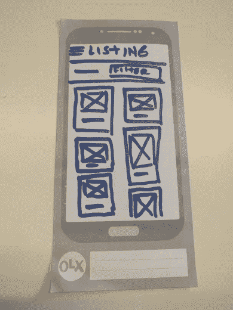
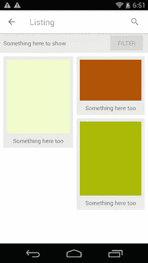

# 如何在(几乎)没有规范的情况下编写特性代码！

> 原文：<https://medium.com/hackernoon/how-to-code-features-with-almost-no-specs-eaaf810b77bf>

我敢打赌，至少曾经有人建议你在没有任何规范、屏幕定义或用例的情况下开始编码。如果这还没有发生在你身上，请做好准备，无规格项目即将到来。

应用行业的发展速度快得令人难以置信:有时截止日期变得更短，你的竞争对手发布了一个令人兴奋的功能，你的指标不太好，等等。所有这些都会导致你和其他人不得不以快速、集中和有组织的方式与时间赛跑。

我将与你分享当这种情况发生在我身上时我是如何做的，以及我是如何获得良好的体验、良好的工作氛围和优化我的时间的。

# 1.就核心功能和要求达成一致

每个人在开始做任何事情(编码、设计等)之前的主要目标是就核心特性和需求达成一致。一直都是。

为此，所有相关人员(工程师、业务分析师、设计师和产品负责人)必须聚在一起，定义项目的核心特性和需求。

这个约定永远不会变。这是项目的核心。如果发生了，应该立即通知所有相关人员，以免浪费时间。

这里的关键部分是开发人员可以开始工作，而产品团队的其他人可以开始完成细节、设计、次要需求等。

让我向你们展示一个用例，我将用它作为一个例子。

> 用例:“Mary 是一个想要查看汽车列表的用户”。

简单吧？

我和我想象中的利益相关者就此达成一致:

*   显示项目列表。
*   显示一些项目属性。
*   使用交错网格列表。
*   从列表中访问过滤器屏幕。
*   追踪一些事件。

# 2.忘记 UI 细节吧

细节是应用程序开发非常重要的一部分，但是当时间是一种稀缺资源时，你最好开始编写一个简化的 UI。

秘诀就是忘记细节。

您应该识别核心 UI 组件和交互。

例如:

*   纽扣。
*   输入字段。
*   要实现的自定义视图。
*   屏幕导航。

对于清单示例，我设想了这个简化的 UI:

Simplified UI sketched for the listing sample app.

基本上，我已经确定了以下内容:一个过滤器按钮，一个项目的网格视图，要显示的基本项目信息和一些关于列表的额外信息。

# 3.实施核心功能和要求

既然您已经有了核心功能和需求以及一个简化的 UI，那么您就可以开始对它和所有特定于您工作的技术任务进行编码了。

此时，您应该关注以下事项:

*   正在连接到后端服务。
*   编写简化的用户界面。
*   解决整合问题。
*   数据持久性。
*   你说吧。

回到示例，我将重点关注:从服务器检索项目，添加分页逻辑，实现交错网格列表，创建模型类，导航到过滤器屏幕，添加跟踪事件，等等。

所有这些导致了这个结果:

Partial implementation of the listing sample app.

# 4.实施设计和细节

你之前所有的努力都是有目的的，记得吗？来优化团队的时间！

*   您能够在(几乎)没有规格说明的情况下开始编码一个特性，并开始解决集成问题。
*   设计团队、[、](https://hackernoon.com/tagged/ux)和产品团队(还有你)有时间定义项目的所有细节。

所以，现在是时候实施你推迟的所有细节了。

这意味着:

*   添加动画和过渡。
*   添加辅助操作。
*   应用设计规格。
*   添加更多跟踪。
*   等等。

在我的案例中，结果是这样的:

End result of the listing sample app.

# 别忘了继续说

我的最后一个建议是:在整个过程中，与参与项目的每个人(设计师、产品负责人、业务分析师)保持沟通。

获取更新、验证、展示进度、征求和提供反馈，这些都有助于更好、更轻松地完成工作。

此外，当我实施项目的每个部分(设计、产品行为、跟踪)时，坐在适当的利益相关者附近有助于我减少错误、返工和挫折。

最后，每个人都想有一个杀手级的生活！

*注:*[*Dami Buonamico*](https://medium.com/u/a8a30f9faa8f?source=post_page-----eaaf810b77bf--------------------------------)*给我推荐了一篇 Mike Cohn 的文章，名为“* [*一个迭代的瀑布不是敏捷的*](https://www.mountaingoatsoftware.com/blog/an-iterative-waterfall-isnt-agile) *”，我鼓励你也去读一读。*

你喜欢你刚刚读的书吗？ *推荐这个故事(通过点击/轻按❤按钮)以便其他人可以阅读它！
你也可以在推特上反应:*[*@ santihollmann*](http://www.twitter.com/santihollmann)

> [黑客中午](http://bit.ly/Hackernoon)是黑客如何开始他们的下午。我们是 [@AMI](http://bit.ly/atAMIatAMI) 家庭的一员。我们现在[接受投稿](http://bit.ly/hackernoonsubmission)并乐意[讨论广告&赞助](mailto:partners@amipublications.com)机会。
> 
> 如果你喜欢这个故事，我们推荐你阅读我们的[最新科技故事](http://bit.ly/hackernoonlatestt)和[趋势科技故事](https://hackernoon.com/trending)。直到下一次，不要把世界的现实想当然！

