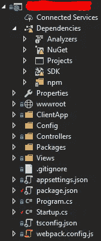
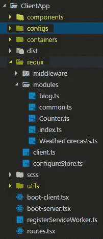
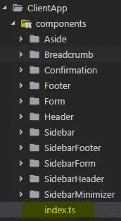

# 如何构造 Web 应用才能晚上睡得好？

> 原文：<https://medium.com/hackernoon/how-to-construct-the-web-application-to-sleep-well-at-night-302e7e7dc39f>


[Source](https://pixabay.com/en/woman-girl-bella-read-sleep-2197947/)

**你有多少次努力为你的前端项目**挑选合适的技术堆栈？**当我们在项目中第一次构建网络框架的时候有多难**？**你有多少个晚上睡不好觉**？如果你喜欢我，那么这篇文章只适合你。

如今，网络发展非常迅速。我们觉得如果我们不学习新的东西，那么从那天起我们就成了穴居人。有很多技术是用于 web 开发的，但是在这篇文章中，我只想关注 React 生态系统。因为我喜欢 React library 和它的生态系统，所以我花了很多时间对它进行了长期的研究和工作。

本系列的前一篇文章可以在[如何在 10 分钟内将干净的架构组织成模块化模式](https://hackernoon.com/applying-clean-architecture-on-web-application-with-modular-pattern-7b11f1b89011)中找到

所以让我们开始吧。

# 依赖性(框架和技术)

*   [JavaScript services](https://github.com/aspnet/JavaScriptServices)(React/Redux 模板)
*   [科瑞](https://github.com/mrholek/CoreUI-Free-Bootstrap-Admin-Template/tree/master/React_Full_Project)(带[反应堆](https://github.com/reactstrap/reactstrap)
*   [打字稿](https://github.com/Microsoft/TypeScript)
*   [网络包](https://github.com/webpack/webpack)
*   [纱](https://github.com/yarnpkg/yarn)
*   [萨斯](https://github.com/sass/sass)
*   其他: [react-router](https://github.com/ReactTraining/react-router) ， [react-table](https://github.com/react-tools/react-table) ， [redux-form](https://github.com/erikras/redux-form) ， [redux-observable](https://github.com/redux-observable/redux-observable) …

# SSR 和 CSR

SSR 代表**服务器端渲染**，CSR 代表**客户端渲染**。查看[上的文章服务器端渲染优于客户端渲染的优势](/walmartlabs/the-benefits-of-server-side-rendering-over-client-side-rendering-5d07ff2cefe8)，获得关于它的完整解释。我只提一点，因为我知道有人会问为什么我要用 JavaScriptServices 包来构建这篇文章的框架。很明显，我正在集中精力。NET Core，我看了一下其他技术，如 NodeJS、Java、PHP、Python 等，发现他们也有办法让服务器呈现脚本和相关的东西，如 style、HTML…所以在这一次，我将告诉你我们如何使用。网络世界。

这种方法的一些警告是:

*   这使得开发更加复杂，因为现在我们还需要查看服务器控制台的启动，一些情况使得调试更加复杂。
*   如果你预先转储了很多任务，那么第一次渲染会慢一点。

这种方法的好处是

*   这使得搜索引擎优化更好，更一致
*   最终用户会觉得内容出现得非常快，因为它已经在服务器端预先编写好了(如果我们缓存输出内容，那就更有意义了)

> 老实说，如果你想建立一个网站，非常重搜索引擎优化相关，那么你应该考虑一下。有人问我这样一个问题，如果他们只为内部用户构建 web 应用程序，那么他们是否也需要考虑使用 SSR 方法来构建 Web 应用程序？在这种情况下，我想建议他们在前端开发方面自然地采用 CSR 方法。但这还是取决于你，我让你选择。

敬请关注 Visual Studio 2017 中使项目采用 SSR 方法的一些简单步骤。首先，您需要选择为下图创建一个新的解决方案:


其次，它会将您带到以下屏幕:


最后一步，我们的项目结构如下



简单。不是吗？这只是为了任何人。NET 开发人员与一个基本水平:)让推出其他以下激动人心的事情

# 为什么使用 TypeScript？

在这一节中，我只想说明我使用 TypeScript 的原因不仅是因为它的好处，而且我的团队也熟悉它。让我们先分析一下它的优点:

*   我不再关心 ES6、ES7、ES8…的发布了
*   我不想在产品中出现一些与类型约束相关的幼稚异常
*   一个大的团队在一个大的基于代码的环境中工作，那么你需要有一种方法来避免常见的错误(类型系统错误)
*   一个熟悉 C#的后端团队，那么我们将受益于使用 TypeScript(来自静态类型语言的许多概念，如类、接口……)

除此之外，我们还与输入系统斗争了许多个夜晚，就像在这篇文章中，当我使用 react-table 时，我试图从 NPM 获得 [@types/react-table](http://twitter.com/types/react-table) 包，但是与最新的 react-table 包有很多冲突和不兼容。然后我才意识到，实际上，那个类型库并不属于 react-table 的作者(其他人维护它)。然后我决定在使用这个库时使用任何变量声明。

> 我不想在 TypeScript 和 Flow 之间进行比较，因为这里有很多偏见。还有一个原因，因为我正在处理 TypeScript，如果我谈论它将是不公平的。很多人在那里做比较。刚刚谷歌了一下**。**

## 在 TypeScript 中使用非类型库(react-table)


[Source](https://pixabay.com/en/dogs-pensive-reluctant-pet-sad-2195708/)

实际上，在做项目时，我们发现有时我们需要使用非类型库(在这个例子中是 react-table ),所以我们需要用 [ES 5.1](https://www.ecma-international.org/ecma-262/5.1/) 风格来声明它。让我们深入探讨一下如何让反应桌与他人合作愉快。我们需要将以下代码放入代码中:

```
const ReactTable: any = require('react-table').default;
```

现在，我们可以在这个文件中的任何地方使用可重复获取的实例。假设我们按照如下方式处理和绑定表的数据

```
const table = (
  <ReactTable
    columns={columns}
    manual
    data={this.props.blogs}
    className="-striped -highlight"
    defaultPageSize={10}
    showPageSizeOptions={false}
    filterable
    defaultSorted={[
      {
        id: 'title',
        desc: true
      }
    ]}
    pages={this.props.totalPages}
    loading={this.props.loading}
    onFetchData={this.fetchData}
    getTdProps={(state: any, rowInfo: any, column: any, instance: any) => {
      return {
        onClick: (event: any, handleOriginal: any) => {
          this.props.history.replace(`/admin/blog/${rowInfo.original.id}`);
          if (handleOriginal) {
            handleOriginal();
          }
        }
      };
    }}
    previousText={<i className="icon-arrow-left" />}
    nextText={<i className="icon-arrow-right" />}
  />
);
```

正如您在上面的代码中看到的，有几个地方声明了任意类型。这很公平。因为现在我们将**自己处理类型**。这很简单，但是当我开始编码的时候，我遇到了很多麻烦，要找到一种方法使非类型库和其他库很好地工作。希望这个建议能帮助像我这样的人摆脱前期阶段的麻烦。

# 鸭子打字


[Source](https://pixabay.com/en/geese-goose-family-family-goslings-2494952/)

> “如果它走路像鸭子，叫声像鸭子，那它一定是鸭子。”— [维基](https://en.wikipedia.org/wiki/Duck_typing)

为了组织良好的代码，我使用 duck typing 来绑定 web 应用程序中的 reducers、action 类型和 action。根据我的经验，我们需要在 redux 代码中反复处理 **{actionTypes，actions，reducer}** 。有了 [Erik Rasmussen](https://github.com/erikras) 提出的 [duck typing，我们可以避免大量杂乱的代码(功能代码)，并将它们转化为模块(业务代码)，这在将来修复 bug 方面也更有意义。让我们想象一下，你有一个 bug，你需要找出引起 bug 的地方，那么你只需要去一个地方(这里是特定的模块)读取代码并调试它。](https://github.com/erikras/ducks-modular-redux)

让我们看看如何组织下图中的代码:



*   **组件**文件夹包含所有转储组件
*   **Configs** 文件夹只包含配置信息，在这种情况下，它将文字对象导出到外部
*   **容器**文件夹包含所有智能组件
*   redux 文件夹包含 modules 文件夹，其中有几个 duck typing 这里那里管理 redux 副作用的中间件文件夹
*   **utils** 文件夹中包含了一些实用的代码，可以帮助完成一些复杂的工作，通常它是一个纯函数，这样就可以很容易地进行测试
*   **boot-client.tsx** 是一个引导客户端文件(因为我们跟进了 JavaScript 服务)
*   **boot-server.tsx** 是一个引导服务器文件(做一些工作，比如准备路由器，再次存储…因为我们使用 JavaScript 服务)
*   **routes.tsx** 包含系统中所有可能的路线

在任何 redux 应用程序中，我们都需要动作、动作创建者、存储、副作用等等。随后，我会告诉你我如何用鸭子打字。

首先，我们添加我们想要使用的结构类型。假设博客类型如下

```
export type Blog = {
  id: string;
  title: string;
  description?: string;
  theme?: number;
  image?: string;
  postsPerPage: number;
  daysToComment: number;
  moderateComments: boolean;
};
```

然后，我们添加 BlogState 接口

```
export interface BlogState {
  loading: boolean;
  loaded: boolean;
  addLoading: boolean;
  ids: any;
  blogByIds: any;
  blogSelected: Blog | null;
  themes: Theme[];
  error: any;
  page: number;
  totalPages: number;
}
```

> 原谅我这里的一些**任何**类型声明:(

我们需要将几个动作类型声明为

```
// Load blogs
const LOAD_BLOGS = 'LOAD_BLOGS';
const LOAD_BLOGS_SUCCESSED = 'LOAD_BLOGS_SUCCESSED';
const LOAD_BLOGS_FAILED = 'LOAD_BLOGS_FAILED';// The rest of the source code in my GitHub
```

他们每个人的行动

```
interface LoadBlogAction extends Action {
  type: typeof LOAD_BLOGS;
  page: number;
}interface LoadBlogSuccessedAction extends Action {
  type: typeof LOAD_BLOGS_SUCCESSED;
  items: any;
  totalPages: number;
  page: number;
}interface LoadBlogFailedAction {
  type: typeof LOAD_BLOGS_FAILED;
  error: any;
}// The rest of the source code in my GitHub
...
```

然后，我们定义了减速器的知识

```
export type KnownAction =
 | LoadBlogAction
 | LoadBlogSuccessedAction
 | LoadBlogFailedAction
 // The rest of the source code in my GitHub
;
```

一些史诗(在这种情况下是可重复观察的)来处理副作用

```
export const blogEpics: any = [
  (action$: ActionsObservable<LoadBlogAction>): Observable<Action> => {
    return action$
      .ofType(LOAD_BLOGS)
      .debounceTime(100)
      .switchMap(action =>
        blogRequest
          .loadBlogs(action.page)
          .map(result => {
            return actionCreators.loadBlogsByPageSuccessed(result.response);
          })
          .catch(error =>
            Observable.of(actionCreators.loadBlogsByPageFailed(error))
          )
      );
  } // The rest of the source code in my GitHub.
];
```

在这篇文章中，我不会解释我用 redux-observable 做了什么。查看[使用 redux-observable 处理 Redux](/dailyjs/using-redux-observable-to-handle-asynchronous-logic-in-redux-d49194742522) 中的异步逻辑，了解您需要的更多信息。

我们将他们的操作创建者定义如下:

```
export const actionCreators = {
  loadBlogsByPage: (page: number): Action =>
    <LoadBlogAction>{ type: LOAD_BLOGS, page }, loadBlogsByPageSuccessed: (data: any) =>
    <LoadBlogSuccessedAction>{ type: LOAD_BLOGS_SUCCESSED, ...data     }, loadBlogsByPageFailed: (error: any) =>
    <LoadBlogFailedAction>{ type: LOAD_BLOGS_FAILED, error }, // The rest of the source code in my GitHub
};
```

最后一步，我们为缩减器定义以下代码

```
export const reducer: Reducer<BlogState> = (
  state: BlogState,
  action: KnownAction
) => {
  switch (action.type) {
    case LOAD_BLOGS:
      return {
        ...state,
        loading: true
      }; case LOAD_BLOGS_SUCCESSED:
      console.log(action);
      return {
        ...state,
        ids: action.items.map((blog: Blog) => blog.id),
        blogByIds: action.items.reduce((obj: any, blog: Blog) => {
          obj[blog.id] = blog;
          return obj;
        }, {}),
        loaded: true,
        loading: false,
        page: action.page || 0,
        totalPages: action.totalPages,
        blogSelected: null
      }; case LOAD_BLOGS_FAILED:
      return {
        ...state,
        ids: [],
        blogByIds: {},
        error: action.error,
        loaded: true,
        loading: false,
        page: 0,
        blogSelected: null
      }; // The rest of the source code in my GitHub default:
      const exhaustiveCheck: never = action;
      if (typeof exhaustiveCheck != 'undefined') break;
  }return (
    state || {
      loading: true,
      loaded: false,
      redirectTo: '/',
      ids: [],
      blogByIds: [],
      blogSelected: null,
      themes: [
        {
          value: 1,
          label: 'Default'
        }
      ],
      error: null,
      page: 0,
      totalPages: 0
    }
  );
};
```

就是这样。并且应该在一个文件(blog.ts)中。

> **有时候，觉得这个文件太长了。你对有效组织有什么建议吗？欢迎在最后评论，我很乐意讨论它。**

# 几个点或太多点

你的代码有没有遇到过以下问题？

```
import {  ComponentA,  ComponentB,  ComponentC,  ComponentE} from '../../../../components';
```

它会把你的代码变成混乱臃肿的结构。如果你觉得在这个问题上很烦，我会帮你做得更好。

第一步，将 index.js 文件放在每个根文件夹结构中，收集相关的东西，如下图所示:



在这种情况下，里面的代码是

```
export { default as Aside } from './Aside/Aside';
export { default as Breadcrumb } from './Breadcrumb/Breadcrumb';
export { default as Footer } from './Footer/Footer';
export { default as Header } from './Header/Header';
export { default as Sidebar } from './Sidebar/Sidebar';
export { renderTextBoxField as TextBoxField, renderNumberField as NumberField, renderSingleSelectField as SingleSelectField } from './Form/Input';
export { default as CheckboxField } from './Form/Checkbox';
export { confirmationBox as ConfirmationBox } from './Confirmation/ConfirmationBox';
```

第二步，我们需要让 Webpack config 也知道它

```
resolve: {
  extensions: [".js", ".jsx", ".ts", ".tsx"],
  alias: {
    OurComponents: path.resolve(__dirname, "./ClientApp/components/"),
    OurModules: path.resolve(__dirname, "./ClientApp/redux/modules/"),
    OurConfigs: path.resolve(__dirname, "./ClientApp/configs/"),
    OurUtils: path.resolve(__dirname, "./ClientApp/utils/")
  }
}
```

现在 Webpack 将为您的代码做别名，但我们还需要让 TypeScript 解释器知道这一点:)。在 tsconfig.json 文件中放入以下代码

```
"paths": {
  "OurComponents": ["./ClientApp/components"],
  "OurComponents/*": ["./ClientApp/components/*"],
  "OurModules": ["./ClientApp/redux/modules"],
  "OurModules/*": ["./ClientApp/redux/modules/*"],
  "OurConfigs": ["./ClientApp/configs"],
  "OurConfigs/*": ["./ClientApp/configs/*"],
  "OurUtils": ["./ClientApp/utils"],
  "OurUtils/*": ["./ClientApp/utils/*"]
}
```

就是这样。让我们看看现在引用我们的组件有多容易

```
import { Breadcrumb, Sidebar, Header, Footer } from 'OurComponents';
```

我真的很喜欢这种方式。你呢？


[Source](https://pixabay.com/en/baby-happy-clap-smile-fun-2320701/)

# 概述

在本文中，我们将介绍几种更有效地组织代码的方法。我们分析了我们**选择 SSR 方法**的一些原因，然后我们**喜欢用 TypeScript 进行代码打字**的原因。随后，我们**以冗余的方式讨论鸭分型**。最后，我们给你一个在代码中操作文件结构时避免过多点的提示。再者，我们其实越来越想分享，只是想让你建议一下。我知道我有很多东西要学，所以请随意评论如下。我非常渴望收到你的来信。

# 资源

本文的源代码可以在我的 [GitHub](https://github.com/thangchung/blog-core) 找到

# 附加阅读

*   [https://medium . com/walmartlabs/the-benefits-of-server-side-rendering-over-client-side-rendering-5d 07 ff 2 EFE 8](/walmartlabs/the-benefits-of-server-side-rendering-over-client-side-rendering-5d07ff2cefe8)
*   [https://medium . com/@ Dan _ abra mov/smart-and-dumb-components-7 ca 2 f 9 a 7 c 7d 0](/@dan_abramov/smart-and-dumb-components-7ca2f9a7c7d0)
*   [https://github.com/erikras/ducks-modular-redux](https://github.com/erikras/ducks-modular-redux)
*   [https://hacker noon . com/the-100-correct-way-to-structure-a-react-app-or-why-there-that-this-3ede 534 ef1ed](https://hackernoon.com/the-100-correct-way-to-structure-a-react-app-or-why-theres-no-such-thing-3ede534ef1ed?source=bookmarks---------18----------------)
*   [https://medium . com/daily js/using-redux-observable-to-handle-asynchronous-logic-in-redux-d 49194742522](/dailyjs/using-redux-observable-to-handle-asynchronous-logic-in-redux-d49194742522)
*   [https://hacker noon . com/applying-clean-architecture-on-web-application-with-modular-pattern-7b 11 f1 b 89011](https://hackernoon.com/applying-clean-architecture-on-web-application-with-modular-pattern-7b11f1b89011)

感谢阅读！如果你喜欢这篇文章，一定要点击👏所以**下面的符号别人**会**看**吧。