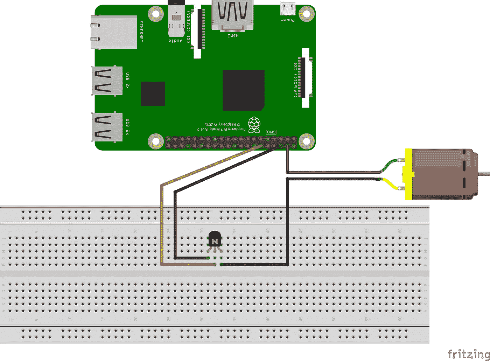
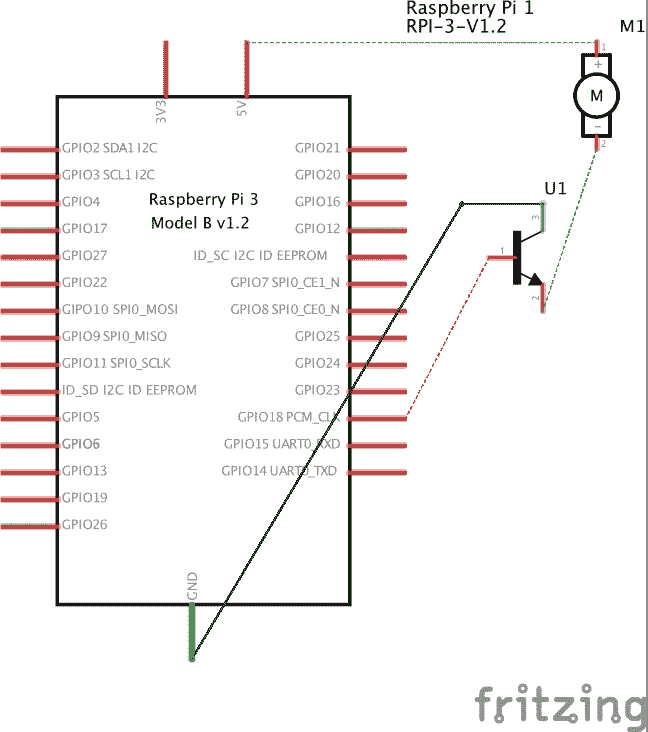

# 如何控制风扇来冷却你的 RaspBerryPi 的 CPU

> 原文：<https://medium.com/hackernoon/how-to-control-a-fan-to-cool-the-cpu-of-your-raspberrypi-3313b6e7f92c>

遵循这个**教程**你将能够**组装一个风扇**使用晶体管将 5V 电流引入风扇的马达。然后，您将编写一个 Python 脚本，让**在 CPU 达到某个温度**时激活风扇。最后，您将能够在启动时自动运行脚本。


## 范围

我用最新的 RaspBerryPi 3 做很多事情。Plex 就是其中之一。RPI3 在索引我所有的媒体文件时速度非常快，但在代码转换方面却很吃力。mkv 文件:它运行良好，但电影经常中断，这不是一个很好的用户体验。幸运的是，Plex 有内置的转换器，可以将免费的. mp4 转换为浏览器流。为此，在后台，CPU 达到 380%,温度大大超过 80C。所以我想:是时候冷却一下了。

## 硬件设置

首先:我已经在亚马逊上买了这个风扇。我见过的所有风扇都是 DC 5V，最大 200 毫安:所以有功功率是 1W。然而，pi 上的 GPIO 引脚只能提供 3.3V，每个引脚最大 16mA:我们不能——也不应该——用引脚的功率给电机供电。休斯顿，我们有一个问题(？).

我们需要的是某种类型的**继电器**，它可以通过标准引脚激活，以全速将电流引入我们的风扇。认识一下**晶体管**。更具体地，一个 **NPN 晶体管** (S8050)。最终设置如下(风扇**表示为 DC 电机**，这是**而不是**真正的 DC 电机):



The Breadboard



The Schematic

> 永远不要把真正的 DC 汽车连接到你的板上:你肯定会损坏它。


My finalhacky solution

一旦一切都设置好了，就是软件部分的时间了。

## 软件设置

在自定义位置(我的位置在~/Development/run-fan.py)创建一个名为“run-fan.py”的文件，并复制粘贴以下代码:

```
#!/usr/bin/env python3
# Author: Edoardo Paolo Scalafiotti <edoardo849@gmail.com>import os
from time import sleep
import signal
import sys
import RPi.GPIO as GPIOpin = 18 # The pin ID, edit here to change it
maxTMP = 40 # The maximum temperature in Celsius after which we trigger the fandef setup():
    GPIO.setmode(GPIO.BCM)
    GPIO.setup(pin, GPIO.OUT)
    GPIO.setwarnings(False)
    return()def getCPUtemperature():
    res = os.popen(‘vcgencmd measure_temp’).readline()
    temp =(res.replace(“temp=”,””).replace(“’C\n”,””))
    #print(“temp is {0}”.format(temp)) #Uncomment here for testing
    return temp
def fanON():
    setPin(True)
    return()
def fanOFF():
    setPin(False)
    return()
def getTEMP():
    CPU_temp = float(getCPUtemperature())
    if CPU_temp>maxTMP:
        fanON()
    else:
        fanOFF()
    return()
def setPin(mode): # A little redundant function but useful if you want to add logging
    GPIO.output(pin, mode)
    return()try:
    setup() 
    while True:
        getTEMP()
    sleep(5) # Read the temperature every 5 sec, increase or decrease this limit if you want
except KeyboardInterrupt: # trap a CTRL+C keyboard interrupt 
    GPIO.cleanup() # resets all GPIO ports used by this program
```

好了，现在让我们从控制台测试它:

```
python run-fan.py
```

如果一切都设置正确，你应该看到你的风扇旋转和停止相应的 CPU 温度。酷毙了。

## 还有一件事…

显然，我们不想每次重启 pi 时都手动运行程序，不是吗？我们希望所有东西都在启动时加载，对吗？然后让我们在/etc/init.d 中创建一个引导脚本，简称为“fan”:

```
nano /etc/init.d/fan
```

…并在其中复制粘贴以下代码:

```
#!/bin/sh
### BEGIN INIT INFO
# Provides: dnscheck
# Required-Start: $remote_fs $syslog
# Required-Stop: $remote_fs $syslog
# Short-Description: Start fan script at boot time
# Description: Enable service provided by daemon.
### END INIT INFOpython /home/pi/Development/run-fan.py
```

…然后通过运行以下命令创建符号链接:

```
update-rc.d /etc/init.d/dnscheck defaults
```

…下次您重新启动 pi 时，您的 fan 脚本将自动运行。

[](http://bit.ly/HackernoonFB)[](https://goo.gl/k7XYbx)[](https://goo.gl/4ofytp)

> [黑客中午](http://bit.ly/Hackernoon)是黑客如何开始他们的下午。我们是 [@AMI](http://bit.ly/atAMIatAMI) 家庭的一员。我们现在[接受投稿](http://bit.ly/hackernoonsubmission)，并乐意[讨论广告&赞助](mailto:partners@amipublications.com)机会。
> 
> 如果你喜欢这个故事，我们推荐你阅读我们的[最新科技故事](http://bit.ly/hackernoonlatestt)和[趋势科技故事](https://hackernoon.com/trending)。直到下一次，不要把世界的现实想当然！

[](https://goo.gl/Ahtev1)