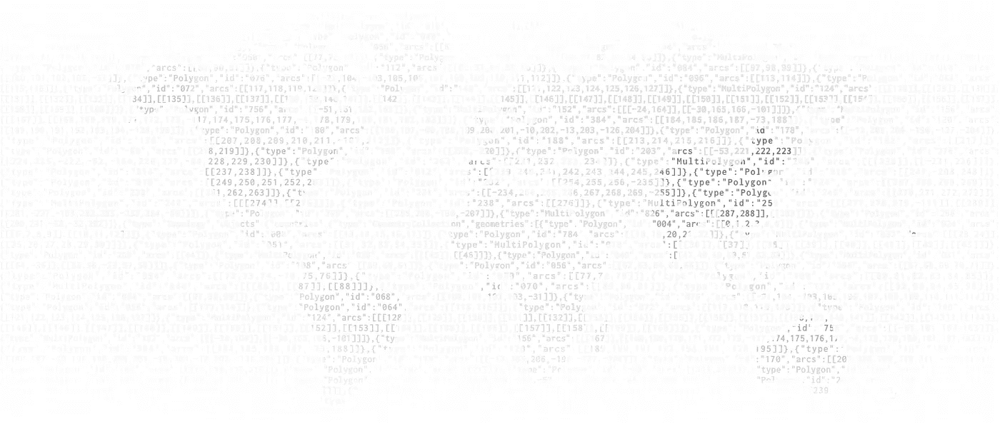
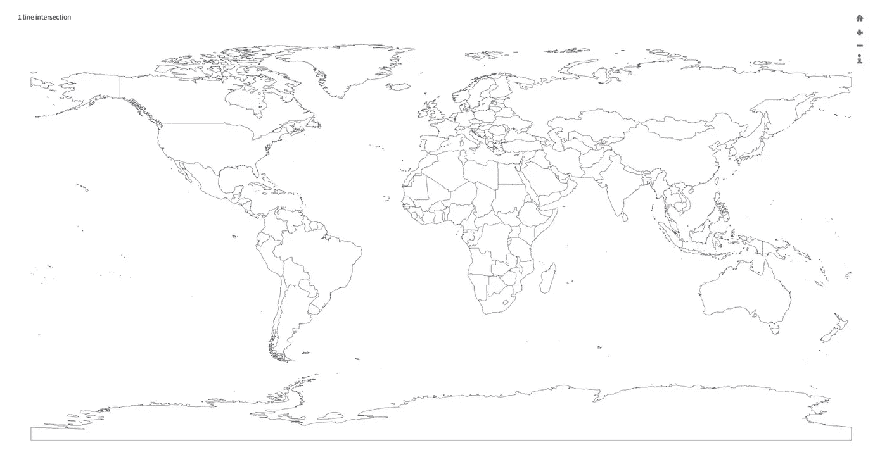

# 如何转换和准备 TopoJSON 文件以使用 d3 进行交互式制图

> 原文：<https://medium.com/hackernoon/how-to-convert-and-prepare-topojson-files-for-interactive-mapping-with-d3-499cf0ced5f>

## 本教程将向您展示如何将公开可用的 shapefiles 转换为 [TopoJSON](https://github.com/topojson/topojson) 来创建与 [d3](https://github.com/d3/d3) / [d3-geo](https://github.com/d3/d3-geo) 的交互式地图。

## 注意:我已经把我的博客搬到了 zcreativelabs.com/blog/。你可以在那里找到这篇文章的更新版本。以后的文章只会在那里发表。请订阅 z creative labs 时事通讯，以便在您的收件箱中收到我的最新文章。

我将向您展示如何在不使用[命令](https://hackernoon.com/tagged/command)的情况下做到这一点，这样您就可以尽快开始尝试 d3。如果您对以更高级的方式使用 shapefiles 和 TopoJSON 感兴趣，我建议您看看 Mike Bostock 最近关于命令行制图的多部分教程。

# 世界地图

你可能想得到的第一张地图是世界地图。这方面的一个很好的资源是 [Natural Earth](http://www.naturalearthdata.com/downloads) ，这是一个 1:10 米、1:50 米和 1:1 亿比例的公共领域地图数据集。对于每个比例(细节层次)，Natural Earth 提供了文化、物理和光栅地图。

## 步骤 1-获取地图

根据详细程度(1:10 米、1:50 米和 1:100 米)和类别(文化、自然和栅格)选择您喜欢的地图。当构建网络地图时，细节层次很重要，因为它会显著影响文件大小和渲染速度，尤其是用 [SVG](https://en.wikipedia.org/wiki/Scalable_Vector_Graphics) 渲染地图时。

基于国家数据( [GDP](http://data.worldbank.org/data-catalog/GDP-ranking-table) 、[人口](http://data.worldbank.org/indicator/SP.POP.TOTL)等)创建世界地图。)你应该选择文化载体。在接下来的步骤中，我将基于 [1:50m cultural vectors Admin 0 国家地图](http://www.naturalearthdata.com/downloads/50m-cultural-vectors/)创建一个 TopoJSON 地图。

## **第二步——选择使用什么**

下载的文件夹将包含许多具有不同扩展名的文件，例如。dbf，。prj，。要将 shapefile 转换为 TopoJSON，您需要。shp 文件和. dbf 文件(如果有的话)。

## 步骤 3 — **将形状文件导入 mapshaper**

要将 shapefiles 转换为 TopoJSON，您可以使用 [mapshaper](http://mapshaper.org/) ，这是一个用于形状简化和从一种 geo 格式转换为另一种格式的工具。它支持 Shapefiles、GeoJSON 和 TopoJSON 格式。虽然 mapshaper 可以在命令行上使用，但在线工具也为简化过程提供了一个很好的可视化界面。

导入以结尾的文件。shp 和。dbf 到 mapshaper。确保选中了“检测线交点”选项。还可以选中“捕捉顶点”来修复拓扑错误。

Once you import the .shp and .dbf files into mapshaper you should see a preview of the map.

## 步骤 4 — **可选步骤:简化您的地图**

“简化”选项允许您通过拖动滑块来调整细节级别。简化得越多，最终地图的精确度和细节就越少。简化的地图会更小，通常简化地图(有时甚至 50%)不会导致任何可见的细节损失。

## 步骤 5 — **导出您的 TopoJSON 地图**

对地图的详细程度感到满意后，将地图导出为 TopoJSON 文件。你完了！

# 国家级和较低行政级别地图

世界地图是很棒的，但是有时你想要可视化一个特定地区、国家、甚至一个更具体的行政区域的更详细的视图。如果你在做非商业工作，一个很好的资源就是全球管理区域网站。

该网站提供多种格式的地图。从[这里](http://gadm.org/country)下载文件时，确保选择 shapefile 作为格式。

解压缩下载的文件后，您将拥有多组 shape file(admin 0、admin1、admin2 等)。这些代表了不同的[行政区划](https://en.wikipedia.org/wiki/Administrative_division)。以美国为例，admin0 表示国家，admin1 表示各个州，admin2 表示县，等等。

一旦你决定选择哪个关卡，你可以重复步骤 2-5，就像处理世界地图一样。

如果你对从哪里获得 shapefiles 的其他资源有任何建议，请在下面留言，我会尽量把它们写进文章里。

感谢您的阅读，如果有任何问题或意见，请在下面回复。快乐映射！

> [黑客中午](http://bit.ly/Hackernoon)是黑客如何开始他们的下午。我们是 [@AMI](http://bit.ly/atAMIatAMI) 家庭的一员。我们现在[接受投稿](http://bit.ly/hackernoonsubmission)并乐意[讨论广告&赞助](mailto:partners@amipublications.com)机会。
> 
> 如果你喜欢这个故事，我们推荐你阅读我们的[最新科技故事](http://bit.ly/hackernoonlatestt)和[趋势科技故事](https://hackernoon.com/trending)。直到下一次，不要把世界的现实想当然！

