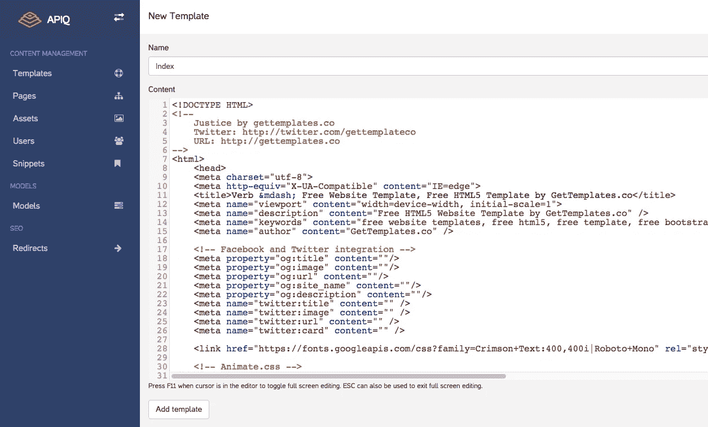
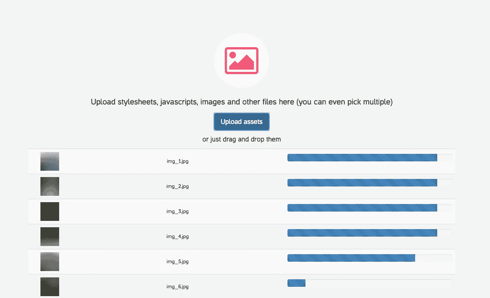
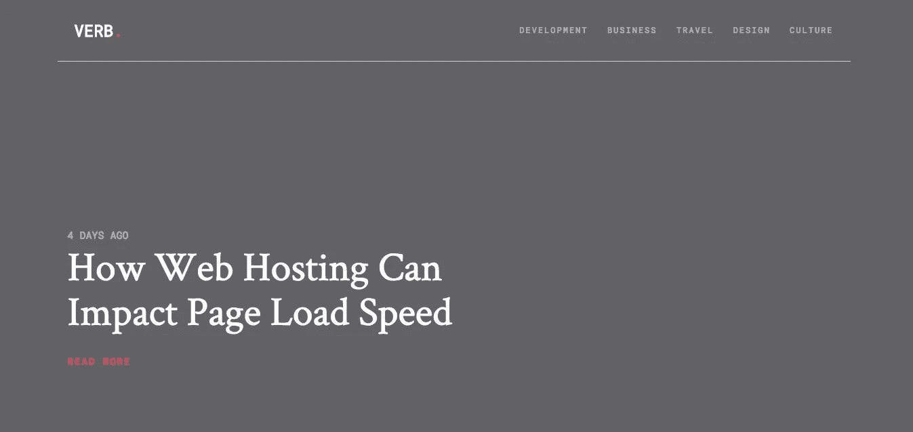
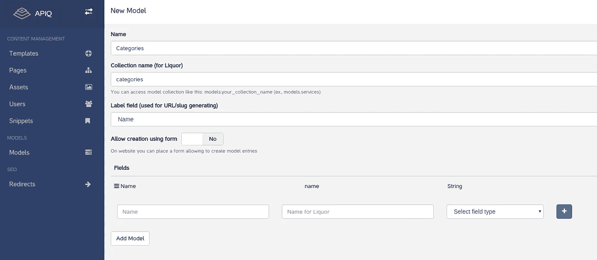
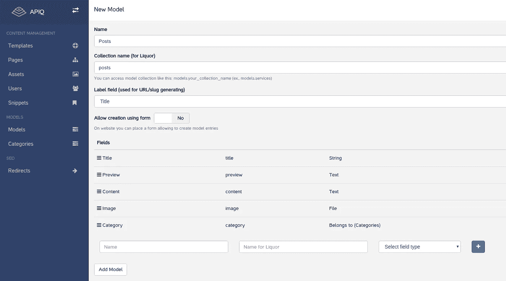
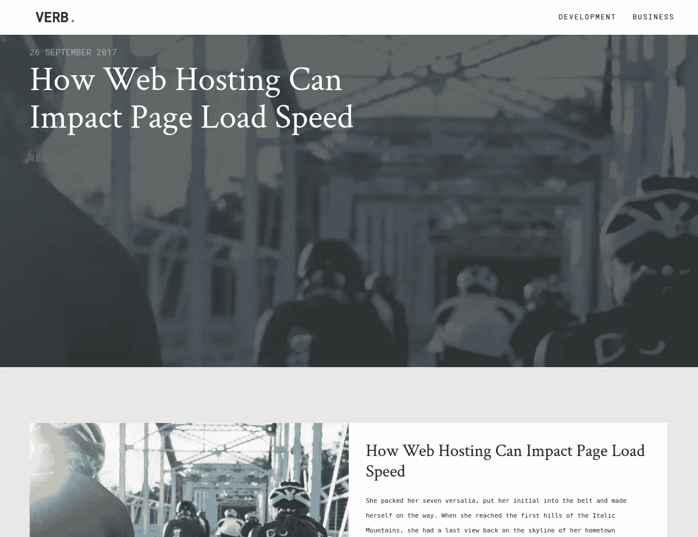
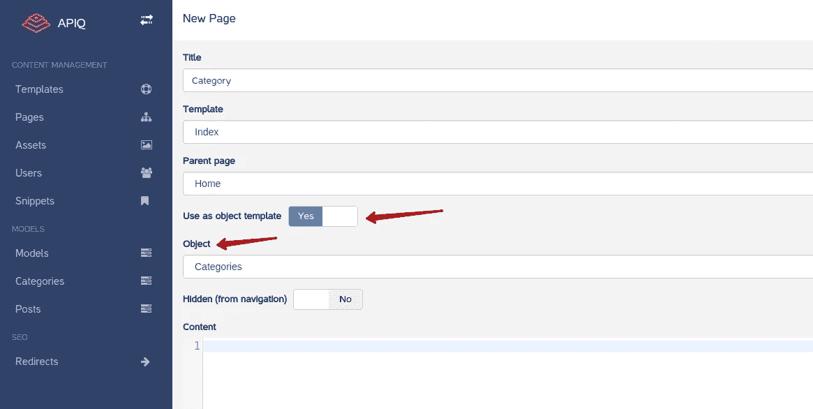

# 如何用 APIQ CMS 创建博客

> 原文：<https://medium.com/hackernoon/how-to-create-a-blog-with-apiq-cms-e6ccfc5f5e63>


大家都知道博客是内容营销策略的第一项。

有很多地方你可以建立你的博客并开始写作。但是如果您需要一些定制的内容模型来写博客呢？那么您可能应该选择自托管或云解决方案，在构建您的特定内容模型时提供更多的灵活性。

今天我将向你展示如何使用 APIQ CMS 制作博客。让我们跳过 [APIQ](https://hackernoon.com/tagged/apiq) 安装步骤，并考虑我们已经有空白 [CMS](https://hackernoon.com/tagged/cms) 安装。通过以下步骤，您将获得功能齐全博客。

# 选择 HTML 模板

首先，你需要下载 HTML 或者由 HTML 编码器从头开始准备。我挑了[这个](https://freehtml5.co/verb-free-html5-bootstrap-template-for-blog-websites/):

# 创建第一个模板

好的，在下载的模板档案中我有`index.html`。我打算用它作为博客索引页的模板。只需粘贴 html 内容，给模板一个名称，然后点击“添加模板”。



# 上传资产

现在，我们需要上传下载模板中的所有资产(在“资产”部分下)，即图像、样式表和 javascripts。您可以一次选择多个。对于我的模板，我首先上传了`js`文件夹的内容，然后是`fonts`、`images`和`css`。



现在，我们需要通过从“资产”部分插入正确的 URL 来修复字体 URL(如`url("../fonts/icomoon/icomoon.eot")`)或样式表中的其他 URL。

接下来，让我们在模板的内容中找到一个应该注入页面内容的地方，并在那里插入特殊的 like 指令``。我将把它插入到`<div id="gtco-main"><div class="container">`之后，并删除所有内容，直到结束标签。

# 创建索引页面

现在让我们创建一个索引页面，它使用刚刚创建的模板，并将我们之前从模板中剪切的内容粘贴到那里。一旦我们做好了这些，你应该会在网站的根目录下看到这样的内容:



# 创建第一个模型

接下来，我将通过引入一些模型来使索引页面动态化。首先，我想主菜单(`Develop`，`Business`等)。)来代表博客类别。让我们在 APIQ `Models`部分下创建`Category`模型。



现在让我们将类别输出为菜单片段。我将模板中的`<ul>...</ul>`提取到带有“菜单”名称和“菜单”标签的新代码片段中，并将该代码片段包含在模板中:

```

```

最后，我修改了代码片段，如下所示(`name`是我添加到`Category`模型中的唯一属性，`permalink`是内置属性):

```
<ul>
  
    <li><a href="/{{ category.permalink }}">{{ category.name }}</a></li>
  
</ul>
```

# 创建帖子模型

好吧，我可以添加类别，并有基于它们的动态菜单。让我们添加第二个模型——`Post`——并建立它和`Category`模型之间的关系。



在这之后，我添加了一个属于“发展”类别的帖子。现在我将把最新的帖子显示为宽横幅(按照模板设计的建议)。我像这样更新了模板的内容(注意我是如何获取最近的帖子的):

```

<header id="gtco-header" class="gtco-cover" role="banner" style="background-image:url({{ recent_post.image }});" data-stellar-background-ratio="0.5">
  <div class="overlay"></div>
  <div class="container">
    <div class="row">
      <div class="col-md-7 text-left">
        <div class="display-t">
          <div class="display-tc animate-box" data-animate-effect="fadeInUp">
            <span class="date-post">{{ recent_post.created_at | strftime format: '%d %B %Y' }}</span>
            <h1 class="mb30">
              <a href="/{{ recent_post.permalink }}">{{ recent_post.title }}</a>
            </h1>
            <p><a href="/{{ recent_post.permalink }}" class="text-link">Read More</a></p>
          </div>
        </div>
      </div>
    </div>
  </div>
</header>
```

现在，在这个标题下面，我想列出所有的帖子。这是用于此目的的索引页面的唯一内容:

```
<div class="row row-pb-md">
  <div class="col-md-12">
    <ul id="gtco-post-list">
      
        <li class="full entry animate-box" data-animate-effect="fadeIn">
          <a href="/{{ post.permalink }}">
            <div class="entry-img" style="background-image: url({{ post.image }})"></div>
            <div class="entry-desc">
              <h3>{{ post.title }}</h3>
              {{ post.preview }}
            </div>
          </a>
          <a href="/{{ post.category.permalink }}" class="post-meta">{{ post.category.name }}  <span class="date-posted">{{ post.created_at | strftime format: '%d %B %Y' }}</span></a>
        </li>
      
    </ul>
  </div>
</div>
```



索引页面应该是这样的(是不是很酷？).

# 为类别和帖子模型创建模板页面

这是我们的最后一步:我们希望有类别页和帖子页，这样我们的`permalink`属性将开始工作，并指向具体的类别或帖子。让我们创建这两个页面作为索引页面的子页面。这里最棘手的事情是启用`Use as object template`属性并选择可表示的对象。



不要忘记在相应的页面中放置一些显示类别和产品的 html。在这些页面中，您可以通过`item`对象访问当前对象。例如，您可以像这样输出帖子的内容(在帖子页面上):

```
<h1>{{ item.title }}</h1>
{{ item.content }}
```

在类别页面上还有一个获取当前类别帖子的技巧(因为我使用了`belongs to`字段):

```


...
```

就这样——现在我有了完全动态的、可工作的类别页面和产品页面！这就是本教程的全部内容:我们有非常基本的博客功能，还有很多进一步改进的可能性。例如，您可以将`Published`字段添加到`Post`模型中，默认情况下只列出发布的文章，或者引入文章标记。你的想象力是唯一的极限，所以就去尝试吧；-)

你可以在[http://patient-forest-605 . app . apiq . io](http://patient-forest-605.app.apiq.io/)找到我的最终结果

*如果你喜欢这个帖子，请点击* ✋ *来传播这个消息。*

*这篇* [*文章*](https://www.apiq.io/2017/09/26/how-to-create-a-blog-with-apiq-cms/) *最初发表在 APIQ CMS 博客上。*