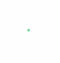
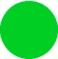
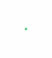
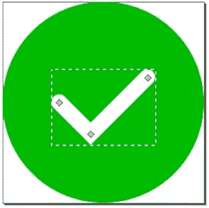
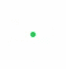

# 如何用 anime-js 制作对勾动画？

> 原文：<https://medium.com/hackernoon/how-to-create-a-check-mark-animation-with-anime-js-86781951a67>

如果在适当的环境下使用，动画会很棒。它们创造了迷人的时刻，当正确使用时，它们有助于增加用户对 UI 的理解。使用动画曾经是一个大禁忌，现在已经或多或少成为构建新网页的标准。突出显示特定的状态转换、变化以及对特定的动作给出反馈通常是使用动画的好地方。

使用 web 技术创建动画可能会很棘手，因为有很多需要考虑的事情和很多方法来创建它们。在这篇文章中，我将使用 [anime.js](http://animejs.com/) (アニメ，日语片假名中的 a-ni-me，指的是动画和其他东西)，这是一个由朱利安·卡尼尔编写的伟大且非常通用的 [Javascript](https://hackernoon.com/tagged/javascript) [动画](https://hackernoon.com/tagged/animation)库。它很容易让你以一种非常简洁的方式创建和管理动画。有很多 javascript 动画库，我强烈建议你去寻找一个符合你需求的。我越来越喜欢 anime.js，因为它有非常紧凑的语法，同时又非常灵活。使用 anime.js，我将创建一个简单而扁平的复选标记动画，对于用户完成一个动作的情况非常有用，从 UX 的角度来看，我们想要突出显示这个动作。让我们从最终结果开始，并把它分解成要单独讨论的步骤。以下是完整的动画:



动画是简单的，流畅的，它基本上由一个圆圈和一个复选标记，一个白色的笔画组成。为了创建这样一个圆，我通常会使用 CSS 边界半径规则。边界半径比使用 SVG 更方便(代码更少)。然而，在这种情况下，由于我稍后要添加一个复选标记作为笔画，我也可以在 SVG 中画圆。顺便说一下，SVG 在 2017 年变得越来越受欢迎，这也难怪。通过网络发送时，它们很小，通常压缩到原始大小的几分之一，无论缩放级别或缩放与否，它们总是(几乎)清晰的。下面是 SVG 内联样式的代码，看起来像是画了一个实心圆:

```
<svg class="checkmark"
     ae jp" href="http://www.w3.org/2000/svg" rel="noopener ugc nofollow" target="_blank">http://www.w3.org/2000/svg"
     width="32"
     height="32"
     viewBox="0 0 32 32">
  <circle class="circle"
          cx="16"
          cy="16"
          r="16"
          fill="#0c3"/>
</svg>
```

这非常简单，一个绿色(#0c3)圆围绕其中心点(16，16)画出，半径(r)为 16 像素。这个圆是在一个从(0，0)到(32，32)的视图(视图框)中的一个 32 乘 32 像素的 svg 节点内绘制的。以下是渲染结果:



为了让事情发生，让我们添加第一个动画步骤，将圆形从无到有缩放到最大尺寸。为此，我们需要两样东西:1。对圆圈的引用，在本例中，它是类名，而 2。一个 *anime.js* 时间轴。我将在这里使用一个时间线，因为我稍后要添加更多的动画步骤。你实际上不需要使用时间线，因为你可以直接创建一个动画动画调用动画构造函数。创建好的动画的一个关键规则是使用延迟和偏移的原则。这是你想要展开你的动画的不同部分，使整个事情变得更加流畅的地方。把整件事想象成美丽图案的多米诺骨牌。砖块不会一下子掉下来，而是一块一块地掉下来。这就是时间线派上用场的地方，因为它让我可以更精细地控制动画的不同部分应该何时发生。缩放外部 SVG 节点也将缩放其内部的所有内容，这反过来将增加效果，因为笔划也将被放大。下面是进行缩放的 javascript 代码片段:

```
var checkTimeline = anime.timeline({ autoplay: true, direction: 'alternate', loop: true });checkTimeline
  .add({
    targets: '.checkmark',
    scale: [
      { value: [0, 1], duration: 600, easing: 'easeOutQuad' }
    ]
  })
```

这里的关键是目标(*目标*键)的获取，SVG 节点(*)。勾号*)和动作(*缩放*键)缩放圆 600ms。这基本上就是所有魔法的来源。循环、交替和自动播放是适合本文的配置，也适合制作动画。在真实的 UI 场景中，它会运行一次就结束了。

以下是目前为止的结果:



选择持续时间本身也是一种艺术。一方面，你不想让用户等待，因为这会降低整体体验，让用户界面感觉迟钝。另一方面，你不希望事情发生得太快，因为你可能会放松或分散用户的注意力。在这个例子中，我使用了一个更长的周期(略小于一秒)。这段时间可能会有点太长，让用户在一个已发布的版本中等待。在开发动画时这很好，但是在生产中你会希望你的用户界面很快。这里的经验法则是从慢开始，当你调整好所有不同的部分后，再提高整个动画的速度。材质设计指南在这里有一个关于动画速度的很好的章节:[持续时间&缓和](https://material.io/guidelines/motion/duration-easing.html#)

在动画上使用放松已经成为 2017 年的标准，因为它使动画更加真实和令人愉快。为不同种类的动画尝试不同种类的季节是值得的。选择正确的缓动取决于对象、它的形状、移动的距离、它的使用环境等等。标准的 CSS 缓动使用所谓的“进”和“出”缓动，开始时很慢，大部分变化集中在中间，最后又慢下来。在这个动画中，我希望对象在放大时只强调它的减速，这样更适合使用渐出(没有“入”)缓动。

现在开始划水！与圆相比，笔画要复杂得多，因为它们通常由 SVG 路径构成。这些又是由 SVG *d* 属性定义的，乍一看，可能像加密或乱码数据。 *d* 属性由一组规则组成，这里更详细地描述:[d 属性](https://developer.mozilla.org/en-US/docs/Web/SVG/Attribute/d)。我几乎总是使用编辑器 Inkscape 来绘制这些形状，因为它给了我更多的自由度来快速更改 SVG。在这种情况下，我们可以用一条简单的由三个点组成的白线。我也用 2.5px 的 linecap 来弄圆角。

这里有一句关于设计的话:一定要坚持你的设计原则，并且在整个项目中保持一致。一致性是最重要和最深刻的设计原则之一。如果你在你的用户界面中使用圆角，那么在你的动画中也要这样做。如果没有，那就用方形的角或者其他的。颜色(你的调色板)、间距等也是如此。



Using Inkscape to create the stroke

在代码中:

```
<path class="check"
      d="M9 16l5 5 9-9"
      fill="none"
      stroke="#fff"
      stroke-width="2.5"
      stroke-linecap="round">
```

让我们再次运行相同的动画，看看我们在哪里:



相当接近。好的，最后一步，让我们偏移并画出笔画。这里我将使用 SVG 破折号技术来画线。 *anime.js* 库有一个很好的助手函数( *anime.setDashoffset)* 来计算线的长度，我们可以用它来模仿用破折号技术画一条线。如果你对这种技术的内部工作有更深的兴趣，这篇文章中有概述:[SVG 线条动画如何工作](https://css-tricks.com/svg-line-animation-works/)。这篇文章也有一些链接到其他关于如何创建动画的这一部分的好文章。代码如下所示:

```
checkTimeline
  .add({ ... }) /* Previous steps */
  .add({
    targets: '.check',
    strokeDashoffset: {
      value: [anime.setDashoffset, 0],
      duration: 700,
      delay: 200,
      easing: 'easeOutQuart'
    }
```

我再次使用目标和动作来制作动画。上面将动画的开始值设置为使用 helper 函数计算的路径的完全偏移。动画的这一部分以完全偏移开始(路径的任何部分都不可见)，并将线条动画化为无偏移(路径完全显示)。如上所述，我还引入了流动性延迟。

最后但并非最不重要的是，我添加了一个对号笔画的翻译，使它更加平衡(居中)。最后一步，我将勾号横向和纵向平移(移动)几个像素，使其始终保持在圆圈的中心。

就是这样！下面是代码。享受用 anime.js 创建动画的乐趣，祝你的动画好运！