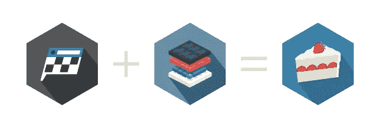
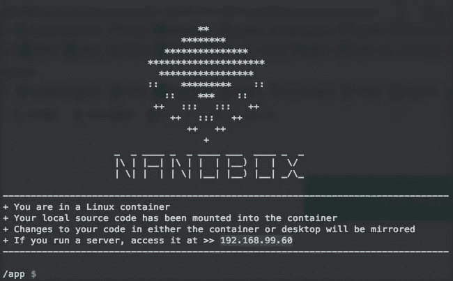
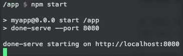

# 如何通过 3 个简单的步骤创建 DoneJS 应用程序

> 原文：<https://medium.com/hackernoon/how-to-create-a-donejs-app-in-3-easy-steps-6e51b738cbee>



使用像 [DoneJS](http://donejs.com/) 这样的框架的主要好处是它允许你专注于开发而不是样板文件。

另一个提供类似好处的工具是 [Nanobox](http://nanobox.io/) 。它创建了即时、隔离的开发环境，因此您不必担心语言版本、版本管理器、全局依赖冲突等问题。所以[下载 Nanobox](http://nanobox.io/download/) 让我们开始吧！

# 步骤 boxfile.yml

Nanobox 使用一个`[boxfile.yml](https://docs.nanobox.io/boxfile/)`来配置你的环境；在项目的根目录下创建一个:

```
# boxfile.yml
run.config:
  engine: nodejs
```

# 步骤 2:创建一个 DoneJS 应用程序

在创建应用程序之前，添加一种使用`nanobox dns add local done.dev`从浏览器访问它的便捷方式。

现在使用`nanobox run`创建您的应用程序环境并进入控制台:



运行`yarn add donejs`安装 DoneJS。

安装完 DoneJS 后，转到`/tmp`目录并创建您的应用程序。一旦创建了应用程序，将其内容移动到您的项目文件夹中，并在那里更改目录。

```
# cd into /tmp and create the application
cd /tmp
donejs add app myapp# copy the contents of your new donejs app to your project root
cp -ar ./myapp/. /app# return to your project root
cd /app
```

# 步骤 3:运行您的应用程序

运行`npm start`启动您的应用程序:



当你的应用程序运行时，你可以使用你之前添加的自定义域在浏览器中访问它: [done.dev:8080](http://done.dev:8080) 。

就是这样！

[](http://bit.ly/HackernoonFB)[](https://goo.gl/k7XYbx)[](https://goo.gl/4ofytp)

> [黑客中午](http://bit.ly/Hackernoon)是黑客如何开始他们的下午。我们是阿妹家庭的一员。我们现在[接受投稿](http://bit.ly/hackernoonsubmission)并乐意[讨论广告&赞助](mailto:partners@amipublications.com)的机会。
> 
> 如果你喜欢这个故事，我们推荐你阅读我们的[最新科技故事](http://bit.ly/hackernoonlatestt)和[趋势科技故事](https://hackernoon.com/trending)。直到下一次，不要把世界的现实想当然！

