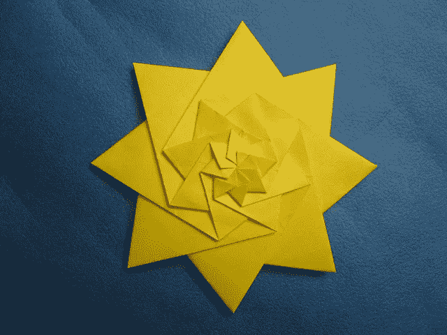
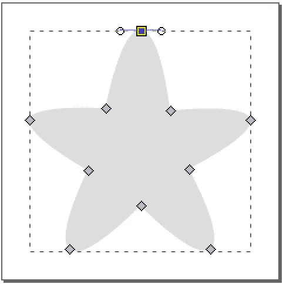
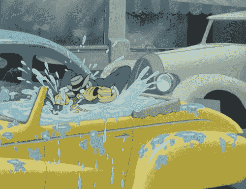
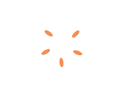

# 如何用动漫创作出喜欢的动画-js？

> 原文：<https://medium.com/hackernoon/how-to-create-a-favorite-animation-with-anime-js-5f9ec02c80dd>



Evan Zodl’s Star Fractalized (3 levels) — Jorge Jaramillo — flickr

这是我第一篇关于[如何用 anime-js](/@mikael_ainalem/how-to-create-a-check-mark-animation-with-anime-js-86781951a67) 制作勾号动画的后续。这一篇将会更深入地探讨如何用 anime-js 构建更高级的动画。前一篇文章更多的是一个介绍性的教程。

制作简单的动画很棒。总的来说，保持事情简单是一个伟大的咒语。少即是多。然而，在某些情况下，你有时确实想走得更远一点。有些时候，你确实想润色某些过渡。变形、多维动画和变形是我们现在越来越多看到的技术。几年前，从 2017 年开始回顾，这些都不是用网络技术建造的。他们更可能是在视频中，某种预动画图形或其他非 web 的东西(flash 等)。现在，我们已经看到了这些基于插件/预渲染动画的转变。除了最近有某种复兴的动画 GIF。我们也看到越来越多精心制作的互动动画。由于现代浏览器的进步，这些动画现在在 HTML5 中实现。使用 web 技术通常可以更好地控制这些交互。此外，它还减少了移动设备的占用空间。如今，减少页面加载时间至关重要。尤其是现在移动端的使用量已经超过了桌面端。

在这篇文章中，我将使用更先进的布局实现一个更精致的[动画](https://hackernoon.com/tagged/animation)。前一篇文章中的复选标记动画更加一维。动画步骤按顺序出现。在这里，更多的事情同时发生。这一条是用来将推文标记为收藏的:[**Twitter-Fav by Brian W from Dribble**](https://dribbble.com/shots/1884504-Twitter-Fav)。这是一部由设计师设计的精美动画，注重视觉细节。为了重新创建它，我将使用一个截屏工具在屏幕外记录它。这将允许我剖析和设置不同部分的时间。和上一篇文章一样，让我们从最终结果开始。然后让我们把它们分解成一个一个讨论的步骤。结果如下:


Twitter-fav

使用截屏工具是分解复杂动画的一个好方法。它可以让你停止和暂停，寻找某些位置，并降低帧速率。这样做有助于你更深入地理解如何制作动画。如果你对细节很感兴趣，那么确保你使用了一个在回放时显示毫秒的屏幕记录器。以毫秒为单位，你可以更精确地重建时间。

为了重现整个过程，我使用了 HTML、 [CSS](https://hackernoon.com/tagged/css) 、SVG 和 Javascript 的组合。这里值得注意的是 CSS 和 SVG 是重叠的技术。你可以在其中任何一个里创造一些东西。根据经验，我倾向于对简单的形状使用 CSS。我发现 CSS 语法通常更容易使用。在其他一些情况下，SVG 更适合。有些事情现在在 CSS 中很难做，比如贝塞尔曲线。总而言之，什么时候用一个胜过另一个，要看上下文。对我来说，没有明确的规则 anno 2017 什么时候使用哪个。有时我用一种，有时用另一种，有时我把它们结合起来用。

当重新制作动画时，通常最好把它分解成更小的部分。一个接一个地创建这些部分，更容易保持焦点。这也将使这个过程看起来不那么势不可挡。其实有点像这篇文章的作文。对我来说，这个动画最好分成以下几个部分:

*   缩小灰色不活动恒星的尺度
*   放大光环
*   溅起的水珠
*   最终升级活跃的恒星。

然后，以下几何形状将依次创建上述台阶:

*   贝塞尔曲线
*   环
*   环
*   用不同的颜色绘制不活跃的星星的相同的贝塞尔曲线

在这四颗恒星中，只有一颗形状有些复杂的恒星比较突出。这里，矢量(SVG)编辑器再次派上了用场。下面是它在诸如 Inkscape 这样的编辑器中的样子。请注意使用平滑节点(控制柄)来创建圆角边。



上面的代码类似于下面的代码(省略了外部的 svg 节点)。早先在 *d* 属性字符串中发现的“c”告诉我们这是一条贝塞尔曲线。

```
<path class=”favorite__inactive”
      d=”M50.214 10.067c6.4.204 10.753 25.648 10.753 25.648s26.256–1.803 27.13 2.857c.874 4.66–20.04 16.642–20.04 16.642s9.537 24.303 5.523 26.817c-4.015 2.515–23.545–14.023–23.545–14.023S29.333 84.493 25.633 81.785c-3.7–2.71 6.657–26.472 6.657–26.472S11.234 43.94 12.383 39.108c1.15–4.832 26.55–3.393 26.55–3.393s4.88–25.853 11.28–25.648z”
      fill=”#dbdedd” />
```

让我们现在添加第一个动画步骤，缩小明星。让我们再次使用 anime-js 时间线，因为它可以很好地控制动画的不同部分。将 SVG 添加到我们的 HTML 文档后，下面的 Javascript 代码将完成这个任务:

```
timeline
.add({
  targets: '.favorite__inactive',
  scale: {
    value: [1, 0],
    duration: 400,
    delay: 1000,
    easing: 'easeInQuad'
  }
})
```


Downscaling the star

到目前为止，这一步应该非常简单。同样，节点的类名创建了 DOM 节点和它的动画之间的关系。恒星在一秒钟内从 1(可见)变到 0(完全消失)。注意放松。它被设置为“in ”,以便在缩小尺度时加速启动。

下一步是创建更棘手的光环。为了创建光环，让我们使用两个普通的圆圈。一个在里面，一个在外面。外圈是不透明的，用来设置光晕颜色。内圆需要是透明的，以显示光环内的其他元素。注意:光环动画在星的缩小结束之前开始。因此，光环内的元素可见是很重要的。SVG 遮罩是在 SVG 中创建透明部分的一种便捷方式。SVG 遮罩在这里有更详细的讨论:[裁剪和遮罩](https://developer.mozilla.org/en-US/docs/Web/SVG/Tutorial/Clipping_and_masking)。本质上，您创建了一个与其他 SVG 内容组合的二进制(黑白)蒙版图像。然后蒙版会在它所应用的不透明物体上打孔。该特定对象下方和内部的其他对象现在将可见。让我们看看这在代码中是什么样子的:

```
<defs>
  <mask id="favorite__halo-mask">
    <rect width="100%" height="100%" fill="white"/>
    <circle class="favorite__halo-inner" cx="50" cy="50" r="0" fill="black"></circle>
  </mask>
</defs>
<circle class="favorite__halo-outer" cx="50" cy="50" r="48" fill="#feb53c" mask="url(#favorite__halo-mask)"></circle>
```

这里首先要注意的是最后一个元素。这是外圈，*最喜欢的 __halo-outer。*它是一个常规的 SVG 圆形元素，具有比例、颜色和遮罩属性。这里的屏蔽语法有点奇怪，因为它通过 url 及其 id 来引用掩码。无论如何，它指向了面具元素，T4 最喜欢的光环面具。它又包含内圆节点，另一个 SVG 圆。这总共给了我们上面提到的两个圆圈。本质上，我们现在已经拥有了制作这部分动画所需的一切。另外值得一提的是面膜里面的白色 rect。这个矩形标记了应该保持完整的区域。即内圈之外的一切。不包含此节点将使掩码不起作用。

作为起点，内圆完全消失(半径 *r* = 0px)。这里，让我们再一次应用偏移和延迟的概念。这是内圈的升级与外圈开始时相比有点延迟的地方。这样做会造成光晕越来越薄的效果。在代码中:

```
timeline
// ...
.add({
  targets: '.favorite__halo-outer',
  scale: {
    value: [0, 1],
    duration: 400,
    delay: 1400,
    easing: 'easeOutQuad'
  },
  offset: 0
})
.add({
  targets: '.favorite__halo-inner',
  r: {
    value: [0, 49],
    duration: 300,
    delay: 1500,
    easing: 'easeOutQuad'
  },
  offset: 0
})
```

请注意上面的延迟差异。这为我们提供了以下动画:


Halo animation (Slow motion)

再来看看上面的糖屑、水花和多余的糖。



Disney’s Goofy

对于卡通和动画来说，飞溅并不是什么新概念。它们经常被用来夸大动作和加强周围的动作。这个动画也没什么不同。在这里，飞溅强调和强调用户的行动。用户界面给了用户正面的强化，创造了良好的 UX。这一魅力时刻将鼓励用户将更多的推文标记为收藏夹。一般来说，这将提高用户参与度。

总共有五个水花，它们的位置角度均匀。它们本质上是同时在五个不同的地方运行的同一个动画。在这里重用相同的动画是重新创建 sprinkles 部分的最快方法。我们需要做的就是创建一个 sprinkles。重复动画 5 次。最后，将 5 个重复的动画以均匀的角度展开。在 HTML 中:

```
<div class="favorite__sprinkle"> // 1st sprinkle
  <div class="favorite__sprinkle-circle"></div>
</div>
<div class="favorite__sprinkle"> // 2nd sprinkle
  <div class="favorite__sprinkle-circle"></div>
</div>
...
<div class="favorite__sprinkle"> // 5th sprinkle
  <div class="favorite__sprinkle-circle"></div>
</div>
```

360 度除以 5 等于 72 度，这是用来旋转节点的值。此外，移位将确保将第三颗星置于 6 点钟位置(180 度)。通过一些简单的数学计算，我们可以计算出这个位移为 36 度(72 / 2)。让我们以 72 度的间隔展开节点，通过旋转节点，从 36 度开始。在 CSS 中，这意味着应用变换规则及其旋转值。值旋转(36)，旋转(108)，旋转(180)，…将布局节点。在代码中，这看起来像:

```
.favorite__sprinkle {
  ...
  transform: rotate(36deg);
}.favorite__sprinkle:nth-child(2) {
  transform: rotate(108deg);
}....favorite__sprinkle:nth-child(5) {
  transform: rotate(324deg);
}
```

动画本身由 3 部分组成。分别是:一个交叉渐变(不透明度)，拉伸圆，移动圆。为了拉伸节点，我使用了一维标尺。在写这篇文章的时候，我发现自己有点粗心大意。我使用 CSS *高度*规则来拉伸糖屑。应该使用*比例*而不是*宽度* / *高度*来改变元素比例。不这样做通常会更慢。这个自*平移* / *缩放* / *旋转*都是硬件(GPU)加速的。与所有优化一样，在需要的地方应用它们，并遵循指导原则。下面是整个序列的样子:

```
.add({
  targets: '.favorite__sprinkle',
  opacity: {
    value: [0, 1],
    ...
})
.add({
  targets: '.favorite__sprinkle-circle',
  height: {
    value: [5, 12],
    ...
})
.add({
  targets: '.favorite__sprinkle-circle',
  height: {
    value: [12, 5],
    ...
})
.add({
  targets: '.favorite__sprinkle-circle',
  opacity: {
    value: [1, 0],
    ...
})
.add({
  targets: '.favorite__sprinkle-circle',
  translateY: {
    value: [0, -28],
    ...
});
```



Sprinkles

最后一部分是第一步的逆过程。这是恒星再次放大的地方。现在，在它活跃的颜色中。我不会涉及这一部分，因为它与第一步相同。

瞧，就是这样！下面是 codepen 上的源代码。