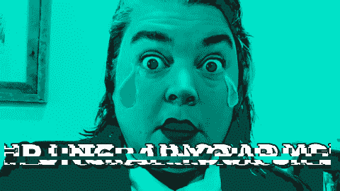
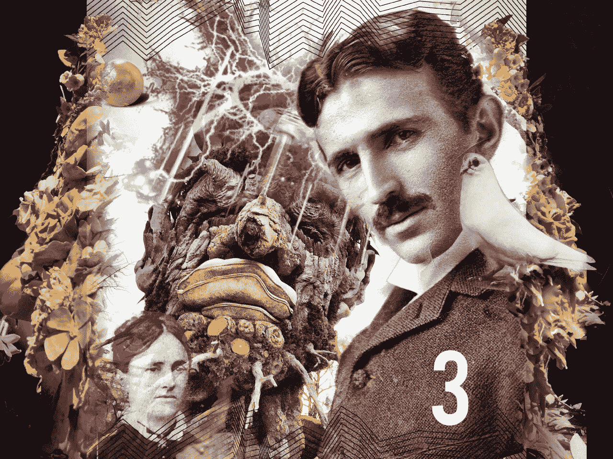

# 如何创建 Gif

> 原文：<https://medium.com/hackernoon/how-to-create-a-gif-a8ae99ff4453>

shameless self-promotion for my book, [Un-Crap Your Life](http://www.amazon.com/Un-Crap-Your-Life-Navigating-Situations-ebook/dp/B017PBLZPA)

创建一个 gif 非常简单。然而，我有把简单的事情变得荒谬复杂的习惯。当我第一次意识到我不能一天不尝试制作自己的 gif 时，我以最复杂的方式着手:我认为我必须有一个像 Photoshop 这样的程序来制作 gif。我没有 Photoshop 的拷贝。我使用一个叫做 GIMP 的免费开源成像程序。我喜欢它，主要是因为它是免费的。我研究了 GIMP 的 gif 制作能力，然后决定我不想破坏它。于是我在网上搜索了一下，“如何制作 gif”。Giphy.com 突然出现了。

过去五年我他妈的去了哪里？Giphy.com 解决了我所有的 gif 制作问题！

使用 giphy.com 创建 gif 就像复制并粘贴一个 YouTube 链接到一个网站一样简单。不过，我还没有想出如何从 YouTube 上获得确切的剪辑，然后将其粘贴到 Giphy 中。

然而，你也可以在 Giphy 上做一些很酷的事情，比如上传一张你自己的静态图片，然后添加动态文本，就像上面的 gif。我五分钟前在 Giphy 上做的，不用开账户也不用付钱。我添加了蓝色滤镜和文字效果。您还可以添加贴纸，字幕和说明，只需使用您的静态图像。转到 GIF 标题标题制作这些类型的 GIF。

对于我所有的其他图像编辑，我使用[光线。](https://itunes.apple.com/us/app/enlight/id930026670?mt=8)我每天都使用 Enlight，很明显我已经上瘾了。这是我用 Enlight 创建的一个图像，我用工具部分和混合器选择添加了许多图像。下面的照片拼贴是用 7 个不同的图像创建的，所有的图像都层叠在一起。所有这些图像分层只在我的 iPhone 上完成，用我的指尖抹去图像的一部分。感觉很像画画！

顺便说一下，这不是 Enlight 或 Giphy 的付费或推广帖子。这些是我最常用的工具。

谢谢你对这件事的关注，
莉亚

> [黑客中午](http://bit.ly/Hackernoon)是黑客们下午的开始。我们是 [@AMI](http://bit.ly/atAMIatAMI) 家庭的一员。我们现在[接受投稿](http://bit.ly/hackernoonsubmission)并乐意[讨论广告&赞助](mailto:partners@amipublications.com)机会。
> 
> 如果你喜欢这个故事，我们推荐你阅读我们的[最新科技故事](http://bit.ly/hackernoonlatestt)和[趋势科技故事](https://hackernoon.com/trending)。直到下一次，不要把世界的现实想当然！

