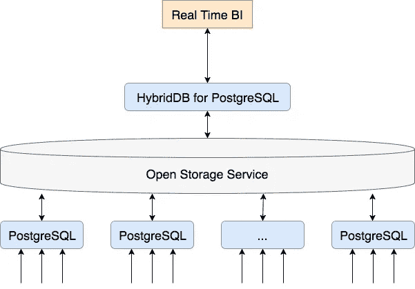

# 如何打造千万级 Feeds 的流系统？

> 原文：<https://medium.com/hackernoon/how-to-create-a-stream-system-with-tens-of-millions-of-feeds-6df06e302c78>

*阿里巴巴数据库的技术解读*

阿里巴巴 2017 年全球购物节以每秒 32.5 万笔交易和 25.6 万笔支付的惊人成绩打破了纪录。然而，如此高的容量会产生大量的数据。在阿里巴巴，这些数据被实时分析，以确保任何系统故障都被立即检测到并尽快报告，以便持续改善客户体验。

自然，这对阿里科技团队来说是一个巨大的挑战。那么，他们如何应对如此巨大的任务呢？

首先，简单介绍一下背景。一个电子商务企业通常涉及许多不同的元素，如商人，商店和物流。每个元素的活动都会产生大量的业务数据，例如订单、投诉和退款，任何单个交易都可能涉及多个业务系统。

为了识别问题、满足操作需求和分析需求，事件跟踪用于记录用户行为在系统中生成的日志(称为馈送日志)。从下订单、付款和发货，到收货和可能的退款，一个订单通常会产生几个相互关联的记录。每个链接可能产生不同的属性，有些可能是新的，有些可能是对现有属性值的更改。

为了便于分析，通常在整个过程中将一个订单生成的多个记录合并为一个记录(或订单表)。基于聚合的数据，主动服务可以执行分析，显示公众意见，并实时识别需要主动服务的对象，提供智能服务操作。

为了实现这一点，Ali Tech 团队通过 RDS PostgreSQL 和 HybridDB for PGSQL 使用了一个实时分析方案，该方案具有以下特性:

-能够承受每秒数十万次写入(数倍于事务处理)的吞吐量，并执行数据清理

-实现了分钟级延迟的实时分析，并提供了五个具有秒级响应的十亿级表

-实时识别异常交易，以改善淘宝的用户体验

除了实时要求之外，写入过程还需要数据整合和清理等操作。DDBA 或数据分析专业人士明白，实现每秒数十万次的写入、切换、整合和清理操作，或者对万亿字节的数据执行毫秒级的分析并不困难。然而，真正的困难在于合理地调度，同时实现实时写入和毫秒级分析，并具有分钟级延迟。

# 阿里巴巴计划

Alibaba Tech

阿里巴巴支持这些需求的方案如下:

- RDS PostgreSQL，由阿里云开发，是开源关系数据库 PostgreSQL 的云版本

- HybridDB for PostgreSQL 是一个具有 MPP 架构的分布式分析数据库。它在多表关联、复杂查询和实时统计等领域提供了出色的性能，并支持包括 JSON、GIS 和 HLL 估值在内的独特功能

- OSS(开放存储服务)是由阿里云运营的海量、安全、低成本、可靠的云存储服务。在这里，它用于离线数据存储

RDS PostgreSQL 和 HybridDB for PostgreSQL 透明访问离线 OSS 存储的能力至关重要

该方案接受对多个 PostgreSQL 数据库的业务写入。数据在每个 RDS PostgreSQL 数据库中被清理，然后通过操作外部表(类似于堆表)写入弹性操作系统。写入完成后，数据从 OSS 加载到 HybridDB，对于 PostgreSQL，只需一条 SQL。这也是通过操作外部表来完成的。在 HybridDB 中实现了无数 TB 数据的毫秒级查询。

# 该方案的优点

那么，使用这种方案有什么好处呢？嗯，虽然一开始看起来并不复杂，但该方案解决了以下问题:

## 1.表演

PostgreSQL 强大的并发写入性能与 HybridDB 的分析性能相结合。

单个 RDS PostgreSQL 可以支持数百万次写入，并且批量加载到 HybridDB，在写入 PostgreSQL 之后，无缝集成 PostgreSQL 和 HybridDB。这通过 MPP 卓越的分析性能实现了实时毫秒级查询。

## 2.数据处理和清理

传统上，数据处理是一项麻烦的任务，性能很差，导致 TP 和 AP 之间的距离很远，导致使用不同的方法。此外，处理异构数据库时的工作量会显著增加。

如果一切都可以通过 SQL 操作，以数据清理和处理作为 SQL 语句的定义和执行，是不是会更简单？

RDS PostgreSQL 和 HybridDB for PostgreSQL 都可以直接读写 OSS，并且可以很容易地链接。通过调度和封装，以前需要较高工作量的功能可以以较低的成本实现。

## 3.冷热数据的统一访问

通过利用离线存储功能，冷数据可以存储在 OSS 中，热数据可以存储在 PostgreSQL 或 HybridDB for PostgreSQL 中。热数据和冷数据可以通过 SQL 以同样的方式访问。

## 4.资源的动态在线调整

云生态的主要优势在于其动态性和弹性。RDS PostgreSQL 资源可以在不影响可用性的情况下随时动态调整，而具有二级交换的 HybridDB 可以实现容量扩展。OSS 本身的弹性允许用户存储任意数量的数据。

因此，该计划提供了以下好处:

1.与传统的数据分析方案相比，通过 SQL 以统一的方式管理数据，减少了异构性

2.动态调度资源降低成本

3.热数据和冷数据之间的界限变得模糊，使得它们之间能够直接访问

4.集成 TP 和 AP

5.无限数量的 RDS PostgreSQL 数据库和 HybridDB 集群

# PostgreSQL，阿里云的云数据库

阿里云的云数据库 PostgreSQL 基于被称为“最先进”的开源关系数据库。在 2017 年 Stack Overflow 开发者调查中，PostgreSQL 被开发者投票选为年度最受欢迎和最受欢迎的关系数据库之一，主要是因为以下特性:

## 1.稳定性

PostgreSQL 的代码质量得到了众多用户的认可。PostgreSQL 的主要版本在经过两到三个次要版本之后，基本上可以用于生产。PostgreSQL“漂亮”的提交日志可以证明这一点。

通过 PostgreSQL 的多进程架构，一个连接的异常不会影响主进程或其他连接，提供了出色的稳定性。

## 2.表演

在收集内部性能数据后:TPCC 性能测试表明，PostgreSQL 的性能在某些场景下可以与商业数据库相媲美甚至更胜一筹。

## 3.丰富

PostgreSQL 的丰富性是它的主要优势。我们不能涵盖它所有的好处，所以我们将把重点放在更有趣的地方——丰富的查询、函数和类型

**丰富的查询**

PostgreSQL 具有各种功能，如 HASH\Merge\NestLoop JOIN、物化视图和全文搜索。最值得注意的是，PostgreSQL 有强大的基于成本的优化器，它与并行执行(并行扫描、并行连接等)一起。)和多种成本因素，支持多种灵活高效的查询。此外，还有许多索引，如 btree、hash 和 gist，您可以为自己定义的类型创建索引和索引扫描。

**功能丰富**

PostgreSQL 有一个无与伦比的插件特性。有了这个特性，您可以在内核代码中使用钩子来添加函数，而无需修改数据库内核代码。例如，插件特性可用于创建 PostGIS、JSON 和 genes，以满足需求，而不会影响内核代码。而且，PostgreSQL 有无数的插件。

FDW 机制使您能够在同一个 PostgreSQL 中访问其他数据源，如 Hadoop、MySQL、Oracle 和 Mongo，而不会消耗太多 PostgreSQL 资源。比如我们团队开发的 OSS_FDW 就是用来读写 OSS 的。

**富豪类型**

支持的类型包括高精度数字、浮点、自动递增序列等等。

PS:数组使用户能够像在 JAVA 中操作数组一样操作数据库中的数据。例如，item [0][1]表示二维数组中的一个元素，该元素可以是表中的一个字段。

如果不够，您可以自定义自己的类型并为这些类型重新加载运算符。比如 IP 类型的加、减、乘、除(运算定义取决于具体实现，所以可以任意 IP 加法)。

**其他福利**

其他好处还包括 PostgreSQL 的 DDL(比如加减法)可以在事务中完成(PostgreSQL 是目录驱动的，所以 DDL 修改可以理解为对一条记录的修改)。运营业务人员会理解这一点的独特优势。

关于开源版本，阿里云的云数据库 PostgreSQL 增加了 HA、无缝容量扩展、自动备份等功能，实现无忧使用。

# 阿里云的 HybridDB for PostgreSQL

HybridDB for PostgreSQL 是一个基于开源 Greenplum 的 MPP 架构的分布式分析数据库。它在多表关联、复杂查询和实时等许多领域提供了出色的性能。在此基础上，阿里云 HybridDB for PostgreSQL 提供了包括 JSON、GIS 和 HLL 估值、备份和恢复以及自动异常修复在内的独特功能。还优化了很多方面来对开源版本进行质的升级。

阿里云的 HybridDB for PostgreSQL 有以下特点:

## 1.实时分析

支持 SQL 语法以实时分析来自地理信息系统(GIS)的分布式数据，协助物联网和互联网上基于位置的服务的数据处理，并实时分析分布式 JSON、XML 和模糊字符串数据。这有助于金融、政府和商业行业的客户执行消息数据处理和模糊文本数据收集。

## 2.稳定性和可靠性

支持分布式 ACID 数据一致性，以实现跨节点的事务一致性。所有数据跨两个节点同步以实现冗余，SLA 保证 99.9%的可用性。部署采用三层安全防护分布式，分别是计算单元、服务器、机柜，提高了关键数据基础设施的安全性。

## 3.易用性

支持广泛的 OLAP SQL 语法和函数以及多种 Oracle 函数。热门行业 BI 软件工具可以直接在线使用。数据可以在云数据库 RDS (PostgreSQL/PPAS)之间进行通信，以提供混合 OLTP+OLAP (HTAP)事务分析解决方案。

支持分布式 SQL OLAP 统计和窗口函数，以及分布式 PL/pgSQL 存储过程和触发器，以支持数据库端分布式计算流程开发。

能够进行符合国际 OpenGIS 标准的混合地理数据分析。这允许使用一条 SQL 语句从大量数据中执行地理信息分析，例如访问者、面积计算或行踪分析。

## 4.完美的表现

支持行列混合存储，在 OLAP 分析期间，列存储的性能是行存储的 100 倍。还支持高性能 OSS 并行数据导入，消除单通道导入的性能瓶颈。

此外，它可以基于分布式大规模并行处理，与计算单元的增加成比例地扩大存储容量和计算能力。充分利用每个计算单元的 OLAP 计算性能。

## 5.灵活的可扩展性

计算单元、CPU、内存和存储容量可以按需同步扩展，可扩展 OLAP 高达数百 TB。支持透明的 OSS 数据操作，不用于在线分析的冷数据可以转移到 OSS 基于对象的存储。数据存储容量的扩展是无限的。

通过 mysql2pgsql，可以向 mysql 数据库导入高性能数据。大多数流行的行业 ETL 工具都支持以 HybridDB 为目标的 ETL 数据导入。

存储在 OSS 中的格式化文件可用作数据源，并可通过外部表模式实时操作，而数据查询可使用标准 SQL 语法完成。

支持来自 PostgreSQL/PPAS 的透明数据流。无需编程即可实现连续增量，简化了维护工作。存储数据后，可以执行高性能的内部数据建模和数据清理。

## 6.安全性

支持多达 1，000 个可连接到 RDS 实例的许可服务器 IP 地址的可配置 IP 白名单，直接从访问源实现直接风险控制。

内置的 DDoS 防护能力实时监控网络入口，如果检测到超高流量攻击，则清洗源 IP，如果清洗失败，则直接将其送入黑洞。

# 总而言之…

借助 RDS PostgreSQL 和 HybridDB for PostgreSQL 等云服务，阿里云帮助客户构建智能企业数据 BI 平台。HybridDB for PostgreSQL 还可以作为企业大数据实时分析计算和存储的核心引擎。这样，来自在线业务的业务数据可以从闭环过渡到云中的实时数据分析。

(原文章作者周、窦贤明)

# 阿里巴巴科技

关于阿里巴巴最新技术的第一手、详细、深入的信息→在**脸书**上搜索**“阿里巴巴科技”**

【www.facebook.com/AlibabaTechnology 