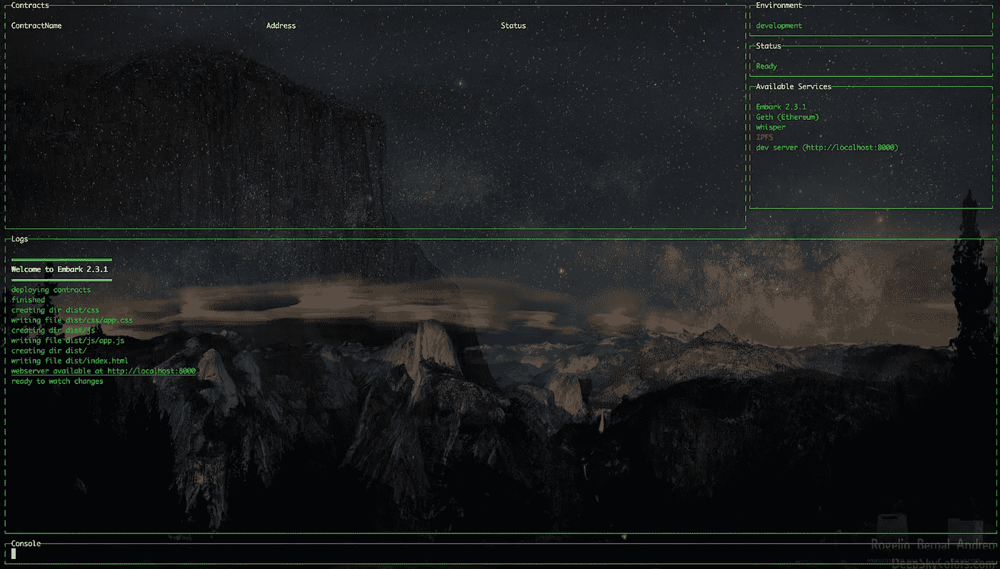
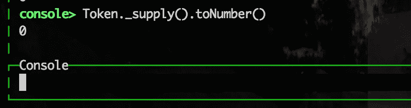
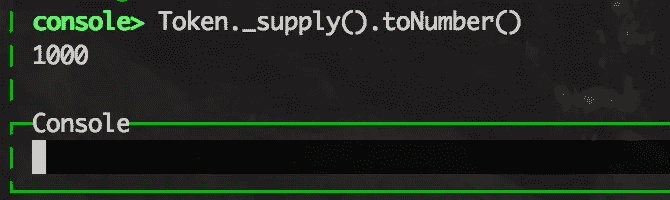
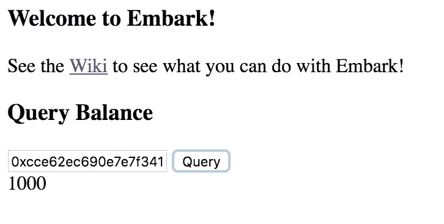
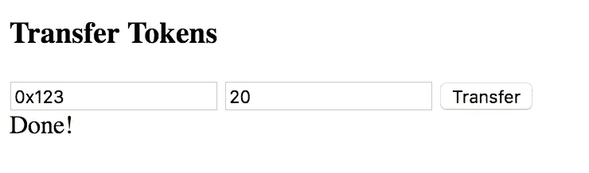
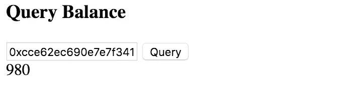
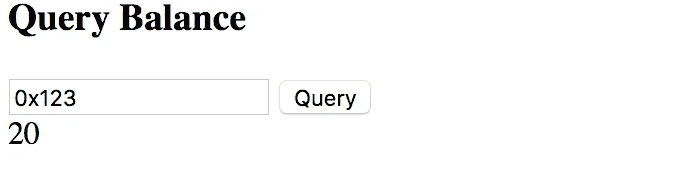

# 如何用以太坊创建令牌工厂—第 1 部分

> 原文：<https://medium.com/hackernoon/how-to-create-a-token-factory-with-ethereum-part-1-85e84d1f38fc>

**过时:新教程可在** [**embark 网站**](https://embark.status.im/tutorials/token_factory_1.html) 找到

(声明:本教程仅用于教学目的)
在本系列教程中，我们将使用[以太坊](https://hackernoon.com/tagged/ethereum)创建一个令牌[工厂](https://hackernoon.com/tagged/factory)。在第 1 部分中，我们将首先创建一个 DApp 来与单个令牌进行交互，在第 2 部分中，我们将调整应用程序，以便它可以使用用户提供的参数在 web 端动态部署新令牌。

令牌通常是用于表示某种服务或实用程序的交换媒介的单位。它们可以代表一张音乐会门票、会员资格、投票份额、声誉点数等…

注意:本教程适用于 embark 2.5.2(不是 2.6.0 和更高版本)

# 入门指南

首先，确保你已经安装了 [Go-Ethereum](https://geth.ethereum.org/) 和 [Embark](http://github.com/iurimatias/embark-framework) 。

```
npm -g install embark@2.5.2
```

现在，让我们创建一个新的 dapp

```
embark new TokenFactory
```

这将创建一个名为 TokenFactory 的目录，cd 到该目录并运行:

```
embark blockchain
```

在另一个控制台的同一目录中，运行:

```
embark run
```

您应该会看到类似这样的内容:



*注意:如果你不想要控制台，你可以运行:
embark run — nodashboard*

现在在*打开你的浏览器 http://localhost:8000* ，启动你最喜欢的编辑器，让我们开始吧！

# **添加代币合同**

我们将向*app/contracts/token . sol*添加一个典型的 ERC20 令牌合约

*警告:本合同仅用于教育目的，除非您知道自己在做什么，否则不要将其用于生产*

Embark 将自动检测新文件并部署合同。然而，我们很快注意到一个问题，在 Embark 的控制台类型中:

```
Token._supply().toNumber()
```



供应量为零，这是因为契约构造函数采用了一个我们尚未指定的 *initial_balance* 参数:

```
function Token( **uint** **initial_balance** ) {
   _balances[msg.sender] = initial_balance;
   **_supply = initial_balance;**
}
```

让我们通过在 *config/contracts.json* 中指定 *initial_balance* 值来纠正这个问题

```
{
  "default": {
    "gas": "auto",
    "contracts": {
 **"Token": {
        "args": [
          1000
        ]
      }**
    }
  }
}
```

Embark 将检测到这一变化，并使用新参数重新部署合同，之后令牌供应如预期的那样为 1000:



# 创建用户界面

为了简洁起见，我们不会在契约中实现每一个功能。然而，我们将实现两个重要的特性:检查地址的平衡和将令牌从一个地址转移到另一个地址。

# 检查地址平衡

为了输入要查询的地址，我们将编辑 *app/index.html* 并添加一个简单的表单。

```
<html>
  <head>
    <title>Embark</title>
    <link rel="stylesheet" href="css/app.css">
    <script src="js/app.js"></script>
  </head>
  <body>
 **<div id="queryBalance">
      <h3>Query Balance</h3>
      <input placeholder="enter account address: e.g 0x123" />
      <button>Query</button>
      <div class="result"></div>
    </div>** </body>
</html>
```

**添加 jQuery**

为了简化本教程中的代码，我们将把 jQuery 库添加到我们的 DApp 中。从[这里](https://code.jquery.com/jquery-3.1.1.min.js)下载 jQuery 并保存在你的 dapp *app/js/* 文件夹中。或者:

```
cd app/js/ && wget [https://code.jquery.com/jquery-3.1.1.min.js](https://code.jquery.com/jquery-3.1.1.min.js)
```

*注意:要使用 react 之类的库，请看一下*[*embark-babel*](https://github.com/iurimatias/embark-babel)之类的插件

**设置默认地址**

让我们将我们自己的地址作为默认文本添加到输入字段中，这样我们就可以方便地查询我们自己的余额。创建文件 app/js/token.js 并添加:

```
$(document).ready(function() { web3.eth.getAccounts(function(err, accounts) {
    $('#queryBalance input').val(accounts[0]);
  });});
```

这将获得第一个帐户的地址，并将其设置为输入表单中的默认文本。

**查询余额**

为了查询余额，我们可以看到合同方法签名这样做是:

```
function balanceOf( address who ) constant returns (uint value) {
    return _balances[who];
}
```

这个方法将在 JS 代码中作为一个承诺自动可用，就像:

```
Token.balanceOf(address).then(function(balance) { });
```

所以我们可以简单地向按钮添加一个点击事件，获取地址，查询余额并设置结果。

```
$(document).ready(function() { web3.eth.getAccounts(function(err, accounts) {
    $('#queryBalance input').val(accounts[0]);
  }); **$('#queryBalance button').click(function() {
    var address = $('#queryBalance input').val();** **Token.balanceOf(address).then(function(balance) {
      $('#queryBalance .result').html(balance.toString());
    });
  });**});
```

*注意:由于 balance 变量是一个大整数，要读取它，需要应用两者之一。toNumber()或。toString()*



现在转到 [http://localhost:](http://localhost:) 8000 并单击查询按钮，它将返回 1000 作为我们的地址。

# 转移代币

现在让我们实现转移令牌！

现在检查合同，这是转移令牌的方法:

```
function transfer( address to, uint value) returns (bool ok)
```

该方法将接受两个参数，一个地址和一个值。像上一步一样，让我们首先在 *app/index.html* 的 html 页面中添加一个简单的表单:

```
<html>
  <head>
    <title>Embark</title>
    <link rel="stylesheet" href="css/app.css">
    <script src="js/app.js"></script>
  </head>
  <body>
    <h3>Welcome to Embark!</h3>
    <p>See the <a href="[https://github.com/iurimatias/embark-framework/wiki](https://github.com/iurimatias/embark-framework/wiki)">Wiki</a> to see what you can do with Embark!</p> <div id="queryBalance">
      <h3>Query Balance</h3>
      <input placeholder="enter account address: e.g 0x123" />
      <button>Query</button>
      <div class="result"></div>
    </div> **<div id="transfer">
      <h3>Transfer Tokens</h3>
      <input class="address" placeholder="enter account address: e.g 0x123" />
      <input class="num" placeholder="enter amount to transfer" />
      <button>Transfer</button>
      <div class="result"></div>**
    **</div>**</body>
</html>
```

然后，我们将添加代码，从输入中获取令牌的地址和数量，并调用合同传输方法到 *app/js/token.js*

```
$(document).ready(function() { web3.eth.getAccounts(function(err, accounts) {
    $('#queryBalance input').val(accounts[0]);
  }); $('#queryBalance button').click(function() {
    var address = $('#queryBalance input').val(); Token.balanceOf(address).then(function(balance) {
      $('#queryBalance .result').html(balance.toString());
    });
  }); **$('#transfer button').click(function() {
    var address = $('#transfer .address').val();
    var num = $('#transfer .num').val();** **Token.transfer(address, num).then(function() {
      $('#transfer .result').html('Done!');
    });;
  });**});
```

让我们转到用户界面，将 20 个令牌转移到一个随机地址，单击“transfer”后，您应该会看到文本“Done！”当转移生效时。



我们从账户中转出了 20 个代币，让我们看看余额是否反映了这一点。



# 转到第 2 部分

在本教程中，我们部署了单令牌并与之交互。在第 2 部分中，我们将修改这个 DApp 并创建一个真正的工厂，这样新的令牌就可以在应用程序端动态部署。

*捐款:如果你喜欢这篇文章请考虑捐款到 0x 8811 fdf 0 f 988 f 0 CD 1 b 7 e 9 de 252 abfa 5 b 18 C1 CD 1(ETH)*

[](http://bit.ly/HackernoonFB)[](https://goo.gl/k7XYbx)[](https://goo.gl/4ofytp)

> [黑客中午](http://bit.ly/Hackernoon)是黑客如何开始他们的下午。我们是 [@AMI](http://bit.ly/atAMIatAMI) 家庭的一员。我们现在[接受投稿](http://bit.ly/hackernoonsubmission)，并乐意[讨论广告&赞助](mailto:partners@amipublications.com)机会。
> 
> 如果你喜欢这个故事，我们推荐你阅读我们的[最新科技故事](http://bit.ly/hackernoonlatestt)和[趋势科技故事](https://hackernoon.com/trending)。直到下一次，不要把世界的现实想当然！

