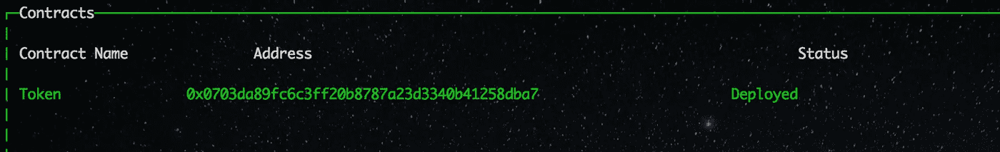
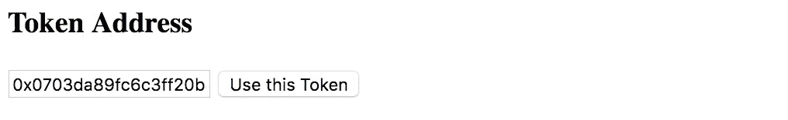
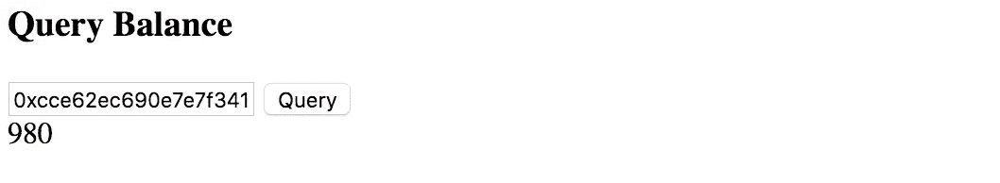
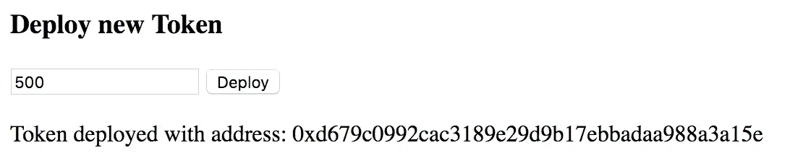
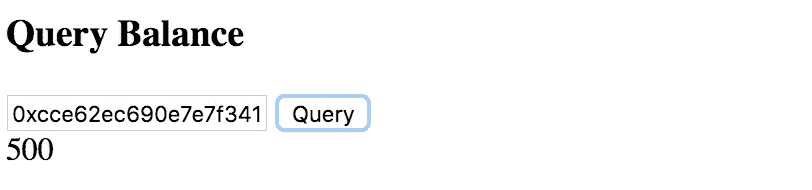
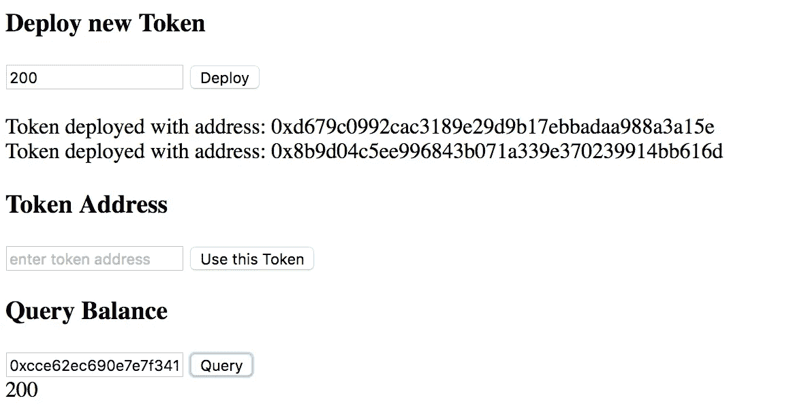
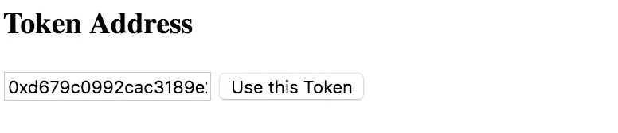
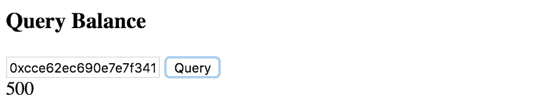
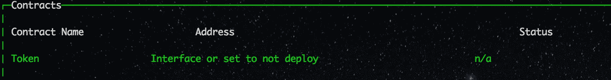

# 如何用以太坊创建令牌工厂—第 2 部分

> 原文：<https://medium.com/hackernoon/how-to-create-a-token-factory-with-ethereum-part-2-ce96a31a5f59>

**过时:新教程可以在** [**embark 网站**](https://embark.status.im/tutorials/token_factory_2.html) 找到

(免责声明:本教程仅用于教育目的)

在第 1 部分中，我们部署了一个令牌并与之交互。在本文中，我们将继续修改之前的 [DApp](https://hackernoon.com/tagged/dapp) 来创建一个真正的工厂，这样新的令牌就可以动态地部署在应用程序端。

令牌通常是用于表示某种服务或实用程序的交换媒介的单位。它们可以代表一张音乐会门票、会员资格、投票份额、声誉点数等…

注意:本教程适用于 embark 2.5.2(不是 2.6.0 和更高版本)

# 入门指南

对于教程的第二部分，需要使用 [Embark](http://github.com/iurimatias/embark-framework) 2.5.2。

如果您使用的是旧版本，您可以通过以下方式进行更新:

`npm install -g embark@2.5.2`

之后确保`embark version`返回`2.5.2` ，然后用`embark run`重启 embark

# 一般化令牌交互

我们将从概括前面的 UI 开始，这样我们就可以输入 ERC20 令牌的地址并与之交互。

首先，我们将向 *app/index.html* 添加一个简单的表单，以获取我们希望与之交互的令牌的地址。

```
<html>
  <head>
    <title>Embark</title>
    <link rel="stylesheet" href="css/app.css">
    <script src="js/app.js"></script>
  </head>
  <body>
    <h3>Welcome to Embark!</h3>
    <p>See the <a href="[https://github.com/iurimatias/embark-framework/wiki](https://github.com/iurimatias/embark-framework/wiki)">Wiki</a> to see what you can do with Embark!</p> **<div id="useToken">
      <h3>Token Address</h3>
      <input placeholder="enter token address" />
      <button>Use this Token</button>
      <div class="result"></div>
    </div>** <div id="queryBalance">
      <h3>Query Balance</h3>
      <input placeholder="enter account address: e.g 0x123" />
      <button>Query</button>
      <div class="result"></div>
    </div> <div id="transfer">
      <h3>Transfer Tokens</h3>
      <input class="address" placeholder="enter account address: e.g 0x123" />
      <input class="num" placeholder="enter amount to transfer" />
      <button>Transfer</button>
      <div class="result"></div>
    </div></body>
</html>
```

在 *app/js/token.js* 中，我们将获得输入中给定的地址，为该地址和令牌 [ABI](https://hackernoon.com/tagged/abi) 初始化一个新的契约对象，然后将它赋给一个变量。我们还将更新剩余的代码，使用 *currentToken* 而不是 *Token。*这样，现有代码将与我们将要加载的令牌一起工作。

```
$(document).ready(function() {**var currentToken;****$("#useToken button").click(function() {
    var address = $('#useToken input').val();** **currentToken = new EmbarkJS.Contract({
      abi: Token.abi,
      address: address
    });
});**web3.eth.getAccounts(function(err, accounts) {
    $('#queryBalance input').val(accounts[0]);
  });$('#queryBalance button').click(function() {
    var address = $('#queryBalance input').val(); **currentToken**.balanceOf(address).then(function(balance) {
      $('#queryBalance .result').html(balance.toString());
    });
  });$('#transfer button').click(function() {
    var address = $('#transfer .address').val();
    var num = $('#transfer .num').val(); **currentToken**.transfer(address, num).then(function() {
      $('#transfer .result').html('Done!');
    });;
  });});
```

现在，您可以输入 chain 中现有令牌的地址，并与之进行交互。例如，查看 embark 仪表盘。



我可以看到在我的例子中部署的令牌的地址是*0x 0703 da 89 fc 6 C3 ff 20 b 8787 a 23d 3340 b 41258 DBA 7。将你的对等地址粘贴到 UI 中。*

*注意:有几种方法可以复制地址，在大多数系统中，按住 ALT 键同时用鼠标拖动会在控制台中启用文本选择，然后按 CMD+C 或右键- >复制。或者你也可以到你的 DApp*[*http://localhost:8000*](http://localhost:8000)*在浏览器开发工具中输入 Token.address。*



复制地址后，点击“使用此令牌”，让我们看看余额。



果然是*980*(*1000*是 *config/contracts.json* 中配置的初始供货， *20* 在 part 1 中转出)

# **动态部署新令牌**

既然我们有了一个 UI 来与给定地址的现有令牌进行交互，我们将添加动态部署令牌的功能，每个令牌都有自己的初始供应。

首先，我们将在 *app/index.html* 中添加一个简单的表单，以获取需要部署的新令牌。

```
<html>
  <head>
    <title>Embark</title>
    <link rel="stylesheet" href="css/app.css">
    <script src="js/app.js"></script>
  </head>
  <body>
    <h3>Welcome to Embark!</h3>
    <p>See the <a href="[https://github.com/iurimatias/embark-framework/wiki](https://github.com/iurimatias/embark-framework/wiki)">Wiki</a> to see what you can do with Embark!</p> **<div id="deployToken">
      <h3>Deploy new Token</h3>
      <input placeholder="enter token supply" />
      <button>Deploy</button>
      <div class="result"></div>
    </div>** <div id="useToken">
      <h3>Token Address</h3>
      <input placeholder="enter token address" />
      <button>Use this Token</button>
      <div class="result"></div>
    </div> <div id="queryBalance">
      <h3>Query Balance</h3>
      <input placeholder="enter account address: e.g 0x123" />
      <button>Query</button>
      <div class="result"></div>
    </div> <div id="transfer">
      <h3>Transfer Tokens</h3>
      <input class="address" placeholder="enter account address: e.g 0x123" />
      <input class="num" placeholder="enter amount to transfer" />
      <button>Transfer</button>
      <div class="result"></div>
    </div></body>
</html>
```

Embark 使契约对象在 js 端可用，每个契约对象将通过一个名为*的方法部署*来部署新的契约实例。该方法可以接受协定的参数，并将返回一个包含已部署协定的协定对象的承诺。
在 *app/js/token.js* 中，我们将添加代码以使用此功能在客户端部署新令牌:

```
$(document).ready(function() {var currentToken;**$("#deployToken button").click(function() {
    var supply = $('#deployToken input').val();** **Token.deploy([supply]).then(function(deployedToken) {
      currentToken = deployedToken;
      $("#deployToken .result").append("<br>Token deployed with address: " + deployedToken.address);
    });****});**$("#useToken button").click(function() {
    var address = $('#useToken input').val(); currentToken = new EmbarkJS.Contract({
      abi: Token.abi,
      address: address
    });
});web3.eth.getAccounts(function(err, accounts) {
    $('#queryBalance input').val(accounts[0]);
  });$('#queryBalance button').click(function() {
    var address = $('#queryBalance input').val(); currentToken.balanceOf(address).then(function(balance) {
      $('#queryBalance .result').html(balance.toString());
    });
  });$('#transfer button').click(function() {
    var address = $('#transfer .address').val();
    var num = $('#transfer .num').val(); currentToken.transfer(address, num).then(function() {
      $('#transfer .result').html('Done!');
    });;
  });});
```

当单击 Deploy 按钮时，我们将输入供应并使用`Token.deploy([supply])`部署一个新令牌。
得到的承诺`.then(function(deployedToken) {})`将包含新部署合同的合同对象。我们将把这个新的令牌对象分配给当前的令牌对象 *currentToken* ，并通知用户地址；

所以让我们试试这个吧！将供应输入为 *500* 并点击部署:



完美！现在，由于它将 currentToken 指定为新的令牌对象，查询平衡应该已经可以使用这个新令牌了。



它果然返回 500！让我们使用不同的供应部署另一个令牌，并再次检查查询平衡:



在使用 *200 处的供应部署新令牌之后，*点击查询也如预期地返回 *200* 。

让我们切换回具有“使用此令牌”功能的第一个部署的令牌，看看是否一切都按预期工作。
每次我们在客户端部署令牌时，DApp 都会通知我们“令牌已部署，地址为:0x…”因此，让我们使用它将第一个已部署合同的地址复制粘贴到令牌地址字段中，然后单击“使用此令牌”切换回该令牌。



现在再次检查平衡:



正如所料，这是 *500* ，因为这是为部署的第一个令牌定义的初始供应。

# 从登船侧禁用令牌部署

既然您的 DApp 可以动态部署令牌，那么 Embark 就没有必要像第 1 部分那样部署令牌契约，但是您仍然需要 Embark 使令牌契约在客户端可用。
要实现这一点，请转到 *config/contracts.json* 并为该合同设置`"deploy": false`

```
{
  "default": {
    "gas": "auto",
    "contracts": {
      "Token": {
        **"deploy": false,**
        "args": [
          1000
        ]
      }
    }
  }
}
```

Embark 现在将不再部署该合同，在控制面板中，您应该会看到:



然而，*令牌*契约对象仍将在您的 DApp 中可用，客户端部署将像以前一样工作。

# 结论

在第 1 部分中，我们部署了单令牌并与之交互。在第 2 部分中，我们将修改 DApp 并创建一个真正的工厂，这样新的令牌就可以动态地部署在应用程序端。这种模式可以应用于 DApps，它不使用固定合同，而是允许用户动态地使用自己的合同。

这些教程还会继续！下次我们将学习如何使用 Embark 来整合以太坊和 IPFS 的 DApps，直到下次！

*捐款:如果你喜欢这篇文章请考虑捐款到 0x 8811 fdf 0 f 988 f 0 CD 1 b 7 e 9 de 252 abfa 5 b 18 C1 CD 1(ETH)*

[](http://bit.ly/HackernoonFB)[](https://goo.gl/k7XYbx)[](https://goo.gl/4ofytp)

> [黑客中午](http://bit.ly/Hackernoon)是黑客如何开始他们的下午。我们是 [@AMI](http://bit.ly/atAMIatAMI) 家庭的一员。我们现在[接受投稿](http://bit.ly/hackernoonsubmission)并乐意[讨论广告&赞助](mailto:partners@amipublications.com)机会。
> 
> 如果你喜欢这个故事，我们推荐你阅读我们的[最新科技故事](http://bit.ly/hackernoonlatestt)和[趋势科技故事](https://hackernoon.com/trending)。直到下一次，不要把世界的现实想当然！

