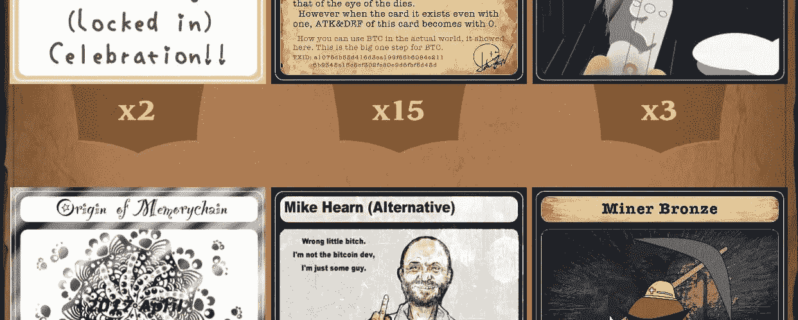
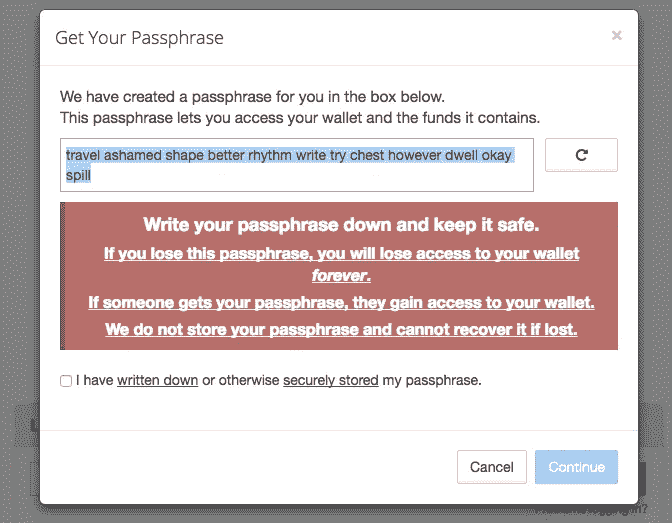
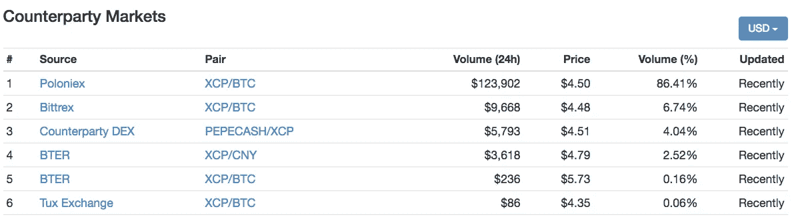
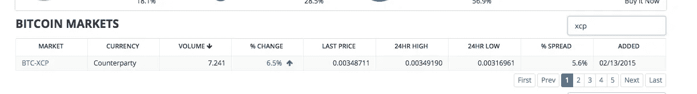
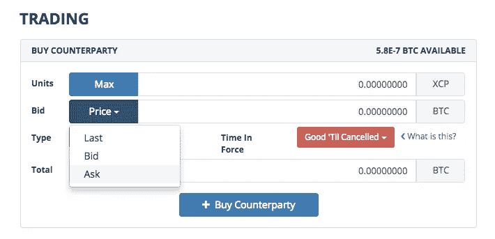
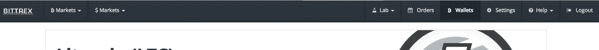
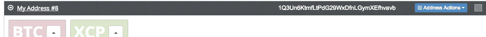
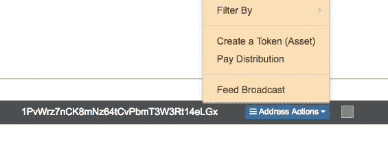
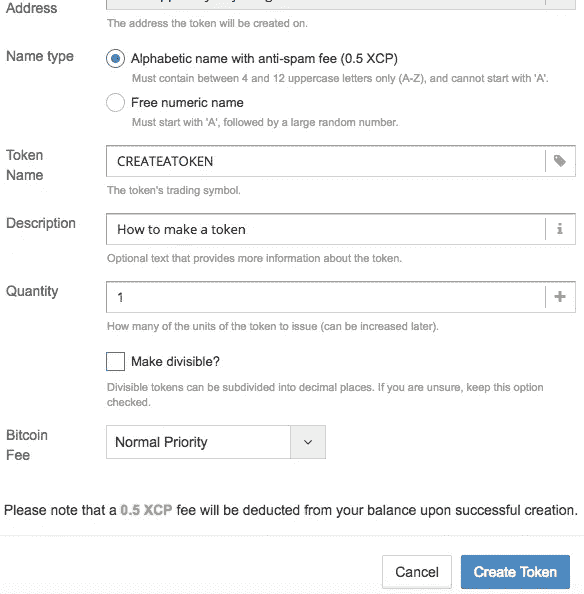
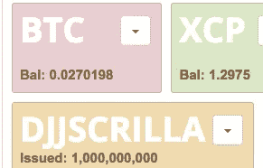

# 如何使用交易对手创建令牌(XCP)

> 原文：<https://medium.com/hackernoon/how-to-create-a-token-using-counterparty-xcp-357b2890e744>

Screenshot of a Book Of Orbs wallet which lists a number of trading card and in-game tokens.

在过去的 7 个月左右，我花时间用对手方(XCP)研究代币和资产，我已经陷入了一些相当不可思议的兔子洞。令人惊讶的是，“你的男孩$crill”被邀请做了几次演讲，讨论各种用例以及如何在[比特币见面会](https://www.meetup.com/Government-Blockchain-Professionals/events/235131195/)上创建代币，我在[的一本电子书](https://www.amazon.com/Blockchain-Billions-technology-money-change-ebook/dp/B01MYDV5VD/ref=asap_bc?ie=UTF8)中接受了采访，内容是通过区块链交易卡，现在我开始了我与辛西娅·盖顿、[主持的播客“区块链上的艺术”我并不自称是这方面的专家，但我确实有一些最近在这方面浪费时间的经验。我有兴趣让更多的艺术家、创意者、音乐家、游戏玩家、收藏家等探索这项技术，看看它能为你做些什么。](https://soundcloud.com/artontheblockchain)

比特币不仅可以用作数字货币的价值储存手段，还可以用作代币的结算层，利用其一流的安全性。通过使用对手方(XCP)附加代币，你可以创建自己的货币、游戏内代币、交易卡、奖励计划、授权密钥或者一些更聪明更漂亮的人能想到的东西。这对艺术家、音乐家、神谕、名人、推广人、俱乐部等尤其有用。

为什么是 XCP？交易对手没有向我支付任何费用，在以太坊、Waves、NXT 等社区中，许多区块链都在谈论象征性的话题。事实是，据我所知，XCP 是最值得信赖和最安全的，有一个很棒的社区——愿意免费提供帮助——而 XCP 肯定是我试过的最容易使用的。交易对手也有许多应用程序和项目使用它，如 [Sarutobi](http://www.mandelduck.com/sarutobi/) 、[宝珠之书](http://bookoforbs.com/index_eng.html)、[创世纪法术](https://spellsofgenesis.com/)、 [Takara](http://www.newsbtc.com/2016/01/23/takara-breadwallet-treasure-hunt/) 、[稀有佩佩交易](http://rarepepedirectory.com/)、[折叠硬币](https://bitcointalk.org/index.php?topic=781352.0)、 [Augmentors](http://www.augmentorsgame.com/) 、 [Token.fm](http://token.fm/) 、 [Indie Square](https://wallet.indiesquare.me/) 等等。如果你发现任何其他区块链代币的运气，欢迎在下面评论。

首先，你需要一点比特币和一些交易对手。

# 获取比特币——有几种方法…

1.首先，你需要一个比特币地址。由于我们将使用 XCP 又名交易对手代币，我建议您从 [counterwallet.io](https://counterwallet.io/) 或[counter wallet . coin daddy . io](http://counterwallet.coindaddy.io/)获取交易对手地址

**记下并妥善保管您的 12 字密码短语** — **这是您的私人密钥。你不应该分享或丢失它，否则你将无法使用你的钱包。**。

“Don’t be a fool, saving passwords is cool.” — Crypto T

2.接下来，**购买比特币**。(您将使用新创建的交易对手地址将它们发送到。)

*获取比特币有很多不同的方式。以下是简单的建议，我不负责任何丢失或找到的硬币。一开始可能会有点沮丧，你可以发邮件给 noRiskNoReward@soManyEmotions.com 发泄一下。*

a.从朋友那里匿名买一些。(你的朋友爱你爱到要和他们一直囤积的比特币分道扬镳吗？如果是的话。他们是真正的朋友。)

b.从 bitquick.co 等地半匿名购买，只需几个小时或更少。

c.从 localbitcoins.com[购买——如果你亲自购买，请在公共场合见面。注意:最好避免信用卡和贝宝服务。](http://localbitcoins.com/)

d.对新手来说，最容易的入口可能是:从 coinbase.com 的[购买——这是一家非常容易和有声望的公司，它有一个几乎模仿银行应用的光滑应用。如果你在这里购买，那么你不是匿名购买，你的比特币可能会被跟踪(客户还声称，如果他们将比特币发送到赌博网站或其他他们认为可疑的地方，他们会被禁止。)](https://www.coinbase.com/join/5606ab134169b01853000001)

# 既然你已经获得了比特币..

你需要获得一些交易对手(XCP)来发行代币。代币的发行成本为 0.5 XCP(这可能会根据 XCP 的价格在未来发生变化)，因此相应地购买。在写这篇文章的时候，1 BTC 大约可以兑换 292 XCP，约合 4.5 美元/个。

Counterparty logo

我可以推荐几个交易所，比如 Poloniex.com、bittrex.com、tuxexchange.com 或 shapeshift.com 的 XCP。

Screenshot from coinmarketcap.com.

为了本文的目的，我将向您展示如何使用 bittrex 收购 XCP。

1.转到[www.bittrex.com](http://www.bittrex.com)

2.点击“登录”，然后“注册”

3.接下来确认你的电子邮件

4.现在您已经注册，登录 Bittrex，然后您可以点击“市场”

5.在搜索框中搜索“XCP”

6.点击 BTC-XCP，订单和图表将出现。

**7。出于这个目的，我将只说市场购买(相对于在订单簿中设置出价以获得更好的交易)你的 XCP 由…**

A.在**“交易”**下查看

B.点击“投标”旁边的**“价格”**

C.点击下拉菜单中的**“询问”**

D.现在在“单位”旁边点击**“最大”**

E.现在，在**“单位”**部分，您应该有一个类似“0.00323400”的价格和一个类似“4”或“5.4358”的 XCP 单位

F.点击**“+买入交易对手”**

G.**你现在应该拥有一些 XCP**

H.注意:*如果您的整个订单没有完成，那么剩余部分将显示在“出价”订单簿的顶部或顶部附近。您可以取消订单并重复步骤 A-F，或者等待订单完成。*

8.现在点击 bittrex 菜单顶部的**“钱包”**。

9.在你的 XCP 旁边，你会看到一个**“+”**和**“-”**的标志。点击**“-”**(减号)。

10.现在，将您的钱包地址(存储密码的地址)中的 XCP 地址粘贴到**“地址”**部分。

Your XCP address is that 20-something digit string in the above screenshot.

11.键入要发送的数量或点击**旁边的双箭头图标“数量”**(我建议只发送大约 0.5 XCP 到该地址，以测试你是否正确地遵循了这些步骤，然后发送最大数量。)

12.现在仔细检查你的金额和你的地址。

13.现在三重检查你的地址是正确的。

14.现在点击**“撤回”**

15.在新屏幕上，第四次验证地址，点击**“确认”**

现在，几分钟后你会看到你的交易显示为**(x . 0)**XCP 金额和少量额外比特币**(0.0000 XXX)。”**根据目前的内存池和费用，可能需要大约 10 分钟到几个小时(很少，但有时您可能需要等待更长时间，不要惊慌。您可以在 [counterpartychain.io](https://counterpartychain.io/) 等块浏览器中查看您的 tx，以了解其状态。)

# 现在…我们终于可以创造我们自己的代币了！

1.通过粘贴或输入 12 个单词的密码，打开您的交易对手钱包([www . wallet . counter wallet . io)](http://www.wallet.counterwallet.io)))。

2.接下来，点击**“地址操作”**下拉菜单并选择**“创建令牌”**

Click on “Create a Asset (Asset)”

3.接下来你会看到一个弹出菜单，你可以用 0.5 XCP 的价格给你的代币命名，或者免费用数字命名。给你的令牌起一个包含 4-12 个字母的名字，但是不能以字母“A”开头(我相信这很快就会改变)，并且名字不能包含任何空格。代币的例子有 GORILLAGLUE、RAREIVANKA、PEPECASH、FLDC 等

4.在**“描述”**部分写下你的代币的描述。您可以使用 coindaddy.io 并按照他们的步骤来增强这一资产(添加图片、事实等)。

5.发放数量。 ***注:*** *这个可以改成以后只加更，不拿走，如果你不锁定令牌，那么如果你不确定不锁定，就发 1 个单位开始*

例:我想投资一项未来会用到的资产，名为 BENDERZ。我不知道我需要多少，也不知道它的确切用途是什么，所以我将只在 1 次发行时发行解锁的令牌。您必须确定的唯一问题是您的令牌是否应该是可分的。对某些人来说，比如在数字交易卡领域，你可能最好让它不可分割，如果它将成为一种货币，你可能更希望它可分割。

6.点击**“创建令牌”**

7.几分钟到一小时后，您的令牌应该会出现在您的钱包中。

At this moment… We are euphoric.

现在我该怎么处理我的代币呢？我们将很快对此进行更深入的研究……但请随时进入 [Telegram](https://telegram.org/) 了解更多信息，并在那里或 Twitter @ scrillaventura 联系我。

***现在试着把你的令牌送到我这里:***1k3 bnucgmdfimbaahepknqszdwgn 9 CGH fw

感谢 Shawn Leary 和 Encypted Charms 的校对=)

> [黑客中午](http://bit.ly/Hackernoon)是黑客如何开始他们的下午。我们是 [@AMI](http://bit.ly/atAMIatAMI) 家庭的一员。我们现在[接受投稿](http://bit.ly/hackernoonsubmission)并乐意[讨论广告&赞助](mailto:partners@amipublications.com)机会。
> 
> 如果你喜欢这个故事，我们推荐你阅读我们的[最新科技故事](http://bit.ly/hackernoonlatestt)和[趋势科技故事](https://hackernoon.com/trending)。直到下一次，不要把世界的现实想当然！

