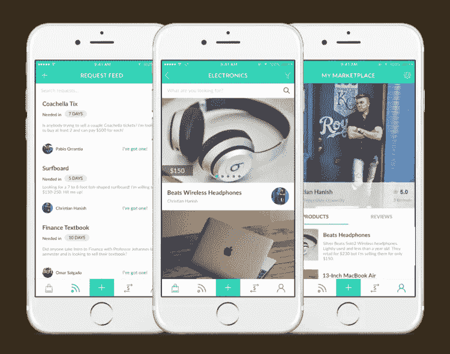
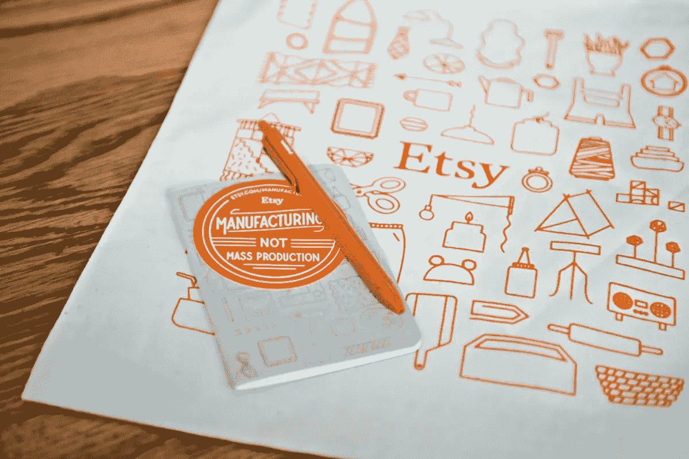

# 如何创建一个双边在线市场平台？

> 原文：<https://medium.com/hackernoon/how-to-create-a-two-sided-online-marketplace-platform-6d10eb9c03db>

当公司做出下一次预测并撰写 20XX 趋势帖子时，人们可能会忘记他们甚至不得不去超市和商店或支付现金。你还是要和送货员闲聊，不是吗？—也是时间问题。2016 年 12 月，亚马逊声称其第一次成功的 Prime Air 无人机送货。

## 在线市场软件:期待什么？

在线购物市场解决方案在技术、物流、交付、供应和其他酷东西方面不断得到增强和更新。预订或购物时需要帮助吗？——Twitter、WhatsApp、脸书和其他公司正在积极整合聊天机器人，从而让客户熟悉人机交互。例如，脸书已经有超过 [11，000 个机器人](http://www.forbes.com/sites/kathleenchaykowski/2016/07/01/more-than-11000-bots-are-now-on-facebook-messenger/#4ccaa52f6b82)可用，而多供应商服装创业公司 [Spring](http://www.forbes.com/sites/rachelarthur/2016/04/12/shopping-start-up-spring-launches-one-of-first-bots-on-facebook-messenger/#7d0714724ee7) 是其早期采用者之一。我们不应该忘记个人数字助理，如苹果的 Siri、微软的 Cortana 和亚马逊的 Alexa，以及其他人机交互的例子。

目前，电子商务是零售业领域的一支优势力量。Statista 声称，2015 年全球零售额高达 1.55 万亿美元，预计 2019 年将增至 3.4 万亿美元，2020 年将增至 4.058 万亿美元。在 2015 年至 2016 年期间，在线买家的数量增加了约 2000 万人。

商业内幕的高级研究服务 BI Intelligence 预计，到 2021 年，将会有 280 万台机器人出货。制造业将会使用工业机器人，商店里也会有盘点存货或填满货架的机器。像塔吉特、百思买、亚马逊、果园供应硬件(劳氏子公司)[这样的零售巨头已经在他们的商店里测试机器人](http://www.businessinsider.com/target-testing-iot-robots-in-stores-2016-5)。甚至中国的一些餐馆已经实践了这个想法，T4 用机器人代替了服务员。

## 网上购物市场:从哪里开始？

电子商务的受欢迎程度每年都在增长，而且没有放缓的迹象。凭借在线支付技术的进步和交易者接受信用卡支付的意愿，在线零售生态系统正在不断发展。

要建立一个双边在线市场，你应该从开始

*   **填补空白**

专注于一个特定的利基市场，并提供能够击中该利基市场观众的产品，是创建基于云的电子商务市场软件的早期阶段的基本规则。如果你对每个人都有吸引力，最终你可能对任何人都没有吸引力。

选择一个你已经有经验的领域是最好的选择。这样你就能更好地了解你的受众的需求和潜在的问题，这样你就能销售和提供买家无法拒绝的解决方案，因此，你的产品永远不会浪费。

**DA-14 真实案例示例:**我们的开发人员已经为大学生开发了一个定制的市场解决方案。这个想法是基于“免费出售”的在线社区，它消除了搜索的需要，使买卖过程迅速而安全。这个点对点平台包括内部支付网关、评论和评级、产品和请求源以及其他有用的选项。

[*Flypd*](https://da-14.com/portfolio/flypd) *—由 DA-14 团队开发的社交驱动市场平台*

*   **钉钉用户体验**

开发双边市场平台的决定不应该被轻易对待。这正是将策略和想法转化为成功业务的背景。如果你仍然想知道如何建立一个市场网站，并使其蓬勃发展，那么你一定要努力使它方便，可靠和个性化的交易者和买家。

你可以让你的电子商务网站感觉像一个社区，从而吸引你的潜在客户。大量基于网络的零售平台仍然是以商业为导向的，而 Etsy 是创业公司和潜在客户不同方法的完美例子。他们围绕一个利基市场建立了整个社区，通过这种方式，他们提供 [Etsy](https://www.etsy.com/) 成员加入团队，参加活动，观看研讨会等。

*   **在**得到高辊

大供应商可以处理大订单，拥有处理交易的必要知识，他们已经赢得了客户的信任。在初始阶段，与这些商家的合作尤其有用。这种方法有助于弥补供需缺口，即众所周知的先有鸡还是先有蛋的问题。

另一个关于如何启动在线市场的解决方案是关注一个特定的群体，包括潜在的供应商和消费者。其中一个例子是 Etsy:他们的研究表明，做手工艺品的人更喜欢从其他手工艺者那里购买，而这两个群体通常都参与同一个社区。

*照片由:* [*Etsy*](https://www.etsy.com/)

谈到平衡供求关系的其他工具，有几个流行的案例研究。当优步开始运作时，它只限于三藩市，当它取得重大进展时，它就被推广到其他城市。Flipkart 也采用了“从小做起”的策略，从图书销售开始，随着时间的推移，开始覆盖其他电子商务领域。

在西雅图推出这项服务时，优步开始向空转的司机付费，这反过来带来了高价值的生产者，并吸引了消费者。约会机构表示，男性成员的数量超过了比例，这就是为什么他们主要邀请女性免费加入。

做一个双面市场网站是一项复杂而持续的任务，为了让你的公司有一个繁荣的开端，你应该首先找到一种方法来克服潜在的问题。最后但并非最不重要的一点是倾听终端用户的声音，优化开源平台。社区是你业务的一部分，所以以人为本设计和建设零售网站是至关重要的。

## 创造一个双边市场&下一步是什么？

如今，电子商务商业模式应用于消费品、时尚、教育、交通、旅游、房地产等领域。但是在线市场平台开发成本不仅应该包括定制软件开发，还应该包括营销和广告、进一步增强和支持、SEO、推广和媒体内容创作。

**从发布促销开始。**制作并打印出带有即将开放网站链接的精美明信片。你也可以分发一些小折扣的卡片，对未来的商店有一点了解。通过社交网络和电子邮件宣传你的宠物项目。

**做自己的产品。** Udemy 投资了自己的课程。Reddit 创始人过去常常制作自己的内容。Airbnb 的创始人参观了纽约地区的上市公寓，为网站拍摄高质量的照片，现在他们有一个专业摄影师团队为东道主提供电影服务。

**投资客户服务。**将首次客户转变为忠诚客户，让他们觉得自己有价值、与众不同。如果你打包并送货上门，附上手写的感谢信和精美的免费礼物。发送后续电子邮件并寻求反馈。反应灵敏，回报容易。

**使用在线全九码。通过各种在线渠道与您的客户建立密切关系。使用电子邮件营销来欢迎新的网站成员，通知新的到达和折扣，提醒废弃的购物车或请求反馈和评论。添加简短的提示，如“通常购买”或“添加最后的装饰”。**

**解决手机版的问题。移动商务正在蓬勃发展，为了保持竞争力，将移动网站放在首要位置至关重要。包括实时通知、运输状态、产品信息、分享/购买按钮，以提高用户参与度和可用性。**

如需更多关于建立繁荣的点对点市场的建议，请立即[联系我们的团队](https://da-14.com/contact-us)。

> [黑客中午](http://bit.ly/Hackernoon)是黑客如何开始他们的下午。我们是 AMI 家庭的一员。我们现在[接受投稿](http://bit.ly/hackernoonsubmission)并乐意[讨论广告&赞助](mailto:partners@amipublications.com)机会。
> 
> 如果你喜欢这个故事，我们推荐你阅读我们的[最新科技故事](http://bit.ly/hackernoonlatestt)和[趋势科技故事](https://hackernoon.com/trending)。直到下一次，不要把世界的现实想当然！

