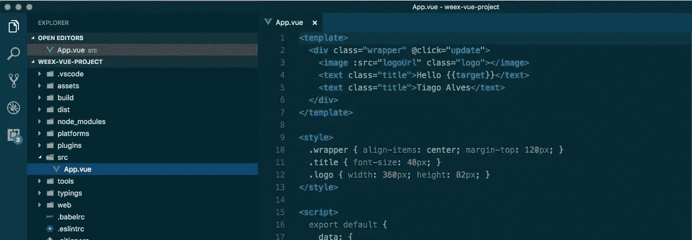
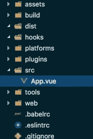
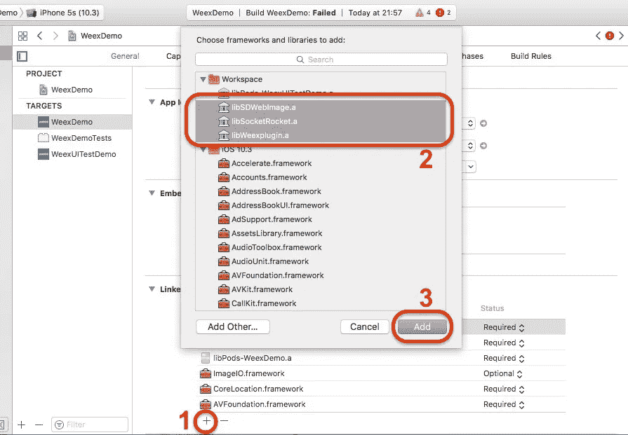

# 带有 Weex 和 VueJS 2.0 的原生移动应用

> 原文：<https://medium.com/hackernoon/how-to-create-a-weex-vue2-project-6b94981bee4e>

如何为 Web、Android 和 iOS 构建 Weex 应用程序！



如果你读过[Weex 的现状:一份不准确且过时的报告](/@tiagoreisalves/the-state-of-weex-an-inaccurate-and-outdated-report-fae2c6e5fc2e)，你会了解到没有明确的途径来开发一款适用于 web、 [Android](https://hackernoon.com/tagged/android) 和 iOS 的 Weex VueJS 应用。

嗯…现在有了！我们开始吧！


好吧…也许我们应该在这里设定适当的期望值。Weex 仍然有很多粗糙的边缘。本教程不会结束可部署的生产应用程序。不过，你会看到一个简单的 Weex Vue2.0 应用程序在浏览器和手机上运行。这是一个很好的里程碑。

# 安装工具

我们将需要 [vue-cli](https://github.com/vuejs/vue-cli) 来安装模板和 [weex-toolkit](https://github.com/weexteam/weex-toolkit) 来构建本地应用程序。

```
> npm install -g vue-cli
> npm install -g weex-toolkit
```

# 创建应用程序

从这个 [weex-vue 模板](https://github.com/tralves/weex-vue)创建应用程序。

```
> vue init tralves/weex-vue <project_name>
> cd <project_name>
> npm install
```

该模板使用文件夹结构创建项目:



Folder structure

重要的文件夹有:

*   `dist` —编译后的 js 将去向何方。
*   `platforms` — Android/iOS 原生项目。
*   `src`—app 代码。

其他重要文件:

*   `config.xml` —用于生成本地项目的 cordova 配置文件。这还不能正常工作。
*   `weex.html` —网页版的入口文件。
*   `app.js`—[vue js](https://hackernoon.com/tagged/vuejs)用于`weex.html`的引导文件。
*   `index.html`—在类似手机的框架中呈现应用程序。显示一个二维码，您可以用它将您的应用程序加载到 [Weex 游乐场应用程序](https://weex.apache.org/playground.html)中。

您的应用程序将在`src`中。如果您打开`App.vue`文件，您会发现一个只有两个 Weex 组件的简单布局:`<image>`和`<text>`。你可以在官方文档中找到更多关于所有 Weex 组件[的信息。Weex 将这些组件编译成网页版的 html(例如，`<image>`变成了``)和 iOS/Android 应用的原生组件。](https://weex.apache.org/references/components/index.html)

这个例子非常简单，但是您可以构建更复杂的应用程序。查看 [weex-hackernews](https://github.com/weexteam/weex-hackernews) 和 [weex-todo-list](https://github.com/tralves/weex-todo-list) 。这些应用程序展示了如何使用 vue 路由器、vuex、本地持久数据等。

# Web 构建

```
> npm run build
> npm run serve
```

命令`npm run build`将应用的 web 和本地版本编译成`build/`。`npm run serve`启动一个本地网络服务器。

现在，您可以将浏览器指向`[http://localhost:8080](http://localhost:8080to)`以在浏览器中预览移动应用，并指向`http://localhost:8080/weex.html`以访问网页版本。

# Android 版本

首先，我们需要:

*   下载安装[安卓工作室](https://www.google.com.br/url?sa=t&rct=j&q=&esrc=s&source=web&cd=1&cad=rja&uact=8&ved=0ahUKEwiO97vWqZjTAhWGEJAKHWL4AwEQFggiMAA&url=https%3A%2F%2Fdeveloper.android.com%2Fstudio%2Findex.html&usg=AFQjCNFxiiJ5jw3OprFf7ya-IJj9GFv2Eg&sig2=69T1Hl64JW95-mSaCQIF7w)。
*   添加`$ANDROID_HOME`环境变量，并将 SDK 工具添加到`$PATH`中。在我的例子中，我添加了`.bash_profile`:

```
export ANDROID_HOME=~/Library/Android/sdk
export PATH=${PATH}:$ANDROID_HOME/tools:$ANDROID_HOME/platform-tools:$ANDROID_HOME/build-tools
```

然后我们添加 android 平台:

```
> weex platform add android
```

然后，连接 Android 设备([并激活 USB 调试](https://www.howtogeek.com/129728/how-to-access-the-developer-options-menu-and-enable-usb-debugging-on-android-4.2/))并运行:

```
> weex run android
```

> 注意:如果你没有 Android 设备，它会使用一个非常慢的模拟器。

就是这样！应用程序应该在设备中运行！

# iOS 版本

先决条件:

*   Xcode
*   [椰子](https://cocoapods.org/)

然后:

```
> weex platform add ios
```

安装 cocoapods 依赖项:

```
> cd platforms/ios
> pod install
```

打开`platforms/ios`下的 Xcode 工作区`WeexDemo.xcworkspace`。

从窗格中添加依赖关系:



*   打开通用设置。
*   (1)按下**下的“+”链接框架和库**
*   (2)选择`libSDWebImage.a`、`libSocketRocket.a`和`libWeexplugin.a`库。
*   (3)按“添加”

跑项目！

> 我对过时的椰子有些问题。如果你遇到编译问题，试试`pod update`。

# weex-vue 的下一步？

待办事项列表很大:

*   请修复 config.xml 设置。
*   让 config.xml 生成一个正确配置的 Android/iOS 项目。目前，这个模板生成的项目有错误的名称、图标、应用 id 等。
*   修复调试工具。Weex 有非常棒的使用 Chrome 开发工具的调试工具。到目前为止，我还不能使它正常工作。
*   改进构建工具:图标/闪屏生成器、可分发的 Web 构建等。
*   关于 Weex 插件的工具和教程，这些插件是与本机功能交互的组件。
*   更多的演示应用，更复杂的场景，将显示更多的 Weex 组件和插件。

[](http://bit.ly/HackernoonFB)[](https://goo.gl/k7XYbx)[](https://goo.gl/4ofytp)

> [黑客中午](http://bit.ly/Hackernoon)是黑客如何开始他们的下午。我们是 [@AMI](http://bit.ly/atAMIatAMI) 家庭的一员。我们现在[接受投稿](http://bit.ly/hackernoonsubmission)并乐意[讨论广告&赞助](mailto:partners@amipublications.com)机会。
> 
> 如果你喜欢这个故事，我们推荐你阅读我们的[最新科技故事](http://bit.ly/hackernoonlatestt)和[趋势科技故事](https://hackernoon.com/trending)。直到下一次，不要把世界的现实想当然！

