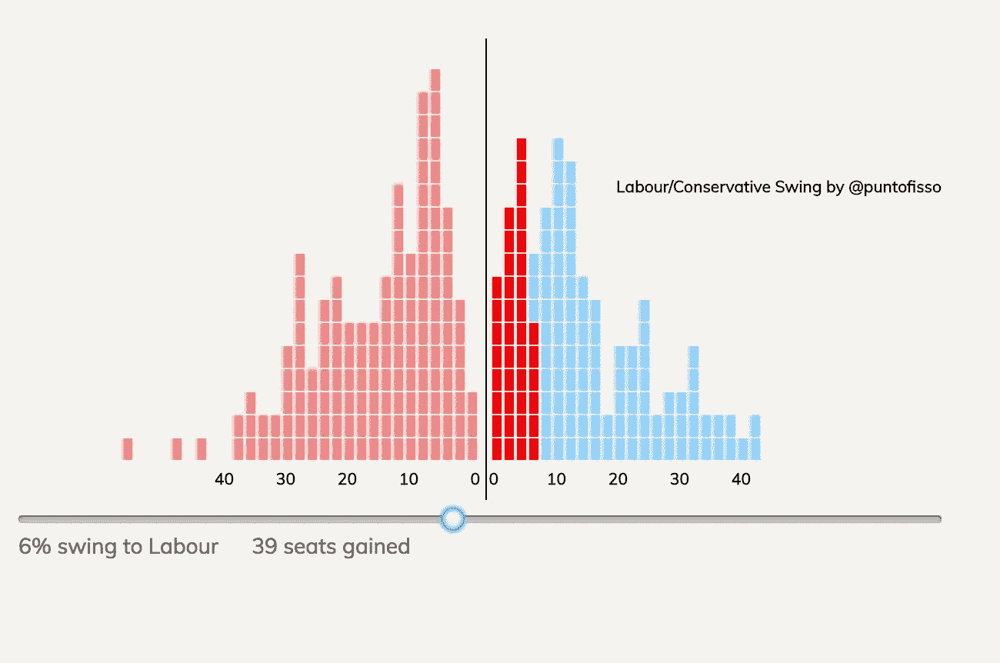
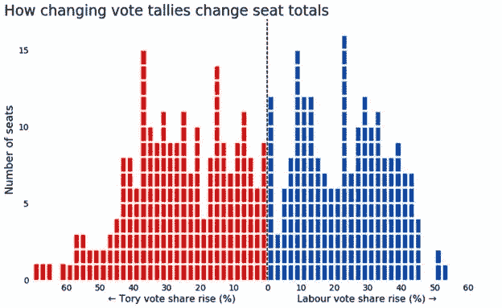
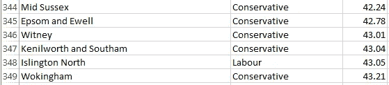

# 如何在 D3 中创建交互式投票摇摆查看器(第 1 部分)

> 原文：<https://medium.com/hackernoon/how-to-create-an-interactive-vote-swing-viewer-in-d3-a6bbd4c96b6f>



The final result: a fully interactive Labour/Conservative swing viewer

几天前，BBC 新闻之夜的政策编辑克里斯·库克的这篇文章出现在 BBC 网站上。文章讨论了 May 和 Corbyn 如何开展截然不同的活动，并使用了以下图表来支持其分析:



Image © BBC: [http://www.bbc.co.uk/news/uk-politics-39927866](http://www.bbc.co.uk/news/uk-politics-39927866)

我想:哇——这是一个非常好的可视化，可以很容易地用来表示任何两方摇摆。它也可以多一点互动性。所以我开始复制它，我将向你们展示如何复制。最后的结果是这里的。

## **警告**:你会看到一些非常肮脏的编码。我在下班后的几个小时内创造了这个工具。多花一点时间和精力，我相信你会做得更好。

开始了。

# 首先，获取数据，确保数据可靠

我这样说是因为我第一次尝试使用我之前从维基百科搜集的一些数据。我没有检查就按下了“发布”按钮。严重的错误。幸运的是，推特总是很有帮助

这一数据的最佳来源是英国选举研究，正如克里斯·汉莱蒂(Chris Hanretty)所建议的那样(如果你对政治数据分析感兴趣，你应该关注他)。数据可在“BES 选区结果与人口普查和候选人数据”下的[此处](http://www.britishelectionstudy.com/data-objects/linked-data/)下载。使用像 BES 这样公认的数据集也将使您的分析和工具可以与他人相比。

# 清理数据，删除不需要的内容

BES 附带了许多有用的变量，但是对于一个简单的两党摇摆工具，我所需要的只是一个三元组:选区名称、获胜政党和多数党(百分比)。此外，我只需要工党和保守党在前两个位置的选区(以任何顺序)。幸运的是，BES 结构良好，所以我简单地使用 Excel 过滤器和一些脚本对其进行了过滤，获得了如下所示的 CSV:



The resulting spreadsheet

现在，我可以直接使用这个 CSV 文件，但是我更喜欢使用 JSON，因为它可以很好地处理 D3。由于它更加结构化，它还允许我扩展数据以支持不同的未来分析。我使用了一个快速 Bash 脚本来做到这一点:

```
while read line
do
        const=`echo $line | awk -F"," {'print $1'}`
        maj=`echo $line | awk -F"," {'print $3'}`
        winner=`echo $line | awk -F"," {'print $2'}`

        echo "{"
        echo " \"name\": \"$const\","
        echo " \"majority\": \"$maj\","
        echo " \"winner\": \"$winner\""
        echo "},"
done < bes.csv
```

确保生成的 JSON 是正确的，去掉最后一个逗号，就可以开始了。

# 总的想法

我要做的事情相对简单:

1.  我将宣读工党/保守党占多数的选区名单
2.  将在 SVG 画布中为每个选区绘制一个矩形
3.  如果当前由保守党议员担任，矩形将位于右侧，并涂上浅蓝色；红色(如果当前正在分娩)和浅红色
4.  该矩形将被堆叠在一个代表其多数的“盆”中，因此我们可以计算收益；每个罐将代表几个百分点的摆动，例如，大多数在 29%和 31%之间的每个席位将在罐“30”
5.  一个滑块可以让你和秋千互动；摇摆的座位将呈现更强烈的蓝色或红色，这取决于谁的增益。

# 设置您的 html 页面

为了将所有这些整合在一起，我使用了一个 bootstrap 模板，但是您可以使用任何您觉得合适的模板。它所需要做的只是一个图表容器、一个滑块和一些显示摆动的文本容器(因为懒，我还使用了一个隐藏的 span 来包含一个表示当前滑块值的数字)。记得添加最新的 jquery 库和 D3(我的代码用的是 D3 版本 4):

```
<div id="graph"></div>
<input type="range" id="slider" min=0 max=100 /></input>
<span id="slidertext">No swing</span>
<span id="slidervalue">0</span>
<span id="seats">0</span>
```

请注意，我将滑块设置为在 0 到 100 的范围内操作。你可以让它表现得不同，但我更喜欢这样做，因为如果我想切换到使用百分比，这很方便。

# 让我们添加选区数据

使用上面的脚本，您可以生成一个由 D3 读取的 JSON 文件，或者将它作为一个变量嵌入到您的 html 文件中。我选择了后者:

```
var constituencies = [
{
   "name": "Gower",
   "majority": "0.06",
   "winner": "Conservative"
},
{
   "name": "Derby North",
   "majority": "0.09",
   "winner": "Conservative"
 },
// and so on ... 
];
```

# 图表设置:一点脚手架

图表设置相对容易。首先，我们使用它的 id (#graph)选择上面创建的 div。我们向它添加一个 svg 元素，并配置它的主要属性—宽度、高度等:

```
var svgContainer = d3.select("#graph")
                     .append("svg")
                     .attr("width", 600)
                     .attr("height", 350)
                     .style("border", "0px solid black");
```

我们还想在每个选区显示一个工具提示。这只是一个出现在某处的 div:

```
var div = d3.select("body").append("div")
            .attr("class", "tooltip")
            .style("opacity", 0);
```

# 我们准备好了:绘图功能

页面上的辛苦工作是由一个函数完成的。每次加载页面和移动滑块时都会调用 paint _ constituencies()(稍后我会向您展示)。你也许可以用一种不需要重绘的方式更有效地完成它，但是这很简单，性能不会成为问题。

首先，让我们将画布从其内容中清除，并检查滑块上是否有摆动(以便我们稍后使用该值)；

```
svgContainer.selectAll("*").remove();
var swing = d3.select('#slidervalue').node().innerHTML;
var seats_gained = 0;
```

通过将我们的数组绑定到创建矩形的工厂方法，可以很容易地为每个选区创建一个矩形。我们创建矩形，并将它们附加到刚刚清空的 svg 容器中。如果你在开发工具中看到 html 元素，你会意识到这些只是添加到主标签中的标签。我们以后再担心造型。

```
var rectangles = svgContainer.selectAll(“rect”)
 .data(constituencies)
 .enter()
 .append(“rect”);
```

我们已经触及了这个应用的核心。我们现在需要做的就是对我们刚刚创建的矩形应用正确的样式。

在我们这样做之前，你会记得我们说过要根据矩形的多数来堆叠矩形。我简单地使用计数器，每个“罐子”一个:这样我就知道如果我想在一个堆栈上添加一个矩形，我可以看到这个堆栈在哪个级别。比如说我想增加一个 30%多数的选区；我需要做的就是检查 29–31 底池。将会有锅来覆盖所有可能的多数(东哈姆是相当的离群值，有 65.50%的多数！)我选择将它们分成 2%。为了初始化 pots，我执行以下操作:

```
var stackLab = {};
var stackCon = {};
for (i = 0; i<67; i=i+2) {
 stackLab[i] = 0;
 stackCon[i] = 0;
}
```

我们现在需要做的就是给矩形正确的属性:它们的 x 和 y 位置、大小、填充等等。在我们到达那里之前，我建议您熟悉 SVG 画布的工作方式——它并不完全是笛卡尔平面。它的轴系总是从左上角的(x=0，y=0)开始；因此，轴总是正的，你可能需要通过调整符号和移动值来从笛卡尔坐标转换你的坐标。这就是我们在接下来的几行代码中要做的。

D3 允许您设置属性的方式非常简单。这种假设的一般形式如下:

```
rectangles.attr(<attribute name>, <value>);
```

最重要的一点是<value>可以是一个函数，带有一个参数来指示我们正在处理哪个特定的矩形。例如，如果我们想把矩形放在水平轴上，从 0 开始到它们的多数所在的位置，我们应该这样做:</value>

```
rectangles.attr("x", function(d) {
 return d['majority'];
});
```

花些时间欣赏这几行。我们将广泛使用它们。

第一步是给我们的矩形一个大小。这相对简单，并且您可以处理这些值，直到您满意为止:

```
rectangles.attr("width", 6).attr("height", 14);
```

是的，你可以像这样连接多个设置——D3 是面向对象的，所以每个函数总是返回原始对象，无论函数做了什么修改。这非常方便。

让我们把长方形放在正确的地方。

对于 x 轴，上面的代码行不能正常工作，因为我们将我们的区域分为两个区域，工党控制的区域和保守党控制的区域。实际上，我们需要将所有内容平移总宽度的一半，我们在初始化图表时将总宽度定义为 600。

想象一下笛卡尔平面上的 x 轴。保守的会在右边，这里 x > 0；工党将在左边，x<0。在我们的 svg 图上，我们的 0 是其宽度的一半:300。因此，保守矩形将大致在区域[301，302，… 600]，而劳动矩形将在区域[0，1，2 … 300]。

我们还想考虑矩形的大小和它们之间的间距，并确保我们记住不要使用实际的多数，而是该多数所属的锅。这相当于以下几行:

```
rectangles
.attr("x", function (d) {
 var pot = Math.round(d['majority'] / 2)*2;
 if (d['winner'] === "Conservative")
  val = 300 + (pot+2)*4;
 else
  val = 300 — (pot+2)*4;
 return val;
 });
```

y 位置的代码非常类似，除了我们将使用该底池达到的堆叠级别，而不是单纯的底池值。换句话说，我们希望将矩形放在该罐中任何已有矩形的顶部，并增加该罐的堆叠级别:

```
rectangles
.attr("y", function (d) {
 var pot = Math.round(d['majority'] / 2)*2;
 if (d['winner'] === "Labour")
  val = 310 — (stackLab[pot]++)*15;
 else
  val = 310 — (stackCon[pot]++)*15;
 return val;
 });
```

我们现在准备添加颜色，使用我们在开始时设置的 swing 变量:

*   浅蓝色或浅红色代表选区的当前持有人；这将在没有施加摆动时出现
*   如果我们应用了一个摆动，并且该摆动大于该矩形所代表的选区的当前多数，则根据谁赢得了席位，颜色将变成强烈的蓝色或红色
*   顺便说一下，我们已经设计了滑块，如果方向是左，我们需要考虑负摆动，即工党，如果方向是右，我们需要考虑正摆动，即保守党。

为了实现所有这些，我们使用“fill”属性和摇摆公式——简而言之，记住要赢得 10%多数席位，你需要 5%的摇摆。当我们这样做时，我们也可以直接从 d3 设置我们的文本增益指示器。因此:

```
rectangles.style("fill", function(d) {
 var returnColor; if (d['winner'] === "Labour")
  {
  if (swing*2 > +d['majority']) {
   seats_gained++;
   returnColor = "#0000ff"; //red
  } else {
   returnColor = "#f08080"; //light red
  }
 } else if (d['winner'] === "Conservative")
  {
  if (-swing*2 > +d[majority']) {
   seats_gained++;
   returnColor = "#ff0000"; //blue
  } else {
  returnColor = "#87cefa";//light blue
  } d3.select('#seats').node().innerHTML = seats_gained + " gains";
  return returnColor;
}
```

最后，我们希望矩形显示一些关于选区的数据。我们可以这样做，显示我们之前定义的工具提示，我们将使用*监听器*这样做。侦听器是帮助器函数，它检测页面上的特定事件，并允许您定义对这些事件的反应。在我们的例子中，我们希望当鼠标指针点击一个矩形时工具提示变得可见，当它不在焦点上时消失:

```
rectangles
.on("mouseover", function(d) {
 div.transition()
 .duration(200)
 .style("opacity", .9);
 div.html(d['name'] + "<br/>" + d['majority'] + "%")
 .style("left", (d3.event.pageX) + "px")
 .style("top", (d3.event.pageY — 28) + "px");
 })
 .on("mouseout", function(d) {
 div.transition()
 .duration(500)
 .style("opacity", 0);
 });
```

上面的代码可能看起来令人困惑，但是如果你一行一行地读它，它实际上是非常容易的。它所做的是使用一个过渡，在这个例子中是一个延迟，来显示工具提示，让用户感觉更舒服。剩下的只是样式问题(添加不透明度=出现，移除不透明度=消失)，以及添加内容，在这种情况下只是选区的名称和当前的大多数。

为了让事情更清楚，我在中间加了一个竖线。这实际上非常简单，因为它只使用两个坐标，(x1，y1)表示底端，(x2，y2)表示顶端:

```
svgContainer.append(“line”)
.style(“stroke”, “black”)
.attr(“x1”, 304) 
.attr(“y1”, 350) 
.attr(“x2”, 304) 
.attr(“y2”, 50);
```

# 标签是可选的，但会使图表更容易阅读

如果你看到我原来的[摆动工具](http://swing.puntofisso.net)，x 轴上有标签。为此，我创建了一个函数 add_labels()，从 paint _ constituencies()中调用它。这允许我决定在哪里放置什么，但是有更好的集成方式，例如使用范围和域。在这种情况下，由于我有花盆，可能不想显示所有标签，我选择了非常手动的方法。

我的函数所做的是将文本追加到 svg 容器中。例如:

```
svgContainer.append("text")                                                         .attr("class", "x label")                                      .attr("text-anchor", "end")                                       .attr("x", 300 + (1+2) * 4)                                     .attr("y", 340 )                                                .text("0");
```

我把剩下的留给锻炼。总的想法是，你找到 y 轴上的最佳点，然后决定如何间隔它们。

# 滑块监听器

为了将它们结合在一起，我们需要在 swing 滑块移动时做出反应。请记住，我们已经将其设置为 0 到 100 之间的范围，而实际上这可能代表 0%-100%的波动(嗯，理论上…)，如果倾向于保守党，这将是积极的，如果倾向于工党，这将是消极的。实际上，我使用 0-100 的滑块来代表-100-100 的范围。所以我需要转换值，当我们完成计算后，我们可以设置文本并重新绘制矩形:

```
$('#slider').change(function() {
 swing_pc = $(this).val()-50;
 swing=200*swing_pc/100; if (swing>0){
  text = swing+"% swing to Conservative";
 } else {
  text = -swing+"% swing to Labour";
}
                                                                $('#slidervalue').html(swing);                                                               $('#slidertext').html(text);paint_constituencies();
});
```

差不多就是这样了！

# 记得配置你的 CSS

为了让它显示得更好，您将设置一些样式。您可能希望滑块具有给定的大小，并且工具提示出现在特定的位置。有几种方法可以做到这一点，但为了完整起见，我将粘贴我的 CSS:

```
div.tooltip {
    position: absolute;
    text-align: center;
    width: 120px;
    height: 28px;
    padding: 2px;
    font: 12px sans-serif;
    background: white;
    border: 0px;
    border-radius: 8px;
    pointer-events: none;
}#slider {
  width: 600px !important;
}span#slidervalue {
  visibility: hidden !important;
}
```

# 干得好，终于来了！

我没什么可说的，除了通常的:

1.  如果您有任何反馈，请让我知道-这是正在进行中的工作
2.  请在 http://twitter.com/puntofisso[的 twitter 上关注我](http://twitter.com/puntofisso)
3.  在 http://puntofisso.net/newsletter 的[订阅我关于所有极客奇闻、数据可视化、开放数据和数据新闻的时事通讯](http://puntofisso.net.newlsetter)
4.  求推荐分享这篇中帖:-)

[*本教程第二部分*](/@puntofisso/how-to-create-an-interactive-vote-swing-viewer-in-d3-part-2-fd6ac625930a) *现已发售。更多喜欢的请* [*在 twitter 上关注我*](http://twitter.com/puntofisso) *并订阅我的* [*简讯*](http://puntofisso.net/newsletter) *。*

[](http://bit.ly/HackernoonFB)[](https://goo.gl/k7XYbx)[](https://goo.gl/4ofytp)

> [黑客中午](http://bit.ly/Hackernoon)是黑客如何开始他们的下午。我们是这个家庭的一员。我们现在[接受投稿](http://bit.ly/hackernoonsubmission)并乐意[讨论广告&赞助](mailto:partners@amipublications.com)机会。
> 
> 如果你喜欢这个故事，我们推荐你阅读我们的[最新科技故事](http://bit.ly/hackernoonlatestt)和[趋势科技故事](https://hackernoon.com/trending)。直到下一次，不要把世界的现实想当然！

