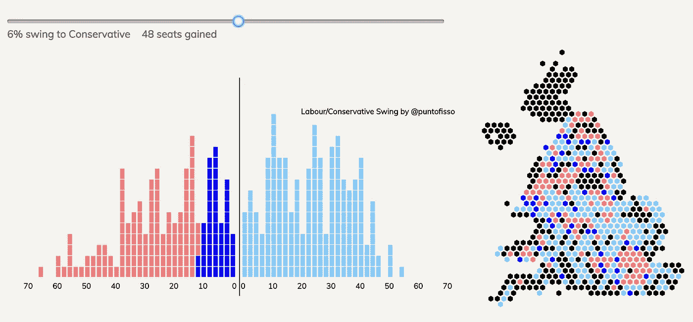
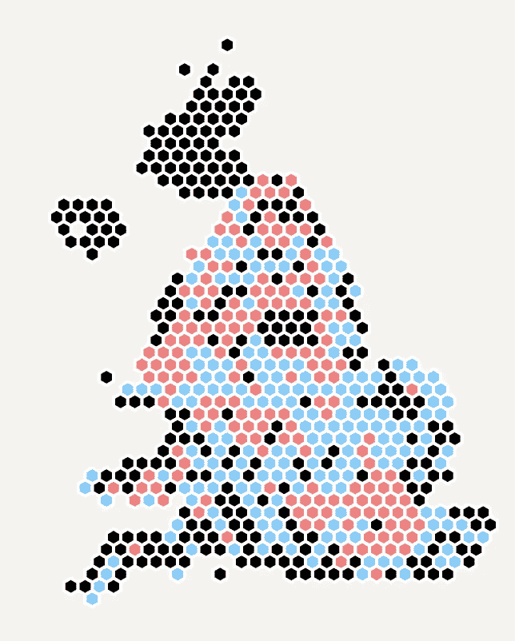

# 如何在 D3 中创建交互式投票摇摆查看器(第 2 部分)

> 原文：<https://medium.com/hackernoon/how-to-create-an-interactive-vote-swing-viewer-in-d3-part-2-fd6ac625930a>



My interactive party swing tool, now with added hex map

在我之前的[帖子](/@puntofisso/how-to-create-an-interactive-vote-swing-viewer-in-d3-a6bbd4c96b6f)中，我讲述了如何使用 D3 为即将到来的大选创建一个工党/保守党摇摆观众。这是一个相当简单的，不是特别高性能的，但有用的工具，可以很容易地重新适应任何其他有意义的两党摇摆的选举。

我的“开放数据兄弟”杰米·威特拿起它，用它创建了一个非常好的地图可视化——将挥杆从 2 轴堆叠视图移动到地理视图。去[的网站](http://propolis.io/dataviz/swingmap/swingmap.htm)看看杰米的互动地图。我花了一些时间玩杰米的地图，因为它真的很好。但是每一个地理可视化都伴随着一个问题:它夸大了低人口地区的影响。

有很多方法可以解决这个问题，幸运的是，英国开放数据社区的另一个中坚力量——利兹的 ODI node 提供了一个方法。他们开发了[一个开发六边形地图](https://odileeds.org/blog/2017-05-08-mapping-election-with-hexes)的简单标准，这是一种可视化网格的方式，节点可以比正方形或长方形更自由地放置。十六进制地图是一个非常强大的工具，它允许笛卡尔网格的简单性，同时以类似于地理的方式放置信息。

感谢 Oli Hawkins 开发的 [d3-hexjson 库](https://github.com/olihawkins/d3-hexjson)，十六进制地图很容易与 d3 一起使用。这是最终的结果，以及我是如何做到的:



650 constituencies in a hex map

# 十六进制地图是如何工作的

十六进制映射基本上是一种标准，它以指定的方式将数据放在 JSON 文件中。您可以指定节点，给它们一个名称、一些属性，并将它们放在网格上。完整的解释可以在[这里](https://odileeds.org/projects/hexmaps/hexjson.html)找到。对于这篇文章，只要说我使用了 ODI Leeds 制作的[选区十六进制地图](https://github.com/odileeds/hexmaps/blob/gh-pages/maps/constituencies.hexjson)就足够了，看起来像这样:

```
..."E14000530":{"n":"Aldershot","q":-3,"r":-11,"a":"SE","u":"UKJ","p":72430}, "E14000531":{"n":"Aldridge-Brownhills","q":-3,"r":-1,"a":"WM","u":"UKG","p":60215}, "E14000532":{"n":"Altrincham and Sale West","q":-7,"r":3,"a":"NW","u":"UKD","p":71511}, "E14000533":{"n":"Amber Valley","q":0,"r":2,"a":"EM","u":"UKF","p":69510}, "E14000534":{"n":"Arundel and South Downs","q":0,"r":-15,"a":"SE","u":"UKJ","p":77242},
...
```

基本上，每个 constituent 都是一个 JSON 对象，由 constituency ID 标识，其属性类似于对象中的名称。

# 我的数据需要一些审查

如果你看了我之前的帖子，你会发现 JSON 摘录的选区数据是这样的:

```
,
{
      "name": "Morley and Outwood",
      "majority": "0.87",
      "winner": "Conservative"
},
{
      "name": "Halifax",
      "majority": "0.98",
      "winner": "Labour"
},
```

在这样的数据中，有一个潜在的问题:如果我们想要将我的数据链接到上面的 constituencies JSON，我们需要依赖于选区名称实际上是相同的。但是使用名字并不是一个明智的做法，所以我决定再次从 BES 电子表格中提取并包含社群 ID。上一篇博文解释了如何做到这一点，最终结果是这样的:

```
...,
{
      "name": "Morley and Outwood",
      "id": "E14000826",
      "majority": "0.87",
      "winner": "Conservative"
},
{
      "name": "Halifax",
      "id": "E14000723",
      "majority": "0.98",
      "winner": "Labour"
},
{
      "name": "Wirral West",
      "id": "E14001044",
      "majority": "1",
      "winner": "Labour"
},
...
```

# 一个简单的逻辑演练

如果我们需要绘制成千上万个节点，那么保持这种极其幼稚的逻辑是行不通的。由于懒惰并且必须处理少于 650 个节点，我会让事情变得非常简单。简而言之:

1.  在每次调用 paint _ constituencies()时，我将在应用 swing 后存储一个包含选区节点所有颜色的对象—因此工党持有的是浅红色，保守党持有的是淡蓝色，而 gains 分别是深红色和深蓝色
2.  我将把这个对象传递给一个绘制十六进制地图的函数，并通过选区 ID 查询这个对象，获得决定颜色的选区状态。

就是这样，简单、快速(而且非常低效——但我们可能会在以后的博客文章中讨论这个问题)。

# 在我们开始之前，让我们调整 html

尽管样式超出了本文的范围，但我还是要补充一点，我希望十六进制地图就在 swing 查看器的右边，所以我将包含两个小部件的两个 div 放在一行中，并使用 Bootstrap 的类来确保它们或多或少对齐:

```
<div class="row">
 <div class="col-md-8" id="graph"></div>
 <div class="col-md-4" id="vis"></div>
</div>
```

剩下的就很容易了。

# 创建“赢家”对象

你还记得我们有一个函数叫做 paint _ constituencies()？该函数为原始 swing 查看器中的节点分配颜色。除了我们希望将每个选区的状态存储在一个数组中之外，逻辑基本相同。我们不存储颜色，而是存储结果，作为这些值中的一个:LAB，CON，LABhold，CONhold。

在函数的开始定义一个对象

```
var winners_object = {};
```

然后，让我们修改设置颜色填充的功能。你会记得这个函数基本上检查了挥杆的状态，并在评估状态为保持或增益后给节点分配了一种颜色。我们所需要做的就是把这个推理加入到我们上面的对象中:

```
rectangles.style(“fill”, function(d) {
 var returnColor;
 **var cid = d['id'];**
 if (d['winner'] === "Labour")
 {
  if (swing*2 > +d['majority']) {
  seats_gained++;
  returnColor = "#0000ff";
 **winners_object[cid] = "CON";**
  } else {
  returnColor = "#f08080";
 **winners_object[cid] = "LABhold";**
  }
 } else if (d['winner'] === "Conservative")
 {
 if (-swing*2 > +d['majority']) {
  seats_gained++;
  returnColor = "#ff0000";
 **winners_object[cid] = "LAB";**
  } else {
  returnColor = "#87cefa";
 **winners_object[cid] = "CONhold";**
 }
}
```

我用粗体突出显示了添加的行。如您所见，逻辑没有改变，我们使用选区 ID (cid)作为索引。

如前所述，我们将这个对象传递给一个绘制十六进制地图的函数。让我们给它一个名字，在下一节我们将看到它是如何工作的。在 paint _ constituencies()的最后添加这一行:

```
do_hex(winners_object);
```

# 绘制十六进制地图

实际的十六进制地图绘制是由奥利的地图非常简单。我们所做的就是加载 constituencies JSON，并设置每个元素。这与我们之前设置矩形的属性非常相似:内嵌函数允许您一次性直接处理六边形，就像您正在枚举它们一样。

我们的 do_hex()函数的基本形状如下:

```
d3.select("#vis").selectAll("*").remove();
d3.json("maps/constituencies.hexjson", function(error, hexjson) {
  // do something
}
```

正如我们之前所做的，我们调用 remove()，因为我们每次移动滑块都要从头开始重画十六进制地图。d3.json 块的内容基本上允许我们将 json 作为一个对象来操作。我们需要做的第一件事是实例化 svg 元素。为此，我们还可以添加一些额外的配置属性，例如向 svg 地图添加边距，但是为了简单起见，我们做了四件事:

1.  添加 svg 块
2.  使用 Oli 的库渲染六边形
3.  将我们的数据绑定到六边形
4.  设计六边形。

让我们一次看一个步骤。首先，正如我们在上一篇文章中看到的，添加 svg 块是一个简单的操作:

```
var svg = d3
 .select("#vis")
 .append("svg")
 .append("g");
```

这里我们还添加了一个“g”元素，因为我们将对子元素进行分组。我建议您在调用该函数后，查看开发人员工具中的 elements 视图。

其次，渲染是一行代码:

```
var hexes = d3.renderHexJSON(hexjson, width, height);
```

这给了我们一个变量中的六进制数，我们现在可以将它传递给绑定函数:

```
var hexmap = svg
      .selectAll("g")
      .data(hexes)
      .enter()
      .append("g")
      .attr("transform", function(hex) {
        return "translate(" + hex.x + "," + hex.y + ")";
      });
```

为了保持整洁，您可以删除对。attr() —我经常把所有的样式放在一起，所有的结构放在一起，等等。接下来，我们需要样式六边形，所以我们可以使用 hexmap 变量，做一个基于函数的样式，就像我们对矩形做的那样:

```
hexmap
 .append("polygon")
 .attr("points", function(hex) {return hex.points;})
 .attr("stroke", "white")
 .attr("stroke-width", "2")
 .attr("fill", function(hex) {
   var party = winners[hex.key];
   var colour = "#000000";
   if (party === "LAB")
     colour = "#ff0000";
   else if (party === "CON")
     colour = "#0000ff";
   else if (party === "LABhold")
     colour = "#f08080"
   else if (party === "CONhold")
     colour = "#87cefa";
   return colour;
 });
```

这里重要的一点是看我们如何识别一个六边形:我们使用 hex.key，它是我们上面设置的对象的键；在这种情况下，关键是选区 ID。我们使用 ID 来查询 winners 对象，并获取该选区的状态，然后用它来设置颜色。

# 搞定了！

接下来呢？嗯，正如我所说的，这不是特别有效。我们实际上不需要遍历这两个数组，因为我们可以合并它们；此外，我们可以找到一种方法来避免每次都重新绘制地图和 swing viewer。敬请期待；-)

[](http://bit.ly/HackernoonFB)[](https://goo.gl/k7XYbx)[](https://goo.gl/4ofytp)

> [黑客中午](http://bit.ly/Hackernoon)是黑客如何开始他们的下午。我们是 [@AMI](http://bit.ly/atAMIatAMI) 家庭的一员。我们现在[接受投稿](http://bit.ly/hackernoonsubmission)，并乐意[讨论广告&赞助](mailto:partners@amipublications.com)机会。
> 
> 如果你喜欢这个故事，我们推荐你阅读我们的[最新科技故事](http://bit.ly/hackernoonlatestt)和[趋势科技故事](https://hackernoon.com/trending)。直到下一次，不要把世界的现实想当然！

