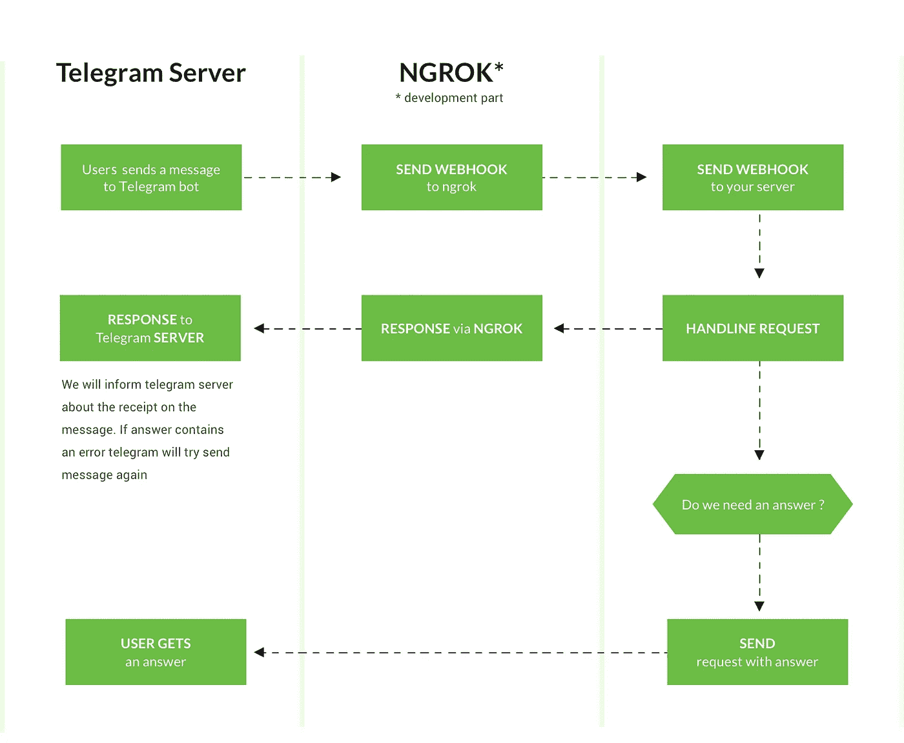
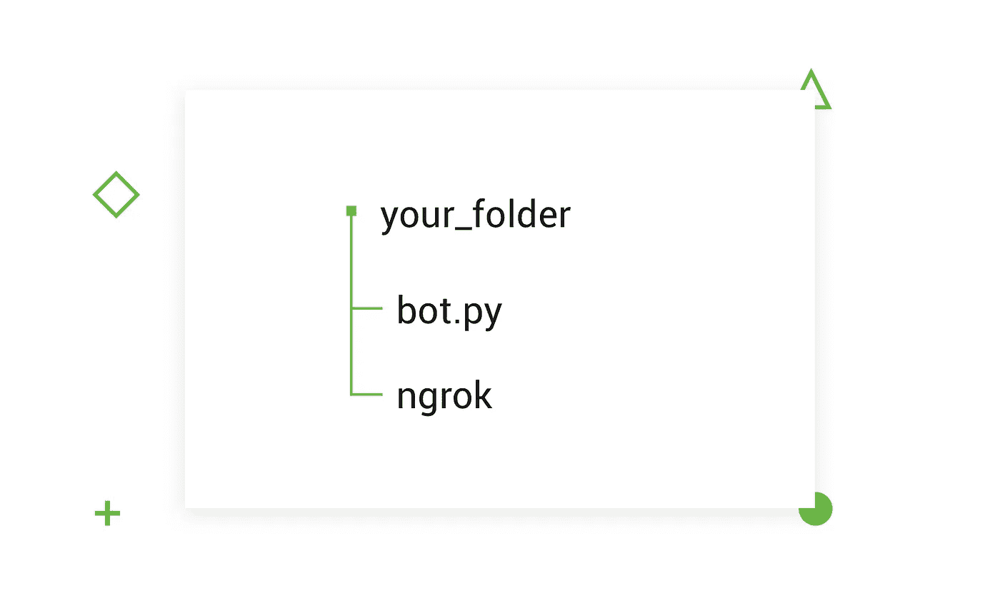
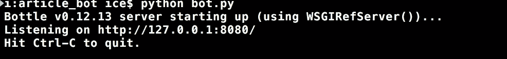
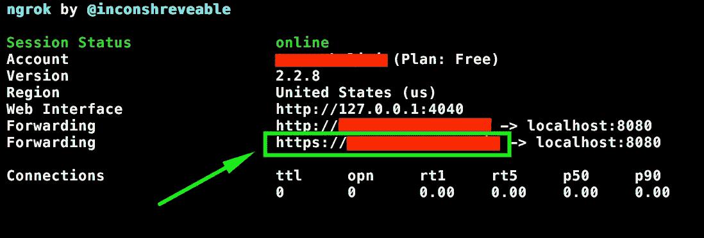
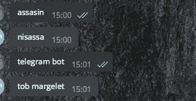

# 如何创建和部署电报机器人？

> 原文：<https://medium.com/hackernoon/how-to-create-and-deploy-a-telegram-bot-2addd8aec6b4>


# 介绍或为什么你应该尝试一个机器人

***(如果你已经知道如何处理你的机器人，你可以跳过)***

> 注意:由于降价，代码示例可能显示不正确。我建议[继续阅读我们博客](https://djangostars.com/blog/how-to-create-and-deploy-a-telegram-bot/?utm_source=medium&utm_medium=hackernoon.com&utm_campaign=telegram%20bot&utm_content=continue%20reading)上的原文，以确保所有的例子都能正确显示。

机器人无处不在。似乎就在昨天，我们甚至不知道它们的存在；现在我们几乎无法想象没有他们的生活。它们在 messengers 的众多活跃用户中广受欢迎，因为它们有各种各样的使用范围——从娱乐内容，包括循序渐进的游戏和在餐馆收集奖励积分，到保持饮食计划，跟踪送货，甚至为不同的服务付款。


为什么它们如此受欢迎？他们的秘诀是什么？我认为更相关的问题是为什么它们比一个 app 更方便。有几个原因。

**1)极简简单的设计。**
嗯，bot 根本就不能有多彩的设计。但是毫无疑问，与众多不同设计的应用程序相比，当你必须记住在哪里点击什么时，bot 更通用和容易；它通过文本提供简单的交流。

**2) Bot 广告最少，关注用户需求。如果你可以从机器人那里获得所有必要的帮助，你就不必为每项服务安装数百个应用程序。这对餐馆和商店特别有用。客户很少渴望从他们访问过的地方安装应用程序。正因为如此，企业主错过了客户的反馈，失去了与他们的沟通。如果每个地方都有自己的机器人可以在不同的信使中使用，对用户来说会更加方便和友好。没有人喜欢用那些只使用一两次的不必要的应用程序来填满手机的存储空间。然而，客户需要与服务所有者接触，他们会很高兴通过他们最喜欢的信使来这样做。**

**3)无需注册、授权和不断重新登录**
使用机器人，用户只需在机器人加入聊天时通过一次授权。客户端可以根据需要使用该机器人，当不再需要它时，用户只需阻止该机器人。就这样，简单！不再有密码重置。


不需要记住密码或登录使用。将 bot 添加到网站或应用程序中会增加用户受众的数量，因为它使与客户的沟通和向他们提供帮助变得更加容易和用户友好。

因此，我们描述了机器人的主要优势，现在你必须愿意创建自己的机器人。让我们继续练习。但首先，我们将看看在预开发阶段必须解决的问题。

# 电报机器人开发的细微差别

当我们已经确定了创建[机器人](https://chatbotslife.com/)的原因时，现在是时候考虑我们计划如何组织开发过程以及我们需要什么工具了。此外，我们将在实践中演示如何创建您的第一个机器人，以及如何教它把我们的信息翻过来。

在这一部分，我们计划如何[构建应用](https://djangostars.com/blog/how-much-it-costs-to-build-a-web-application/?utm_source=medium&utm_medium=hackernoon.com&utm_campaign=telegram%20bot&utm_content=build%20the%20app)以及使用什么开发工具。此外，我们将展示如何建立您的第一个电报机器人，并将教它把我们的信息。
因为这是初学者的手册，我们将使用单个端点运行服务器，该端点将接收我们的电报消息并做出回答。

为此，我们将使用以下工具:

*   [瓶子](https://bottlepy.org/docs/dev/) —为我们的服务器；一个简单轻量的 WSGI 微型网络框架
*   [请求](http://docs.python-requests.org/en/master/) —用于向电报发送请求。lib 不需要有过多的代表。它在世界各地的各种项目中普遍使用。
    注意:你必须在你的电脑上安装这些工具。我们以后会需要它们。为此，打开 bash 控制台并通过 pip 安装它

```
pip install bottle requests
```

*   `ngrok`–这是一个应用程序，在整个开发阶段为我们提供与 Telegram WebHook 交互的公共 URL(请在下面的 WebHook 上查找信息)。这很有用，因为 Telegram 将无法与我们的本地服务器建立连接，因为我们无法在 Telegram API 配置中指定我们的本地地址。
    你要从[官方网站](https://ngrok.com/download)下载`ngrok`，把安装好的 app 放在有项目的文件夹里。

# 创建你的第一个机器人怎么样？

如果你热衷于此，探索这一部分，我们将提供一个详细的电报机器人开发教程。

重要的事情先来。你需要在电报上登记(很明显)。我推荐使用 [Telegram web 客户端](https://web.telegram.org/)来测试基本概念。

打开 Telegram app，搜索 **@BotFather** ，开始聊天。发送 **/newbot** 命令并按照指示操作。完成初始步骤后，您将获得—

*   你的令牌
*   电报 API URL—[**https://api.telegram.org/bot**](https://api.telegram.org/bot)
*   [文档链接](https://core.telegram.org/bots/api)

威尔斯，其实就是这样。目前，机器人是 100%被动的。

您需要初始化与您的[机器人](https://chatbotslife.com/)的对话。打开搜索，输入你的机器人的名字。点击**/开始**按钮开始对话。键入类似“你好”的内容。这条消息很重要，因为它是你的机器人将收到的第一个更新。

如果这是您第一次体验构建 API，您可以使用 web 浏览器轻松了解这个想法。在浏览器中打开一个新标签，使用电报 API URL–

[**https://api.telegram.org/bot<令牌> /getUpdates**](https://api.telegram.org/bot%3Ctoken%3E/getUpdates)

当您在 web 浏览器中打开这个 URL 时，您向 Telegram 服务器发出请求，它用 JSON 作出响应。响应类似于 Python 字典。您应该会看到类似这样的内容:

```
{"ok":true,"result":[{"update_id":523349956,
"message":{"message_id":51,"from":{"id":303262877,"first_name":"YourName"},"chat":{"id":303262877,"first_name":"YourName","type":"private"},"date":1486829360,"text":"Hello"}}]}
```

如果你打开 bots 文档并检查 **/sendMessage** 方法[部分](https://core.telegram.org/bots/api#sendmessage)，你会注意到这个方法需要两个额外的参数 **chat_id** 和 **text** 。在浏览器搜索栏中，您可以使用**链接参数。**为第一个， **&为所有的后件。发送消息看起来像这样**

```
/sendMessage?chat_id=303262877&text=test
```

尝试通过调用 **/getUpdates** 将 **chat_id** 替换为您获得的回复。我的号码是 303262877。文本参数由您决定。请求应该是这样的

https://api.telegram.org/bot<你的-token > /sendMessage？chat _ id =&text =<your-text>

# WebHook

**(如果你熟悉 WebHook 可以跳过这一部分)**

简而言之，WebHook 是一个越来越流行的 API 概念。WebHook 的概念很简单。WebHook 是一个 HTTP 回调:一个 HTTP POST，当某件事情发生时发生；通过 HTTP POST 的简单事件通知。

再解释一下，有时在线应用程序之间的交互需要对事件做出即时响应，而持续不断连接的解决方案通常都很麻烦、苛刻且难以支持。在这种情况下，最好也是最容易的解决方案是通过 HTTP 立即回调(最常见的是 POST)。

换句话说，该解决方案通过向其他连接的应用程序发送 HTTP POST 请求来通知它或让它响应，从而确保对一个应用程序内的任何事件的响应。

这个确切的概念叫做 WebHook。它广泛用于:

*   实时接收数据
*   接收数据并传递数据
*   处理数据并给予回报

这似乎是电报客户端(电报应用程序)与我们的项目交互的最佳解决方案。



# 编码部分

最后，我们开始最实际的部分，你将能够开发一个电报机器人。

*主要任务:教我们的机器人把我们的信息反过来*

首先，为我们的 bot 项目创建一个文件夹。

其次，创建 bot.py 文件，做一个瓶子服务器。



接下来，我们开发 bot.py

```
from bottle import run, post@post('/')  # our python function based endpoint
def main():  
    returnif __name__ == '__main__':  
    run(host='localhost', port=8080, debug=True)
```

让我们尝试启动我们的服务器。为此，在您的 bot 文件夹中打开 bash。

```
python bot.py
```

在结果中，您应该会看到类似这样的内容:



然后，打开一个新标签。在下一个选项卡中，我们将开始`ngrok`

`./ngrok http <our_server_port>`

```
./ngrok http 8080
```

之后，您会看到类似这样的内容:



现在，让我们设置 WebHook。

[https://api.telegram.org/bot<your _ token>/setweb hook？URL =](/)[https://<your _ ngrok _ URL . ngrok . io/](https://%3Cyour_ngrok_url.ngrok.io/)

*   注意:要找到 ngrok URL，您必须启动 ngrok。然后，在类似于下图的屏幕上，您会找到 URL(它在我们的截屏上突出显示)。您在设置 WebHook 的链接中使用的 URL。

对链接的回应应该是:

`{"ok":true,"result":true,"description":"Webhook was set"}`

让我们检查一下你是否成功设置了 WebHook。使用您的令牌访问此链接:

[https://api.telegram.org/bot<your _ token>/getWebhookInfo](/)

如果一切正常，您将在配置时指定的 URL 键前面看到相同的 ngrok 地址值。

恭喜，它还活着！


现在，我们需要实现一个消息请求/响应机制。
基本上，我们的端点获取 json 格式的数据。因此，通常情况下，您会看到数据消息。

```
from bottle import run, post, request as bottle_request  # <--- we add bottle request@post('/')
def main():  
    data = bottle_request.json  # <--- extract all request data
    print(data)returnif __name__ == '__main__':  
    run(host='localhost', port=8080, debug=True)
```

它应该类似于启动服务器的控制台选项卡中的内容。

```
{'update_id': <integer>, 'message': {'message_id': <integer>, 'from': {'id': <your telegram id>, 'is_bot': False, 'first_name': '<your telegram name>', 'last_name': '<...>', 'username': '<...>', 'language_code': 'en-En'}, 'chat': {'id': <integer chat id>, 'first_name': '<...>', 'last_name': '<...>', 'username': '<...>', 'type': 'private'}, 'date': 1535022558, 'text': '1'}}
```

关于参数的更多详细信息，您可以在[电报](https://core.telegram.org/bots/api)的官方文档中找到。

现在，我们必须提取`chat_id`和`text`，以便将我们的消息反过来发送答案。

```
from bottle import (  
    run, post, response, request as bottle_request
)def get_chat_id(data):  
    """
    Method to extract chat id from telegram request.
    """
    chat_id = data['message']['chat']['id']return chat_iddef get_message(data):  
    """
    Method to extract message id from telegram request.
    """
    message_text = data['message']['text']
    return message_textdef change_text_message(text):  
    """
    To turn our message backwards.
    """
    return text[::-1]@post('/')
def main():  
    data = bottle_request.json
    answer_data = prepare_data_for_answer(data)return response  # status 200 OK by default
```

现在，我们已经准备好了答案。我们把它发给电报机器人吧。

```
import requests  
from bottle import (  
    run, post, response, request as bottle_request
)BOT_URL = '[https://api.telegram.org/bot](https://api.telegram.org/bot)<YOUR_TOKEN>/' # <--- add your telegram token here; it should be like [https://api.telegram.org/bot12345678:SOMErAn2dom/](https://api.telegram.org/bot12345678:SOMErAn2dom/)def get_chat_id(data):  
    """
    Method to extract chat id from telegram request.
    """
    chat_id = data['message']['chat']['id']return chat_iddef get_message(data):  
    """
    Method to extract message id from telegram request.
    """
    message_text = data['message']['text']return message_textdef send_message(prepared_data):  
    """
    Prepared data should be json which includes at least `chat_id` and `text`
    """ 
    message_url = BOT_URL + 'sendMessage'
    requests.post(message_url, json=prepared_data)  # don't forget to make import requests libdef change_text_message(text):  
    """
    To enable turning our message inside out
    """
    return text[::-1]def prepare_data_for_answer(data):  
    answer = change_text_message(get_message(data))json_data = {
        "chat_id": get_chat_id(data),
        "text": answer,
    }return json_data@post('/')
def main():  
    data = bottle_request.jsonanswer_data = prepare_data_for_answer(data)
    send_message(answer_data)  # <--- function for sending answerreturn response  # status 200 OK by defaultif __name__ == '__main__':  
    run(host='localhost', port=8080, debug=True)
```

在所有的准备和编码之后，如果一切正常，让我们试着和我们的机器人聊天。



现在，让我们的代码更具可读性，实现 OOP 结构。

```
import requests  
from bottle import Bottle, response, request as bottle_requestclass BotHandlerMixin:  
    BOT_URL = Nonedef get_chat_id(self, data):
        """
        Method to extract chat id from telegram request.
        """
        chat_id = data['message']['chat']['id']return chat_iddef get_message(self, data):
        """
        Method to extract message id from telegram request.
        """
        message_text = data['message']['text']return message_textdef send_message(self, prepared_data):
        """
        Prepared data should be json which includes at least `chat_id` and `text`
        """       
        message_url = self.BOT_URL + 'sendMessage'
        requests.post(message_url, json=prepared_data)class TelegramBot(BotHandlerMixin, Bottle):  
    BOT_URL = '[https://api.telegram.org/bot000000000:aaaaaaaaaaaaaaaaaaaaaaaaaa/](https://api.telegram.org/bot000000000:aaaaaaaaaaaaaaaaaaaaaaaaaa/)'def __init__(self, *args, **kwargs):
        super(TelegramBot, self).__init__()
        self.route('/', callback=self.post_handler, method="POST")def change_text_message(self, text):
        return text[::-1]def prepare_data_for_answer(self, data):
        message = self.get_message(data)
        answer = self.change_text_message(message)
        chat_id = self.get_chat_id(data)
        json_data = {
            "chat_id": chat_id,
            "text": answer,
        }return json_datadef post_handler(self):
        data = bottle_request.json
        answer_data = self.prepare_data_for_answer(data)
        self.send_message(answer_data)return responseif __name__ == '__main__':  
    app = TelegramBot()
    app.run(host='localhost', port=8080)
```

差不多就是这样。现在你有了一个可以工作的电报机器人，它甚至可以倒着拼写“赛车”。恭喜你。你可以在这里找到错误代码。

有了免费账户，你将面临某些限制。然而，这里你有一个功能齐全的机器人。

[](https://djangostars.com/services/python-django-development/?utm_source=medium&utm_medium=hackernoon.com&utm_campaign=telegram%20bot&utm_content=banner_end)

> 这篇文章是由 [Django Stars](https://djangostars.com) 的后端工程师 Arez Khalimi 撰写的。这篇关于 [telegram](https://djangostars.com/blog/how-to-create-and-deploy-a-telegram-bot/?utm_source=medium&utm_medium=hackernoon.com&utm_campaign=telegram%20bot&utm_content=telegram) 的文章最初发布在 **Django Stars 博客**上。
> 
> 特别分享给 [Hackernoon](https://medium.com/u/4a8a924edf41?source=post_page-----2addd8aec6b4--------------------------------) 读者。

我们随时欢迎您提出问题，分享您想阅读的话题！

> *如果你觉得这篇文章有用，请点击👏下面的按钮:)*

[](http://bit.ly/HackernoonFB)[](https://goo.gl/k7XYbx)[](https://goo.gl/4ofytp)

> [黑客中午](http://bit.ly/Hackernoon)是黑客如何开始他们的下午。我们是 T21 家庭的一员。我们现在[接受投稿](http://bit.ly/hackernoonsubmission)并乐意[讨论广告&赞助](mailto:partners@amipublications.com)机会。
> 
> 如果你喜欢这个故事，我们推荐你阅读我们的[最新科技故事](http://bit.ly/hackernoonlatestt)和[趋势科技故事](https://hackernoon.com/trending)。直到下一次，不要把世界的现实想当然！

