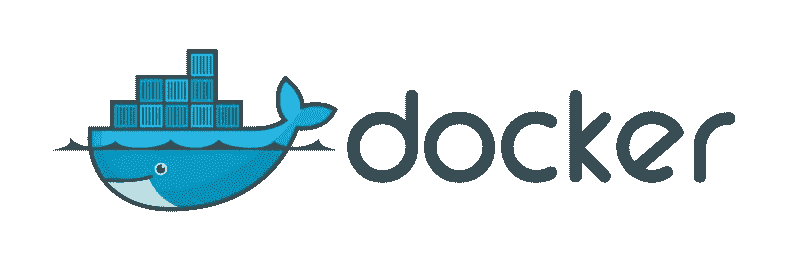

# 如何创建可正常工作的一致的开发环境

> 原文：<https://medium.com/hackernoon/how-to-create-consistent-development-environments-that-just-work-55be5417341b>


我曾作为众多团队的成员、团队领导和项目经理工作过。

在我 10 年的开发生涯中，最让我濒临疯狂的事情就是处理开发环境。

我们将使用哪种语言的哪个版本？哪个版本管理器？哪个版本的版本管理器？我们如何管理依赖关系？他们要去哪里？我们用的是什么数据库？我们如何运行服务器？测试呢。为什么这不起作用？

“我不知道，它对我有效…”

# 码头工人



Docker 是创建一致环境的一个很好的方式。如果你还不熟悉它， [Docker 自己的网站](https://www.docker.com/what-docker)对它的功能做了完美的解释:

> Docker 容器将一个软件包装在一个完整的文件系统中，该文件系统包含运行所需的一切:代码、运行时、系统工具、系统库——任何可以安装在服务器上的东西。这保证了软件将总是相同地运行，而不管其环境如何。
> 
> 容器包括应用程序及其所有依赖项，但与其他容器共享内核，在主机操作系统的用户空间中作为独立的进程运行。Docker 容器不依赖于任何特定的基础设施:它们可以在任何计算机、任何基础设施和任何云中运行。

这种容器化使得创建互不干扰的应用程序环境变得非常容易。每个环境都有独立运行该应用程序所需要的东西。

Docker 唯一潜在的缺点是，要想舒适地使用它，您不仅需要了解 Docker 的工作原理，还需要对 Linux 和 DevOps 概念有一定程度的了解，如容器、网络等。

这不是一件坏事，但不是每个人都能完成的。由于 Docker 提供了如此多的功能，让所有技能水平的开发人员更容易使用它的想法变得非常流行。

Nanobox 是试图将 Docker 带给每个人的不断增长的工具列表中的新成员。它的设计考虑到了应用程序开发人员，提供了一种简单的方法来利用 Docker 创建一致的、可重用的环境，允许应用程序开发人员专注于构建应用程序而不是基础架构。

# 设置一个简单的开发环境

在任何项目的根目录下放置一个简单的配置文件，称为 boxfile.yml:

```
# boxfile.yml
run.config:
  engine: nodejs # php, python, ruby, golang, elixir, etc.
```

现在运行`nanobox run`；这将使用 Docker 为您的项目创建一个即时的、隔离的开发环境，并让您进入一个安装了项目代码的控制台。

# 设置生产环境

现实是，没有一个环境会如此简单。如果你打算做一些有意义的事情，你将需要更多。

下面的例子将提供一个完整的生产级 ruby on rails 开发环境(甚至可以在生产环境中用`nanobox deploy dry-run`进行测试)。

# 冲洗并重复

不管你在多少台机器上运行你的应用程序，结果总是一样的:一个一致的开发环境，这个环境就是*刚刚工作的*。

[](http://bit.ly/HackernoonFB)[](https://goo.gl/k7XYbx)[](https://goo.gl/4ofytp)

> [黑客中午](http://bit.ly/Hackernoon)是黑客如何开始他们的下午。我们是 [@AMI](http://bit.ly/atAMIatAMI) 家庭的一员。我们现在[接受投稿](http://bit.ly/hackernoonsubmission)并乐意[讨论广告&赞助](mailto:partners@amipublications.com)机会。
> 
> 如果你喜欢这个故事，我们推荐你阅读我们的[最新科技故事](http://bit.ly/hackernoonlatestt)和[趋势科技故事](https://hackernoon.com/trending)。直到下一次，不要把世界的现实想当然！

