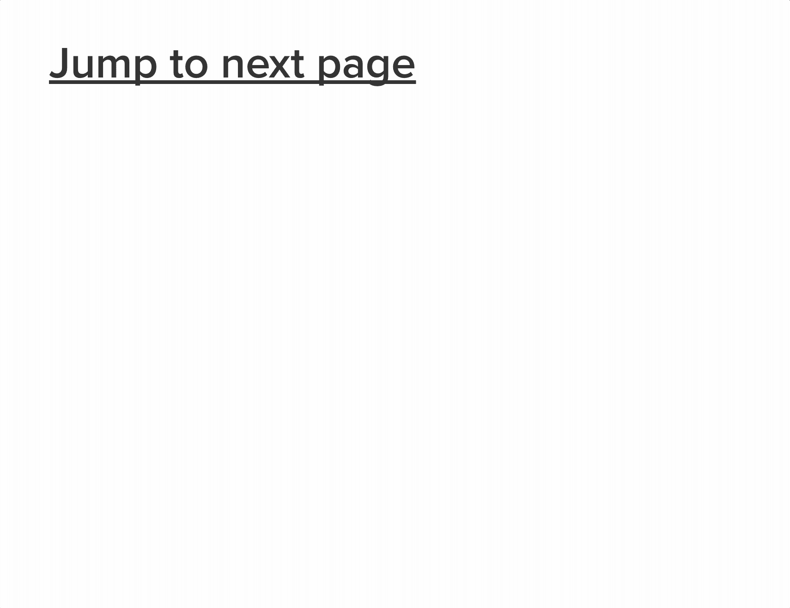
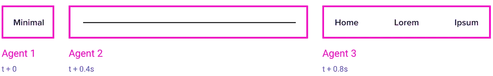
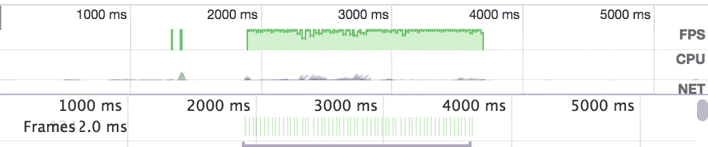

# 如何用这些简单的 CSS 技巧创建有趣的揭示性动画

> 原文：<https://medium.com/hackernoon/how-to-create-fancy-revealing-animations-with-these-simple-css-tricks-5b34614ae69a>

我和你一样讨厌点击诱饵文章，但这不是其中之一。所以，让我现在就在这里告诉你一些窍门，这样可以节省你 10 分钟的阅读时间。

> 用`*@keyframes*`定义一些 CSS 动画，设置元素的初始状态(不透明度:0，缩放(0)等)，将元素的`*animation*` CSS 属性设置为你刚刚定义的动画之一，将动画的填充模式设置为`*forwards*`，不要总是使用老式的`*ease*`计时功能，而是尝试一些很酷的`*cubic-bezier*`。通过`*animation-delay*`协调整个事情。通过避免大范围的运动来保持整洁和优雅。仅动画显示`*transform*`和`*opacity*`。永远争取 60fps。

简单吧。这显然是框架不可知的，因为一旦元素的`animation`被插入 DOM 或者它的`display`属性从`none`变为可见，它就会被触发。这是任何框架路由器的正常行为，所以不管您首选的前端堆栈是什么，您都可以这么做。

感谢阅读。

等等，看起来你想要更多的细节，更多的肉。太酷了，我也能做到。因此，在接下来的几个段落中，我将更详细地向你解释如何**轻松地**实现上面显示的动画。

# 2020 年初更新🔥

我正慢慢地离开媒体，在我的网站上发布类似的内容。你可能想在那边读这篇文章，因为我会写更多关于很酷的 CSS 技巧和动画的后续文章:

 [## 如何用这些简单的 CSS 技巧创建有趣的揭示性动画

### 我和你一样讨厌点击诱饵文章，但这不是其中之一。所以，让我为你节省 10 分钟的阅读时间…

carlosroso.com](https://carlosroso.com/how-to-create-fancy-revealing-animations-with-these-simple-css-tricks/) 

# 掌握技巧

## 显示数据标题

我将通过一步一步地展示我们的示例站点的标题来解释整个动画技术是如何工作的。我们将首先确定我们想要独立制作动画的三个*代理*:

我们基本上有三个代理人，我们想在不同的时间揭示。我用蓝色标出了每个特工暴露自己的时间间隔。我们希望特工 1 和特工 3 从左边微妙地淡入。对于代理 2，有一个从左到右的很酷的放大动画是有意义的，就好像这条线是从代理 1 流向代理 3。让我们从定义核心 CSS 动画开始:

对于`fade-in-right`,我们只需将元素的初始状态定义为*隐藏*,并将**位向左移动**,我们的最终状态会将元素渲染为完全不透明，并将其定位回其自然位置。看看我如何在只有 15px 运动范围的情况下完成。**始终避免长距离移动；整个秘密在于微小而微妙的动作。`grow-left`的代码基本上是不言自明的，所以我真的不必赘述。这里最酷的是看到我只制作了下面两个 CSS 属性的动画:`transform`和`opacity` *。如果你真的致力于高性能、60fps 的动画制作，你可能想阅读更多关于为什么你应该避免制作任何其他属性的动画的内容。***

现在我们已经定义了我们的动画，让我们把它们应用到我们的代理上。在查看代码之前，您需要记住三件重要的事情:

1.  在默认 CSS 属性中设置元素的初始状态
2.  使用`forwards`作为动画的填充模式，这样它可以保持它的最终状态
3.  通过`animation-delay`编排披露

看看我们是如何将代理 1 和 3 的初始状态定义为`opacity: 0`的，因为我们希望在淡入过渡到来之前隐藏它们。然后，我们用旧的`ease`函数和`forwards`填充模式将动画设置为之前定义的`fade-in-right`。由于我们仍然希望代理 3 进入场景，稍后，我们设置了一个`animation-delay: 0.8s`，这基本上意味着动画不会启动，直到从元素被放置在 DOM 上或通过`display`属性变得可见起 800 毫秒。真的很简单不是吗？

现在，对于代理 2 事情有点不同。初始状态被设置为`transform: scaleX(0)`，否则我们的元素将被完全放大显示，直到动画开始。因此，通过设置一个初始设置，我们甚至可以在动画启动之前就指出元素应该如何呈现。然后，我们设置它的`transform-origin: left`属性，使线条从左到右放大，否则，它的锚点将默认为中心。然后，我们做一些与代理 1 和 3 类似的事情，将`animation: grow-left`、其填充模式设置为`forwards`，并确保它仅在 0.4 秒后在 DOM 中呈现。有趣的是，我们没有使用默认的`ease`函数作为动画计时函数，而是定义了一个自定义的`cubic-bezier`函数。这允许我们创建比浏览器中默认的更有趣和视觉上更吸引人的过渡。继续尝试用[这个非常有趣的工具](http://cubic-bezier.com/#.17,.67,.83,.67)定义你自己的`cubic-bezier`。

让我们看看最后的结果:

很酷吧？看看现在`animation-delay`是如何变得有意义的，以及代理 1 和代理 3 是如何有相同的揭示动作的。想出正确的动画持续时间和动画延迟是一个通过反复试验来调整的问题，所以不要对此有太大的压力，只是玩得开心就好。

## 现在给我看看尸体

因为相同的技术一遍又一遍地重复，所以对其余内容进行动画处理是没有意义的:

1.  识别代理和揭示时间
2.  制作合适的动画
3.  设置代理的初始状态
4.  为每个代理设置动画，并通过适当的动画延迟进行编排
5.  通过反复试验来调整动画
6.  利润

## 很酷，但是，你知道，#很重要

是的，性能很重要，这就是为什么我们努力只用`transform`和`opacity`来打造整部剧。这些是在浏览器渲染过程中触发合成的唯一属性，因此避免了计算工作，从而带来了免费的体验。

让我们对我们揭示的动画进行性能分析:

你往前走，看看绿色条。这意味着在整个动画中，99%的时间我们达到 60fps。该死的每秒 60 帧(抱歉，我太骄傲了)。没有比这更好的表演了。请记住，你动画化的元素越多(在本文中称为代理)，即使使用 CSS 黄金道具，你的应用看起来也就越像 [jankier](http://jankfree.org/) 。这是因为每一个动画都不可避免的会增加一点 GPU 的工作量。因此，尝试限制动画元素的数量，但始终努力达到 60fps。

## 太多魔法了

> “我真的没有那么大的创造力来创作这样的精美动画”

制作优秀的动画不是技术上的问题，而是需要很好的设计感和天生的动力来制作好的 UI 交互。这可能非常困难，只有最有才华的设计师有足够的创造力来完成这样的壮举。然而，我们凡人仍然能够通过模仿和从真正的专家那里获取尽可能多的灵感来学习。为此，我建议你经常访问像 [wwwards](https://www.awwwards.com/) 或 [Dribbble](https://dribbble.com/search?q=page+transition) 这样的网站，并检查酷页面展示动画的想法。

我真的希望你通过这篇文章消除了对展示动画的恐惧。这不是你看到的火箭科学，但如果做得好，它肯定可以添加你的应用程序今天缺少的 ***wow*** 因素。所以，继续在你的网站上制作一些很酷的动画，然后在 [@caroso1222](https://twitter.com/caroso1222) 上发一条你想出来的推文吧！

如果你从这篇文章中得到任何灵感或留下评论，请通过击中心灵来表达你的爱。