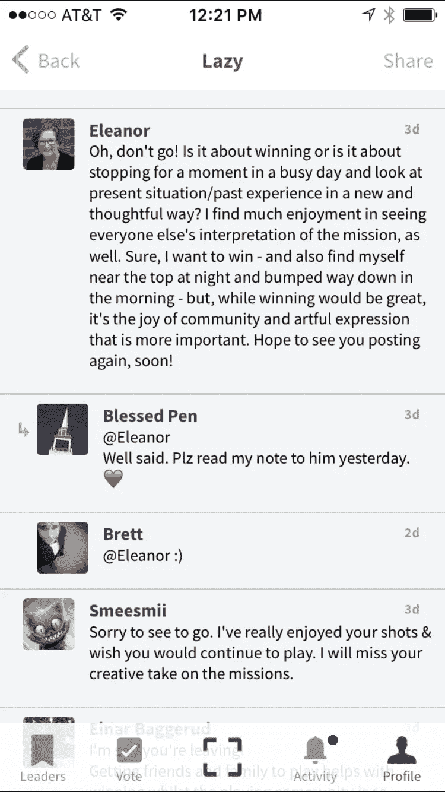
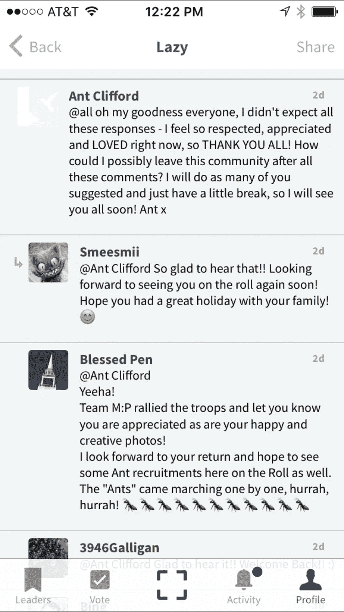
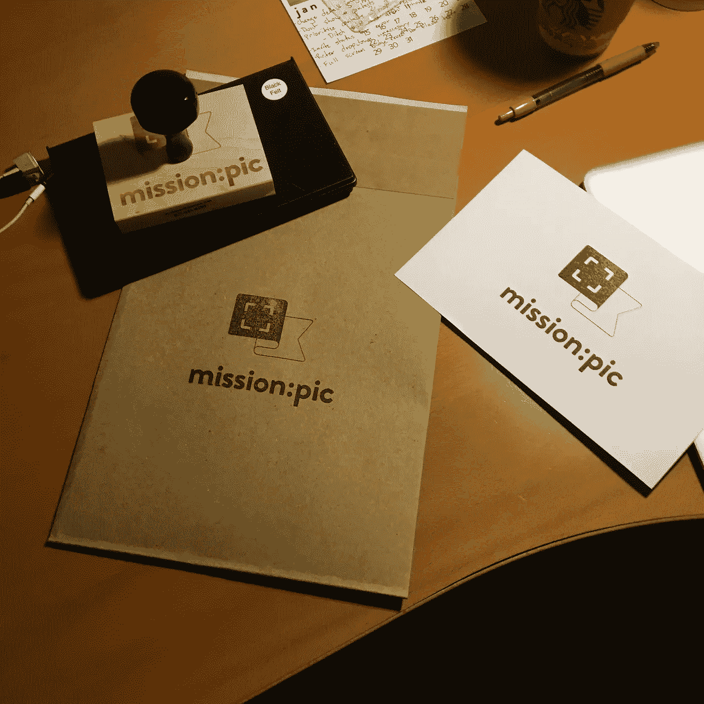
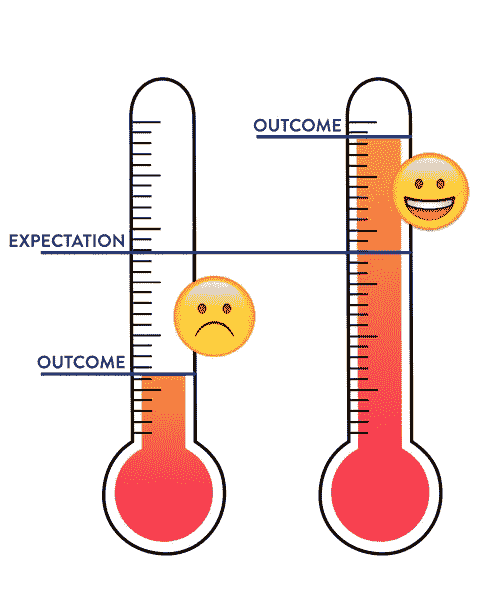

# 如何在互联网上创建最友好的社区

> 原文：<https://medium.com/hackernoon/how-to-create-the-friendliest-community-on-the-internet-8f98d2a5a83a>

*或者，关于建立数字社区的想法*

我将在最后以一个快速的例子开始，如果你关注[社区](https://hackernoon.com/tagged/community)，然后跟进一些总体的想法，混合一些我们为实现目标所做的实际事情，结果会有多棒。

上周，我们的摄影游戏[出现在产品搜索](https://www.producthunt.com/posts/mission-pic-3-0)上，有人问了一个有趣的问题，让我对这个我已经喜欢谈论的话题进行了更深入的思考。即社区。

问题是:

> [……]如果有人得分可能较低，但您仍然希望他们使用该应用程序，并且不感到气馁，您该如何吸引他们？很难解决的问题，但我期待着尝试一下，看看你的解决方案！

就其核心而言，这个问题所指的基本上是一个信息传递问题，与几乎每个公司在某个时候都面临的问题没有什么不同。对我们来说，我们必须找到一种方式来说，“嘿，这只是一种有趣的方式来把创造力变成一种游戏，每天都以一种不同的方式来看待这个世界。不要过度紧张。”但是很明显，我们不能在足够多的地方说足够多的次数，让它在适当的时候对适当的人有意义，而不在我们自己的产品上放满烦人的弹出窗口。

对于与产品核心紧密相关的信息传递问题，唯一持久的解决方案必须从社区层面开始。在这种情况下，如果乐趣和创造力而不是“表演焦虑”的信息被植入我们早期选民的核心，那么总会有人在适当的时候出现，说出需要说的话。

幸运的是，我们已经做了很好的工作，建立了一个令人难以置信的友好和支持的社区，实现了这一点。这里有几张上周的截图来说明。*公平的警告:回顾这些评论，它们听起来几乎是滑稽的表演，但我向你保证，这些是大约 30 个陌生人真实互动的真实截图，当时一个用户对他们没有获胜感到沮丧，并表示他们将停止使用*[*Mission:Pic*](http://missionpic.com/app)*。*

那么我们是怎么到这里的呢？我们是如何到达这样一个地方的:整个社区都非常友好和支持，即使你想离开也不能离开？

我确信运气在其中起了一定作用，但是这里有一些我们已经做的事情和我们一路走来收到的建议。

# *导乱*

从第 0 天开始树立良好行为榜样。即使你是唯一的用户。我喜欢把这看作是社区建设的混沌理论。

正如伊恩·马尔科姆博士如此优雅地解释的那样，由于微小的变化，一个社区可以向十亿个不同的不可预测的方向发展，一旦你所在社区的文化偏离了轨道，蝴蝶效应就会接管。在你意识到之前，你正独自坐在车里谈论混沌理论，想知道哪里出了问题。但是，你在那里给予社区早期指导的时间越长，你给予文化的偏离发展方向的选择就越少。

当社区做得好的时候，去告诉他们。积极的强化(和一般的积极情绪)价值连城。尤其是因为他们技术上没有任何重量。

# 言而无信，言而无信。

这是一篇很长的文章，或许值得单独发表，但这是我在迪士尼期间反复学到的重要一课。生活中的大多数事情都归结于期望和结果。如果你期望某样东西很平庸，相反它很棒，你会不由自主地被打动。相反，如果你期望某件事完美无缺，而它只是令人吃惊，你会希望你能回到那两个小时的生活。(我在跟你说话，银河护卫队。)

有些人可能不同意，但是迪斯尼的天才之处，尤其是他们的主题公园，在于他们玩一个危险的游戏，而且玩得很好。他们把你的期望定得很高，告诉你你将会有一次不可思议的一生一次的经历，然后他们仍然超额完成。

photo credit: [chris.alcoran](https://www.flickr.com/photos/alc_chris/)

当你计划去迪士尼旅行时，你会专注于游乐设施和氛围，你迫不及待地想让你的孩子见到米奇……迪士尼知道它可以在这方面提供帮助。这部分很简单。

迪士尼也知道，而你在计划中没有考虑的是，他们也可以通过确保你遇到的每个演职人员都微笑着迎接你来大张旗鼓地传递信息。他们知道，在某些时候，你可能会把爆米花掉在地上，然后你会震惊地发现，1)在你有时间感到尴尬之前，垃圾就被清理干净了，2)看到这一切的演职人员已经在确保你得到一个新的袋子。他们知道你可能会在乘坐过程中丢失帽子，尽管已经在 PA 上一遍又一遍地警告你，操作员要么会关闭乘坐过程以找回你的帽子，要么确保你在迪士尼的一角得到一个新的。

你甚至无法想象他们每天在数百名客人身上练习的数千种可能发生在你身上的意想不到的事情。你的期望毫无希望。

他们玩的把戏特别厉害，因为人们很少设定与客户服务相关的期望值。或者更好的是，他们确实对客户服务有期望，但由于我们都有过平庸的零售经历，他们的期望低得离谱。

这是我试图带给 [Mission:Pic](http://missionpic.com/app) 的一个观点。显然我们没有那么多机会让意想不到的事情发生在你的生活中，但我们可以看看其他人都在做什么，然后超越。

例如，Mission:Pic 是一个通过将摄影变成游戏来挑战你的创意的地方，这也意味着每天都有一个赢家。正如你所料，获胜者将获得一个漂亮的小徽章，他们可以在应用程序中查看并在社交媒体上分享。这就是你满足期望的方式。勉强。

获胜者还将获得一张 8x8 尺寸的获奖照片，上面印有我们的第一名印章，放在一个贴有商标的信封里，还有一张我手写的明信片。全部直接运回家。免费的。这意味着我们可以每天为一个人交付 4 美元，并且<20 minutes of my time and in the process build good will in our community.

People too often talk about the flipside of this concept. They say that when outcome doesn’t meet expectation, the gap is disappointment. But the reason this is such and important concept in terms of community building is when outcomes exceed expectation then that gap between the two is nothing but joy. The more joy you feed into your community the happier a place it’s going to be for everyone. And happiness, like any emotion, has its own inertia.

# *爱你的家人*

可能是最重要的，也是你认为最明显的，你必须关心你的员工。你的社区是你家庭的延伸，你可以用任何可以想象的方式延伸这个比喻。当然，那里有一些古怪的阿姨和叔叔，但他们是你的古怪的阿姨和叔叔，如果你以善良、尊重和真诚的态度对待他们，那么他们将永远支持你。

尽一切努力让你的用户及时了解尽可能透明的邮件或帖子。对我们来说，像这样简单的事情😍“来自《使命:Pic》的创作者之一，一张很棒的照片表明我们在那里，我们在乎。

# *负一公差*

作为一个不可救药的乐观主义者，喜欢把人往好的方面想，在过去，我在遵循自己的建议方面糟糕得可怜，这只会导致心痛。你知道什么是好的行为(因为你是你自己社区的一部分，每天都在做榜样，对吗？)这样你就知道当另一个用户不友好时是什么样子了。

为了重温社区建设的混沌理论，把用户的行为想象成一根向内生长的头发，它会把马尔科姆博士的水滴推得偏离轨道，直接滴到你的裤裆上。不仅你的社区文化偏离了轨道，而且你现在看起来像是尿裤子了。个人和职业上的尴尬，只是因为你不能做出艰难的选择，挖出一根痛苦的头发。不值得。

# 结束了

老实说，这是我最喜欢的话题之一，为了你的缘故，我把我自己的许多哲学都漏掉了。我很乐意在下面谈论更多，或者你可以给我发电子邮件，地址是 missionpic.com 的 brett。

> [黑客中午](http://bit.ly/Hackernoon)是黑客如何开始他们的下午。我们是 [@AMI](http://bit.ly/atAMIatAMI) 家庭的一员。我们现在[接受投稿](http://bit.ly/hackernoonsubmission)，并乐意[讨论广告&赞助](mailto:partners@amipublications.com)机会。
> 
> 如果你喜欢这个故事，我们推荐你阅读我们的[最新科技故事](http://bit.ly/hackernoonlatestt)和[趋势科技故事](https://hackernoon.com/trending)。直到下一次，不要把世界的现实想当然！

