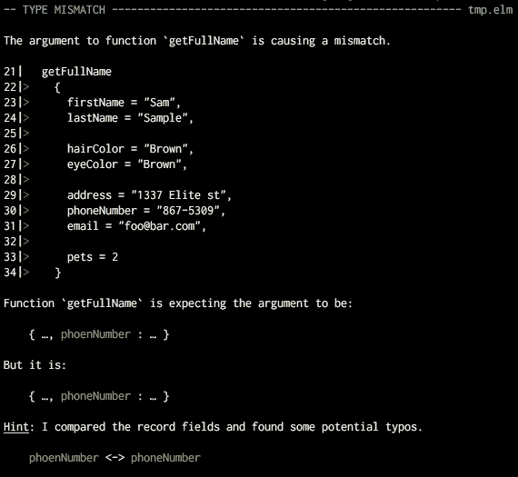
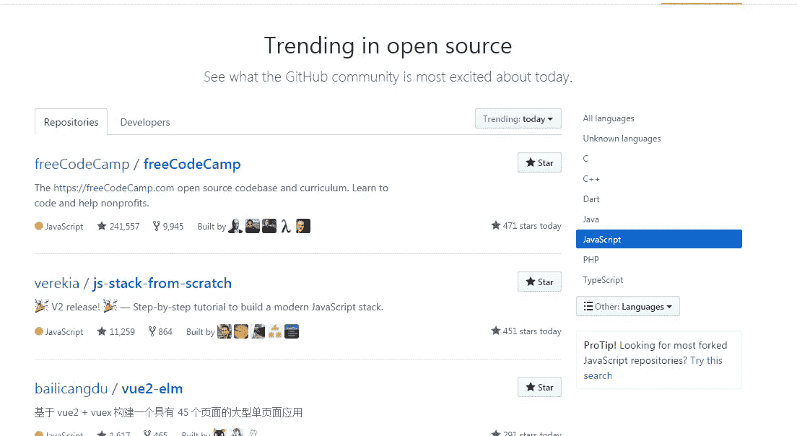
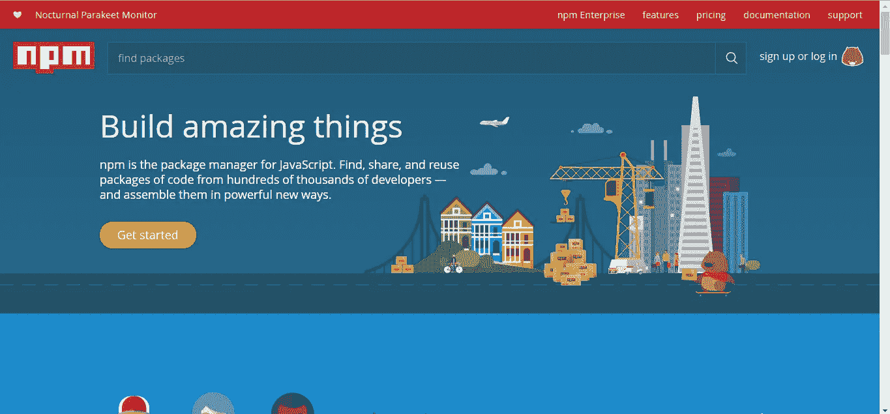

# 如何创造下一个伟大的编程语言

> 原文：<https://medium.com/hackernoon/how-to-create-the-next-great-programming-language-cff4f1ba921>

我们中的许多人都曾梦想创造一种[编程](https://hackernoon.com/tagged/programming)语言，重新定义我们开发软件的方式。我们大多数人也开始接受这样一个现实，即这样一个壮举，如果不是完全不可能的，也是非常难以完成的。在过去的几年里，我读了很多关于语言和编译器的书，我列出了一些帮助最流行和最强大的编程语言成为今天这样的组件。虽然你创造下一个 C 或 Java 的可能性仍然很小，但是如果不注意下面的列表，你就没有实现如此崇高目标的现实机会。

那么，事不宜迟…让我们开始吧！

# #0:事先做出正确的选择

每个项目都需要一个明确的方向，如果你不知道你的语言的重点是什么，你将会一事无成。问自己以下问题，以确定你的新语言的价值和范围:

> 你为什么要设计一种全新的语言？

哪些**问题**(理想情况下*很多*不止一个)将通过重新发明轮子来解决？你的语言的**好处**是否足以说服企业和开发者从已建立的、更成熟的工具转向**依赖**你将要构建的工具？

> 你将如何为你的项目融资？

如果你的项目是开源的，你将从哪里获得资助？捐款？会有大公司做后盾吗？或者你会仅仅被你创造一种可行的语言的动机所支持吗？

> 你的语言的目标是什么？

Web 开发？嵌入式系统？通用？

> 你的语言会促进什么风格？

你会支持多种编程范式，还是会强迫开发者适应一种范式？

> 你将如何传播你的语言？

你会做些什么来促进你的努力，并获得公众的支持？

# #1:熟悉度和可访问性

老实说，没有人想仅仅为了能够用你的语言编写程序而学习一个全新的语法。尽量遵守出现在各种语言中的通用约定。许多语言都采用了 C 语法的特性，比如花括号、函数括号以及关键字`if`或`for`。类似下面这样的话，虽然有些夸张，却是对已有约定俗成的完全拒绝，因此读起来和写起来都很困难:

```
FUNCTION main
  input <INTEGER argc, STRING argv()>
  output <INTEGER>
[
  std>>cout:"Hello, world!" + std>>endl;
]
```

你也不要太啰嗦(看你，Java！):

```
public static function main
  requires input(int, char**)
  produces output(int) {
  using System and its "out" property, call println with ("Hello, world!");
  exit with result 0;
}
```

一门语言还需要让使用它的任何人都容易理解。一个特定于平台的工具，如 [MASM](http://www.masm32.com/) 只需要分发一个 Windows installer，而一个被设计为在每一个主要操作系统上运行的语言需要为每一个操作系统提供令人头疼的安装选项。例如，要在一台新电脑上开始开发 [PHP](http://www.php.net/) ，你需要做的就是运行适合你的操作系统的安装程序，并打开一个文本编辑器。

如果你支持 Windows，提供一个好的开发体验也无妨。Ruby 著名的*在 Windows 上很烂*(主要是因为没人在 Windows 上用它)，Dart 甚至没有为 Windows 提供官方安装程序。

# #2:积极维护


Commit velocities of a few Web languages and tools (credit: [池田 泰延](https://twitter.com/clockmaker)])

Pascal 在其全盛时期是一门伟大的语言。艾达也是。堡垒也是！那么为什么 2017 年不流行呢？答案很简单:*无一主动维护*。不管未来会发生什么，我们会取得什么样的技术进步，或者消费者的需求会如何变化，前面提到的这些都不会再进化来反映它，因为它们的代码库是静态的。2017 年没有人在研究 Pascal 编译器。无论您在开发过程中遇到什么样的错误，您都会受到困扰，或者不得不自己编写一个解决方法。主动维护意味着 Github 问题不会在几个月或几年内停滞不前，这也意味着开发人员和公司可以更加信任您的工具。作为一个额外的奖励，人们会想使用你的项目，因为他们可以看到仍然在努力使它保持最新！

# #3:快速失败和描述性错误消息



Elm’s friendly error messages.

每个人都同意运行时错误很糟糕。它们成本高昂，难以追踪，而且在大多数情况下，完全可以预防。快速失效系统可以在运行时错误发生之前对其进行诊断。最终，这可以节省你的时间，头痛和金钱。您的语言工具集在检测和防止错误方面做得越好，对新开发人员就越有吸引力。

[Elm](http://elm-lang.org/) 作为 Web 开发语言的成功可以部分归功于其编译器产生的[描述性错误消息。它不仅检测类型不匹配，甚至还检测拼写错误的变量名。错误消息越详细，就越容易在错误到达应用程序之前将其消除。](http://elm-lang.org/)

# #4:类型安全

类型安全使语言更容易快速失败。你见过多少次这样的错误？

```
NoSuchMethodError: Class 'Wtf' has no instance method 'IsThisNonsense'.Receiver: Instance of 'Wtf'Tried calling: IsThisNonsense()
```

在强类型语言中，比如 Java，这样的错误总是能够在编译时被静态分析和捕获。

关于强类型和动态类型语言的争论可能永远不会结束，但是我个人推荐强类型检查。如果您可以在编译时捕获每一个类型错误，就不需要在最终产品中增加运行时类型检查的开销。

# #5:多功能工具


Microsoft’s Visual Studio line provides top-quality tools for a variety of language, most notably C#.

好的工具节省时间。好工具省钱。好的工具可以拯救生命。

好吧，也许好的工具并不能真正拯救生命，但是不可否认的是，一门拥有足够工具的语言工作起来更有效率，并且通常是一个比一门实际上只能靠自己的语言更有吸引力的选择。

C#是语言工具的一个很好的例子。的。NET framework 不仅包括一个健壮的编译器，还包括调试和反编译 IL 字节码的工具。结合 Roslyn、NuGet 和 Visual Studio，C#开发体验几乎为您提供了一切。

# #6:元编程

最经得起未来考验的语言能够随着时间的推移而进化。如果开发人员必须等到一个新的 SDK 版本实现一个关键特性，那么他们会离开你的平台，选择一个已经有这个特性的平台。

据[维基百科](https://en.wikipedia.org/wiki/Reflection_(computer_programming)):

> **反射**是计算机程序在运行时检查、自省和修改自身结构和行为的能力。

给用户一个工具，让他们可以自己添加语言特性，这是让他们存在更长时间的好方法。在某些情况下，通常的元编程库被改编为语言特性本身。例如，ES6 在 JavaScript 中引入了`extends`关键字，不再需要使用第三方库来扩展对象原型。

# #7:充满活力的社区

这一步几乎超出了你的控制，但也是你人生道路上最重要的一步。一个繁荣的社区可以成为吸引人们使用你的语言的磁性因素。如果全是蟋蟀和风滚草，你将面临为你的项目聚集观众的困难。想想看:谁想使用一种没人谈论的语言，为它写库，或者回答关于它的问题？不是我。不是你。不是其他人。众所周知，Ruby 在 Windows 上是个麻烦，因为其社区中的绝大多数人使用 Mac 或 Linux。我如何在 Windows 7 上安装 Jekyll？谁知道呢？没人。



Today’s trending JavaScript repositories on Github.

社区活动也是衡量使用你的语言的人数的一个不错的标准。使用你的语言的人越多，就越有可能有人会寻求支持或答案，以及在哪里找到它们。JavaScript 是这个星球上最流行的编程语言，这是显而易见的。在 Github 的趋势知识库中，每天至少有一半是用 JavaScript 编写的。有数以千计的 JavaScript Gitter 和 Slack rooms，它是编码营中最常见的语言之一。

# #8:深入的文档

这是一个显而易见的。每个程序员在编码时都会遇到错误，而这些错误通常会因为缺少足够的失败 API 文档而加剧。帮大家一个忙——*记录公共 API。*

你构建的语言也应该让文档成为一流的特性，而不是在发布后试图修补它。类似 Javadoc 的东西也可以。Dart 是文档支持的一个很好的例子 Dart SDK 包括一个[静态文档站点生成器](https://github.com/dart-lang/dartdoc)，上传到[发布库](https://pub.dartlang.org/)的每个包都有在现场生成和托管的文档。

# #9:通过版本控制实现稳定性

如果引入的每一个新变化都是突破性的变化，没有人会迁移到你的语言，这可能非常昂贵。实施强有力的版本控制策略允许开发人员进行更新，而不用担心 API 神的邪恶报复。SemVer 是一个流行的严格版本约束系统，通过遵循它的约定，你的语言实际上是面向未来的。例如，Dart 的[发布包管理器](https://www.dartlang.org/tools/pub/get-started)通过将 SemVer 约束解析为合适的库版本来安装依赖项。

如果您选择提交 SemVer，您的包管理器(或者您使用的任何类似工具)可以被编写来比较库源代码和过去的版本，以确保遵循 SemVer。这有点极端，因为许多开发人员更喜欢只发布包，而没有一个愤怒的工具来催促他们重命名 API。

然而，如果你这样做了，这将是一个很好的方法来迫使*包版本号反映它们所呈现的变化，并防止更新后不可预见的应用程序中断。*

# #10:图书馆支持



NPM has a massive number of JavaScript packages hosted on its servers.

除了语法和工具，也许切换到一个新的语言堆栈的决定性因素是它的生态系统。NPM 有超过 400，000 个 JavaScript 库向公众开放。无论您的 Node.js 应用程序需要什么额外的功能，您都可以相信别人已经为您实现了它。

新语言在这方面处于非常不利的地位，原因很简单，因为它们出现的时间还不够长，开发人员无法发布数量相当的库。因此，如果你想留住用户，你必须提供大量现成的功能。

Dart(我想你可以看出我对这种语言的偏见！)采用了“包含电池”的方法，并提供了一个大规模的标准库，消除了将 25 万个包上传到其包管理器的需要。像左填充字符串这样的功能已经存在很长时间了，删除 Pub 包也是一项艰巨的任务，所以如果一些开发者决定推出一个包，[整个互联网不会崩溃](https://www.theregister.co.uk/2016/03/23/npm_left_pad_chaos/)。

# #11:高效的内存使用和并发性

一般来说，大规模的应用程序有很高的崩溃风险。简单来说，处理高流量和昂贵的运营需要大量的资源。更糟糕的是，内存管理是手动实现的 PITA。

虽然这可能不一定是语言本身的特性，但是您的编译器/解释器/VM 应该尝试防止内存泄漏、缓冲区溢出和其他内存管理不当错误。大多数现代的虚拟机，比如 JVM。NET 运行时，Dart VM 通过垃圾回收实现内存管理，因此，相应语言的开发人员不必担心分配内存或释放指针。

多线程也是一种以并行方式运行异步代码的常见技术，因此，并发操作应该很容易实现，并且几乎不需要额外的样板代码。例如，Google 的 Go 语言已经将[并发支持融入了语言本身](https://www.golang-book.com/books/intro/10):

```
func main() {
  var c chan string = make(chan string)

  go pinger(c)
  go ponger(c)
  go printer(c)

  var input string
  fmt.Scanln(&input)
}
```

# #12:测试

众所周知，维护阶段是软件开发生命周期中最长的阶段。测试驱动开发是一个保证软件质量的常见过程，但是它也非常依赖于编写非常具体的单元测试来验证在各种用例中的成功的能力。

你的语言越适合测试，运行时遇到的错误就越少，你的语言在生产中就越可信。

一个好主意是让语言背后的团队发布测试工具，但是使用社区支持的、成熟的测试库(例如 [JUnit](http://junit.org/junit4/) 、 [Mocha](https://mochajs.org/) 或 [Cucumber](https://cucumber.io/) )也是一个可行的策略。

# #13:便携性和模块化


Java runs on a large variety of platforms, including those smaller than an actual cup of java (image credit: Robert Savage).

并不是所有的语言都需要可移植性，但是那些面向多个平台的语言需要设计良好的系统来允许跨系统的代码重用。大多数语言(如果不是所有的话)都有某种类型的`import`关键字，允许你从其他文件中获取代码。现代语言需要超越仅仅使用导入来分割大文件，并且实际上实现某种模块系统。

模块化允许开发者明确地分离逻辑，也使得在任何平台上使用库的某些部分成为可能。例如，Dart 和 ES6 实现了模块系统。

模块系统还使编译器更容易去除不使用的代码，并最终减少编译后代码的输出大小。这对于编译成 Javascript 的语言来说很关键，因为在客户端解析更少的代码有助于防止 Web 浏览器的主要瓶颈。

# #14:既定标准

公共标准可以让你的语言更加稳定，在团队环境中更加高效。一门严肃的语言会有一个完整的规范，可以在一个免费的在线平台上阅读(例如:[达特 ECMA 规范](http://www.ecma-international.org/publications/files/ECMA-ST/ECMA-408.pdf))。

考虑实现一个可配置的 linter 和 formatter，并作为你的语言的标准工具集的一部分提供它。最终，标准将被灌输到开发人员的大脑中，加入新的商业团队或开源项目将是一种更容易的体验。例如，Dart 同时配备了[棉绒](https://github.com/dart-lang/linter)和[格式器](https://github.com/dart-lang/dart_style)。

您甚至可以考虑拒绝编译/运行格式不良的代码。这对于编译来说有点极端，但是项目作者可能会考虑在 presubmit 脚本中包含格式化/林挺检查，以确保所有提交都是可读和可理解的。带有 [ESLint](http://eslint.org/) 的示例:

```
// package.json
{
  "scripts" : {
     "prepublish": "eslint **/*.js"
  }
}
```

# #15: Unicode 支持

语言开发者需要记住:*不是世界上每个人都会说英语*。只支持拉丁字符有效地将数百万潜在的开发者拒之门外，也阻止了英语不是主要语言的国家的任何人使用在你的国家开发的应用程序。

如果在 *Java* 中像下面这样的事情(鸣谢:[尼克·麦克迪](https://github.com/nickmccurdy))是可能的，为什么你的语言不应该支持 Unicode 呢？

# #16:由一家大公司支持

这不是必须的，但是如果一家大公司支持你的语言，你会自动获得一些好处:

*   可信度——人们会看到一家大型企业在生产中使用你的语言，并相信它有能力处理现代需求。
*   资金——因为你的语言为价值数百万美元的应用程序提供动力，公司有动力(实际上是义务)提供必要的资源来确保语言持续运行，并适应不断增长的需求。
*   情感验证:)—构建一门语言绝非易事；这需要长时间的艰苦工作，有时感觉吃力不讨好。一家使用你的语言的大公司向你保证你的努力没有白费，更重要的是，切实向你证明人们确实在使用你的语言。

这是一个主要因素，如果不是主要因素的话，也是保持像 [Java](https://www.java.com/en/) 、 [Go](https://golang.org/) 、 [Dart](https://www.dartlang.org/) 和 [PHP](http://www.php.net/) 这样的语言积极维护和定期更新的主要因素。如果你的语言开始流行，你可以考虑把它推销给公司，在开发者会议上演讲，甚至在你自己的应用程序中运行它。

这份名单到此为止。当然，你可能会尝试以上所有的建议，但仍然失败，但最终还是值得一试。带着你所学到的，去实现你的白日梦吧！

***感谢阅读！喜欢这篇文章吗？请点一下“*****【❤】*上的绿色按钮！:)***

## 关于作者

*Tobe O .是一个 17 岁的程序员，他最喜欢的语言不得不是*[*Dart*](https://www.dartlang.org/)*。当他不在学校的时候，他在做运动，做音乐，或者在做* [*天使服务器框架*](https://github.com/angel-dart/angel/wiki) *(看看吧——不，真的！).* [*在推特上找到他！*](https://twitter.com/thosakwe)

[](http://bit.ly/HackernoonFB)[](https://goo.gl/k7XYbx)[](https://goo.gl/4ofytp)

> [黑客中午](http://bit.ly/Hackernoon)是黑客如何开始他们的下午。我们是这个家庭的一员。我们现在[接受投稿](http://bit.ly/hackernoonsubmission)并乐意[讨论广告&赞助](mailto:partners@amipublications.com)机会。
> 
> 如果你喜欢这个故事，我们推荐你阅读我们的[最新科技故事](http://bit.ly/hackernoonlatestt)和[趋势科技故事](https://hackernoon.com/trending)。直到下一次，不要把世界的现实想当然！

