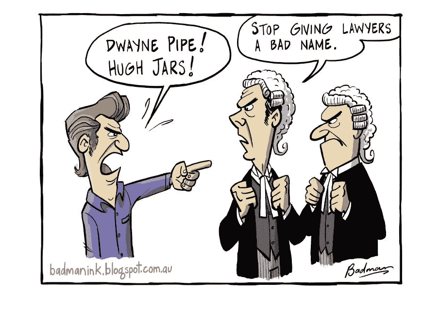
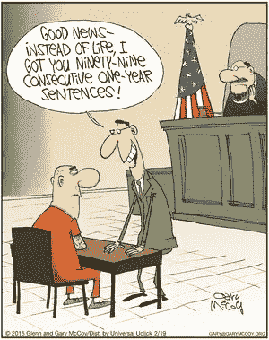

# 律师不是你想的那样:如何(快速)结束一轮融资

> 原文：<https://medium.com/hackernoon/how-to-deal-with-lawyers-fa38e28f2531>

你已经让你的投资者排好了队——双方都对合作感到兴奋，并对启动这一进程充满热情。没有你的正式化，事情就不会发生，所以你打电话给律师。

你可以看到终点线。

你看不到的是，要到达那里，有一个很深的山谷要穿越。

我就要达到 35 笔交易的目标了——以下是我辛苦学来的诀窍。

首先，一些经常被忽略的上下文…

## 律师不提供商业建议。

大多数律师都没有经营过公司，只对所涉及的任务和压力有咨询性的了解。企业家常常将协议视为机遇，而律师则将其视为债务的集合。

**这是一个非常重要的观点**，(特别是对于一个过于乐观的企业家来说)，但它不应该淹没其他的考虑。

*律师受过训练，能看清细节中的风险，但他们不会为你着想。*

如果你向风险投资人寻求对你企业未来的建议，他们会谈到发展到 10 亿美元的公司。如果你问一个破产律师，他们会给你一个关于如何把它管理的行动计划。这都是观点的问题。

## 你们的兴趣不一致。

假设你正在筹集资金，时间很紧。

如果这笔交易没有达成，你的公司就是…你怎么说… [*mechuleh*](http://www.yiddishslangdictionary.com/word/559/mechuleh) *。*

但是你的律师呢？不管怎样，他们都会得到报酬，init。

这意味着你错位了。

**这很好**(从事应急工作的律师觉得不对劲)，但这是你需要意识到的事情。

这不仅仅是成本，律师不需要像你一样处理后果…在我职业生涯的早期，我做了一笔没有好/坏离职条款的交易。很高兴我和我的团队执行了一个企业家友好的交易来对抗大的坏投资者，我们为一个好交易的完成干杯。但是当首席技术官一个月后离开时，公司陷入了瘫痪。律师不仅不能轻易让我们摆脱困境，而且他们还想收取告诉我们这些的费用。

但是，他们当然这么做了，因为他们是律师，这是他们的工作。

## **当心语言障碍**

我认为这是我能提出的最重要的一点。

律师们多年来一直在玩弄法律语言——对他们来说，一切都是微妙而有目的的。对他们来说，协议是一个公式，就像代码一样——它适合或不适合目的。就像开发人员一样，他们在编码方面也有自己的风格。

所以对对方送来投资协议的第一反应很少是"*这些都是很棒的文件，你可以签了"*，但几乎总是*“我们不能接受这些条款”，“有人拿这部分开玩笑”*或者令人畏惧的*“我不知道从何说起”。*

灾难场景突然从次要条款中出现，法律条款推动交易，而不是相反。

是的，每笔交易都有风险，你需要保护自己，但是这些风险出现的可能性有多大，它们的后果是什么？一些律师明白这一点，但每笔交易有两套，他们之间肯定有一些高人一等的地方，或者可能是一名律师试图给一名合伙人留下深刻印象，或者可能他们都证明自己“站在客户一边”。

所有这些都很好，但是你如何利用它们呢？

# 如何在投资交易中与律师打交道

在你的条款清单上要求报价——即使他们是你的固定律师，而你不想用其他人。用不同的律师做同样的事情。协商一致。

**2:设定期限预期。**对你的投资者也这样做，但要确保各方在同一时间内达成一致。

与投资者就所有主要条款达成一致。我有过的最好的交易经历是，当我们收到一份非常详细的 TS 时，我们的团队花了 2 个小时，我们的律师花了 2 个小时，然后去直接与投资者谈判，然后再转向长篇文件。它不仅节省了时间，给投资者留下了深刻印象，而且把商业放在了第一位，让所有人从第一天起就站在了同一立场上。

**4:** **红绿灯你的问题。**红色代表交易破坏者。橙色代表“我们真的很喜欢这个，但它并不引人注目”。绿色代表技术或非争议性的双边投资条约。和你的律师一起做这件事，这样你就能理解问题所在——但是当事情变得优先时，你说了算。

**5:** **不要让律师和律师谈判。**交易疲劳是真实存在的，当公司的投资者在这个过程中感觉到惯性时，它就会发生。给律师与律师谈判的许可很容易造成这种情况。唯一的解决办法是…

永远打电话给我。你必须站在乒乓球的顶端。每 48 小时和你的律师通一次电话，讨论进展情况，并在中间和他们谈谈。你不知道律师还穿着什么，所以要确保你面对着他们，由你来决定什么是重要的。但这还不是全部…

永远不要在没有跟进的情况下结束一封邮件。类似于“请让我知道这件事什么时候完成”，“让我知道他们说了什么”或者“我什么时候能完成这件事？”

在你拿到“投资圣经”之前，不要买单。太多的交易以银行存款结束，却没有完整的签名、股票和文件。律师走了，公司合并了，当你需要他们的时候，没有人在你身边——所以确保你在交易完成后马上拿到这些。