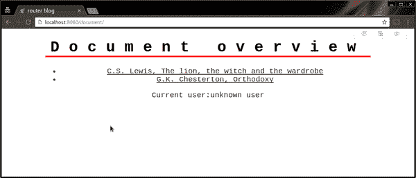
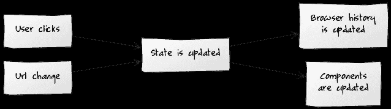

# 如何分离状态和用户界面(也就是你不需要组件)

> 原文：<https://medium.com/hackernoon/how-to-decouple-state-and-ui-a-k-a-you-dont-need-componentwillmount-cc90b787aa37>

*在没有 UI 层的情况下处理路由、数据获取、认证和工作流测试的策略*

管理像 [MobX](http://mobxjs.github.io/mobx) 这样的开源项目让我有机会窥视许多代码库。在这样做的时候，我发现大多数 React 应用程序不是由存储在存储中的状态驱动的；它们也由安装元件的逻辑驱动。这听起来可能有点模糊，所以让我们看两个例子:

*   解释路由更改通常是在组件中完成的；尤其是在使用 react-router 时。路由器基于当前 URL 构建一个组件树，这将触发*组件的*处理程序，这些处理程序将解释参数并相应地更新状态。
*   数据获取通常由组件将要被呈现的事实触发，并由 *componentWillMount* 生命周期挂钩启动。

尽管这种方法非常可行，但是它也有一些缺点:首先，我们不能仅仅通过查看我们的存储状态来推断我们的应用程序状态和流程。其次，我们需要知道哪些组件将被呈现给某些路线，以及它们在被挂载时执行什么活动。用图片来描述:

这看起来不像我们的 UI 是状态的函数。看起来更像是我们的状态，最初是我们组件的函数。在这篇博客中，我将展示如何将这种关系转化为下图:

这种方法具有更好的状态和 UI 解耦性。这有几个优点:

1.  无需实例化组件就可以测试完整的应用程序流。
2.  更多的组件可以是哑的；他们不必获取数据或处理路由。
3.  我们的存储变得更像一个状态机，使得跟踪应用程序的转换变得容易。

# 示例应用程序

为了演示这一点，我们将构建一个简单的文档查看器应用程序。该应用程序本身是琐碎的，但是具有路由、认证和数据获取的特性，这使它与真实的应用程序有一些相似之处。该应用程序由具有以下属性的两个页面组成:

1.  有一个文档概述(route " *document/"* )
2.  存在文档查看页面(route "*document/<document-id>"*)
3.  任何人都可以访问概览，但是要想看到特定文档的内容，必须登录。

该动画展示了应用程序的整个功能集。请注意地址栏、加载和错误消息中的变化。

该应用程序是使用 React 和 [MobX](http://mobxjs.github.io/mobx) 构建的。尽管如此，我认为所展示的原则可以应用于，或者已经存在于许多现有的框架中。应用程序最初是使用 [mobx-react yeoman 生成器](https://github.com/cafreeman/generator-mobx-react)生成的。完整的源代码可以在这个 [github repo](https://github.com/mweststrate/state-routing-blog-sources) 中找到。

# 视图存储:捕获应用程序状态

大多数应用程序状态将在*视图存储*中捕获。它捕获两个重要的数据:当前用户和当前视图。
*当前用户*反映登录用户的身份。 *currentView* 描述当前可见的页面，并捕获该页面所需的数据。

现在我们可以介绍我们的第一个动作，它更新了 *currentView* 来反映我们正在显示文档的概览。

首先我们商店接受 *fetch* 作为构造函数参数。这基本上是一个围绕*窗口的小包装器。它会自动解析 JSON，并对任何非 200 响应进行保释。我们显式地将它传递给我们的存储，以便我们可以在单元测试中轻松地将其存根化。*

*showOverview* 方法是有趣的部分，它更新 *currentView*
并开始从我们的 HTTP 服务器(本演示中的一个静态文件服务器)获取文档。 *fetch* 返回的承诺从 [mobx-utils](https://github.com/mobxjs/mobx-utils#frompromise) 包传递给 *fromPromise* ，mobx-utils 包将承诺转化为 [MobX](https://hackernoon.com/tagged/mobx) 可观察。这允许 MobX 在 UI 和测试中观察承诺的进展。

# 测试文档概述

此时，ViewStore 捕获应用程序的当前状态或“路线”,并获取必要的数据。由于 ViewStore 中没有特定于浏览器的东西，我们可以使用 node 和 [tape](https://github.com/substack/tape) 轻松测试这个服务器端。在我们的测试中，我们用一个简单的文件系统调用 stub *fetch* (我很清楚有很棒的库可以做得更好，但是为了这个博客，我想保持简单和透明)。

注意，我们使用 MobX 的 *when* 来等待，直到可观察到的承诺完成，然后检查是否加载了正确数量的文档。

# 显示特定文档

是时候采取更具挑战性的行动了；打开特定文档。请记住，只有登录的用户才允许这样做。

为了检查用户是否已经登录，我们引入了一个 computed 属性来检查是否设置了 *currentUser* 。 *showDocument* 函数与 *showOverview* 非常相似，除了这次如果用户没有登录，我们会立即拒绝承诺，而不是获取数据。

注意，我们仍然更新*当前视图*。这样做的好处是，我们已经可以更新 URL(见下文)并在 UI 中反映用户的预期位置。

将可观察到的承诺存储在 *currentView* 中有一个好处:
它消除了竞争条件。对外界可见为 *currentView.document* 的可观察承诺，永远是最后一个 *showDocument* 调用创建的承诺。

# 证明

为了支持用户实际登录的场景，ViewStore 公开了 *performLogin* 动作，该动作接受一个*用户名、密码*和*回调。*如果成功登录，将调用回调函数 *true* ，否则调用 *false* 。

(是的，我确实意识到这是最糟糕的登录方式；-).一个合适的登录调用会给示例增加一些噪音，但不会从根本上改变方法本身)

有了身份验证，我们可以引入两个额外的测试来检查我们是否可以在登录(退出)的情况下访问文档。与前面的测试类似，我们调用将存储转换到正确状态的操作，并检查是否所有承诺都将正确结算。

到目前为止还不错，对吧？我们已经测试了整个工作流程，还没有涉及到单个组件或路由库。ViewStore 完全不知道这些事情。

# 去大教堂！

是时候渲染我们的视图库了！因为我们所有的逻辑都是在视图存储中捕获的，所以大多数组件可能是哑的、无状态的组件。

首先是“App”组件，它使用一个简单的 switch 语句获取商店并根据商店的名称 *currentView.name* 初始化适当的视图。此外，它还显示当前登录的用户。

呈现文档概览的组件与呈现单个文档的组件非常相似。后者更有趣，所以我们现在省略了*文档概述* 的[来源。(为简单起见，在本例中所有组件都放在同一个文件中)。](https://github.com/mweststrate/state-routing-blog-sources/blob/90b7fb8d5350b3367cb6e1be8facdc18b1390670/src/components/App.jsx#L26)

*文档*组件打开由*显示文档*动作创建的*视图.文档*可观察承诺的状态。
基于承诺的状态，它呈现加载消息、错误消息或已解决的文档。

但是在呈现文档之前，我们检查当前用户是否已经过身份验证。如果不是这样，我们将呈现登录表单并提供一个 *afterLogin* 回调。如果我们不检查这一点，用户将会看到被拒绝的*文档*承诺的认证错误。这不是非常用户友好的。

为了能够看到“正在加载”的消息，你可以在 chrome devtools 中启用网络节流:

# 登录表单

登录表单本身也非常简单。它有一些存储当前用户名、密码和反馈消息的本地可观察状态。一旦用户成功登录，就会调用 *afterLogin* ，这是通过 *ViewStore.performLogin* 动作完成的。

# 路由:将路由转换为状态

我们还没有实现路由。如前所述，我们希望路由器直接在我们的存储上调用操作。而不是间接地通过构建一个组件树并触发*组件来挂载*钩子。这使得测试和推理更加简单，因为 UI 完全基于存储中的状态。

当路由改变时调用存储方法是微不足道的。任何通用的 [JavaScript](https://hackernoon.com/tagged/javascript) 路由库都可以这样做。例如，你可以使用 [*历史*](https://github.com/mjackson/history) 库(它也支持 react-router ),但是在这个例子中，我选择了 [director](https://github.com/flatiron/director) ,它有一个方便的 URL 匹配机制。

使用*控制器*，设置路由非常简单。我们定义两条路线来触发 *showDocument* 或 *showOverview* 动作。后者也被用作默认路由。请注意， *startRouter* 函数位于我们商店之外，因为它主要是一个浏览器专用的东西。

# 路由:将状态转换为路由

这很简单。每当在浏览器的地址栏中输入 URL 时，商店将转换到正确的状态，并呈现正确的 UI。然而，相反的过程却不见了。如果我们单击概览中的一个文档，地址栏中的 URL 应该会更新。

人们可以简单地通过在商店的适当动作中调用 *history.pushState* 来解决这个问题。那会起作用，但是不要着急。这种方法有两个缺点。首先，它会让我们的商店浏览器知道。其次，这是解决问题的一种繁琐而又迫切的方法。如果你的用户界面有很多可能的视图，你会在很多地方使用 *pushState* 调用。

请考虑这一点:应用程序的 URL 只是应用程序状态的一种表示。与 UI 一样，它可以完全从当前应用程序状态中派生出来。从状态中派生事物，这是 MobX 擅长的地方。因此，让我们在 viewStore 中引入一个计算属性，该属性派生出表示当前视图的路径:

*当前路径*是我们当前状态的抽象字符串表示。但它仍然只是一个值。我们需要一个副作用来让它成为历史。所以我们在之前定义的 *startRouter* 中设置了一个自动运行(可以用来自动触发副作用)来解决这个问题。

为了避免 URL 更新触发 URL 更改和无休止的循环，我们添加了一个简单的保护措施，在推送历史记录项目之前检查 URL 是否确实发生了更改。我们的路由流现在看起来像这样:

# 将这些点连接起来

我们现在有了一个捕捉应用程序状态的通用视图存储、呈现状态的 React 组件和一个设置路由的函数。现在，我们可以简单地将这些部分粘合在一起，得到一个可工作的应用程序，而不仅仅是单元测试:

仅此而已。

# 结论

现在，我们刚刚构建了一个执行路由、数据获取和身份验证的应用程序。虽然它只有大约 200 LOC，但是它很好地展示了如何在实际应用程序中实现这些概念。

现在，我们在管理应用程序状态(完全可以独立测试)、呈现 UI 和路由之间实现了高度的解耦。这是通过(1)从 React 组件的 c*componentwillmount*处理程序中移除数据获取和路由解释的责任，以及(2)确保 UI 的全局状态由 ViewStore 管理来实现的。这使得测试组件和测试应用程序流变得更加简单。

我希望这给了你一个很好的概述，关于一个*如何通过清楚地描述状态和可以从它派生的东西来建立 MobX 应用程序(或其他框架)中的项目结构。如果你想了解更多关于 MobX 的知识，请确保查看[免费 egghead.io 课程](https://egghead.io/courses/manage-complex-state-in-react-apps-with-mobx)！*

简而言之，来源:

*   [ViewStore.js](https://github.com/mweststrate/state-routing-blog-sources/blob/master/src/store/ViewStore.js) ( [测试](https://github.com/mweststrate/state-routing-blog-sources/blob/master/src/store/ViewStore.test.js))
*   [App.jsx](https://github.com/mweststrate/state-routing-blog-sources/blob/master/src/components/App.jsx)
*   [router.js](https://github.com/mweststrate/state-routing-blog-sources/blob/master/src/store/router.js)
*   [fetch.js](https://github.com/mweststrate/state-routing-blog-sources/blob/master/src/store/fetch.js)

## 回答潜在问题的补充说明:)

您可能已经注意到，我没有将所有的状态放入视图存储中。只有与应用程序的不同部分相关的状态，或者在导航时应该保持的状态，等等。

我不认为必须移除所有*组件才能安装*挂钩。我只是想表达一个人应该小心使用它们。避免它们会使应用程序流更清晰，组件更简单。

不要误解我。React-router 是一个非常棒的工具。React-router 可能是与 MobX 结合使用最多的路由器库，如果你已经有了这些东西，没有理由抛弃它。

在我们的项目中观察到，在组件树的根中通常有一个组件，其唯一的目的是在路由改变时更新状态。我们注意到不同的路由经常使用这个组件作为路由处理器。这就提出了一个问题，当直接改变状态会产生完全相同的结果时，是否真的需要构建组件树。

是的，在 MobX 中使用 decorators 是完全可选的。

> [黑客中午](http://bit.ly/Hackernoon)是黑客如何开始他们的下午。我们是 [@AMI](http://bit.ly/atAMIatAMI) 家庭的一员。我们现在[接受投稿](http://bit.ly/hackernoonsubmission)，并乐意[讨论广告&赞助](mailto:partners@amipublications.com)机会。
> 
> 如果你喜欢这个故事，我们推荐你阅读我们的[最新科技故事](http://bit.ly/hackernoonlatestt)和[趋势科技故事](https://hackernoon.com/trending)。直到下一次，不要把世界的现实想当然！

