# 如何在 10 分钟内部署一个实时的 ReactJS/Redux 网站

> 原文：<https://medium.com/hackernoon/how-to-deploy-a-live-reactjs-redux-website-in-under-10-minutes-cadf73cfc75a>


曾经有过一个 webapp 的想法，你想快速原型并发送给人们？在参加了 8 次以上的黑客马拉松并赢得超过 105，000 美元的奖金后，我发现了一个很好的方法来在< 10 minutes.

Preview of deployed website ([演示](http://onederful-quickstart.s3-website-us-west-2.amazonaws.com/)中建立并运行一个功能齐全的网站

TL；灾难恢复步骤:

1.  使用样板文件在本地运行 ReactJS(时间:~2 分钟)
2.  设置 AWS(亚马逊网络服务)S3 桶(时间:~5 分钟)
3.  创建 AWS 用户凭据以将文件上传到 S3(时间约 2 分钟)
4.  将样板文件部署到 AWS(时间:~1 分钟)
5.  验证它的工作，并开始构建您的应用程序！

**先决条件:**

[Node.j](https://nodejs.org/en/download/) s(版本> v6.0)

[纱线](https://yarnpkg.com/lang/en/docs/install/)

[AWS](https://aws.amazon.com/) 帐户(这里的所有内容都包含在自由层中)

## 1.使用样板文件在本地运行 ReactJS(时间:~2 分钟)

*a)克隆样板文件(在您的终端中运行以下命令)*

```
$ git clone -o onederful-quickstart -b master --single-branch \
       https://github.com/alxyee/onederful-quickstart.git NameOfApp
$ cd NameOfApp
```

*b)安装所有库*

```
$ yarn install
```

*c)获取 React 本地运行(*[*http://localhost:3000/*](http://localhost:3000/)*)*

```
$ yarn start
```

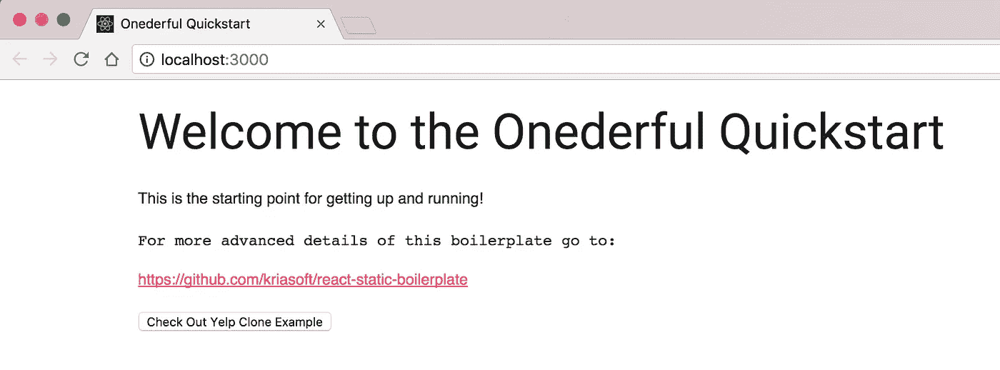

It takes a couple seconds to build, but when its done go to [http://localhost:3000/](http://localhost:3000/) in your browser

## 2.设置 AWS S3 铲斗(时间:~5 分钟)

*a)登录 AWS 控制台，点击 S3*

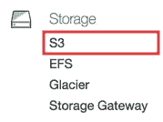

*b)点击【创建桶】，输入桶名(例如:****one derful-quick start****)。单击 Next 完成所有剩余步骤，并创建存储桶。*

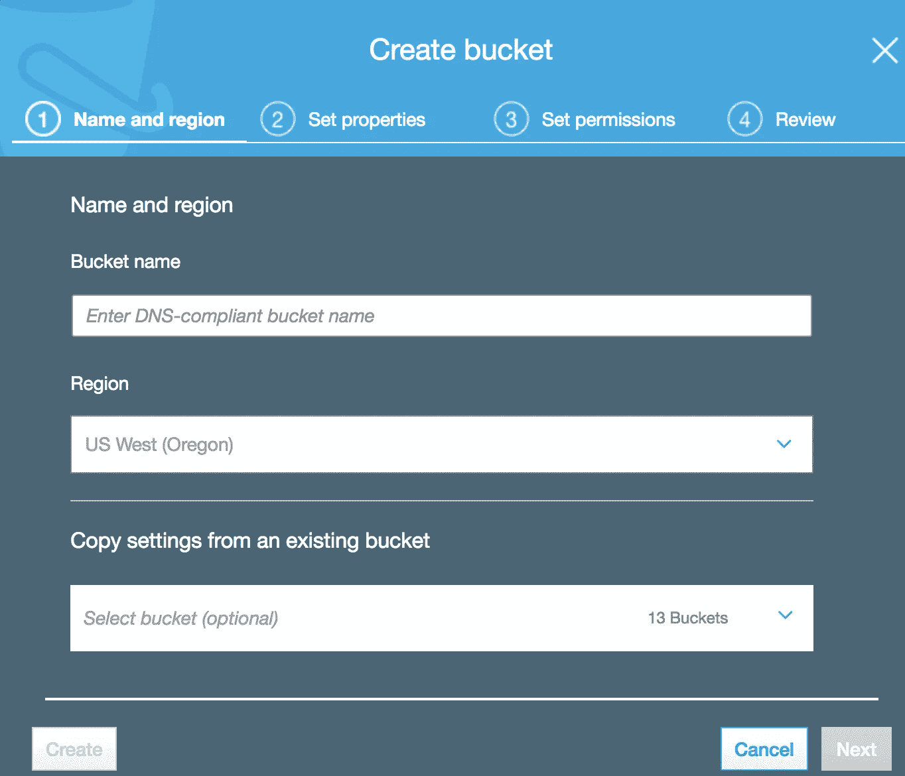

In Bucket name, use a unique name for your app

*c)在列表视图上，点击新创建的存储桶*

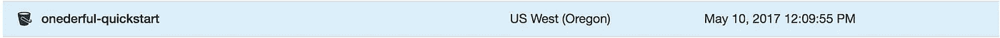

Your newly created bucket should be in the list view

*d)将显示一个弹出窗口，单击属性*

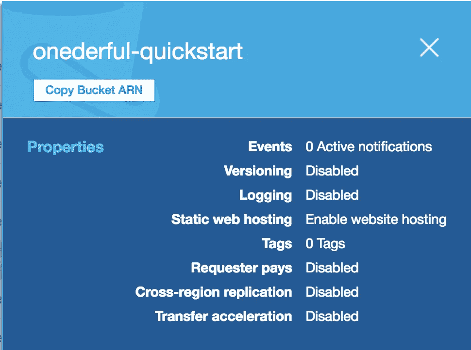

Clicking on the properties panel will redirect you to the properties tab for the bucket

*e)点击静态网站托管，在****index.html****中输入* ***索引文档*** *和* ***错误文档***

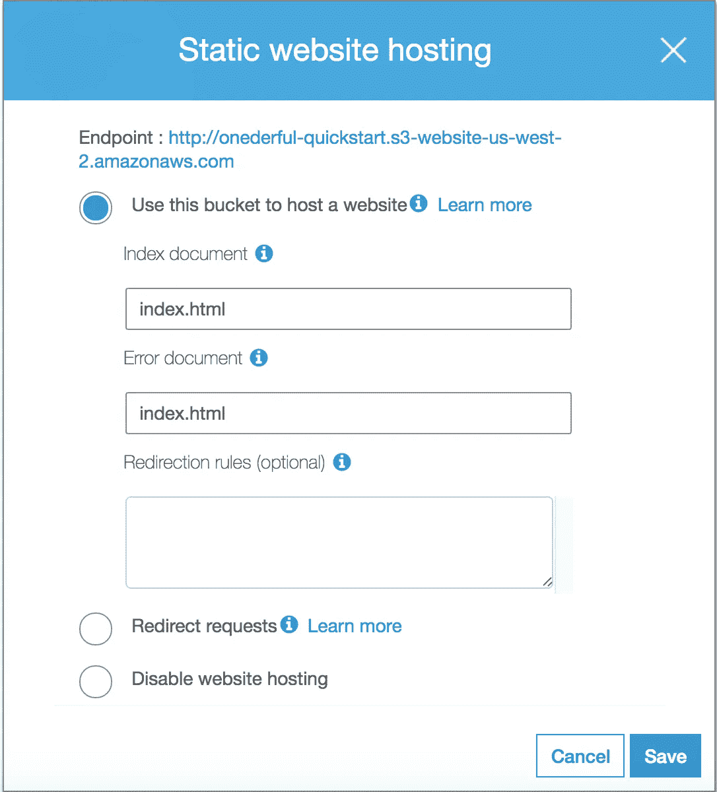

The endpoint is the public URL you can share with anyone. The error document being set to index.html enables the React app to define and handle all the routing rather than S3

*f)单击“permissions”选项卡，复制并粘贴策略(用您的存储桶名称替换[您的存储桶名称])*

```
{
    "Version": "2012-10-17",
    "Statement": [
        {
            "Sid": "AllowPublicRead",
            "Effect": "Allow",
            "Principal": "*",
            "Action": "s3:GetObject",
            "Resource": "arn:aws:s3:::[YOUR BUCKET NAME]/*"
        }
    ]
}
```

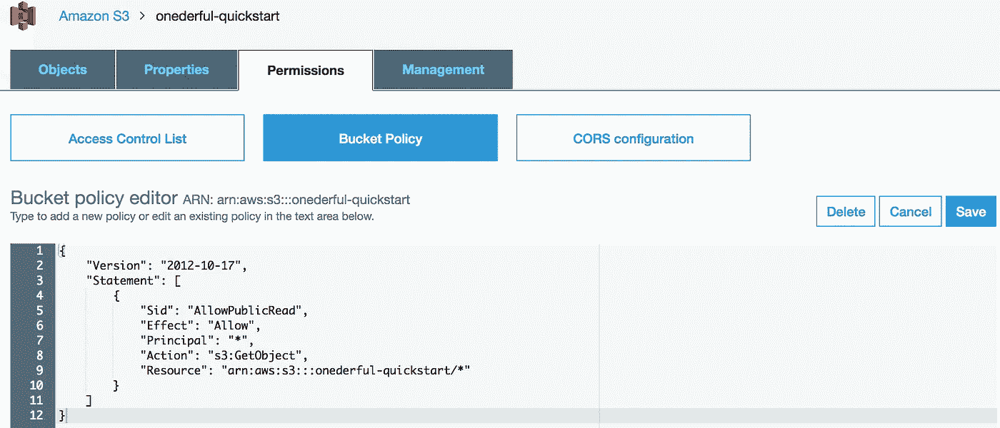

This policy allows everyone (principal: “*”) to see the objects (your website) in your bucket. If you don’t include this, the endpoint in step e) will return a 403 unauthorized error as it defaults the bucket to private.

## 3.创建 AWS 用户凭据以将文件上传到 S3(时间约 2 分钟)

*a)在 AWS 控制台中，单击 IAM(身份访问管理器)*

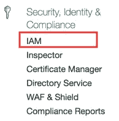

*b)点击侧面板上的用户选项卡。添加一个名为 s3-admin 的用户*

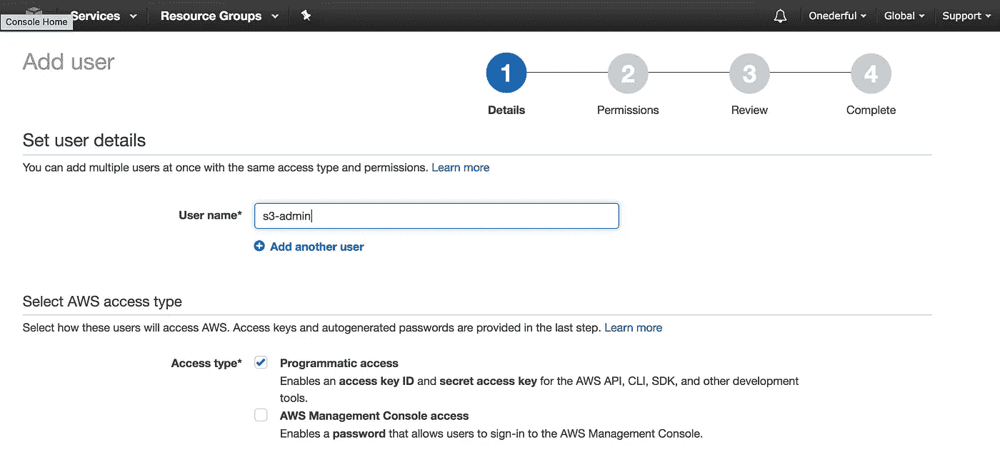

*c)附加 Amazon S3 完全访问策略*

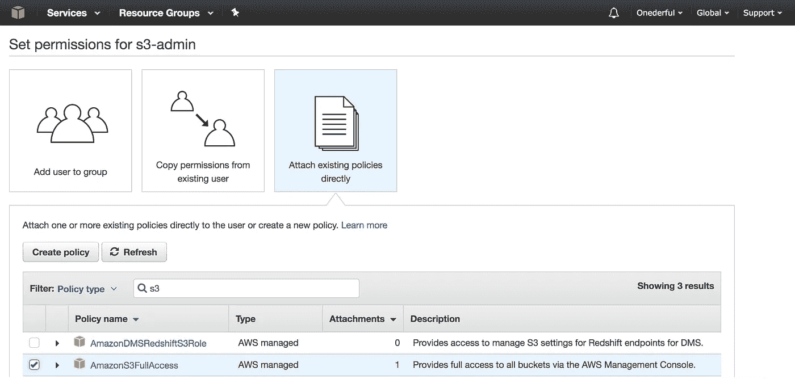

Use the AmazonS3FullAccess policy to enable the React app to use AWS APIs to deploy the website to S3

*d)创建用户后，跟踪您的* ***访问密钥 ID*** *和* ***秘密访问密钥*** *(凭证将在最后一步使用)*

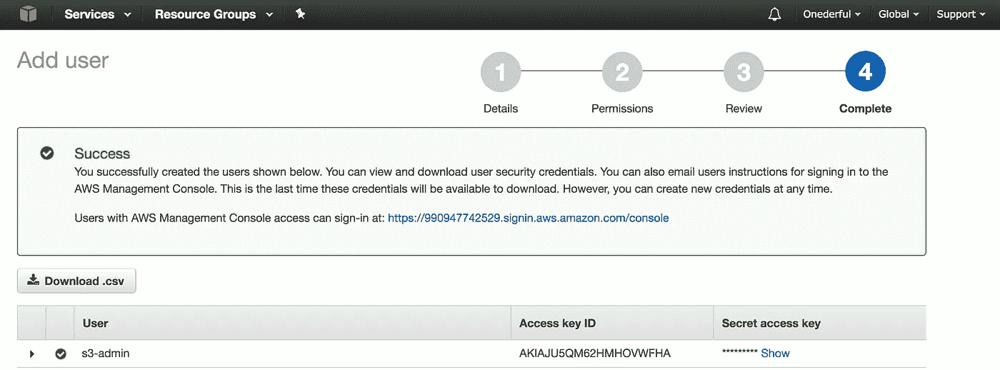

## 4.将样板文件部署到 AWS(时间:~1 分钟)

*a)更改文件中的凭证(tools/s3-upload.js)替换:****【YOUR _ BUCKET _ NAME】****用你的 BUCKET 名称* ***(步骤 2b)【YOUR _ AWS _ ACCESS _ KEY】****用你的* ***访问密钥 ID(步骤 3d)********’*****

*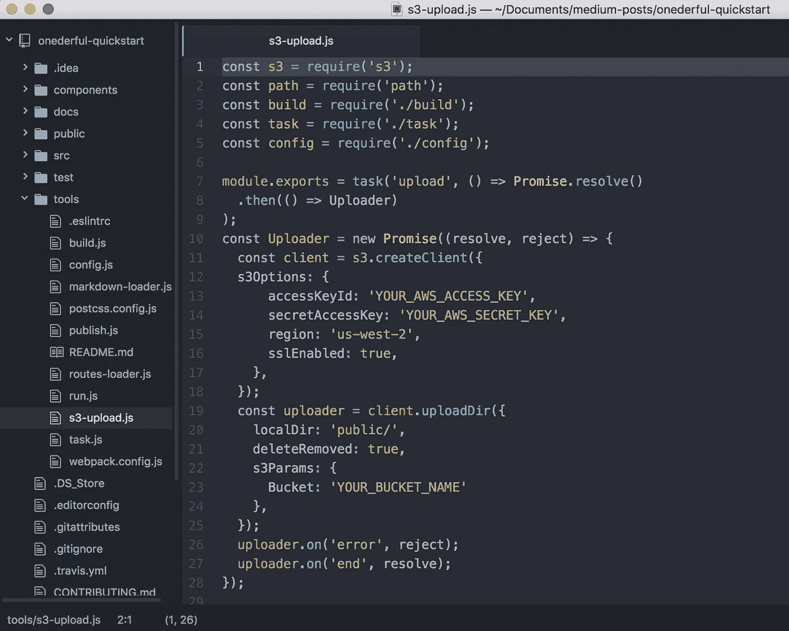*

*If you plan to save this project to a public git repo, make sure to hide your credentials. 1 way to do this is to import the credentials from a file that is in the .gitignore*

**b)构建并部署 quickstart 应用程序(每当您想要部署对 webapp 的更改时，请运行此命令)**

```
*$ yarn publish:webapp*
```

## *5.验证它的工作，并开始构建您的应用程序！*

*在您的浏览器中测试端点(从 2e 开始),并确保它已启动并运行。如果是的话，那么您已经准备好开始构建您的应用程序了！*

*总结一下:使用一个样板文件，使用 ReactJS/Redux 在 localhost 上快速获得一个工作的 webapp。设置 AWS S3 来托管具有公共端点的网站。设置 AWS 凭证，使我们能够从命令行将样板文件部署到 S3。*

*AWS 设置只需完成一次，所以现在如果您对 webapp 进行任何更改，您可以运行 deploy 命令(4b ),几秒钟内，更改就会生效。*

## *后续步骤*

*其他几个逐步教程正在准备中:*

*   *如何利用[www.onederful.co](http://www.onederful.co)graph QL 端点(ReactJS + GraphQL +愿望驱动设计)快速构建 yelp 克隆！)*
*   *如何使用[www.onederful.co](http://www.onederful.co)graph QL 端点跨多个公司 API 进行查询*
*   *设置无服务器 GraphQL 端点(无服务器框架— AWS Lambda)*
*   *使用 AWS Cognito(用于用户管理)+ AWS Lambda 设置一个完全无服务器的 webapp*
*   *使用 AWS Cloudfront + Route 53 将 CDN 放在此 webapp 的前面(为自定义域/子域启用缓存+ https)*

## *资源*

*[全方位快速启动回购](https://github.com/alxyee/onederful-quickstart)*

*[反应静态样板文件](https://github.com/kriasoft/react-static-boilerplate)*

*[AWS S3 静态托管文档](http://docs.aws.amazon.com/AmazonS3/latest/dev/WebsiteHosting.html)*

*[](http://bit.ly/HackernoonFB)**[](https://goo.gl/k7XYbx)**[](https://goo.gl/4ofytp)*

> *[黑客中午](http://bit.ly/Hackernoon)是黑客如何开始他们的下午。我们是 [@AMI](http://bit.ly/atAMIatAMI) 家庭的一员。我们现在[接受投稿](http://bit.ly/hackernoonsubmission)，并乐意[讨论广告&赞助](mailto:partners@amipublications.com)机会。*
> 
> *如果你喜欢这个故事，我们推荐你阅读我们的[最新科技故事](http://bit.ly/hackernoonlatestt)和[趋势科技故事](https://hackernoon.com/trending)。直到下一次，不要把世界的现实想当然！*

**