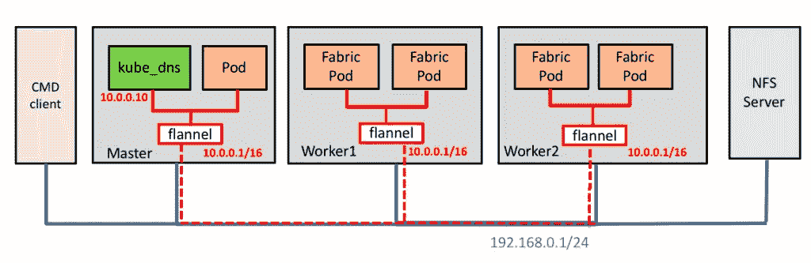
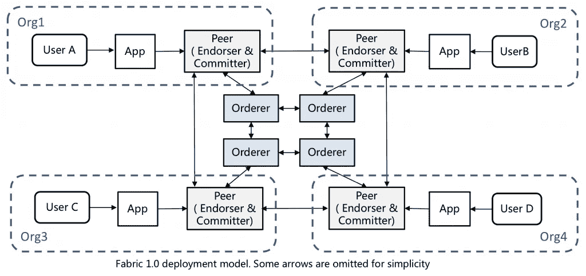
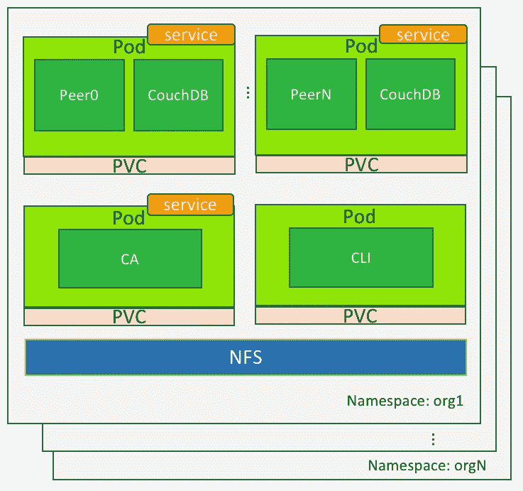
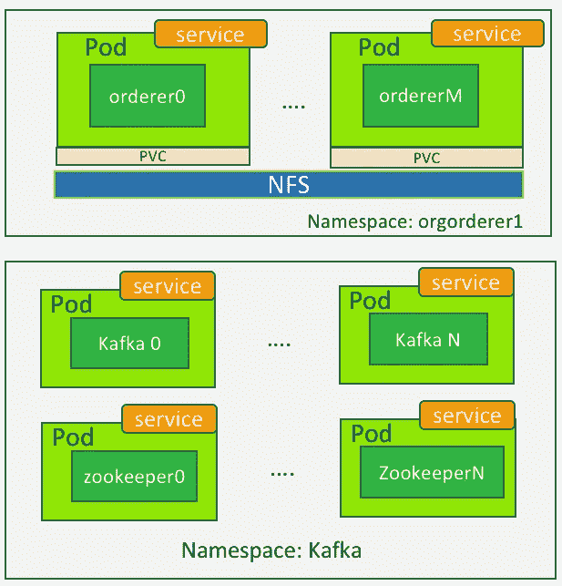
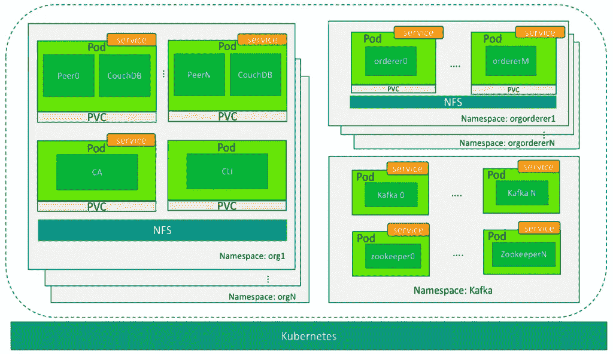
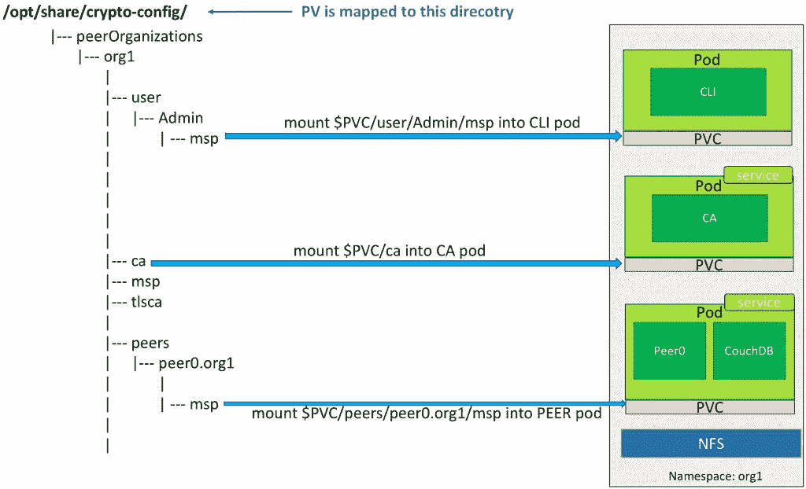

# 如何在 Kubernetes 上部署 Hyperledger Fabric)

> 原文：<https://medium.com/hackernoon/how-to-deploy-hyperledger-fabric-on-kubernetes-1-a2ceb3ada078>

# 概观

Fabric 是 Linux 基金会主持的 Hyperledger 项目之一。它提供了一个开发区块链应用程序的框架。自从今年 7 月 Fabric 1.0 发布以来，人们渴望使用 Fabric 构建应用程序来解决他们的业务问题。然而，由于结构配置的复杂性，许多人在部署和管理结构系统时会遇到困难。

为了简化 Fabric 的操作，我们需要一些工具来帮助我们更好地管理 Fabric 的分布式系统。Kubernetes 似乎是这一目的的理想选择，原因有几个。(有趣的是，Kubernetes 是 CNCF 的旗舰项目，也是 Linux 基金会的项目。)

首先，Fabric 的位被构建到容器映像中。它的 chaincode(智能契约)也利用容器在沙箱中运行。Fabric 系统由运行在多个容器中的组件组成。另一方面，Kubernetes 正在成为自动化容器化应用程序的部署、伸缩和其他管理的主导平台。这两者是天生的一对。

其次，Fabric 组件可以通过部署在 Kubernetes 上实现高可用性。Kubernetes 有一个名为 replicator 的功能，它可以监控正在运行的 pod，并自动调出崩溃的 pod。

第三，Kubernetes 支持多租户。我们可以在同一个 Kubernetes 平台上运行多个独立的 Fabric 实例。这有助于区块链应用程序的开发和测试。

在接下来的小节中，我们将介绍一种在 Kubernetes 上部署 Fabric 的方法。我们假设读者对织物、Docker 容器和 Kubernetes 有基本的了解。

# **网络拓扑**

我们的网络拓扑如图 1 所示。物理网络用蓝线表示。Kubernetes 有一个或多个主节点和工作节点。除此之外，我们有一个 CMD 机器作为客户机来发布部署命令。NFS 服务器用作配置文件和其他数据的共享文件系统。所有这些节点都通过物理网络(例如 192.168.0.1/24)连接在一起。

Kubernetes 的网络模型使所有的 pod 能够直接相互连接，而不管它们在哪个节点上。通过使用 Kubernetes 的 CNI 插件，如法兰绒，很容易为此目的创建一个叠加网络。如图 1 中的红线所示(省略了法兰绒组件的一些细节)，Kubernetes 将所有的 pod 连接到法兰绒网络，允许这些 pod 的容器正确地相互通信。

法兰绒网络的 IP 地址范围以及 kube_dns 的 IP 地址可以在附加配置文件中指定。我们需要确保 kube_dns 的 IP 地址必须在指定的地址范围内。例如，在图 1 中，法兰绒网络是 10.0.0.1/16，kube_dns 地址是 10.0.0.10。



图 1

# **将织物组件映射到 Kubernetes pod**



图 2

Fabric 是一个包含多个节点的分布式系统。这些节点可以属于不同的实体。如图 2 所示，每个组织都有自己的节点集(为了简单起见，没有显示所有节点)。还有一种由订购者形成的公共共识服务。为了将 Fabric 部署到 Kubernetes 上，我们需要将所有组件转换成用于部署的 pod，并使用名称空间来隔离组织。

在 Kubernetes 中，名称空间是一个重要的概念。它用于在多个用户之间划分集群资源。在 Fabric 的情况下，可以将组织映射到名称空间，以便它们拥有自己的专用资源。在这个映射之后，每个组织的对等体可以通过域名来区分。此外，我们可以通过设置网络策略来隔离不同的组织(不在本博客中讨论)。

如图 2 所示，假设在结构网络中有 N 个对等组织和 M 个订购者组织。我们在 Kubernetes 上是这样划分的:

如果是 Fabric，我们将第 N 个对等组织命名为 *orgN* 。它在 Kubernetes 中对应的名称空间也叫做 *orgN* 。Fabric *orgN* 的所有组件都将被放置到 Kubernetes 中的名称空间 *orgN* 中。每个组织的名称空间下有多个窗格。在 Kubernetes 中，pod 是一个部署单元，它由一个或多个容器组成。我们可以将每个组织的织物容器捆绑到几个容器中。这些 pod 类型如下:

*   **Peer Pod:** 包括 Fabric peer，couchDB(可选)，代表组织的对等节点。每个组织可以有一个或多个对等 pod。
*   **CA Server Pod:** 组织的结构 CA 服务器节点。通常一个组织需要一个 pod。
*   **CLI Pod:** (可选)为命令行工具提供操作组织节点的环境。Fabric 的对等环境变量在此 pod 中配置。



图 3

**B)** 结构中可能有一个或多个订购者。我们将第 M 个订购者组织的名称设置为*orgorderm*。它在 Kubernetes 上对应的名称空间是*orgorderm*。它有一个或多个窗格来运行订购者节点。



图 4

**C)** 如果 Kafka 用于共识过程，我们可以把 Kafka 放入一个单独的命名空间。它仅用于运行和管理 Zookeeper 和 Kafka 容器。

总的来说，整个部署如下所示:



图 5

# **共享存储**

在我们部署 Fabric 之前，我们需要准备它的组件的配置文件，比如对等体和订购者。这是一个非常复杂的过程，容易出错。幸运的是，我们创建了一个工具来自动生成这些配置文件。生成的文件存储在共享文件系统中，如 NFS。

当我们稍后启动 Fabric 的 pods 时，我们将配置文件的不同子集挂载到 pods 中，以便它们具有特定于其所属组织的配置。

在 Kubernetes 中，我们可以通过使用持久卷(PV)和持久卷声明(PVC)将文件或目录挂载到 pod 中。我们为结构中的每个组织创建 PVs 和 PVC，以实现资源隔离。每个组织应该只能在 NFS 服务器中看到自己的目录。

创建 PV 后，我们定义 PVC，以便结构节点可以使用 PV 来访问相应的目录和文件。

以同级组织 org1 为例。首先，我们创建一个名称空间 org1 及其 PV。PV 被映射到 NFS 上的目录*/opt/share/crypto-config/peer organizations/org 1*。其次，我们创建一个 PVC 来消耗 PV。名称空间 org1 下的所有 pod 都使用相同的 PVC。但是，我们只通过在 pod 配置文件中指定挂载路径来将必要的文件映射到每个 pod 中。

图 6 显示了 pod 和它们共享的 NFS 目录之间的关系。变量$PVC 表示 PVC 挂载点，在本例中是*/opt/share/crypto-config/peer organizations/org 1*。



图 6

# **织物组件之间的通信**

当所有 Fabric 的组件都放入 Kubernetes 的 pod 时，我们需要考虑这些 pod 之间的网络连接。Kubernetes 中的每个 pod 都有一个内部 IP 地址，但是很难使用 IP 和端口在 pod 之间进行通信，因为 IP 地址对于 pod 来说是短暂的。当 pod 重新启动时，它的 IP 地址也会改变。因此，有必要在 Kubernetes 中为 pods 创建服务，以便它们可以通过服务名相互对话。服务的命名应该遵循以下原则，以显示它所绑定的 pod 信息:

**1)** 服务和 pod 的名称空间应该一致。
**2)** 服务的名称应该与 pod 内容器的 id 一致。

例如，组织 org1 的 fabric peer0 映射到命名空间 org1 下名为 peer 0 的 pod。绑定到它的服务应该命名为 peer0.org1，其中 peer0 是服务的名称，org1 是服务的名称空间。其他 pod 可以通过服务名 peer0.org1 连接到 org1 的 peer0，该服务名显示为 peer0 的主机名。

# **绕过链码沙箱**

当 Fabric 中的一个对等体实例化一个链代码时，它创建一个 Docker 容器，链代码在其中运行。它调用来创建容器的 Docker API 端点是 unix:///var/run/docker.sock。只要对等容器和链码容器由同一个 Docker 引擎管理，这种机制就能很好地工作。但是，在 Kubernetes 中，chaincode 容器是由对等体创建的，没有通知 Kubernetes。因此，链代码和对等容器不能相互连接，这导致实例化链代码时失败。

为了解决这个问题，我们需要在每个 worker 节点的 Docker 引擎中添加 Kube_dns IP 地址。这确保了 chaincode 容器可以通过使用 Kube_dns 服务正确解析对等体的主机名(服务名)。为此，在 Docker 引擎的配置文件中添加以下选项，在 Ubuntu 14.04 中通常是 */etc/default/docker* 。如果该文件不存在，您可能需要创建它。请注意，在最新版本的 docker 和一些 Linux 发行版中，设置 Docker 守护进程选项的方式可能会有所不同。更多细节请参考 Docker 的文档。

在下面的示例中，10.0.0.10 是 kube_dns pod 的 IP 地址。在您的环境中用正确的值替换它。

```
DOCKER_OPTS="--dns=10.0.0.10 --dns=192.168.0.1 --dns-search \
default.svc.cluster.local --dns-search \
svc.cluster.local --dns-opt ndots:2 --dns-opt \
timeout:2 --dns-opt attempts:2 "
```

到目前为止，我们已经说明了在 Kubernetes 上部署 Fabric 的关键点。在下一篇文章中，我们将描述部署的详细步骤。对于不能等待的人，请在 Kubernetes 上下载我们的 Fling“[**区块链”，感受一下它是如何工作的。它是一个自动化工具，允许您以最少的配置在 Kubernetes 上部署 Fabric。Fling 向您展示了如何在 vSphere 上部署 Kubernetes。如果不使用 vSphere，您可以为 Kubernetes 实例选择任何底层基础架构。只需跳过在 vSphere 上部署 Kubernetes 的步骤。请随时让我们知道您的想法。**](https://labs.vmware.com/flings/blockchain-on-kubernetes)

**继续第二部分:**

[https://medium . com/@ Zhang Henry/how-to-deploy-hyperledger-fabric-on-kubernetes-2-751 abf 44 c 807](/@zhanghenry/how-to-deploy-hyperledger-fabric-on-kubernetes-2-751abf44c807)

**相关帖子:**

[**Hyperledger Fabric 部署使用舵图**](http://www.think-foundry.com/hyperledger-fabric-deployment-using-helm-chart/)

# **关于作者:**

**张卫彝:**VMware 中国首席架构师 R & D，[项目港](https://github.com/vmware/harbor)()——开源容器注册服务器创始人。亨利是《**区块链技术指南**》一书的合著者。他也是 [Hyperledger 大提琴项目](https://github.com/hyperledger/cello)的贡献者。推特:@张海宁

**陈璐珂:**VMware 中国研发中心工程师&他拥有广州大学的硕士学位。他是 Hyperledger Cello 项目的维护者。