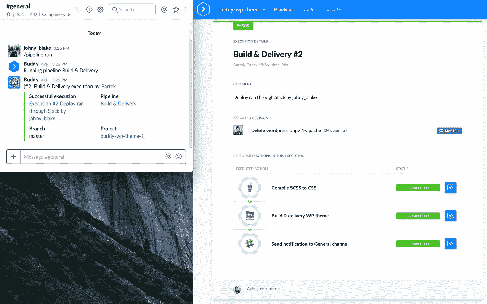

# 如何直接从 Slack 部署 WordPress

> 原文：<https://medium.com/hackernoon/how-to-deploy-wordpress-directly-from-slack-eb25ec7b8e1d>

以简单为核心， [Slack](https://hackernoon.com/tagged/slack) 似乎一直是巴迪的完美补充。事实就是这样:超过 50%的用户在他们的管道中使用了松弛行为。

Slack 和 Buddy 最常见的用例是向您的团队通道发送关于完成的构建和部署的通知。然而，没有多少开发人员知道您还可以直接从 Slack 运行部署:

# 用例:一个 WordPress 项目

让我们假设你有一个 [WordPress](https://hackernoon.com/tagged/wordpress) 应用程序，它有以下动作:

1.  准备资产[大口]
2.  部署编译的资产[FTP]
3.  通知您的团队完成部署，或者向 QA 发送消息，告知出现了问题[Slack]

有了 Buddy，你可以通过一个简单的`run`命令来触发以上所有操作。

# 与巴迪一起建立一个项目

1.  [**使用您的 GitHub/Bitbucket 帐户或电子邮件注册好友**](https://buddy.works/sign-up)
2.  创建一个新项目，选择您的 Git 提供程序，然后选择您的项目:

# 建立一个输送管道

现在让我们添加一个交付管道，它将在收到命令时构建并交付您的项目:

1.  点击**添加新管道**
2.  将触发模式设置为“点击时”
3.  选择要部署的分支
4.  准备好后点击**添加新管道**

# 喜欢你读的书吗？[点击此处查看完整指南！](https://buddy.works/guides/how-deploy-wordpress-from-slack)

