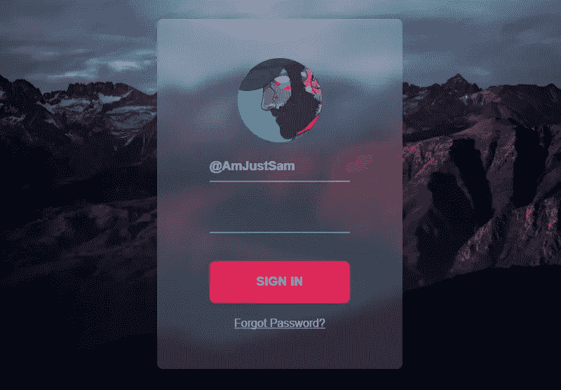
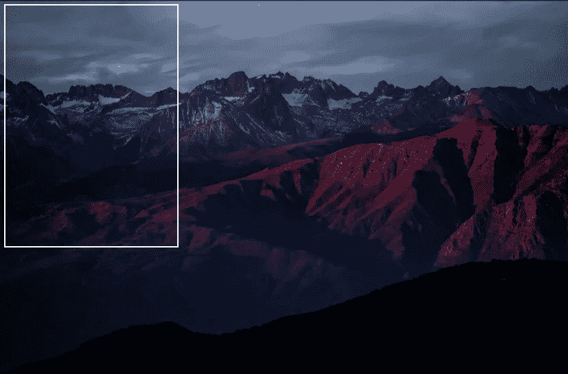
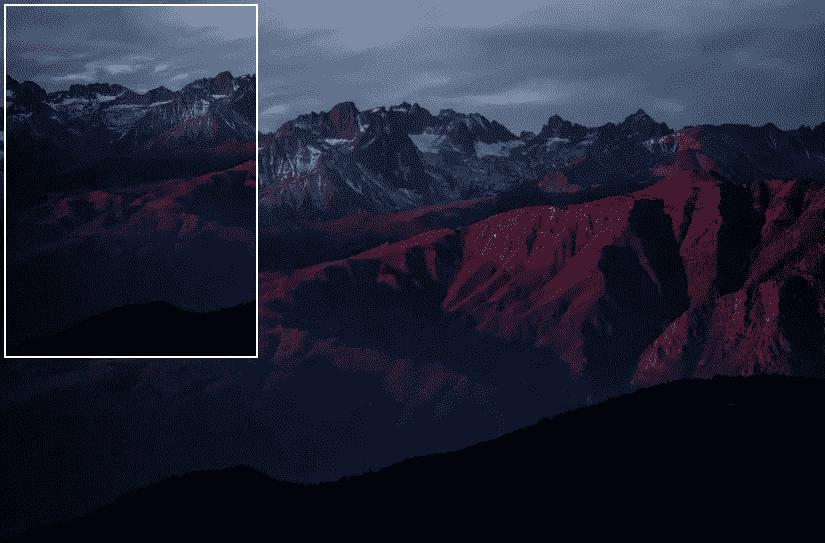
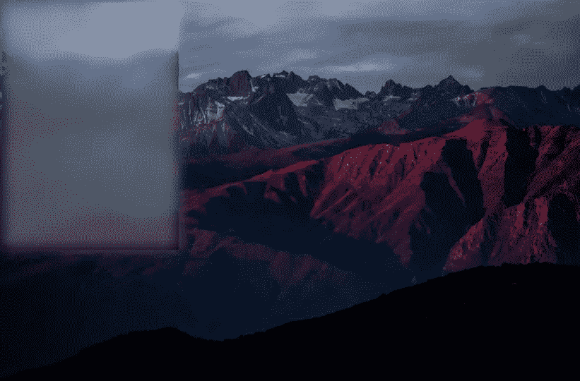
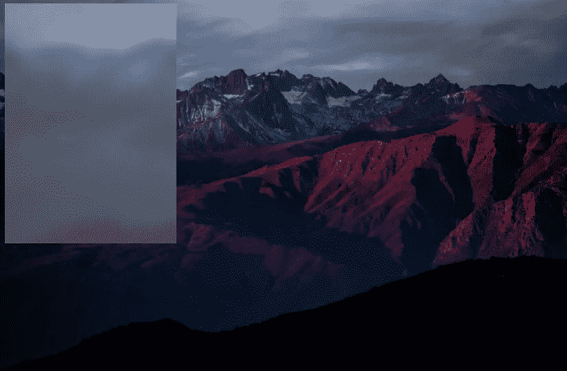

# CSS 只有毛玻璃效果怎么做？

> 原文：<https://medium.com/hackernoon/how-to-do-css-only-frosted-glass-effect-e2666bafab91>



[https://codepen.io/AmJustSam/full/ModORY/](https://codepen.io/AmJustSam/full/ModORY/)

磨砂玻璃效果已经风靡互联网好几年了，Mac OS 因其磨砂玻璃效果而闻名，Windows 10 也在使用其他一些光线&深度、运动、材料、比例等东西来实现磨砂玻璃效果，这被称为[流畅设计系统](https://www.microsoft.com/design/fluent/)。

当谈到在 CSS 中做磨砂玻璃效果时，我们中的一些人知道如何做，而另一些人仍然在互联网上到处搜索:

# 怎么办？？

> “css 光泽效果”
> “css 毛玻璃”
> “透明模糊背景 CSS”
> “毛玻璃效果 Photoshop”
> “仅 CSS 模糊背景”
> “CSS 玻璃窗格”
> “CSS 背景滤镜”
> “CSS 模糊叠加”
> “CSS 模糊背景 div 后面”

今天我将展示一个 CSS 唯一的方法，你可以用它在 CSS 中制作毛玻璃效果。

让我们开始吧。

# **1。创建一个 HTML 标记**

为了简单起见，我将向你展示如何用一个空的 div 做一个磨砂玻璃效果。所以，在 HTML 中你需要的只是一个空的 div。

```
<div></div>
```

# **2。移除所有元素的多余空白&填充**

现在，我们需要从所有元素中移除多余的空白和填充。因此，我们的背景没有任何空白或填充等。

```
*{
 margin: 0;
 padding: 0;
}
```

# 3.添加背景图像

我们需要我们的背景采取一个页面的全部宽度和高度，我们不希望我们的背景重复，我们也希望我们的背景是固定的。我们希望我们的背景是固定的，因为我们不希望当我们以后继承我们的背景时，我们的完整背景出现在一个 div 中。

```
body{
 background-image: url([http://bit.ly/2gPLxZ4](http://bit.ly/2gPLxZ4)); //add "" if you want
 background-repeat: no-repeat;
 background-attachment: fixed;
 background-size: cover;
}
```

# 4.现在给 Div 一些样式

现在，我们要给背景继承的 div 一些宽度和高度。我们还需要绝对位置，以确保我们的覆盖不占用我们的网页的全部宽度和高度

```
div{
 background: inherit;
 width: 250px;
 height: 350px;
 position: absolute;
}
```

# 5.附件固定和不固定的示例



with background attachment fixed



without background attachment fixed

现在，我们知道背景附件是固定的，我们只能看到 div 后面的 div 中的背景图像区域，这是我们希望磨砂玻璃效果起作用的地方。

# 6.现在我们需要创建一个覆盖

我们需要`content: “”`来确保我们的 before 伪类工作。我们也从它的父元素继承了背景，并且我们使用绝对位置在它的父元素 DIV 中对齐它。我们使用框阴影添加一个白色透明覆盖，我们使用模糊覆盖模糊。

```
div:before{
 content: “ ”;
 background: inherit; 
 position: absolute;
 left: 0;
 right: 0;
 top: 0; 
 bottom: 0;
 box-shadow: inset 0 0 0 3000px rgba(255,255,255,0.3);
 filter: blur(10px);
}
```



It looks something like this now

嗯，现在看起来像这样，但是我们在 div 的边缘仍然有一些问题。

# 7.修复 DIV 的未模糊边缘

现在，我们需要修复 div 的非模糊边缘，为此我们需要将覆盖图的大小增加到比它的父尺寸高一点，然后给它减去(-25)的顶部和左侧位置。我们还需要给它的父 DIV 一个 hidden 溢出，以确保父 DIV 之外的任何覆盖都不会显示出来，并且是隐藏的。

```
div{
 background: inherit;
 width: 250px;
 height: 350px;
 position: absolute;
 overflow: hidden;  //adding overflow hidden
}div:before{
 content: ‘’;
 width: 300px;
 height: 400px;
 background: inherit; 
 position: absolute;
 left: -25px;  //giving minus -25px left position
 right: 0;
 top: -25px;   //giving minus -25px top position 
 bottom: 0;
 box-shadow: inset 0 0 0 200px rgba(255,255,255,0.3);
 filter: blur(10px);
}
```



CSS only frosted glass effect

> **提示:**如果你想在这个 div 中添加内容，那么我建议你在磨砂玻璃效果 div 中创建另一个 div，并给它一个绝对位置，然后将你想放入的任何内容放入该 div 中，如果没有绝对位置，你的内容将位于磨砂玻璃效果 div 的后面，而不会显示在它的上面。

好了，现在我们有了 CSS 的磨砂玻璃效果…
我希望你喜欢这篇文章，如果你有任何问题，欢迎在下面评论，我会很乐意尽快回答。

> **注意**:你也可以使用 CSS 属性`“backdrop-filter: blur(20px)”`来达到这个效果，就其工作原理来说，这是一个更容易和更好的选择，但是浏览器对它的支持还不够好。([点击这里](https://caniuse.com/#feat=css-backdrop-filter))

如果你正在寻找这篇文章封面图片中的例子，那么——[点击这里](https://codepen.io/AmJustSam/pen/ModORY)

另外，看看这篇关于 CSS 布局问题的新文章。 [**点击这里**](/@AmJustSam/how-to-fix-css-layout-issues-bc54a21b0b8c)

#KeepCoding:)