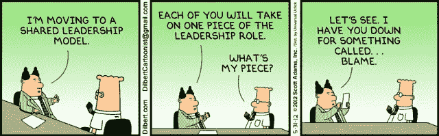
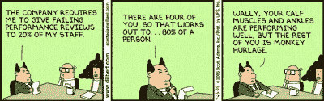
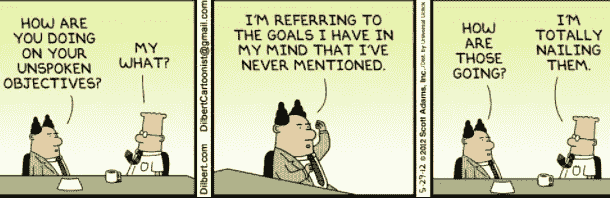
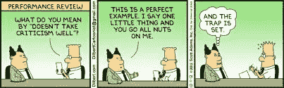
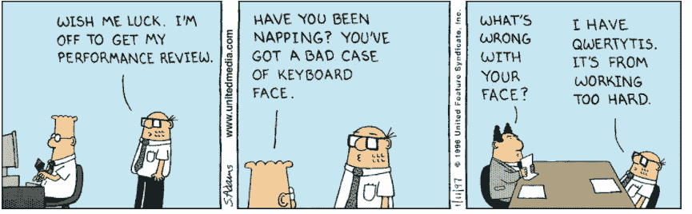
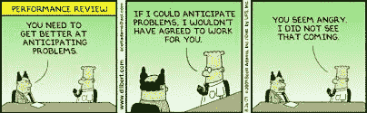
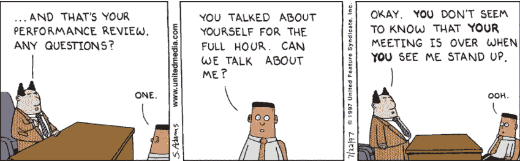
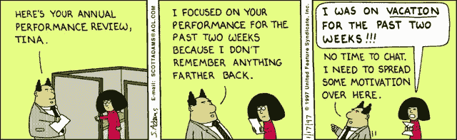

# 如何进行绩效评估

> 原文：<https://medium.com/hackernoon/how-to-do-performance-reviews-2f0e8cd170da>

绩效/焦点评估每年都会对员工进行，是绩效的重要驱动力，但许多公司却经常犯这样的错误。作为一名软件工程师，我已经收到了许多绩效评估，随着时间的推移，我意识到了一些应该有助于这一过程的要点。

考核会以积极或消极的方式影响员工的绩效。对于希望从团队中获得高绩效的经理来说，有两种方法可以利用，绩效评估和培训。前者比后者更有影响力。我认为评估应该真正针对员工的技能/差距，并激励他/她提高绩效。

同时，绩效评估对员工来说确实是一个情绪化的时间，因为它是他努力工作的结果，以反馈的形式，可能还有一些金钱或基于责任的收获。

Jargon

> **绩效评估(预评审)**

在绩效评估中保持客观是非常重要的。业绩的衡量应该基于产出，而不是活动。这是为了区分那些看起来很忙的人和那些实际上能产生有意义的结果的人。有些员工可能正在做数千种不同的活动，但收效甚微，而且可能显得非常忙碌。但是，在我看来，真正交付产出的员工表现更好。我不是说活动应该没有重量。让我们举一个需要设计特定架构的例子。尽管这是一项活动，但却是一项高杠杆的活动。其次，如果员工只是承担较少的功能来构建产品，这几乎和执行一项活动一样糟糕。交付速度、质量和数量在评审中应该具有同等的权重。因此，评估应该是产出和活动的平衡，其中活动应该只是员工执行的高杠杆任务。

Reality

另一个要点是，评估永远不应该基于“潜力”。“潜力”意味着奖励形式而非实质。这可能会在同一团队的同事之间引起冲突。对于经理的绩效评估评级，我们应该遵循一条黄金法则——经理的绩效评级不能高于我们对其团队的评级。这将会淘汰那些表现得像好经理，但行为却不像好经理的经理。

经理可以使用的一个重要方法是设身处地为员工着想，想想如果他处在这个位置，他会怎么做。两种方法之间的差异可以让经理很好地了解员工的立场。这种偏离路线的情况只有在经理对该员工过去的工作有相当的经验时才有可能出现。评估也可以与收入挂钩。就销售而言，这比较容易，但在许多其他领域则比较困难。对于工程师来说，最重要的是了解他们对业务收入的影响。规模、架构和功能都很好，但只有当你能为其分配一些价值时，它们才变成可以量化的有形价值。

> **绩效考核**

Communication gap

> ndy Grove 提到了一篇评论的三个 L:Level，听着，别管自己。

与您的员工坦诚相待，并对他保持透明。没有它，审查就失去信誉。沟通是关键。员工可能会因为某些原因而生气，在评估过程中不会倾听，他会倾听但不在乎，或者他会倾听，只是重复他被告知的内容。所有这些都是经理需要知道的危险信号。经理需要非常清楚和简洁地表达他想要传达的信息。

第二个是倾听。经理需要非常仔细地倾听员工要说的话。在复习过程中，他不仅要用耳朵听，还要寻找视觉线索。

第三个，也可能是最重要的一个，就是不要管自己。审查是针对员工的，经理过去的艰辛、内疚和不安全感不应该影响他的员工的职业生涯。在科技领域，变化非常迅速。时代和环境发生了变化，与经理作为员工的时间有很大不同。这应该在让经理的过去的权力审查之前说明。不要误解我的意思，一个经理过去的经历很棒，我需要的只是他的负罪感和不安全感。

> H **如何进行审核？**

Play Safe

促进审查的流程应该赋予员工比经理更多的权力。我过去设计了很多流程，我学到的是，好的流程会略微改善公司员工的生活，而坏的流程会成倍地增加问题。同样，糟糕的审查流程会导致员工流失或士气低落。糟糕的审查过程真的很难发现，因为它可能表面上看起来是公平的，或者它的糟糕结果可能归因于其他更明显的原因。一个好的审查过程可以提高公司的诚信。

为员工准备评估时，一个好主意是将所有内容不加过滤和编辑地写在纸上。之后，你可以利用这一点来建立对员工绩效有重大影响的分数。这将防止熵。审查不应该有任何意外。如果你还看到任何它应该提出来，无论它可能是困难的。在一篇评论中，沟通不良是没有理由的。

> **糟糕的表演者**

Blame Game

每个团队都有一些好的和一些不太好的表现者。对于经理来说，重要的是隔离表现不佳的员工，以免影响整个团队。鼓励糟糕的表现会导致团队内部出现重大裂痕，这可能是不可挽回的。通常表现差的人会忽略这个问题。经理需要提供问题的证据来说服他们。他们可能会玩指责游戏，这是标准的防御机制。只有当表现不佳的人能够承认问题并试图找到解决办法时，这种改变才会发生。经理不得不尽力帮助这个可怜的表演者过桥。

Admit it

一旦表现不佳的员工承认需要改进，经理应该信任他，并在整个过程中帮助他。不接受他正在努力改进的事实对经理来说也是消极的。

> **明星演员:**

在任何绩效评估中，明星员工通常会得到最糟糕的一面。当他持续取得成果时，经理对他的表现给予了很好的评价。他较少关注自己可以改进的领域。有时他可能会添加一个或两个只是为了引起他的注意。请记住，团队中表现最好的人有 5-10%的提高，会给团队和你自己的绩效带来指数级的提高。但是，我们仍然无法提供反馈，这将有助于他到达那里。

Stars

对于表现不佳的员工，经理通常会给予许多指点、培训机会和指导。表现不佳者的边际改善不会极大地改善团队，但表现出色者的边际改善可以创造奇迹。最好是以建设性的方式传达经理对明星员工的所有负面反馈，无论多细微。这会鼓舞他的士气，帮助他提高更多。我觉得明星员工的评估应该比普通员工或表现不佳的员工的评估有更多的批评，因为这是经理最大的优势。

> **最佳实践:**

*   谁先写评论？如果员工先写了他的评价，你可以用自己的话回复一下，然后寄回去。这对员工公平吗？不。经理应该先写他的评估。员工可以阅读经理的反馈，然后独立完成自己的评估。这也有助于员工理解经理的背景。如果员工认为他在地球上，但经理的背景是火星，员工必须更清楚地了解他的背景。此外，如果他们相差太远，员工在其他地方可能会更好。如果员工先写评估，这是不可能的。

New Hire

*   经理是应该事先提供评估，还是只在会议期间提供？如果这发生在会议期间，那么也许会有伦敦漫步东京的讨论。换句话说，经理提供了 X 点，而员工停留在 y 点。为了使评估过程最有成效，如果经理提前提供评估，员工可以了解更多信息，理解背景，并为会议做好更充分的准备。
*   员工应该何时进行评估？最佳时间是在经理的书面评估和评估会议之间。这将有助于他整理思绪，从情感和理性上为面对面的讨论做好准备。

Good managers

*   如果每年进行审查，则应考虑年度绩效，而不是过去三个月的绩效。根据过去三个月的情况写一份评估报告很容易，但这对员工的辛勤工作是不公平的。好的管理者绝不会犯这种错误。
*   审查过程的时间表应该是什么？经理书面评审、员工评审到评审会议之间的整个时间不应超过两周。时间越多，在翻译中增加熵的机会就越多。应该尽一切可能利用技术工具来实现这一过程。
*   高层经理应随机要求中层经理提交其员工的评估。高层管理人员可以根据自己的经验向直接下属提供改进建议。这应该在尽可能多的能见度和噪音的情况下进行，以确认该过程的重要性。这将有助于他的链中的每个人有尊严地做审查。这可以提高他的中层经理的影响力，从而提高他自己的影响力。

所有的复习方法都会有漏洞和问题，包括上面提到的。然而，最好的方法将有最高的杠杆作用。因此，在为你的团队/公司设计评审流程时，一定要优化杠杆作用。