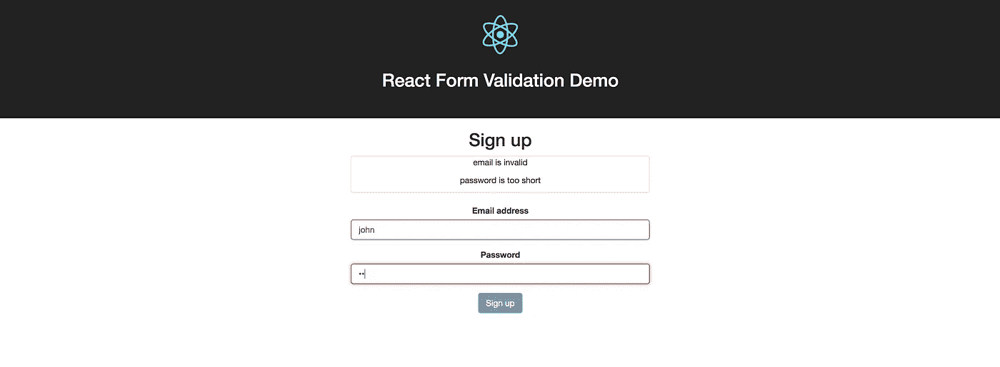

# 如何在#Reactjs 中进行简单的表单验证

> 原文：<https://medium.com/hackernoon/how-to-do-simple-form-validation-in-reactjs-83b92c080b67>



Simple Form Validation in React

这是一个循序渐进的教程，将向您展示如何在 [React](https://hackernoon.com/tagged/react) 中进行基本的表单验证。

你可以 [**在 Github**](https://github.com/learnetto/react-form-validation-demo) 上看到完整代码 [**在 Heroku**](https://reactform.herokuapp.com/) 上看到运行的 app。

[](https://github.com/learnetto/react-form-validation-demo) [## learnetto/react-表单-验证-演示

### 反应-表单-验证-演示-反应表单验证演示

github.com](https://github.com/learnetto/react-form-validation-demo) 

我们将使用[**create-react-app**](https://github.com/facebookincubator/create-react-app)快速启动并运行一个简单的 React 应用程序。

从 npm 安装软件包并创建新的应用程序:

```
$ npm install -g create-react-app 
$ create-react-app react-form-validation-demo
```

现在让我们运行应用程序:

```
$ cd react-form-validation-demo/
$ npm start
```

这将打开我们的新应用程序正在运行的[**http://localhost:3000/**](http://localhost:3000/)。

接下来，让我们添加 bootstrap，以便我们可以轻松地设计表单:

```
$ npm install react-bootstrap — save 
$ npm install bootstrap@3 — save
```

在 **src/index.js** 文件的开头导入引导 CSS 和可选的引导主题 CSS:

```
import ‘bootstrap/dist/css/bootstrap.css’; 
import ‘bootstrap/dist/css/bootstrap-theme.css’;
```

好了，现在让我们构建演示应用程序的核心。让我们添加一个表单组件。

在 **src/App.js** 中，让我们用将要构建的表单组件替换默认的介绍文本标记。我们还需要导入它:

```
import React, { Component } from 'react';
import logo from './logo.svg';
import './App.css';
import Form from './Form.js';class App extends Component {
  render() {
    return (
      <div className="App">
        <div className="App-header">
          
          <h2>React Form Validation Demo</h2>
        </div>
        <Form />
      </div>
    );
  }
}export default App;
```

现在，让我们在 **src/Form.js.** 中创建表单组件

我们将制作一个简单的注册表单，包含电子邮件和密码输入字段以及一个提交按钮。

```
import React, { Component } from ‘react’;
import ‘./Form.css’;class Form extends Component {
 render () {
   return (
     <form className=”demoForm”>
       <h2>Sign up</h2>
       <div className=”form-group”>
         <label htmlFor=”email”>Email address</label>
         <input type=”email” className=”form-control”
           name=”email” />
       </div>
       <div className=”form-group”>
         <label htmlFor=”password”>Password</label>
         <input type=”password” className=”form-control”
           name=”password” />
       </div>
       <button type=”submit” className=”btn btn-primary”>
          Sign up
       </button>
     </form>
   )
 }
}
export default Form;
```

我从 Bootstrap 文档中复制了一个示例表单，这样它开箱后看起来很漂亮。

但是请注意，我必须改变一些东西，使它与 JSX。

的*类*和*是 [JavaScript](https://hackernoon.com/tagged/javascript) 中的保留关键字，所以我们必须分别使用 *className* 和*html 来代替*。*

我们还需要确保关闭所有标签，包括输入标签*和输入标签*。

现在，让我们在构造函数中初始化状态:

```
constructor (props) {
  super(props);
  this.state = {
    email: '',
    password: ''
  }
}
```

我们将电子邮件和密码设置为空字符串。

对于电子邮件，我们将把表单输入字段与这些状态值联系起来:

```
value={this.state.email}
```

对于密码:

```
value={this.state.password}
```

但是我们没有更新用户输入的状态，所以如果我们现在输入表单域，我们的文本不会出现。

我们需要一个用于输入字段的 *onChange* 处理程序:

```
onChange={this.handleUserInput}
```

我们将其定义为:

```
handleUserInput = (e) => {
  const name = e.target.name;
  const value = e.target.value;
  this.setState({[name]: value});
}
```

好了，现在让我们开始验证。

我们将在状态中保存任何验证错误和表单的有效性状态。

让我们给初始状态添加几个属性:

```
constructor (props) {
  super(props);
  this.state = {
    email: '',
    password: '',
    formErrors: {email: '', password: ''},
    emailValid: false,
    passwordValid: false,
    formValid: false
  }
}
```

我们正在添加一个名为*former errors*的属性，它将是一个对象，输入字段名作为键，任何验证错误作为它们的值。每个键的初始值是一个空字符串。

我们还有 3 个布尔属性——*email valid*、 *passwordValid* 和 *formValid* ，我们将根据验证结果使用它们来启用或禁用表单提交按钮。我们将它们的初始值设置为 false。现在让我们添加一个名为*former errors*的新组件，用于在表单上方显示我们验证的任何错误。

```
<div className=”panel panel-default”>
 <FormErrors formErrors={this.state.formErrors} />
</div>
```

我们将它保存在 **src/FormErrors.js** 中:

```
import React from ‘react’;export const FormErrors = ({formErrors}) =>
  <div className='formErrors'>
    {Object.keys(formErrors).map((fieldName, i) => {
      if(formErrors[fieldName].length > 0){
        return (
          <p key={i}>{fieldName} {formErrors[fieldName]}</p>
        )        
      } else {
        return '';
      }
    })}
  </div>
```

它是一个无状态的功能组件(或表示组件),简单地遍历所有的表单验证错误并显示它们。

现在，我们将在用户在字段中键入内容后调用一个验证。

setState 方法接受一个回调函数作为第二个参数，所以让我们向它传递一个验证函数。

```
handleUserInput (e) {
  const name = e.target.name;
  const value = e.target.value;
  this.setState({[name]: value}, 
                () => { this.validateField(name, value) });
}
```

让我们定义一下:

```
validateField(fieldName, value) {
  let fieldValidationErrors = this.state.formErrors;
  let emailValid = this.state.emailValid;
  let passwordValid = this.state.passwordValid;switch(fieldName) {
    case 'email':
      emailValid = value.match(/^([\w.%+-]+)@([\w-]+\.)+([\w]{2,})$/i);
      fieldValidationErrors.email = emailValid ? '' : ' is invalid';
      break;
    case 'password':
      passwordValid = value.length >= 6;
      fieldValidationErrors.password = passwordValid ? '': ' is too short';
      break;
    default:
      break;
  }
  this.setState({formErrors: fieldValidationErrors,
                  emailValid: emailValid,
                  passwordValid: passwordValid
                }, this.validateForm);
}validateForm() {
  this.setState({formValid: this.state.emailValid &&
                            this.state.passwordValid});
}
```

我们对输入字段进行两种不同的检查。对于 email 字段，我们对照一个正则表达式来检查它是否是一封电子邮件。

*注意:我使用的是来自 Devise 库的示例正则表达式。用正则表达式检查电子邮件非常复杂，但是这个简单的正则表达式可以满足我们的玩具应用程序。*

对于密码字段，我们检查其长度是否至少为 6 个字符。

当字段没有通过检查时，我们为它设置一个错误消息，并将其有效性设置为 false。

然后我们调用 *setState* 来更新*former errors*和字段 validity，我们通过 *validateForm* 回调来设置 *formValid* 的值。

让我们根据 *formValid* state 属性的值来设置 submit 按钮的 disabled 属性。

```
<button type="submit" className="btn btn-primary"
  disabled={!this.state.formValid}>Sign up</button>
```

因此，我们的基本表单验证工作正常。

当输入字段有错误时，我们可以通过高亮显示来增加一点增强功能。

我们将根据字段的错误值将 bootstrap *has-error* 类添加到字段的表单组中:

```
<div className={`form-group
                 ${this.errorClass(this.state.formErrors.email)}`}>
```

*errorClass* 是一个我们可以定义为:

```
errorClass(error) {
   return(error.length === 0 ? '' : 'has-error');
}
```

现在，当一个字段出现错误时，它周围会有一个红色边框。

这就是本教程的全部内容。

[](https://learnetto.com/users/hrishio/courses/the-complete-react-on-rails-5-course)

你可以 [**在 Github**](https://github.com/learnetto/react-form-validation-demo) 上看到完整代码，在 Heroku 上运行的 [**演示 app。**](https://reactform.herokuapp.com/)

这是一个非常简单的例子。我们的验证代码中有硬编码的字段名，这并不理想，也不可伸缩。我们也只能对每个字段进行一次验证，这也是不实际的。

但是我们可以将其一般化，以处理任意数量的具有多个错误的字段。

有许多可用于表单验证的库，但是在开始使用它们之前，最好考虑一下如何自己实现该功能。

> 本教程摘自免费的完整的 React on Rails 课程的模块 6，其中我更深入地讨论了表单验证。[看看这个](https://learnetto.com/users/hrishio/courses/the-complete-react-on-rails-5-course)。

[](https://learnetto.com/users/hrishio/courses/the-complete-react-on-rails-5-course) [## Rails 5 课程的完整反应

### 预购开放！这门课程对预购开放。前 6 个模块已启用。将发布新的课程…

learnetto.com](https://learnetto.com/users/hrishio/courses/the-complete-react-on-rails-5-course) 

【learnetto.com】最初发表于[](https://learnetto.com/blog/how-to-do-simple-form-validation-in-reactjs)**。**

*[](http://bit.ly/HackernoonFB)**[](https://goo.gl/k7XYbx)**[](https://goo.gl/4ofytp)*

> *[黑客中午](http://bit.ly/Hackernoon)是黑客如何开始他们的下午。我们是 AMI 家庭的一员。我们现在[接受投稿](http://bit.ly/hackernoonsubmission)并乐意[讨论广告&赞助](mailto:partners@amipublications.com)机会。*
> 
> *如果你喜欢这个故事，我们推荐你阅读我们的[最新科技故事](http://bit.ly/hackernoonlatestt)和[趋势科技故事](https://hackernoon.com/trending)。直到下一次，不要把世界的现实想当然！*

**